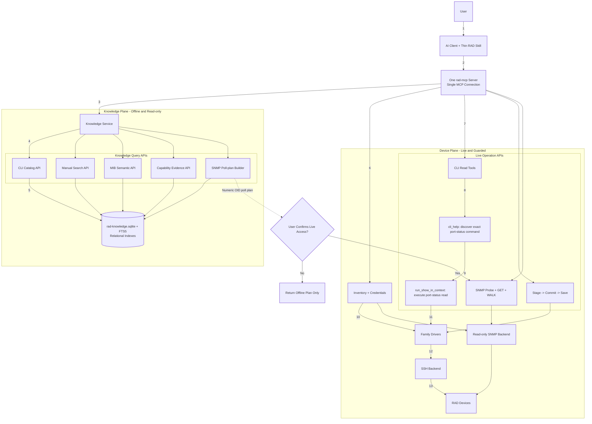
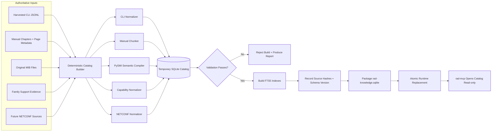

# Future rad-mcp Architecture

## Document purpose

This document specifies an implementation-ready future architecture for a
single `rad-mcp` server that owns both:

1. Live RAD device operations through CLI and read-only SNMP.
2. Offline RAD knowledge retrieval across CLI references, manuals, MIBs, and
   family-support evidence (also future NETCONF).

It is intended to be sufficient for a separate development team to implement
the design without relying on the original discussion.

The implemented baseline is documented in
[`MCP-CURRENT-ARCHITECTURE.md`](MCP-CURRENT-ARCHITECTURE.md).

## Executive decision

Keep one MCP server and one client connection. Move large reference data out of
installed skills and into a generated, server-side SQLite knowledge catalog.
Expose narrow MCP query tools that retrieve only the records needed for the
current question.

**Two knowledge distribution modes, both installable (binding requirement,
2026-07-18).** The catalog does not retire the file-based skill; after full
implementation every installer must offer BOTH:

- **`bundled`** (Bundled Knowledge — today's mode): skills install WITH their
  `references/` files; knowledge answers work with no MCP connection.
- **`served`** (Served Knowledge): thin skills (SKILL.md only); ALL knowledge
  is served by the MCP catalog tools from `rad-knowledge.sqlite`.

The mode is a per-install choice (e.g. `--knowledge bundled|served`),
orthogonal to the stdio/http transport modes. The skill's behavior layer
(safety contract, personas, method) is identical in both; only where
knowledge lives differs. `list_versions` and the docs must report which mode
an installation uses. Note the naming trap: `bundled` is not "offline mode" —
served-mode knowledge tools are also offline (no device I/O); the modes
differ in where knowledge lives, not device connectivity.

Use:

- **PySMI** at build time to compile original ASN.1 MIBs into semantic JSON.
- **SQLite** as the embedded canonical runtime catalog.
- **SQLite FTS5** for lexical full-text search.
- Existing Python/FastMCP for query and device tools.
- Existing PySNMP and Netmiko backends for live operations.

Do not require a second process, external database service, vector database, or
network dependency for the first implementation.

## Future architecture diagram

Example in this diagram: get ports status from `Device3` by using MCP `cli_help` first, then running the discovered read command.



The major change is ownership: the skill retains routing and safety rules, but
the MCP server owns the authoritative CLI, manual, MIB, and capability data.
Knowledge tools can answer questions or prepare plans without device contact.
Only the existing guarded device plane can execute those plans.

The detailed MIB compiler, semantic schema, prepared-database, MCP query, and
SNMP poll-plan specification is maintained in
[snmp-mib-catalog-design.md](skills/rad-cli-operations/references/snmp-mib-catalog-design.md).

## Why SQLite with FTS5 is the best fit

The known MIB corpus contains roughly 330 modules and 35,977 objects. Even after
adding descriptions, enums, manual chunks, and CLI records, this remains a
small embedded-search workload.

SQLite provides:

- One portable database file.
- Python standard-library support through `sqlite3`.
- Transactions and atomic catalog replacement.
- Exact indexes for OID, module, symbol, family, context, and source.
- Recursive queries for OID hierarchy.
- FTS5 full-text search over names, descriptions, manual text, and CLI help.
- No database daemon, credentials, ports, or service lifecycle.
- Straightforward packaging with the existing Python server.

FTS5 is part of SQLite's standard amalgamation. The build should still perform
a startup capability check and produce a clear error if a particular Python
distribution lacks FTS5.

Official references:

- SQLite FTS5: https://www.sqlite.org/fts5.html
- PySMI: https://docs.lextudio.com/pysmi/
- PySMI JSON code generation:
  https://docs.lextudio.com/pysmi/docs/codegen/jsondoc/jsoncodegen.html

## Technology decision matrix

### Scoring method

Each technology is scored from 1 to 5:

- **1:** poor fit; major custom work or operational problems
- **2:** usable only with significant compromises
- **3:** adequate
- **4:** strong
- **5:** excellent fit

The workload columns measure different data shapes:

- **Manuals:** full-text retrieval, chapter/page provenance, ranking, and
  bounded excerpts.
- **MIBs:** exact OIDs, hierarchy, tables, indexes, enums, relationships,
  notifications, and descriptions.
- **CLI:** exact family/context lookup, command search, firmware scope, and
  harvested-reference provenance.
- **NETCONF:** future storage of modules, containers, lists, keys,
  leaves, types, constraints, RPCs, notifications, and schema relationships.
- **Toolkit fit:** one-process deployment, offline use, cross-platform
  packaging, source control, backup, rebuild, and maintenance burden.

`Toolkit fit` is a more useful name than `repo score`: the criterion is not
whether a database belongs in Git, but whether it fits the complete
`rad-mcp` product and installation model.

### Scores

| Technology | Manuals | MIBs | CLI | NETCONF | Toolkit fit | Weighted overall |
|---|---:|---:|---:|---:|---:|---:|
| Flat JSON files | 2 | 2 | 3 | 2 | 5 | **2.9 / 5** |
| **SQLite + FTS5** | **4** | **5** | **5** | **4** | **5** | **4.7 / 5** |
| DuckDB | 3 | 4 | 4 | 4 | 3 | **3.6 / 5** |
| PostgreSQL | 5 | 5 | 5 | 5 | 2 | **4.4 / 5** |
| OpenSearch/Elasticsearch | 5 | 2 | 3 | 2 | 1 | **2.7 / 5** |
| Dedicated vector database | 5 | 1 | 2 | 1 | 1 | **2.1 / 5** |

The weighted score uses:

- Manuals: 20%
- MIBs: 25%
- CLI: 25%
- NETCONF: 10%
- Toolkit fit: 20%

MIBs and CLI receive the highest weight because they are the core structured
knowledge and safety-grounding layers. NETCONF is included now but weighted
lower because it is a future capability rather than an implemented dependency.

### Interpretation by technology

#### Flat JSON files

JSON is excellent as a compiler interchange format and useful for debugging.
It should remain a build artifact, but not become the primary query engine.

- Manuals require loading or scanning many files.
- MIB relationships and table indexes require application-side joins.
- CLI exact lookup is possible, but natural-language search and pagination are
  weak.
- NETCONF schema trees can be represented, but cross-module imports, augmentations,
  identities, deviations, and leaf references become expensive to query.
- Packaging is simple, which explains its high toolkit-fit subscore.

#### SQLite with FTS5

SQLite best matches the current product boundary.

- FTS5 provides deterministic lexical retrieval for manuals.
- Relational tables model MIB indexes, enums, notifications, and OID hierarchy.
- Exact indexes make family/context/command CLI lookup fast.
- Future NETCONF schemas can use normalized module/node/type/relationship
  tables, with raw normalized schema data retained for lossless reconstruction.
- The database ships as one generated file and opens read-only in the existing
  MCP process.
- No database account, listener, daemon, or network dependency is introduced.

SQLite is the selected technology for the first production implementation.

#### DuckDB

DuckDB is attractive for analytical scans, Parquet, and large telemetry
datasets. It is less compelling for this metadata-serving workload.

- Its FTS support is extension-based.
- FTS indexes need explicit recreation when source data changes.
- It excels at columnar analysis rather than many small exact lookups.
- It may become useful later for offline analysis of large telemetry exports,
  but that is separate from the authoritative knowledge catalog.

#### PostgreSQL

PostgreSQL is technically the strongest general-purpose alternative and scores
well for every knowledge domain.

- Full-text search, recursive queries, JSONB, concurrency, and remote sharing
  are excellent.
- It is the best future option if `rad-mcp` becomes a centralized,
  multi-instance service with concurrent catalog updates.
- It is not the best present option because every local stdio installation
  would need a database service, credentials, migrations, backup policy, and
  lifecycle management.

The architecture should keep repository interfaces storage-neutral enough that
PostgreSQL can replace SQLite behind the same knowledge-service API if scale or
deployment changes.

#### OpenSearch or Elasticsearch

These systems are strong for distributed full-text retrieval over large manual
corpora. They are weak as the sole authoritative store for strongly relational
MIB and NETCONF structures.

- Object hierarchy, indexes, augmentations, and references become denormalized.
- Exact consistency and cross-object validation require extra application code.
- Operating a search cluster is disproportionate to the current corpus.

They may later serve as a secondary search index for a large shared deployment,
not as the source of truth.

#### Dedicated vector database

A vector database is useful for fuzzy conceptual recall, especially across many
manuals. It is unsuitable as the primary catalog.

- Similarity search cannot replace exact OID, command, schema-path, or enum
  lookup.
- MIB and NETCONF relationships still need a structured database.
- Embedding generation adds model dependencies, cost, versioning, and
  nondeterministic retrieval behavior.

Vector search may be added later as a secondary candidate generator. Every
candidate must still resolve to canonical SQLite records with provenance.

### Final recommendation

Use a layered implementation:

```text
Original CLI, manual, MIB, and future NETCONF sources
                      |
                      v
             Build-time normalizers
                      |
          +-----------+-----------+
          |                       |
          v                       v
 Semantic JSON artifacts   rad-knowledge.sqlite
 (debug/rebuild input)     (runtime source of truth)
                                  |
                                  +-- exact indexed lookup
                                  +-- relational traversal
                                  +-- FTS5 lexical search
                                  +-- bounded MCP results
```

Add embeddings only if evaluation later proves that FTS5 misses important
manual questions. Store embedding references alongside canonical record IDs;
never make the vector index authoritative.

## Architectural principles

### One MCP, multiple internal domains

```text
rad-mcp
    |
    +-- Knowledge domain
    |     +-- CLI catalog
    |     +-- Manual catalog
    |     +-- MIB semantic catalog
    |     +-- Capability/evidence catalog
    |     +-- Search and poll-plan services
    |
    +-- Device domain
          +-- Inventory
          +-- SSH CLI backend
          +-- SNMP backend
          +-- Drivers
          +-- Backup/stage/commit
```

All domains run in one process and are exposed by one FastMCP server.

### Knowledge is offline and read-only

Knowledge tools never contact a device. They require no device credentials and
remain available when the server is globally read-only.

### Planning and execution are separate

A knowledge result or SNMP poll plan does not authorize device access. Live
execution continues to require the skill's confirmation gate.

### MIB definition is not implementation evidence

The system must distinguish:

- Defined: an object exists in an original MIB.
- Documented: a family manual claims support.
- CLI-visible: a family's harvested CLI exposes related configuration.
- Observed: a live walk or GET returned the object.
- Verified: evidence was reviewed for a specific family/firmware.

No query may silently promote "defined in portfolio MIB" to "supported by every
RAD device."

### Query results are bounded

No tool returns the entire catalog. Search tools require limits, provide
pagination where appropriate, and return compact structured records.

## Proposed package layout

```text
rad-mcp-server/
  server/
    rad_mcp/
      knowledge/
        __init__.py
        catalog.py
        models.py
        search.py
        cli.py
        manuals.py
        mibs.py
        capabilities.py
        poll_plans.py
      backends/
      drivers/
      server.py
    data/
      rad-knowledge.sqlite
  scripts/
    knowledge/
      build_catalog.py
      ingest_cli.py
      ingest_manuals.py
      ingest_mibs.py
      validate_catalog.py
      report_catalog.py
  skills/
    rad-cli-operations/
      SKILL.md
```

Original MIBs and source manuals may remain outside distributable artifacts if
licensing or size requires it. The generated catalog is the runtime artifact.

## Catalog lifecycle

The database is generated, not hand-edited.

```text
Original sources
    +-- MIB ASN.1 files
    +-- harvested CLI JSONL
    +-- manual chapter Markdown
    +-- support/evidence manifests
            |
            v
    deterministic normalizers
            |
            v
    temporary SQLite database
            |
            +-- schema validation
            +-- referential checks
            +-- search smoke tests
            +-- coverage report
            |
            v
    atomic replacement of rad-knowledge.sqlite
```

The runtime opens the packaged database read-only. Rebuilds occur outside the
serving process and replace the file only after validation succeeds.

### Catalog build and release diagram



Recommended SQLite connection mode:

```text
file:/absolute/path/rad-knowledge.sqlite?mode=ro&immutable=1
```

Use `immutable=1` only for packaged catalogs that are never modified in place.
Development mode may use ordinary read-only mode so a rebuilt file can be
reopened between test runs.

## Proposed schema

The exact DDL may evolve, but the following entities and constraints are part
of the contract.

### Catalog metadata

```sql
CREATE TABLE catalog_meta (
    key TEXT PRIMARY KEY,
    value TEXT NOT NULL
);

CREATE TABLE source_files (
    source_id INTEGER PRIMARY KEY,
    source_type TEXT NOT NULL,
    logical_name TEXT NOT NULL,
    path_hint TEXT,
    sha256 TEXT NOT NULL,
    source_version TEXT,
    ingested_at TEXT NOT NULL,
    UNIQUE(source_type, logical_name, sha256)
);
```

Store schema version, build time, builder version, Git revision, object counts,
and source-set hashes in `catalog_meta`.

### MIB modules and objects

```sql
CREATE TABLE mib_modules (
    module_id INTEGER PRIMARY KEY,
    name TEXT NOT NULL UNIQUE,
    organization TEXT,
    contact_info TEXT,
    description TEXT,
    last_updated TEXT,
    source_id INTEGER NOT NULL REFERENCES source_files(source_id)
);

CREATE TABLE mib_revisions (
    module_id INTEGER NOT NULL REFERENCES mib_modules(module_id),
    revision TEXT NOT NULL,
    description TEXT,
    PRIMARY KEY(module_id, revision)
);

CREATE TABLE mib_objects (
    object_id INTEGER PRIMARY KEY,
    module_id INTEGER NOT NULL REFERENCES mib_modules(module_id),
    name TEXT NOT NULL,
    qualified_name TEXT NOT NULL UNIQUE,
    oid TEXT NOT NULL,
    oid_sort_key BLOB NOT NULL,
    parent_oid TEXT,
    object_class TEXT NOT NULL,
    node_type TEXT,
    syntax_type TEXT,
    textual_convention TEXT,
    max_access TEXT,
    status TEXT,
    units TEXT,
    default_value TEXT,
    description TEXT,
    reference_text TEXT,
    UNIQUE(module_id, name),
    UNIQUE(oid, qualified_name)
);

CREATE INDEX idx_mib_objects_oid ON mib_objects(oid);
CREATE INDEX idx_mib_objects_parent ON mib_objects(parent_oid);
CREATE INDEX idx_mib_objects_name ON mib_objects(name);
CREATE INDEX idx_mib_objects_module ON mib_objects(module_id);
```

`oid_sort_key` should encode each numeric arc in sortable binary or fixed-width
form. Plain lexical ordering is incorrect because `.10` sorts before `.2`.

### MIB constraints, enums, and relationships

```sql
CREATE TABLE mib_enum_values (
    object_id INTEGER NOT NULL REFERENCES mib_objects(object_id),
    numeric_value INTEGER NOT NULL,
    label TEXT NOT NULL,
    description TEXT,
    PRIMARY KEY(object_id, numeric_value)
);

CREATE TABLE mib_ranges (
    object_id INTEGER NOT NULL REFERENCES mib_objects(object_id),
    range_order INTEGER NOT NULL,
    minimum TEXT,
    maximum TEXT,
    PRIMARY KEY(object_id, range_order)
);

CREATE TABLE mib_table_indexes (
    row_object_id INTEGER NOT NULL REFERENCES mib_objects(object_id),
    position INTEGER NOT NULL,
    index_object_id INTEGER REFERENCES mib_objects(object_id),
    implied INTEGER NOT NULL DEFAULT 0,
    PRIMARY KEY(row_object_id, position)
);

CREATE TABLE mib_augments (
    row_object_id INTEGER PRIMARY KEY REFERENCES mib_objects(object_id),
    augmented_row_object_id INTEGER NOT NULL REFERENCES mib_objects(object_id)
);
```

### Notifications

```sql
CREATE TABLE mib_notifications (
    notification_id INTEGER PRIMARY KEY,
    object_id INTEGER NOT NULL UNIQUE REFERENCES mib_objects(object_id),
    description TEXT,
    status TEXT
);

CREATE TABLE mib_notification_objects (
    notification_id INTEGER NOT NULL REFERENCES mib_notifications(notification_id),
    position INTEGER NOT NULL,
    object_id INTEGER NOT NULL REFERENCES mib_objects(object_id),
    PRIMARY KEY(notification_id, position)
);
```

### CLI knowledge

```sql
CREATE TABLE cli_contexts (
    context_id INTEGER PRIMARY KEY,
    family TEXT NOT NULL,
    firmware TEXT,
    context_path TEXT NOT NULL,
    prompt TEXT,
    entered INTEGER NOT NULL,
    entry_note TEXT,
    source_id INTEGER NOT NULL REFERENCES source_files(source_id),
    UNIQUE(family, firmware, context_path)
);

CREATE TABLE cli_commands (
    command_id INTEGER PRIMARY KEY,
    context_id INTEGER NOT NULL REFERENCES cli_contexts(context_id),
    command TEXT NOT NULL,
    command_kind TEXT,
    description TEXT,
    argument_help TEXT,
    removable INTEGER,
    verified INTEGER NOT NULL DEFAULT 0,
    UNIQUE(context_id, command)
);
```

### Manual knowledge

```sql
CREATE TABLE manual_documents (
    document_id INTEGER PRIMARY KEY,
    family TEXT NOT NULL,
    title TEXT NOT NULL,
    document_version TEXT,
    source_id INTEGER NOT NULL REFERENCES source_files(source_id)
);

CREATE TABLE manual_chunks (
    chunk_id INTEGER PRIMARY KEY,
    document_id INTEGER NOT NULL REFERENCES manual_documents(document_id),
    chapter_key TEXT NOT NULL,
    heading_path TEXT,
    page_start INTEGER,
    page_end INTEGER,
    body TEXT NOT NULL
);

CREATE TABLE manual_cli_links (
    family TEXT NOT NULL,
    cli_topic TEXT NOT NULL,
    chunk_id INTEGER NOT NULL REFERENCES manual_chunks(chunk_id),
    PRIMARY KEY(family, cli_topic, chunk_id)
);
```

Chunks should preserve page provenance. Chunk boundaries should follow headings
and paragraphs, not arbitrary token counts.

### Family capability and evidence

```sql
CREATE TABLE capability_claims (
    claim_id INTEGER PRIMARY KEY,
    family TEXT NOT NULL,
    firmware TEXT,
    topic TEXT NOT NULL,
    capability TEXT NOT NULL,
    support_state TEXT NOT NULL,
    evidence_type TEXT NOT NULL,
    source_id INTEGER REFERENCES source_files(source_id),
    evidence_locator TEXT,
    observed_at TEXT,
    confidence TEXT NOT NULL,
    notes TEXT
);
```

Suggested `support_state` values:

- `supported`
- `unsupported`
- `partial`
- `unknown`

Suggested `evidence_type` values:

- `mib-defined`
- `manual`
- `cli-harvest`
- `live-snmp`
- `live-cli`
- `operator-verified`

### Full-text indexes

Create separate FTS5 tables so each domain can use appropriate ranking:

```sql
CREATE VIRTUAL TABLE mib_objects_fts USING fts5(
    qualified_name,
    description,
    reference_text,
    content='mib_objects',
    content_rowid='object_id',
    tokenize='unicode61'
);

CREATE VIRTUAL TABLE manual_chunks_fts USING fts5(
    heading_path,
    body,
    content='manual_chunks',
    content_rowid='chunk_id',
    tokenize='porter unicode61'
);

CREATE VIRTUAL TABLE cli_commands_fts USING fts5(
    command,
    description,
    argument_help,
    content='cli_commands',
    content_rowid='command_id',
    tokenize='unicode61'
);
```

Exact symbol and OID lookup must run before FTS. FTS is for natural-language
discovery, not identifier resolution.

## MIB ingestion pipeline

### Input

The builder receives one or more ordered MIB source directories. Newer vendor
sets win module-name collisions, but all decisions are recorded.

### Compilation

Use PySMI JSON generation with MIB texts enabled. The generated module JSON
preserves semantic fields such as class, node type, syntax, maximum access,
table augmentation, revisions, and descriptions.

The build must:

1. Discover modules by module identity, not filename alone.
2. Resolve imports from local sources first.
3. Permit an explicit, pinned supplemental source for standard dependencies.
4. Record borrowed modules and their hashes.
5. Fail on unresolved vendor modules.
6. Allow a reviewed exclusion list for macro-only SMIv1 modules.
7. Normalize every module into relational rows.
8. Preserve unknown source fields in a raw JSON column or side artifact so
   normalization does not destroy future information.

### Validation

At minimum, verify:

- Every object has a module, name, class, and numeric OID where applicable.
- Every table row points to valid index objects or a valid augmentation.
- Every notification payload object exists.
- Qualified names are unique.
- OID collisions are reported, not silently overwritten.
- Enum labels are unique per object.
- All expected RAD modules compiled.
- Known fixtures such as `erpNodeState`, `ifTable`, and `sysDescr` retain their
  descriptions, syntax, access, and relationships.

### Compatibility output

Continue generating `snmp-oid-map.json` from the database during migration so
the existing SNMP renderer remains unchanged. After the server uses catalog
lookups directly, the flat map can become a derived compatibility artifact.

## CLI and manual ingestion

The existing harvested JSONL is the canonical CLI input. Do not parse rendered
Markdown when structured JSONL exists.

The CLI ingester should:

- Store family, firmware, context, prompt, entry status, commands, descriptions,
  and argument constraints.
- Retain source hashes and harvest time.
- Mark verified-command recipes separately.
- Preserve device-reported refusal text for contexts that could not be entered.

The manual ingester should:

- Consume extracted chapter Markdown and its index.
- Preserve family, document version, chapter, heading path, and page numbers.
- Split long chapters by semantic headings and paragraphs.
- Store CLI-topic cross-links.
- Rebuild only the affected document inside one transaction.

## Proposed MCP knowledge tools

Tool names are explicit and domain-oriented. Avoid a single unbounded
`search_everything` response, although a federated search tool may call domain
searchers internally.

### Token-access matrix

The future knowledge plane remains read-only. Knowledge tools are therefore
available to both HTTP RO and HTTP RW tokens. Existing device-write tools keep
their stricter RW-only scope.

| Tool or tool group | HTTP RO token | HTTP RW token | Device contact |
|---|---|---|---|
| `knowledge_status` | Allowed | Allowed | No |
| `knowledge_search` | Allowed | Allowed | No |
| `cli_lookup`, `cli_search` | Allowed | Allowed | No |
| `manual_search`, `manual_get` | Allowed | Allowed | No |
| `capability_check` | Allowed | Allowed | No |
| `mib_search`, `mib_describe`, `mib_table`, `mib_notifications` | Allowed | Allowed | No |
| `snmp_build_poll_plan` | Allowed | Allowed | No |
| Existing inventory and device-read tools | Allowed | Allowed | Read-only where applicable |
| Existing `snmp_probe`, `snmp_get`, `snmp_walk` | Allowed | Allowed | Yes, read-only |
| Existing inventory mutation tools | Refused | Allowed | No device contact; server state changes |
| Existing configuration stage/commit/save tools | Refused | Allowed | Yes for commit/save |

`RAD_MCP_READONLY=true` removes all mutation and device-write tools regardless
of token configuration, but it does not remove knowledge or device-read tools.
Local stdio mode continues to use `RAD_MCP_READONLY` rather than bearer-token
scope.

### `knowledge_status`

Returns catalog schema version, build revision, source dates, source counts,
record counts, and validation status.

### `knowledge_search`

Federated bounded search across CLI, manuals, MIBs, and capability claims.

```json
{
  "query": "Ethernet ring protection",
  "family": "etx2",
  "sources": ["cli", "manual", "mib"],
  "limit": 10
}
```

Each result includes source type, title, compact excerpt, score, source
locator, family/firmware scope, and provenance.

### `cli_lookup`

Exact lookup by family, context, and optional command prefix. This replaces
filesystem grep for normal agent operation.

### `cli_search`

Natural-language or keyword search over one family's harvested commands.

### `manual_search`

Ranked family-scoped manual search with page and chapter provenance.

### `manual_get`

Fetches one bounded chunk by stable ID. This supports search-then-read rather
than returning an entire chapter.

### `capability_check`

Combines evidence without flattening it:

```json
{
  "family": "etx2",
  "feature": "ERP",
  "conclusion": "supported",
  "evidence": [
    {"type": "cli-harvest", "locator": "configure protection erp"},
    {"type": "manual", "locator": "chapter ..."},
    {"type": "mib-defined", "locator": "RAD-EthIf-MIB::erpTable"}
  ],
  "warnings": []
}
```

### `mib_search`

Searches object names and descriptions with filters:

- module
- object class
- node type
- access
- status
- OID subtree
- limit and cursor

### `mib_describe`

Exact lookup by qualified name, unqualified name, or numeric OID. Returns:

- module, name, OID, class, and node type
- description and references
- syntax, textual convention, units, ranges, and default
- max access and status
- enum mappings
- parent and children summary
- table/index relationship
- notifications that carry the object
- provenance

Ambiguous unqualified names return candidates rather than guessing.

### `mib_table`

Returns one table as a structured model:

- table, entry, and index objects
- index order and implied flags
- augmentation relationship
- columns with OID, syntax, access, enums, units, and description
- recommended read operation

### `mib_notifications`

Searches notifications and returns ordered payload objects with their semantics.

### `snmp_build_poll_plan`

Builds an offline, non-executing plan from a topic:

```json
{
  "topic": "ERP operational state and R-APS counters",
  "family": "etx2",
  "mode": "offline",
  "operations": [
    {
      "operation": "walk",
      "root_oid": "1.3.6.1.4.1.164.3.1.6.1.4.2.1",
      "table": "RAD-EthIf-MIB::erpTable",
      "columns": ["erpNodeState", "erpWTRStatus"],
      "max_rows": 200
    }
  ],
  "evidence": [],
  "warnings": []
}
```

The plan builder must:

1. Resolve desired concepts to objects.
2. Expand table indexes and required identifying columns.
3. Exclude objects that are not readable.
4. Never include write-only control objects in a read plan.
5. Prefer exact GET when complete instance OIDs are known.
6. Use bounded walks when indexes are unknown.
7. Include family-support evidence and uncertainty.
8. Return numeric OIDs accepted by the existing SNMP backend.
9. Never contact a device.

## Live execution workflow

### Offline explanation only

```text
User asks about ERP variables
    -> mib_search
    -> mib_table / mib_describe
    -> answer with definitions and provenance
```

No confirmation is required because no device is contacted.

### Offline planning followed by live polling

```text
User asks to check ERP state on Device3
    -> resolve Device3 family from inventory
    -> capability_check(etx1p, ERP)
    -> snmp_build_poll_plan(ERP state, etx1p)
    -> present exact GET/WALK plan
    -> ask "Run this on the device now?"
    -> user confirms
    -> execute existing snmp_get/snmp_walk
    -> decode values using MIB enums and textual conventions
    -> report completeness, cap, evidence, and warnings
```

The knowledge service does not call device tools internally. Keeping the final
live call visible to the model preserves the existing confirmation boundary and
audit trail.

## Value decoding

Live SNMP results should be enriched after retrieval:

- Resolve the longest matching object OID.
- Separate the base object OID from the instance suffix.
- Decode enumerations while preserving the raw numeric value.
- Format TimeTicks, counters, gauges, addresses, and octet strings.
- Decode table indexes using the table's ordered index definition.
- Attach units where defined.
- Mark unknown or malformed encodings without discarding raw data.

Example:

```json
{
  "name": "RAD-EthIf-MIB::erpNodeState",
  "instance": {"erpIdx": 1},
  "raw_value": 3,
  "display_value": "protecting",
  "units": null
}
```

Never return only the display value; raw values are required for diagnostics.

## Thin-skill design

After migration, `rad-cli-operations/SKILL.md` should contain only:

- Trigger conditions and supported families.
- Device-target resolution.
- Safety and confirmation gates.
- Rules for offline versus live questions.
- Routing to MCP knowledge tools.
- Staged configuration workflow.
- Output conventions.
- A small number of critical product exceptions that must remain visible even
  if the catalog is unavailable.

It should not package command trees, complete CLI captures, manuals, semantic
MIB data, or live SNMP maps.

This makes installation smaller and gives every client the same authoritative
knowledge version through the MCP server.

## Compatibility and failure behavior

### MCP available, catalog available

Use knowledge tools as the primary path.

### MCP available, catalog missing or incompatible

- Device tools may start only if explicitly allowed by configuration.
- Knowledge tools return a structured `catalog_unavailable` error.
- The server logs the expected and observed schema versions.
- The skill must not invent syntax or MIB semantics.

Recommended default: fail server startup when the packaged catalog is missing,
because the future product promises integrated knowledge.

### MCP unavailable

The thin skill can explain safety and installation but cannot provide detailed
product knowledge. It must say that the RAD knowledge server is unavailable.

### Existing clients

Keep existing tool names and resource URIs through the first migration release.
Implement existing resources as database-backed adapters before removing file
dependencies.

## Security model

- Knowledge tools are read-only and need no device credentials.
- Original MIB and manual source paths are never exposed to clients.
- Search snippets are bounded.
- SQL is parameterized; tool inputs never become SQL fragments.
- FTS query syntax is escaped or parsed through a safe query builder.
- Catalog files are opened read-only at runtime.
- Catalog hashes and schema versions are checked at startup.
- Existing bearer-token scope rules remain in force for device write tools.
- Poll-plan generation cannot execute SNMP.
- SNMP remains GET/GETNEXT-only unless a separate future design explicitly
  introduces SET with stronger authorization.

## Performance targets

For a warm local catalog:

| Operation | Target |
|---|---|
| Exact OID or qualified-name lookup | p95 below 20 ms |
| FTS search over one domain | p95 below 100 ms |
| Table expansion | p95 below 100 ms |
| Federated search | p95 below 250 ms |
| Poll-plan generation excluding model reasoning | p95 below 250 ms |

Default search results should be 10 or fewer. Hard maximum should be 100.
Descriptions should be truncated in search results and returned fully only by
exact describe/get tools.

## Testing strategy

### Builder unit tests

- Parse SMIv1 and SMIv2 fixtures.
- Preserve descriptions, enums, ranges, defaults, access, indexes, augments,
  notifications, and revisions.
- Resolve duplicate modules deterministically.
- Reject unresolved vendor imports.
- Produce stable output from identical inputs.

### Catalog tests

- Foreign-key check passes.
- FTS row counts match content tables.
- Known objects resolve by name and OID.
- OID subtree ordering is numeric.
- Ambiguous names return candidates.
- Provenance exists for every result.

### Domain fixtures

Required fixtures should include:

- `SNMPv2-MIB::sysDescr`
- `IF-MIB::ifTable`
- `IF-MIB::ifOperStatus`
- `RAD-EthIf-MIB::erpTable`
- `RAD-EthIf-MIB::erpNodeState`
- `RAD-EthIf-MIB::erpPortRapsRxValidMsg`
- At least one enum-bearing RAD object
- At least one indexed table and augmented table
- At least one notification with payload objects

### MCP contract tests

- Validate every tool's JSON schema and bounded output.
- Verify offline tools never access inventory credentials or network sockets.
- Verify poll-plan creation produces no audit event for device access.
- Verify live execution still requires the normal external confirmation flow.
- Verify read-only HTTP tokens can use all knowledge tools.
- Verify write tools remain hidden or refused according to server mode.

### Migration regression tests

For a corpus of representative questions, compare the old reference answer and
new catalog answer for factual equivalence, provenance, and latency.

## Build and release process

1. Pin PySMI and all compiler dependencies in the tooling extra.
2. Build the catalog in a clean environment.
3. Emit a machine-readable build report.
4. Run schema, integrity, FTS, fixture, and MCP tests.
5. Record the database SHA-256 and source-set hash.
6. Package the database with the Python distribution or installer payload.
7. Verify installation on Windows, Linux, and macOS.
8. Start the server and call `knowledge_status`.
9. Publish the server, catalog, and thin skill as one compatible release.

The catalog schema version is independent of the server package version. The
server declares a supported schema range and refuses incompatible catalogs.

## Migration plan

### Phase 1: Semantic MIB catalog

- Add PySMI semantic JSON compilation with texts enabled.
- Define schema and builder.
- Ingest modules, objects, enums, indexes, and notifications.
- Add `knowledge_status`, `mib_search`, `mib_describe`, and `mib_table`.
- Keep the flat OID map and current skill references unchanged.

### Phase 2: Poll planning and decoding

- Add `mib_notifications` and `snmp_build_poll_plan`.
- Decode live SNMP values from catalog metadata.
- Add family evidence to plans.
- Keep existing `snmp_get` and `snmp_walk` contracts compatible.

### Phase 3: CLI catalog

- Ingest harvested CLI JSONL.
- Add `cli_lookup` and `cli_search`.
- Back existing CLI resources from SQLite.
- Change the skill to prefer MCP lookups.

### Phase 4: Manual catalog

- Ingest chapter chunks and cross-links.
- Add `manual_search` and `manual_get`.
- Back manual resources from SQLite.

### Phase 5: Capability fusion

- Normalize manual, CLI, MIB, and live evidence.
- Add `capability_check` and federated `knowledge_search`.
- Make uncertainty and contradictions explicit.

### Phase 6: Thin skill and packaging

- Remove large `references/` payloads from installed skills.
- Keep source artifacts in the repository build inputs as needed.
- Update all installers to ship the knowledge catalog with `rad-mcp`.
- Rebuild Desktop and portable distributions.
- Document rollback to the previous full-reference release.

## Acceptance criteria

The future architecture is complete when:

1. A clean installation needs one `rad-mcp` connection and thin skills only.
2. No client-side skill copy contains the full CLI, manual, or MIB corpus.
3. Offline ERP questions return names, OIDs, descriptions, enums, access, and
   table indexes without contacting a device.
4. A natural-language SNMP request can produce a bounded numeric poll plan.
5. The plan clearly distinguishes MIB definition from family support evidence.
6. Live execution still uses the existing confirmation and audit path.
7. Existing CLI and SNMP tools remain compatible.
8. Existing `rad://` resources continue working during migration.
9. Catalog build inputs and output are reproducible and hash-traceable.
10. All query results include source provenance.
11. Catalog absence or schema mismatch fails clearly.
12. Cross-platform installers deploy the server and catalog successfully.

## Initial implementation sequence for another team

A team starting outside this workspace should proceed in this order:

1. Copy the current server package and tests.
2. Obtain the complete original MIB source sets and licensing approval.
3. Build a small PySMI proof of concept for `IF-MIB` and `RAD-EthIf-MIB`.
4. Confirm generated JSON retains descriptions, enums, access, and indexes.
5. Implement the SQLite schema and deterministic normalizer.
6. Load only those two modules and build the first four MIB tools.
7. Add ERP contract fixtures and tests.
8. Expand compilation to the full module set.
9. Add poll-plan generation and live-value decoding.
10. Migrate CLI JSONL, then manuals, then capability evidence.
11. Convert the skill to the thin routing model only after database-backed
    tools reach answer parity with current references.

This sequence keeps device execution stable while the knowledge plane is built
and validated incrementally.
