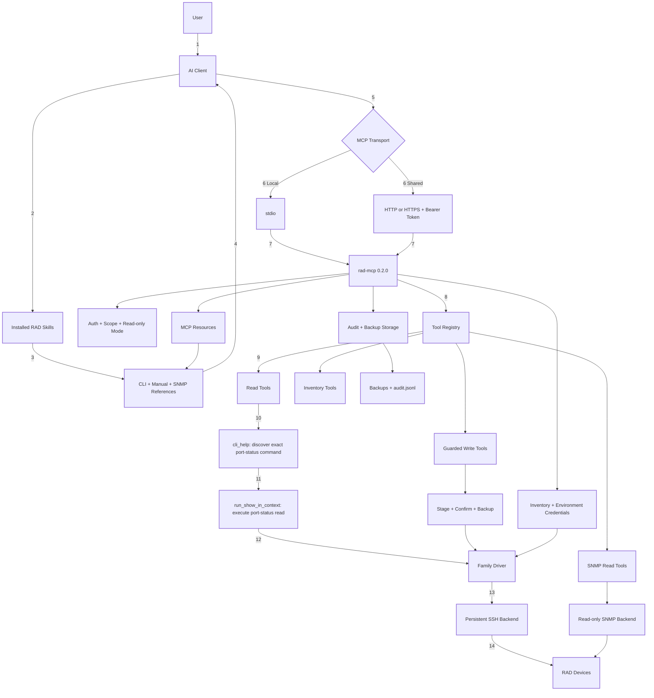
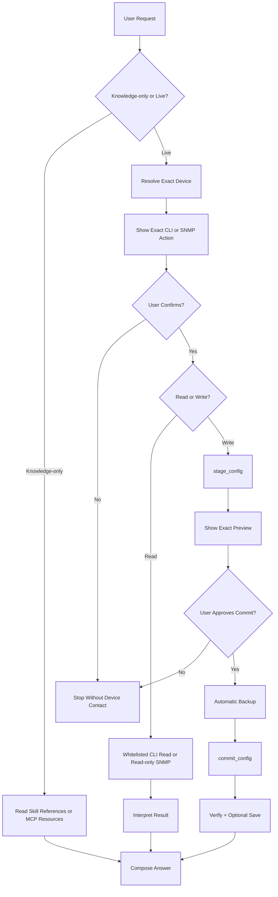

# rad-mcp + skills — BUNDLED mode architecture

*(Knowledge distribution mode: **bundled** — skills carry their ; works with no MCP connection. The served counterpart is [MCP-SKILLS-SERVED-ARCHITECTURE.md](MCP-SKILLS-SERVED-ARCHITECTURE.md).)*

## Document purpose

This document describes the implemented `rad-mcp` server as it exists at
version `0.2.0`. It is an implementation-oriented inventory of the runtime,
tools, resources, safety controls, knowledge sources, device integrations,
storage, deployment modes, and known limitations.

This is a current-state document. Proposed changes belong in
[`MCP-SKILLS-SERVED-ARCHITECTURE.md`](MCP-SKILLS-SERVED-ARCHITECTURE.md).

## Product boundary

The repository has two related boundaries:

- `rad-agent-toolkit/` is the umbrella repository.
- `rad-mcp-server/` contains the MCP server, agent skills, commands, reference
  data, installation scripts, tests, and documentation.

The MCP server is the execution layer. The skills currently carry much of the
operating method and product knowledge. Together they let an AI client answer
offline questions and perform guarded operations against RAD equipment.

## Supported clients and deployment modes

The toolkit has installers and operating guidance for:

- Claude Code CLI and IDE extension
- Claude Desktop and Cowork
- GitHub Copilot in VS Code agent mode
- GitHub Copilot CLI
- OpenAI Codex IDE and desktop surfaces

The server supports two transports:

### Local stdio

The AI client starts one local Python process and communicates over standard
input/output. This is the simplest and most capable mode.

- No network listener is opened.
- The client configuration points to the virtual environment Python and runs
  `-m rad_mcp.server`.
- Write tools are enabled unless `RAD_MCP_READONLY=true`.
- Every client process gets its own server process and in-memory stage store.

### Shared HTTP or HTTPS

The server runs as a persistent FastMCP HTTP endpoint.

- `RAD_MCP_TRANSPORT=http` enables the listener.
- `RAD_MCP_HOST`, `RAD_MCP_PORT`, and `RAD_MCP_PATH` select the endpoint.
- `RAD_MCP_TOKENS` contains read-only bearer tokens.
- `RAD_MCP_WRITE_TOKENS` contains read-write bearer tokens.
- At least one token set is required; the server refuses unauthenticated HTTP.
- `RAD_MCP_TLS_CERT` and `RAD_MCP_TLS_KEY` enable native TLS.
- A token's scope is checked again inside every write tool.
- `RAD_MCP_READONLY=true` removes write tools even when write tokens exist.

HTTP mode is intended for trusted internal networks. It is not currently
designed as an Internet-facing multi-tenant service.

## Runtime stack

```text
AI client
    |
    | MCP over stdio or HTTP(S)
    v
FastMCP server: rad_mcp.server
    |
    +-- inventory and credential resolution
    +-- tool and resource registration
    +-- safety validation and audit
    +-- SSH CLI backend
    +-- read-only SNMP backend
    +-- per-family CLI drivers
    +-- filesystem-backed reference resources
```

The Python package is under `server/rad_mcp/`. Its package version and
`server/pyproject.toml` version are both `0.2.0`.

## Current architecture diagram

Example in this diagram: get ports status from `Device3` by using MCP `cli_help` first, then running the discovered read command.



How to read this diagram:

1. The current skill carries both operating rules and large reference files.
2. The AI client uses MCP tools for live work and MCP resources when it cannot
   read those references directly.
3. CLI operations pass through a family driver and the persistent SSH backend.
4. SNMP uses a separate read-only backend and never enters the write path.
5. Authentication, token scope, staging, backup, and audit form the safety
   boundary around live execution.

## Runtime modules

| Module | Responsibility |
|---|---|
| `server.py` | FastMCP initialization, authentication, tools, resources, write staging, and process startup |
| `inventory.py` | YAML inventory loading and mutation, environment credential resolution |
| `audit.py` | Append-only JSONL audit records and secret redaction |
| `backends/base.py` | CLI backend interface |
| `backends/ssh.py` | Persistent Netmiko SSH sessions and prompt-driven command execution |
| `backends/snmp.py` | Read-only PySNMP GET, GETNEXT walk, and identity probing |
| `drivers/base.py` | Product-driver interface |
| `drivers/radcli.py` | Shared RAD context-CLI behavior and read allowlists |
| `drivers/<family>.py` | Family-specific contexts, connection profiles, and behavior |

## Device model

Devices are declared in `inventory.yaml`. An inventory entry contains
non-secret facts:

```yaml
devices:
  - name: example-etx
    host: 192.0.2.10
    family: etx2
    groups: [lab]
    description: Example device
```

Credentials never belong in the inventory. They are resolved from the
gitignored `server/.env` file or the process environment. Device-specific
environment variables take precedence over global fallback variables.

The device `family` selects the driver. The device name selects credentials
and is also used for session caching, audit records, and backup paths.

## Supported families

| Family | Product scope | CLI model | Notable behavior |
|---|---|---|---|
| `secflow` | SF-1p and SecFlow | Shared context CLI | Verified live |
| `etx1p` | ETX-1p | Shared context CLI | Modern CLI, not legacy ETX-1 |
| `etx2` | ETX-203AX/205A/220A/ETX-2I | Shared context CLI | Additional flow/test contexts and family-specific port naming |
| `mp4100` | Megaplex-4100 | Shared context CLI | Candidate database requires sanity-check and device commit |
| `mp1` | MP-1 | Shared context CLI | Candidate database requires sanity-check and device commit |
| `minid` | MiNID | Compact shared context CLI | Direct-write save and a slow, fragile SSH profile |
| `etx2v` | ETX-2V/uCPE-OS | Shared context CLI | Direct-write save and virtualization/VNF context |

Legacy ETX-1 uses a different menu CLI and is not implemented.

## Driver and backend separation

The architecture separates transport from product dialect:

- A backend answers how bytes reach the device and how responses are collected.
- A driver answers which commands, contexts, prompts, save operations, and
  health sequences are valid for a family.

This permits a future RADview backend to reuse the same family model and lets
the SSH backend operate several related but non-identical product families.

## MCP tool surface

### Always-registered tools

These tools are present in both read-only and read-write server modes.

| Tool | Purpose | Device contact | HTTP RO token | HTTP RW token |
|---|---|---|---|---|
| `list_devices` | List inventory entries, optionally filtered by group or family | No | Allowed | Allowed |
| `list_versions` | Report server, skill, and driver versions | No | Allowed | Allowed |
| `test_connectivity` | Establish a CLI session and report the prompt | Yes, read-only | Allowed | Allowed |
| `run_show` | Execute a driver-approved root/global read command | Yes, read-only | Allowed | Allowed |
| `get_config` | Export the full running configuration | Yes, read-only | Allowed | Allowed |
| `health_check` | Run the driver's health sequence in one session | Yes, read-only | Allowed | Allowed |
| `run_show_in_context` | Navigate to a validated context and execute an approved read | Yes, read-only | Allowed | Allowed |
| `cli_help` | Relay interactive `?` help without executing the pending line | Yes, read-only | Allowed | Allowed |
| `backup_config` | Save a running-config snapshot under `server/backups/` | Yes, read-only device access; local file write | Allowed | Allowed |
| `snmp_probe` | Read MIB-II identity, firmware, and family hint | Yes, read-only | Allowed | Allowed |
| `snmp_get` | Read explicit numeric OIDs | Yes, read-only | Allowed | Allowed |
| `snmp_walk` | Perform a row-capped GETNEXT subtree walk | Yes, read-only | Allowed | Allowed |

Although `backup_config` writes a local archive file, it does not modify the
device and remains available in read-only mode.

### Conditionally registered write tools

These tools exist only when `WRITE_TOOLS_ENABLED` is true.

| Tool | Purpose | HTTP RO token | HTTP RW token |
|---|---|---|---|
| `add_device` | Add inventory facts and append supplied credentials to `.env` | Refused | Allowed |
| `update_device` | Change selected inventory facts | Refused | Allowed |
| `remove_device` | Remove an inventory entry without touching the device or archives | Refused | Allowed |
| `stage_config` | Validate and hold a proposed command sequence in memory | Refused | Allowed |
| `commit_config` | Back up and apply an approved stage | Refused | Allowed |
| `save_startup` | Persist running configuration through the family save command | Refused | Allowed |

In HTTP mode, an RO token comes from `RAD_MCP_TOKENS`; an RW token comes from
`RAD_MCP_WRITE_TOKENS`. Write tools are registered only when at least one RW
token exists and `RAD_MCP_READONLY` is false. Each write invocation also checks
the calling token's scope, so an RO token cannot invoke a write tool even when
the same server exposes its schema to RW clients.

Local stdio mode does not use bearer tokens. All tools are available unless
`RAD_MCP_READONLY=true`, in which case the six write tools are not registered.

## MCP resource surface

Resources expose repository data to clients that cannot read local files:

| Resource | Contents |
|---|---|
| `rad://inventory` | Raw inventory YAML |
| `rad://backups` | Backup index |
| `rad://backups/{name}` | One archived configuration |
| `rad://command-tree/{family}` | Harvested CLI command tree |
| `rad://cli-reference/{family}` | Index of harvested CLI contexts |
| `rad://cli-reference/{family}/{context}` | One context's captured help |
| `rad://manual/{family}` | Manual chapter and topic index |
| `rad://manual/{family}/{chapter}` | One extracted manual chapter |

The current resource layer reads Markdown and JSONL files from the skill's
`references/` directory. It is a presentation layer over files, not a search
database.

## CLI execution model

RAD's implemented families use a context-based CLI. Many `show` commands are
valid only after navigating into a configuration context.

The SSH backend:

1. Maintains one persistent Netmiko session per device.
2. Serializes access to each device with a lock.
3. Reuses a warm session to avoid repeated SSH startup cost.
4. Re-grounds the session with `exit all`.
5. Reads until the device prompt returns, avoiding unsafe quiet-gap truncation.
6. Reconnects when a cached session is no longer usable.

`run_show_in_context` validates context tokens and the top-level context before
sending navigation. `run_show` and context reads use driver allowlists.

`cli_help` writes `<prefix>?`, captures the help text, and sends Ctrl-U to
discard the pending line. Newlines and control characters are rejected.

## Configuration write model

Configuration changes use a two-step server workflow:

```text
stage_config
    -> stage ID and exact preview
    -> human approval outside the server
commit_config(stage_id, confirm=true)
    -> automatic pre-commit backup
    -> command push
    -> audit record and backup path
```

Stages are held in process memory. They do not survive a server restart and are
not shared between separate stdio processes.

For `mp1` and `mp4100`, `stage_config` enforces the candidate-database recipe:

```text
discard-changes
configure ...
exit all
sanity-check
commit
save
```

The server refuses malformed MP sequences before they reach a device.

## SNMP execution model

SNMP is a second, read-only view of a device. No SNMP SET implementation exists.

### Authentication

The backend supports:

- SNMPv2c community
- SNMPv1 community
- SNMPv3 no-auth/no-priv user

Device-specific variables override global fallbacks. The implementation does
not yet support SNMPv3 authentication or privacy keys.

### Operations

- `snmp_probe` reads `sysDescr`, `sysObjectID`, `sysUpTime`, `sysName`, and
  `sysLocation`, then maps known RAD product OIDs to inventory families.
- `snmp_get` polls explicit OIDs.
- `snmp_walk` uses GETNEXT rather than GETBULK and enforces `max_rows`.

GETNEXT is deliberate: verified RAD agents can misorder or skip arcs with
GETBULK. The backend also treats repeatable end-of-view silence as completion
after a retry because some RAD agents do not return `endOfMibView`.

The backend loads `snmp-oid-map.json`, a flat OID-to-symbol map containing
35,977 compiled objects. It uses longest-prefix matching to render returned
instance OIDs symbolically.

## Current knowledge architecture

The current skill reference directory carries several distinct knowledge sets:

| Artifact | Role |
|---|---|
| `cli-help-<family>.jsonl` | Canonical captured CLI help |
| `cli-reference-<family>.md` | Human-readable CLI rendering |
| `command-tree-<family>.md` | Full CLI hierarchy |
| `verified-commands.md` | Frequently used commands verified by family |
| `manual-<family>/` | Extracted user-manual chapters and indexes |
| `snmp-support.md` | Family SNMP evidence and live lessons |
| `snmp-oid-map.json` | Flat portfolio OID-to-symbol map |
| `snmp-map-<family>.md` | Observed live family SNMP maps |

Two primary pipelines maintain this data:

- `scripts/harvest_cli.py` captures device `tree` and interactive `?` help.
- `scripts/ingest_manual.py` converts a manual PDF into chapter Markdown and
  cross-links CLI topics to chapters.

MIB compilation was used to produce the flat OID map, but a semantic MIB
catalog is not currently part of the repository runtime.

## Skill and command layer

The source skills are:

- `rad-core`: safety, staged-change workflow, inventory conventions
- `rad-cli-operations`: CLI and SNMP operating expertise and references
- `rad-device-mng`: inventory management workflow

The packaged Claude commands are:

- `/rad-health`
- `/rad-backup`
- `/rad-harvest`
- `/rad-load-manual`

Skills currently serve two roles: small behavioral instructions and a large
delivery vehicle for references. This creates duplicated data across source,
installed skill copies, portable bundles, and Desktop ZIP snapshots.

## Safety controls

The implemented defense-in-depth controls are:

1. The skill requires confirmation before any requested live device action.
2. Driver allowlists constrain CLI reads.
3. Context navigation is validated.
4. `cli_help` cannot execute the pending line.
5. Configuration is staged before commit.
6. `commit_config` requires `confirm=true`.
7. A pre-commit backup is automatic.
8. MP candidate-database sequences are structurally enforced.
9. Read-only mode removes write tools at registration.
10. HTTP bearer tokens carry read-only or read-write scope.
11. SNMP has no SET path.
12. Audit output is append-only and secret-redacted.

The server cannot prove that a model obtained genuine human approval; the skill
and conversation contract remain part of the approval boundary.

### Current request and safety flow



## Persistent and transient state

| State | Location | Lifetime |
|---|---|---|
| Inventory facts | `inventory.yaml` | Persistent |
| Credentials | `server/.env` or environment | Persistent outside source control |
| Backups | `server/backups/` | Persistent |
| Audit records | `server/logs/audit.jsonl` | Persistent append-only |
| Harvested references | `skills/.../references/` | Persistent, version controlled |
| Staged changes | In-memory `_STAGES` | Process lifetime |
| SSH sessions | In-memory backend cache | Process lifetime |
| OID map cache | In-memory dictionary | Process lifetime |

## Current strengths

- One product-neutral MCP surface across seven implemented RAD families.
- Firmware-grounded CLI help rather than invented command syntax.
- Strong write interlocks and automatic backups.
- Persistent SSH sessions with prompt-driven output collection.
- Read-only SNMP support with real-agent compatibility workarounds.
- Local and authenticated shared deployment modes.
- Cross-client installation scripts.
- Manuals complement syntax references with procedures and limits.

## Current limitations and architectural debt

### Knowledge duplication

Large references are copied with skills and bundles. Updating knowledge may
require rebuilding or reinstalling several copies.

### File-oriented retrieval

CLI and manual retrieval is based on indexes, direct resource paths, and grep.
There is no unified query API, ranking, pagination, or provenance contract.

### Flat MIB representation

`snmp-oid-map.json` preserves only OID-to-symbol resolution. It does not expose
descriptions, syntax, enumerations, access, indexes, ranges, units, revisions,
or notification payload definitions.

### Portfolio MIB versus product support

An object existing in the RAD MIB collection does not prove that a specific
family, firmware, or device implements it. Current evidence is distributed
between manuals, CLI references, and a small number of live SNMP maps.

### Uneven resource support

Not every MCP client handles resources as conveniently as tools. File-backed
resources also return coarse documents rather than small ranked results.

### Transient stage storage

Staged configurations disappear on restart and are local to one process.

### SNMP security coverage

SNMPv3 auth/priv is not implemented. The present v3 path supports only
no-auth/no-priv.

### No semantic knowledge API

There is no server-side capability for questions such as:

- "Which ERP objects report operational state?"
- "Explain this alarm object and its enumeration."
- "Build a safe poll plan for R-APS counters."
- "Find the CLI and manual evidence for this feature."

These limitations motivate the future architecture.
