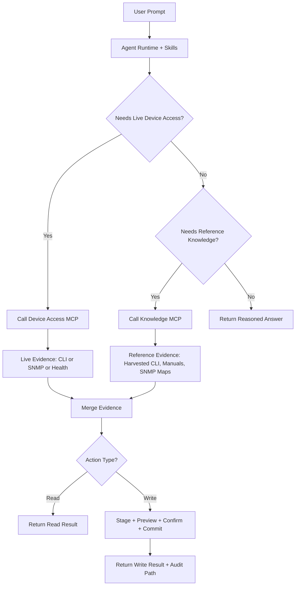

# Future Concept: Dual-Plane MCP Architecture

This concept splits MCP responsibilities into two dedicated servers:

- Device Access MCP: live device operations (CLI, SNMP, connectivity, staged writes).
- Knowledge MCP: reference-data ownership and retrieval (harvested CLI, manuals, SNMP maps, indexes).

Three-word meaning: Dual-plane MCP architecture.

## Related Docs

- [README.md](../../README.md)
- [rad-mcp-server/README.md](../README.md)
- [architecture.md](architecture.md)
- [CONCEPTS.md](CONCEPTS.md)
- [workflows.md](workflows.md)
- [VERSIONS.md](VERSIONS.md)

## Why This Split

- Strong separation of concerns between execution and knowledge.
- One source of truth for reference data, owned by MCP (not by skill directories).
- Safer runtime behavior because write-capable tools stay isolated from static data operations.
- Easier scaling: device operations and knowledge retrieval can evolve independently.

## Responsibility Model

| Plane | Primary Role | Typical Tools/Resources | Write Risk |
| --- | --- | --- | --- |
| Device Access MCP | Operate and validate against live devices | `test_connectivity`, `health_check`, `run_show`, `cli_help`, `stage_config`, `commit_config`, `save_startup`, `snmp_get`, `snmp_walk` | Medium to High (guarded) |
| Knowledge MCP | Build, index, and serve references | `rad://references/*`, `rad://cli-reference/{family}/{context}`, refresh/build/index tools | Low |

## End-to-End Flow

## Data Ownership Target State

Current state (to migrate away from):
- Skills read files directly from `skills/rad-cli-operations/references/`.

Target state:
- Knowledge MCP owns reference artifacts and exposes them via MCP resources.
- Skills request references through MCP resources, not directory reads.
- Device Access MCP remains focused on live operations and guardrails.

## Suggested Migration Phases

1. Phase 1: Resource API
- Add Knowledge MCP resources for CLI/manual/SNMP reference retrieval.
- Add refresh/build/index tooling behind MCP APIs.

2. Phase 2: Skill Migration
- Update skills to call Knowledge MCP resources.
- Run parity checks against current skill-directory behavior.

3. Phase 3: Decommission Direct Reads
- Remove direct file reads from skill logic.
- Keep MCP as the single reference-data control plane.

## Expected Benefits

- Cleaner architecture boundaries.
- Better testability for knowledge quality and freshness.
- Lower coupling between skill prompts and filesystem layout.
- Safer operations by isolating write-capable device workflows.
