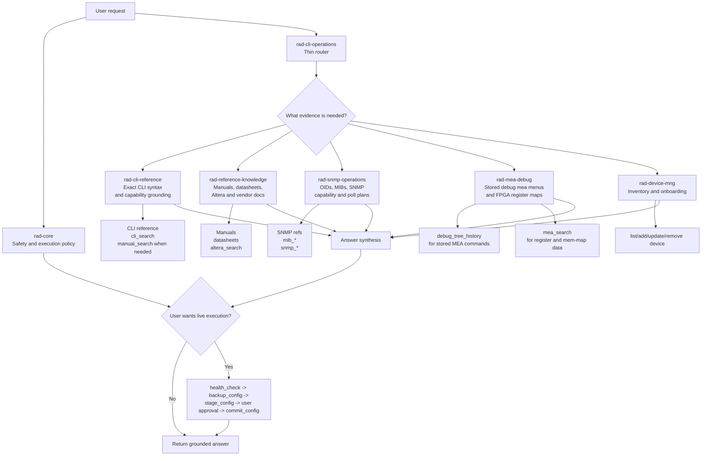

# RAD Skills Routing

This document explains the relationship between the RAD skills, why they were
split, and how routing between them is supposed to work.

## Why the split exists

The original `rad-cli-operations` skill grew into one large mixed prompt that
covered:

- exact CLI syntax
- manuals and procedures
- datasheets and vendor documentation
- SNMP and MIB reasoning
- hidden `debug mea` menus and FPGA register maps
- broad persona prompts like `rad agent`

That shape made routing brittle. A broad keyword like `MEA` or `fan` could send
the model into the wrong evidence store, producing repeated low-signal queries.

The current design keeps one thin router and moves deep domain behavior into
specialized skills.

## Routing diagram

## Skill roles

### `rad-core`

Owns shared safety and execution policy:

- staged config flow
- health-check-before-change behavior
- debug-shell and hidden-debug safety boundaries
- version drift checks

This skill is about **what is safe to do**.

### `rad-cli-operations`

Owns top-level routing:

- persona entry points like `rad agent`, `abayev`, `noam`
- broad RAD questions that first need intent classification
- bundled-vs-served boundary rules
- shared cross-domain rules like `stored data only`

This skill is about **which other skill should take the lead**.

### `rad-cli-reference`

Owns exact CLI syntax and capability grounding:

- command/context lookup
- paste-ready CLI sequences
- family-specific support checks from CLI references
- `cli_search` / CLI-reference routing

This skill is about **what exact CLI command or context is correct**.

### `rad-reference-knowledge`

Owns document-style knowledge:

- manuals and procedures
- datasheets and hardware questions
- Altera/vendor documentation
- figure-aware reference retrieval

This skill is about **how or why something works according to the documents**.

### `rad-snmp-operations`

Owns SNMP and MIB reasoning:

- OID lookup
- MIB object meaning
- table/trap/capability questions
- poll-plan selection

This skill is about **what can be known or polled through SNMP**.

### `rad-mea-debug`

Owns the hidden MEA/debug world:

- stored `debug mea` command/menu history
- FPGA/MEA register maps
- split between `debug_tree_history` and `mea_search`
- stored-data-only behavior for hidden-debug questions

This skill is about **what the hidden MEA path exposes, and which MEA store is relevant**.

### `rad-device-mng`

Owns device inventory and onboarding:

- add/update/remove/list device workflow
- inventory vs credentials separation

This skill is about **which devices exist and how they are registered**.

## Routing model

The intended control flow is:

1. `rad-core` supplies the safety contract.
2. `rad-cli-operations` classifies the user request.
3. One domain skill becomes primary.
4. Cross-domain checks happen only when needed.
5. The answer is synthesized once sufficient evidence exists.

The router should avoid activating several domains just because the prompt
contains overlapping words. Route by **evidence need**, not by raw keyword
presence.

## Primary routing table

| User ask shape | Primary skill | Typical first source |
|---|---|---|
| "what is the command", "show me the syntax", "which context" | `rad-cli-reference` | CLI reference / `cli_search` |
| "how do I", "what does this mean", "what are the limits" | `rad-reference-knowledge` | manual / `manual_search` |
| "which model / ports / optics / datasheet" | `rad-reference-knowledge` | datasheet / `datasheet_search` |
| "AWVALID/WVALID", "NoC", "figure", "timing", "Altera" | `rad-reference-knowledge` | `altera_search` or bundled Altera refs |
| "OID", "MIB", "SNMP", "trap", "walk", "poll" | `rad-snmp-operations` | SNMP refs or `mib_*` / `snmp_*` |
| "debug mea", "MEA commands", "under FPGA>MEA", "what did OAM program" | `rad-mea-debug` | `debug_tree_history` |
| "register", "mem-map", "FPGA table", address/symbol lookup | `rad-mea-debug` | `mea_search` |
| "add device", "remove device", "update host", "inventory" | `rad-device-mng` | inventory tools |
| "run this", "configure this", "commit it" | `rad-core` plus the domain skill that produced the command | health/stage/commit flow |

## Important routing boundaries

### 1. CLI syntax vs manuals

Use `rad-cli-reference` for exact syntax.

Use `rad-reference-knowledge` for explanation, procedure, and limits.

A manual hit is not a substitute for exact CLI syntax.

### 2. SNMP vs generic docs

If the question is about OIDs, tables, traps, capability via SNMP, or poll
shape, prefer `rad-snmp-operations`.

Do not answer a family SNMP-support question from generic MIB text alone.

### 3. Stored MEA commands vs MEA register maps

This is the most important split:

- `debug_tree_history` is for stored MEA commands and menu paths.
- `mea_search` is for register/map data.

Do not treat `mea_search` as a command store.

### 4. Bundled vs served knowledge

In bundled mode, the local references under
`skills/rad-cli-operations/references/` are authoritative.

In served mode, the MCP knowledge tools are authoritative.

Do not replace bundled local references with repository or GitHub search.

### 5. Stored-data-only mode

Once the user says `stored data only`, `offline only`, or `not on live device`:

- stop suggesting live probing
- stop escalating to debug logon or shell steps
- answer from stored references/tools only
- state `not captured in stored data` when necessary

## Cross-skill cooperation

The skills are not isolated silos. The expected pattern is:

- one **primary** skill owns the answer path
- one **secondary** skill may supply a supporting cross-check
- `rad-core` remains active for safety when live execution is involved

Examples:

- A CLI command answer may use `rad-cli-reference` first and
  `rad-reference-knowledge` second for behavioral caveats.
- A hidden OAM/MEA question may use `rad-mea-debug` first and `mea_search`
  second for register-level support.
- An SNMP capability answer may use `rad-snmp-operations` first and
  `rad-reference-knowledge` second if the manual explicitly documents the
  behavior.

The anti-pattern is letting one question trigger a wide fan-out across all
stores without a primary owner.

## Why the references stay under `rad-cli-operations`

The skill split does **not** duplicate the underlying harvested/reference
assets. They still live under:

- `skills/rad-cli-operations/references/`

That keeps ingestion, packaging, and portability simpler. The specialized
skills are routing and behavior layers over the same shared knowledge tree.

## Practical maintenance rule

When adding a new knowledge source or new family behavior, decide first:

1. Which skill should route to it?
2. Which existing store is the authority?
3. Is this exact syntax, document knowledge, SNMP evidence, MEA/debug state,
   inventory state, or safety policy?

If that is unclear, the new logic probably does not belong in the router.
