# Prompt-to-Answer Workflows

This document explains what happens after a user prompt is received: who decides what, which MCP tools are called, which knowledge source is used, and how the final answer is produced.

## Table of Contents

1. [System Roles](#1-system-roles)
2. [Tooling Building Blocks and Structures](#2-tooling-building-blocks-and-structures)
3. [Device Onboarding Workflow (New Family)](#3-device-onboarding-workflow-new-family)
4. [Device Management Workflow (Add/Update/List/Remove)](#4-device-management-workflow-addupdatelistremove)
5. [High-Level Execution Flow](#5-high-level-execution-flow)
6. [Prompt Classification](#6-prompt-classification)
7. [Device Target Resolution](#7-device-target-resolution)
8. [Knowledge Lookup Pipeline](#8-knowledge-lookup-pipeline)
9. [MCP Tool Invocation Model](#9-mcp-tool-invocation-model)
10. [Safety and Gating Behavior](#10-safety-and-gating-behavior)
11. [Data Sources and Ownership](#11-data-sources-and-ownership)
12. [What Happens for Prompts in examples.md](#12-what-happens-for-prompts-in-examplesmd)
13. [Failure and Fallback Paths](#13-failure-and-fallback-paths)
14. [Recommended Future Additions](#14-recommended-future-additions)

## 1. System Roles

1. User
- Writes a natural-language prompt (for example from [docs/examples.md](docs/examples.md)).

2. Agent runtime
- Interprets intent.
- Loads and applies skill rules.
- Chooses whether the answer is knowledge-only or requires device execution.

3. Skill layer
- Defines behavior and safety policy.
- Provides domain workflows and lookup order.
- Main files:
- [skills/rad-cli-operations/SKILL.md](../skills/rad-cli-operations/SKILL.md)
- [skills/rad-core/SKILL.md](../skills/rad-core/SKILL.md)
- [skills/rad-device-mng/SKILL.md](../skills/rad-device-mng/SKILL.md)

4. MCP server (rad-mcp)
- Executes tools for inventory, reads, staged writes, backups, and resources.
- Main server code: [server/rad_mcp/server.py](../server/rad_mcp/server.py).

5. Device backends/drivers
- Backend handles transport behavior (SSH, SNMP reads).
- Driver handles per-family CLI dialect and allowed read commands.

## 1.1 Component Structures (Skills and MCP Server)

### Skill Component Structure

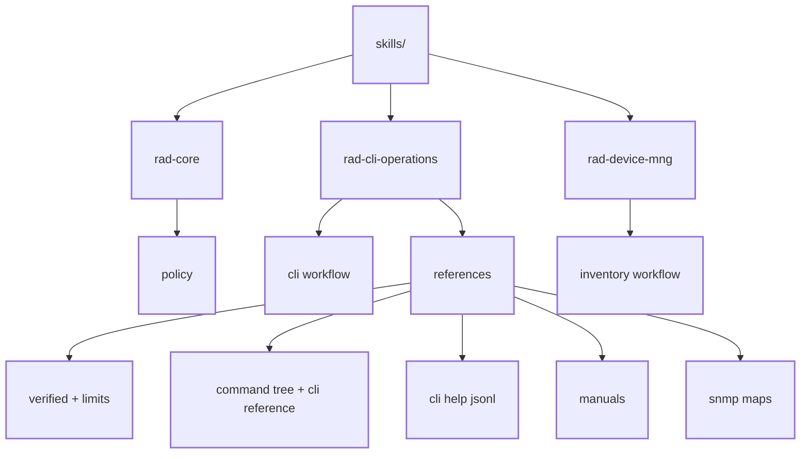

### MCP Server Component Structure

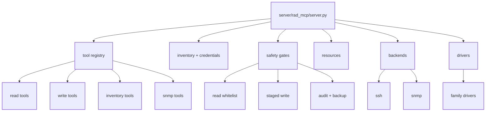

How to read these two diagrams:

1. Skills define domain behavior and knowledge sources.
2. MCP server exposes executable tools and enforces safety.
3. Backends and drivers are execution adapters used by MCP tools at runtime.

## 2. Tooling Building Blocks and Structures

Before onboarding or runtime flow, use this toolbox summary.

### 2.1 MCP Tool Structures (What Each Tool Contains)

| Category | Tool(s) | Contains as Input | Contains as Output |
| --- | --- | --- | --- |
| Read-only CLI/syntax | `cli_help` | `device`, optional `context`, optional `prefix` | Command/argument help for that CLI context, no command execution |
| Read-only CLI/syntax | `run_show`, `run_show_in_context` | `device`, read command (and optional context wrapper) | Operational read data from whitelisted show/info verbs |
| Operational state | `health_check` | `device` | Consolidated health sweep (identity, alarms, key status) |
| Operational state | `test_connectivity` | `device` | SSH reachability and authentication status |
| Operational state | `get_config`, `backup_config` | `device` | Exported running config and/or archived backup artifact |
| Write-path (guarded) | `stage_config` | `device`, `lines[]`, `purpose` | `stage_id` and preview only (no device change yet) |
| Write-path (guarded) | `commit_config` | `stage_id`, `confirm=true` | Applied change result with backup/audit path |
| Write-path (guarded) | `save_startup` | `device`, `confirm=true` | Persist result for reboot survival |
| Inventory | `list_devices` | Optional `group` and/or `family` filters | Inventory facts (`name`/`host`/`family`/`groups`) |
| Inventory | `add_device` | `name`, `host`, `family`, optional `port`, `groups`, `description` | New inventory record (facts only, no credentials in payload) |
| Inventory | `update_device` | Device name + changed fields only | Updated inventory record |
| Inventory | `remove_device` | `name`, `confirm=true` | Deletion status from inventory |
| SNMP | `snmp_probe`, `snmp_get`, `snmp_walk` | Target device, OID/scope parameters | SNMP identity, scalar values, or walked subtree evidence |

Usable MCP tools in lookup and validation flows:

| Call | Purpose |
| --- | --- |
| Call MCP `cli_help` tool | Read live CLI syntax and argument help from root or context |
| Call MCP `run_show` or `run_show_in_context` tool | Execute approved read-only operational commands for validation |
| Call MCP `health_check` or `test_connectivity` tool | Pre-flight checks before deeper live lookups |
| Call MCP `get_config` or `backup_config` tool | Read/export configuration for evidence and cross-checking |
| Call MCP `snmp_probe`, `snmp_get`, `snmp_walk` tool | Read telemetry and OID state where SNMP coverage exists |

Allowed static reference artifacts:

| Artifact Group | Files |
| --- | --- |
| Verified templates and caveats | `verified-commands.md`, `known-limitations.md` |
| Harvested CLI artifacts | `command-tree-*.md`, `cli-reference-*.md`, `cli-help-*.jsonl`, `*-tree-cache.txt` |
| Manual artifacts | `manual-<family>/manual-index.md` and chapter files |
| SNMP artifacts | `snmp-oid-map.json`, `snmp-map-*.md`, `snmp-support.md` |

Blocked or guarded operations:

| Operation | Guard Rule |
| --- | --- |
| Direct write execution without staging | Not allowed; write path must use stage then explicit commit approval |
| Unapproved read commands outside whitelist | Not allowed through read tools |
| Commit/save actions inside lookup layers | Out of scope for lookup; these belong to the write workflow |
| Any credentials inside inventory/reference files | Not allowed; credentials stay in environment variables |

## 3. Device Onboarding Workflow (New Family)

Use this workflow when adding a new device family end to end: inventory, CLI harvest, manual ingest, SNMP mapping, skill updates, MCP server/driver updates, and validation.

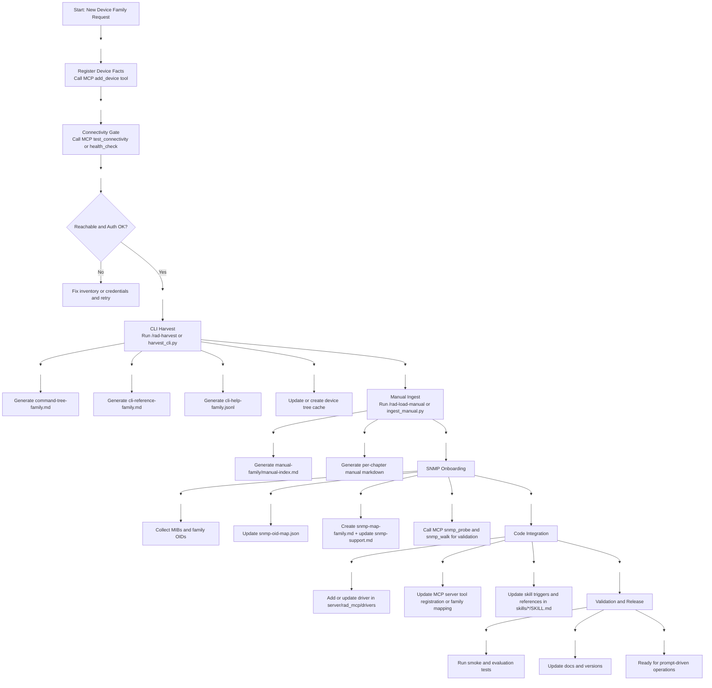

### 3.1 Artifact Outputs by Stage

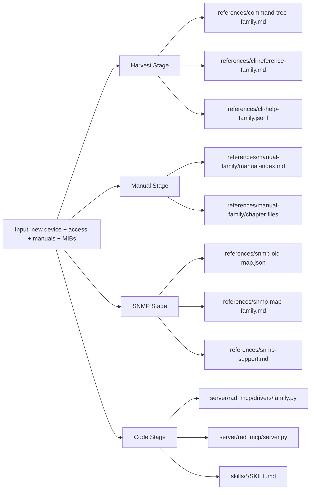

### 3.2 Required Update Checklist

1. Inventory and access
- Register device facts with the MCP inventory tools.
- Verify reachability before harvesting.

2. Skill knowledge refresh
- Add the new family references under [skills/rad-cli-operations/references](../skills/rad-cli-operations/references).
- Update [skills/rad-cli-operations/SKILL.md](../skills/rad-cli-operations/SKILL.md) family coverage and trigger wording.
- Update [skills/rad-core/SKILL.md](../skills/rad-core/SKILL.md) and [skills/rad-device-mng/SKILL.md](../skills/rad-device-mng/SKILL.md) only if onboarding or safety rules changed.

3. MCP server and driver integration
- Add or extend the family driver under [server/rad_mcp/drivers](../server/rad_mcp/drivers).
- Update [server/rad_mcp/server.py](../server/rad_mcp/server.py) if tool behavior, family routing, or capabilities changed.
- Update backend code under [server/rad_mcp/backends](../server/rad_mcp/backends) only when transport behavior differs.

4. SNMP integration
- Extend [skills/rad-cli-operations/references/snmp-oid-map.json](../skills/rad-cli-operations/references/snmp-oid-map.json) and add family SNMP mapping docs.
- Update [skills/rad-cli-operations/references/family-profiles.yaml](../skills/rad-cli-operations/references/family-profiles.yaml) for the new family and refresh support notes in [skills/rad-cli-operations/references/snmp-support.md](../skills/rad-cli-operations/references/snmp-support.md).
- Run coverage gate for ALL existing families: [scripts/check_snmp_support_coverage.py](../scripts/check_snmp_support_coverage.py) and resolve any missing family rows/blocks before release.
- Validate by calling MCP SNMP tools on a real target.

5. Validation and documentation
- Run smoke checks and relevant evals.
- Update docs and version notes so onboarding state is explicit.

### 3.3 Minimum Onboarding Path (Reuse Existing Driver)

Use this compact path when the new device can safely reuse an existing family driver and only knowledge artifacts need to be refreshed.

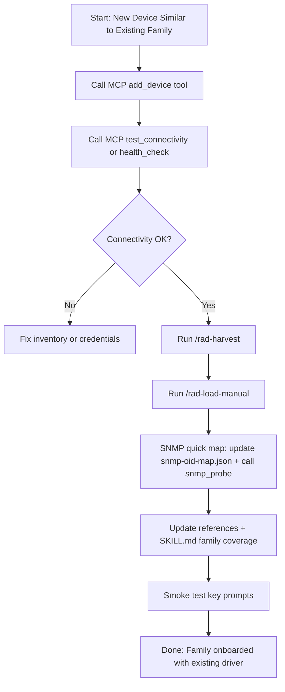

Fast-path exit criteria:

1. Harvested CLI syntax resolves expected contexts and arguments.
2. Manual sections answer core concept/procedure questions.
3. SNMP probe identifies usable object mapping for the family.
4. No driver-level transport or dialect mismatch is observed.

If any criterion fails, switch to the full onboarding workflow in section 3.

## 4. Device Management Workflow (Add/Update/List/Remove)

Use this workflow after family onboarding is complete.

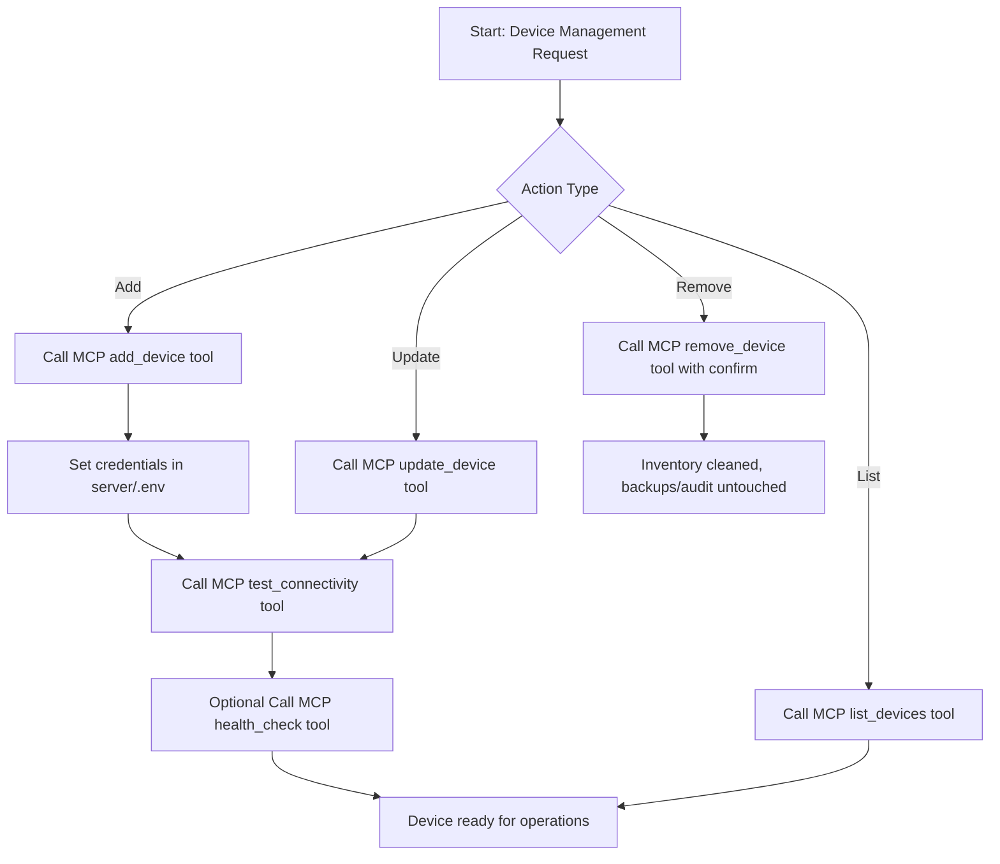

## 5. High-Level Execution Flow

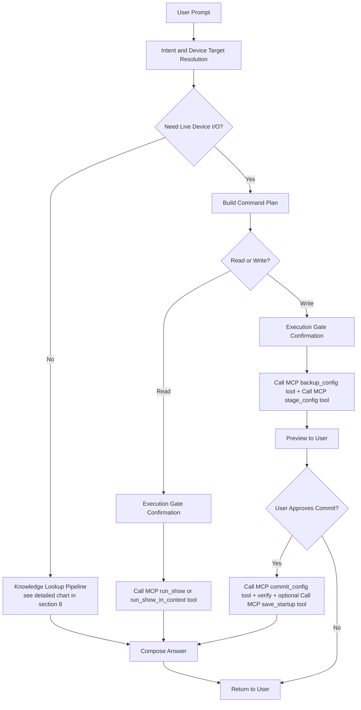

## 6. Prompt Classification

The runtime first classifies the prompt into one of these buckets:

1. Knowledge question
- Example: concept, limit, explanation, comparison.
- Usually no live device call needed.

2. Read operation
- Example: alarms, status, inventory, backup retrieval, health.

3. Write operation
- Example: configuration change, add/remove/update managed device, commit/save.

4. Maintenance and content tasks
- Example: harvest, manual ingest, version checks, knowledge refresh.

## 7. Device Target Resolution

Before device actions, the runtime resolves the target device using:

1. Explicit name/IP/family in prompt.
2. Conversation continuity (current active device).
3. If ambiguous, ask user to select the device.

If no device action is needed, this step is skipped.

## 8. Knowledge Lookup Pipeline

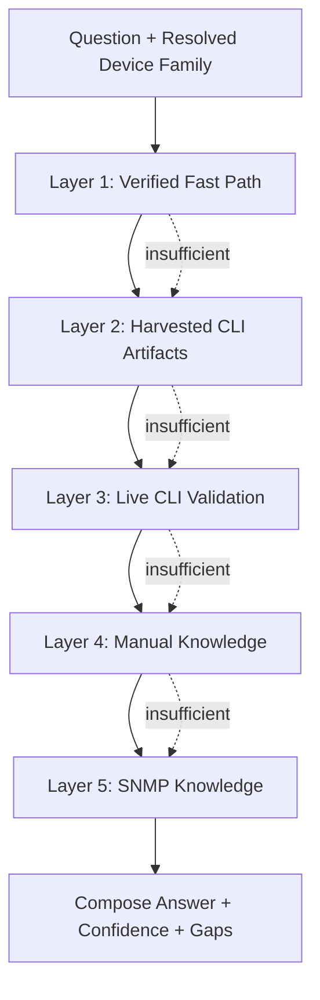

This is the simplified main diagram. Each layer below has its own expanded diagram so the flow stays readable.

### 8.1 Layer 1: Verified Fast Path

How this layer is used:

1. Start with [skills/rad-cli-operations/references/verified-commands.md](../skills/rad-cli-operations/references/verified-commands.md) for proven command templates.
2. Check [skills/rad-cli-operations/references/known-limitations.md](../skills/rad-cli-operations/references/known-limitations.md) for caveats and guardrails before giving an answer.
3. If coverage is complete, answer immediately with high confidence; otherwise fall through to Layer 2.

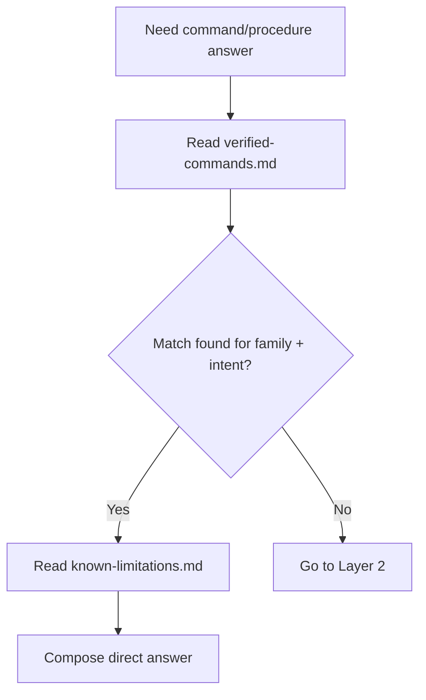

### 8.2 Layer 2: Harvested CLI Artifacts

How each reference file group is used:

1. Command tree files define navigation and context:
- [skills/rad-cli-operations/references/command-tree-etx1p.md](../skills/rad-cli-operations/references/command-tree-etx1p.md)
- [skills/rad-cli-operations/references/command-tree-etx2.md](../skills/rad-cli-operations/references/command-tree-etx2.md)
- [skills/rad-cli-operations/references/command-tree-etx2v.md](../skills/rad-cli-operations/references/command-tree-etx2v.md)
- [skills/rad-cli-operations/references/command-tree-minid.md](../skills/rad-cli-operations/references/command-tree-minid.md)
- [skills/rad-cli-operations/references/command-tree-mp1.md](../skills/rad-cli-operations/references/command-tree-mp1.md)
- [skills/rad-cli-operations/references/command-tree-mp4100.md](../skills/rad-cli-operations/references/command-tree-mp4100.md)
- [skills/rad-cli-operations/references/command-tree-secflow.md](../skills/rad-cli-operations/references/command-tree-secflow.md)

2. CLI reference files define syntax and argument patterns:
- [skills/rad-cli-operations/references/cli-reference-etx1p.md](../skills/rad-cli-operations/references/cli-reference-etx1p.md)
- [skills/rad-cli-operations/references/cli-reference-etx2.md](../skills/rad-cli-operations/references/cli-reference-etx2.md)
- [skills/rad-cli-operations/references/cli-reference-etx2v.md](../skills/rad-cli-operations/references/cli-reference-etx2v.md)
- [skills/rad-cli-operations/references/cli-reference-minid.md](../skills/rad-cli-operations/references/cli-reference-minid.md)
- [skills/rad-cli-operations/references/cli-reference-mp1.md](../skills/rad-cli-operations/references/cli-reference-mp1.md)
- [skills/rad-cli-operations/references/cli-reference-mp4100.md](../skills/rad-cli-operations/references/cli-reference-mp4100.md)
- [skills/rad-cli-operations/references/cli-reference-secflow.md](../skills/rad-cli-operations/references/cli-reference-secflow.md)

3. CLI help JSONL files provide harvested completion/argument evidence:
- [skills/rad-cli-operations/references/cli-help-etx1p.jsonl](../skills/rad-cli-operations/references/cli-help-etx1p.jsonl)
- [skills/rad-cli-operations/references/cli-help-etx2.jsonl](../skills/rad-cli-operations/references/cli-help-etx2.jsonl)
- [skills/rad-cli-operations/references/cli-help-etx2v.jsonl](../skills/rad-cli-operations/references/cli-help-etx2v.jsonl)
- [skills/rad-cli-operations/references/cli-help-minid.jsonl](../skills/rad-cli-operations/references/cli-help-minid.jsonl)
- [skills/rad-cli-operations/references/cli-help-mp1.jsonl](../skills/rad-cli-operations/references/cli-help-mp1.jsonl)
- [skills/rad-cli-operations/references/cli-help-mp4100.jsonl](../skills/rad-cli-operations/references/cli-help-mp4100.jsonl)
- [skills/rad-cli-operations/references/cli-help-secflow.jsonl](../skills/rad-cli-operations/references/cli-help-secflow.jsonl)

4. Tree cache files speed lookup and context reconstruction for known lab devices:
- [skills/rad-cli-operations/references/ehud1p-tree-cache.txt](../skills/rad-cli-operations/references/ehud1p-tree-cache.txt)
- [skills/rad-cli-operations/references/etx2v-1-tree-cache.txt](../skills/rad-cli-operations/references/etx2v-1-tree-cache.txt)
- [skills/rad-cli-operations/references/marks-mp4-tree-cache.txt](../skills/rad-cli-operations/references/marks-mp4-tree-cache.txt)
- [skills/rad-cli-operations/references/minid-tree-cache.txt](../skills/rad-cli-operations/references/minid-tree-cache.txt)
- [skills/rad-cli-operations/references/mp-one-tree-cache.txt](../skills/rad-cli-operations/references/mp-one-tree-cache.txt)
- [skills/rad-cli-operations/references/sf-163-187-tree-cache.txt](../skills/rad-cli-operations/references/sf-163-187-tree-cache.txt)

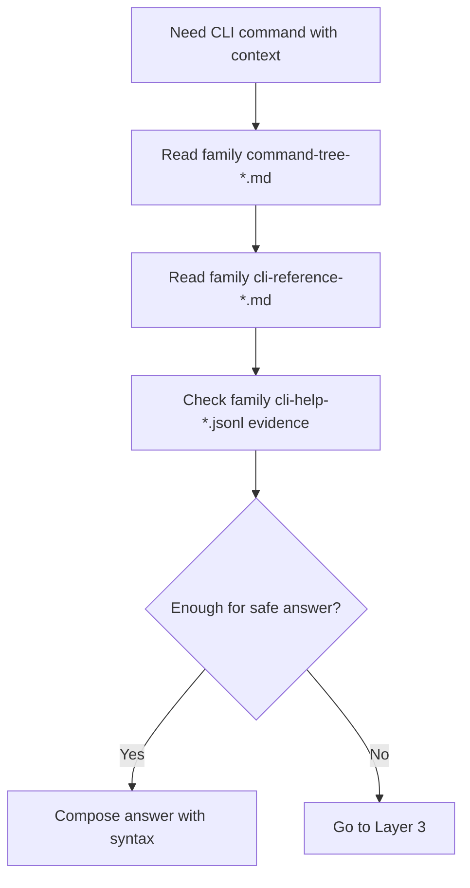

### 8.3 Layer 3: Live CLI Validation

How this layer is used:

1. If harvested artifacts are incomplete or possibly stale, call MCP live help.
2. Primary action: Call MCP cli_help tool (root or specific context).
3. Optional action: Call MCP read-only show tool for runtime confirmation.

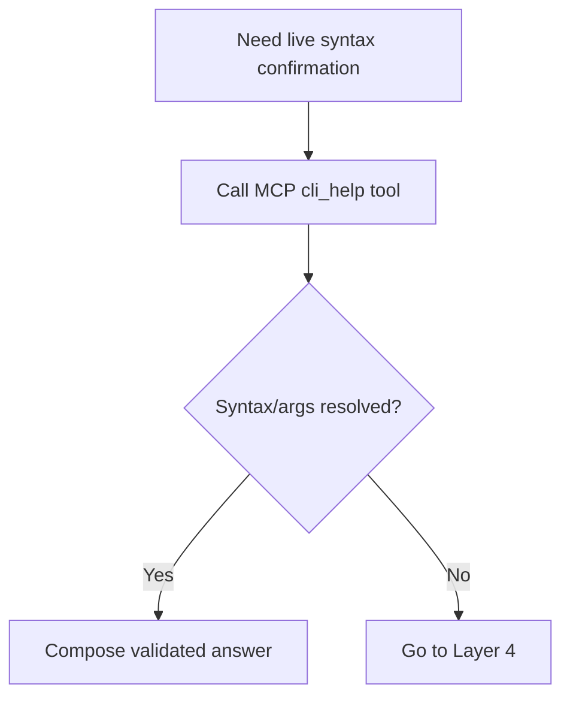

### 8.4 Layer 4: Manual Knowledge

How each manual reference folder is used:

1. Family manuals for concept, architecture, procedures, and limits:
- [skills/rad-cli-operations/references/manual-etx1p](../skills/rad-cli-operations/references/manual-etx1p)
- [skills/rad-cli-operations/references/manual-etx2](../skills/rad-cli-operations/references/manual-etx2)
- [skills/rad-cli-operations/references/manual-etx2v](../skills/rad-cli-operations/references/manual-etx2v)
- [skills/rad-cli-operations/references/manual-minid](../skills/rad-cli-operations/references/manual-minid)
- [skills/rad-cli-operations/references/manual-mp1](../skills/rad-cli-operations/references/manual-mp1)
- [skills/rad-cli-operations/references/manual-mp4100](../skills/rad-cli-operations/references/manual-mp4100)
- [skills/rad-cli-operations/references/manual-secflow](../skills/rad-cli-operations/references/manual-secflow)

2. In each manual folder, manual-index.md is used first, then section files.

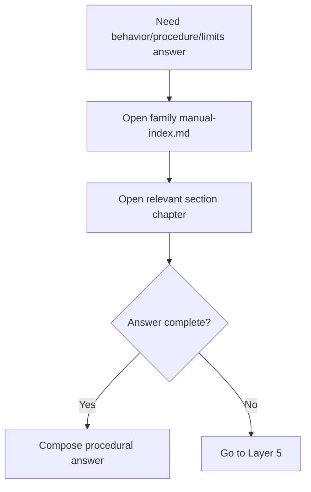

### 8.5 Layer 5: SNMP Knowledge

How each SNMP reference file is used:

1. [skills/rad-cli-operations/references/snmp-oid-map.json](../skills/rad-cli-operations/references/snmp-oid-map.json)
- Primary machine-readable OID to signal mapping.

2. Family SNMP map markdown
- [skills/rad-cli-operations/references/snmp-map-etx2v.md](../skills/rad-cli-operations/references/snmp-map-etx2v.md)
- [skills/rad-cli-operations/references/snmp-map-minid.md](../skills/rad-cli-operations/references/snmp-map-minid.md)

3. [skills/rad-cli-operations/references/snmp-support.md](../skills/rad-cli-operations/references/snmp-support.md)
- Support scope, constraints, and caveats.

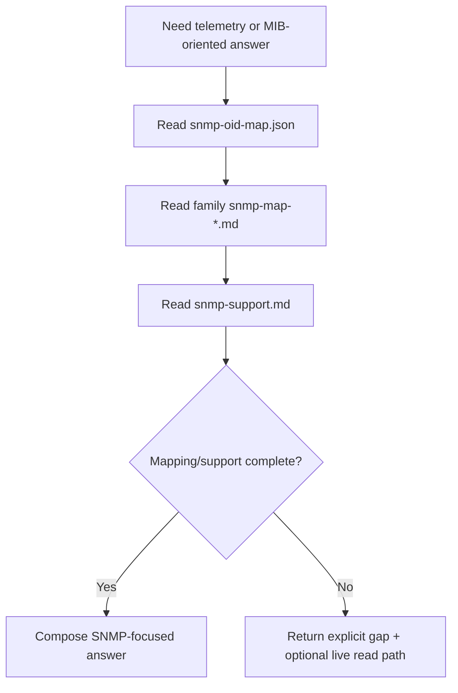

For knowledge-only or pre-flight syntax answers, the lookup order is:

1. Skill recipes and verified patterns
- Fast path for repeated, validated operations.

2. Verified command map and family references
- Command trees and cli-reference files under:
- [skills/rad-cli-operations/references](../skills/rad-cli-operations/references)

3. Live CLI help only when needed
- Use live help for drift, missing coverage, or verification before sensitive write.

4. Manual layer for concept/procedure/limits
- Source folders: manual-family chapters and index.
- Use for "what/why/limits" answers.

5. SNMP map and support notes when the question is telemetry/state oriented
- [skills/rad-cli-operations/references/snmp-oid-map.json](../skills/rad-cli-operations/references/snmp-oid-map.json)
- [skills/rad-cli-operations/references/snmp-support.md](../skills/rad-cli-operations/references/snmp-support.md)

## 9. MCP Tool Invocation Model

MCP tools are called by the agent runtime, not by the user directly.

1. User expresses intent in natural language.
2. Agent translates intent to tool calls.
3. MCP server executes tools and returns structured outputs.
4. Agent synthesizes output into user-facing answer.

Typical read sequence:

1. test_connectivity or health_check (if needed)
2. run_show or run_show_in_context
3. Optional get_config/backup_config for deep inspection
4. Summarize

Typical write sequence:

1. backup_config (automatic before commit)
2. stage_config
3. user preview/approval
4. commit_config with explicit confirmation
5. verify reads
6. optional save_startup

## 10. Safety and Gating Behavior

Safety controls are split between skill policy and server enforcement.

| Control | Behavior |
| --- | --- |
| Execution gate | For shown commands, ask the user before running on device |
| Read whitelist | Only approved read command families are allowed via show tools |
| Staged write model | No direct write execution without stage and explicit commit approval |
| Audit and backup | Commit path includes backup and audit logging |
| Family-specific write constraints | MP candidate-db families enforce additional sequence requirements |

## 11. Data Sources and Ownership

1. Runtime truth (live)
- Device CLI output, SNMP responses, health/connectivity checks.

2. Static truth (versioned knowledge)
- Harvested CLI trees/references.
- Manual chapter markdown.
- SNMP OID map and support notes.

3. Inventory and credentials
- Inventory contains device facts.
- Credentials are env-based and kept separate from inventory facts.

## 12. What Happens for Prompts in examples.md

For prompts in [docs/examples.md](docs/examples.md), flow is usually:

1. Prompt category detection (management, operations, engineering, advanced, onboarding).
2. If concept-only: answer from references/manual.
3. If read action: ask execution gate, then call read tools.
4. If write action: ask execution gate, then stage, preview, confirm commit, verify.
5. Return concise answer plus evidence and next action if needed.

## 13. Failure and Fallback Paths

1. Unknown command/context
- Fallback to family command tree and context-level lookup.

2. Firmware drift
- Use live help/resource checks and report mismatch clearly.

3. Connectivity/auth issues
- Report exact tool failure and required remediation.

4. Incomplete harvested coverage
- Use manual layer and/or targeted live checks.

## 14. Recommended Future Additions

1. Add workflow IDs per prompt class (WF-READ-01, WF-WRITE-02, and so on).
2. Add a compact troubleshooting matrix by failure code.
3. Add sequence diagrams per major family scenario (ETX, MP, MiNID, ETX-2V).
4. Add an explicit decision table: CLI vs manual vs SNMP for each question type.
