# Altera document: Agilex™ 7 M-Series FPGA Network-on-Chip (NoC) User Guide

Source PDF: `768844_854748.pdf`
Pages: 104
Figures extracted: yes

## Agilex 7 M-Series FPGA Network-on-Chip (NoC) User Guide  *(p.1-104)*

Explore more resources
Altera® Design Hub
Agilex™ 7 M-Series FPGA Network-
on-Chip (NoC) User Guide
Updated for Quartus® Prime Design Suite: 25.1.1
Answers to Top FAQs:
Q What is the NoC?
A General NoC Architecture on page 9
Q Which applications benefit from NoC?
A Example NoC Applications on page 29
Q What is the NoC architecture?
A High-Level NoC Architecture on page 86
Q What protocols does NoC support?
A NoC Protocol Support on page 7
Q How do I implement the NoC?
A NoC Design Flow on page 22
Q Can I start from a design example?
A NoC Example Designs on page 23
Q What IP does NoC require?
A NoC Building Blocks on page 23
Q How do I simulate my NoC design?
A Simulating NoC Designs on page 36
Q How do I estimate power for NoC designs?
A NoC Power Estimation on page 84
Online Version
Send Feedback
768844
2025.07.14

Contents
1. Answers to Top FAQs...................................................................................................... 4
2. Network-on-Chip (NoC) Overview...................................................................................5
2.1. Introduction to Agilex™ 7 M-Series FPGAs................................................................. 5
2.2. Terminology for Agilex 7 M-Series FPGAs.................................................................. 5
2.3. General NoC Architecture and Applications................................................................ 7
2.3.1. General NoC Architecture............................................................................7
2.3.2. Example NoC Applications...........................................................................8
3. Hard Memory NoC in Agilex 7 M-Series FPGAs................................................................ 9
3.1. High-Level Architecture.......................................................................................... 9
3.2. NoC Segments.................................................................................................... 11
3.2.1. UIB Segments......................................................................................... 12
3.2.2. GPIO-B Segments.................................................................................... 12
3.2.3. GPIO-B and HPS Segment.........................................................................13
3.2.4. SDM Segment......................................................................................... 14
3.2.5. PLL and SSM Segment..............................................................................14
3.3. NoC Switch and Link Detail....................................................................................15
3.4. Fabric NoC.......................................................................................................... 18
3.5. NoC Protocol Support........................................................................................... 19
3.5.1. AXI4 Protocol Support.............................................................................. 19
3.5.2. AXI4 Handshaking Support........................................................................20
3.5.3. Quality of Service (QoS) Support............................................................... 20
3.5.4. Transaction Ordering Support.................................................................... 21
3.5.5. AXI4-Lite Protocol Support........................................................................ 22
3.6. NoC Design Considerations....................................................................................22
3.6.1. Determining the Number of NoC Targets..................................................... 22
3.6.2. Determining the Number of NoC Initiators...................................................22
3.6.3. Fabric NoC Considerations.........................................................................22
3.6.4. Latency Considerations............................................................................. 23
3.6.5. Initiator and Target Bandwidth Considerations............................................. 23
3.6.6. Horizontal Bandwidth Considerations.......................................................... 23
3.6.7. Options for Managing NoC Bandwidth ........................................................ 27
3.6.8. GPIO-B Bypass Mode and Initiators............................................................ 28
4. NoC Design Flow in Quartus Prime Pro Edition..............................................................29
4.1. Hard Memory NoC Design Flow Overview................................................................ 29
4.1.1. NoC Design Flow Options.......................................................................... 29
4.2. Using NoC Example Designs.................................................................................. 31
4.3. NoC Building Blocks............................................................................................. 32
4.3.1. NoC Initiators for Hard Processor Systems...................................................32
4.3.2. NoC Targets for Hard Processor Systems..................................................... 33
4.3.3. NoC Initiators for Fabric AXI4 Managers...................................................... 33
4.3.4. NoC Targets for Fabric AXI4 Managers........................................................ 35
4.3.5. NoC Clock Control.................................................................................... 35
4.4. Connecting NoC IP............................................................................................... 36
4.4.1. General NoC IP Connectivity Guidelines.......................................................36
Contents
Agilex™ 7 M-Series FPGA Network-on-Chip (NoC) User Guide
Send Feedback
2

4.4.2. Connectivity Guidelines: NoC Initiators for Fabric AXI4 Managers....................38
4.4.3. Connectivity Guidelines: NoC Targets for Fabric AXI4 Managers...................... 40
4.4.4. Connectivity Guidelines: NoC Clock Control ................................................ 42
4.4.5. Connectivity Guidelines: NoC Initiators for HPS ........................................... 42
4.4.6. Connectivity Guidelines: NoC Targets for HPS ............................................. 43
4.5. Making NoC Logical Assignments............................................................................44
4.5.1. Creating NoC Assignments for Compilation.................................................. 44
4.5.2. Using the NoC Assignment Editor............................................................... 45
4.5.3. Troubleshooting NoC Assignment Editor...................................................... 52
4.5.4. NoC Connection and Addressing Examples...................................................52
4.6. Making NoC Physical Assignments Using Interface Planner.........................................62
4.6.1. Using Interface Planner.............................................................................65
4.6.2. Recommended Placement Order for NoC Elements in Interface Planner........... 67
4.6.3. Hard Memory NoC Locations in Interface Planner..........................................69
4.6.4. NoC Performance Reports in Interface Planner............................................. 72
4.7. Compiling the NoC Design.....................................................................................74
4.7.1. Fitter NoC Reports....................................................................................74
4.7.2. Viewing NoC Elements in Chip Planner........................................................ 77
5. NoC Real-time Performance Monitoring........................................................................ 78
6. Simulating NoC Designs................................................................................................ 79
6.1. Using the Abstract NoC Simulation Model................................................................ 80
6.1.1. Generating the Abstract Simulation Include File (Platform Designer
Connection Flow)..................................................................................... 81
6.1.2. Generating the Abstract Simulation Include File (NoC Assignment Editor
Connection Flow)..................................................................................... 81
6.1.3. Using the Abstract Simulation Include File................................................... 82
6.2. Using the Accurate NoC Simulation Model................................................................84
6.2.1. Generating the Accurate Simulation Include File...........................................84
6.2.2. Using the Accurate Simulation Include File.................................................. 84
7. NoC Power Estimation...................................................................................................86
7.1. Using the Power and Thermal Calculator to Estimate NoC Power.................................86
8. Hard Memory NoC IP Reference.................................................................................... 90
8.1. NoC Initiator Intel FPGA IP....................................................................................90
8.1.1. NoC Initiator Intel FPGA IP Parameters....................................................... 90
8.1.2. NoC Initiator Intel FPGA IP Interfaces......................................................... 92
8.2. NoC Clock Control Intel FPGA IP...........................................................................100
8.2.1. NoC Clock Control Intel FPGA IP Parameters.............................................. 100
8.2.2. NoC Clock Control Intel FPGA IP Interfaces................................................ 101
8.2.3. NoC Clock Control Intel FPGA IP Platform Designer-only Signals................... 101
9. Document Revision History of Agilex 7 M-Series FPGA Network-on-Chip (NoC)
User Guide............................................................................................................. 102
Contents
Send Feedback
Agilex™ 7 M-Series FPGA Network-on-Chip (NoC) User Guide
3

1. Answers to Top FAQs
Q
What is the NoC?
A
 General NoC Architecture on page 9
Q
Which applications benefit from NoC?
A
 Example NoC Applications on page 29
Q
What is the NoC architecture?
A
 High-Level NoC Architecture on page 86
Q
What protocols does NoC support?
A
 NoC Protocol Support on page 7
Q
How do I implement the NoC?
A
 NoC Design Flow on page 22
Q
Can I start from a design example?
A
 NoC Example Designs on page 23
Q
What IP does NoC require?
A
 NoC Building Blocks on page 23
Q
How do I simulate my NoC design?
A
 Simulating NoC Designs on page 36
Q
How do I estimate power for NoC designs?
A
 NoC Power Estimation on page 84
© Altera Corporation. Altera, the Altera logo, the ‘a’ logo, and other Altera marks are trademarks of Altera Corporation. Altera
reserves the right to make changes to any products and services at any time without notice. Altera assumes no responsibility or
liability arising out of the application or use of any information, product, or service described herein except as expressly agreed
to in writing by Altera. Altera customers are advised to obtain the latest version of device specifications before relying on any
published information and before placing orders for products or services.
*Other names and brands may be claimed as the property of others.

2. Network-on-Chip (NoC) Overview
2.1. Introduction to Agilex™ 7 M-Series FPGAs
Agilex™ 7 M-Series FPGAs introduce an integrated Network-on-Chip (NoC) to facilitate
high-bandwidth data movement between the FPGA core logic and memory resources,
such as HBM2e and external memories, such as DDR5. The Agilex 7 M-Series FPGA
implements the NoC as two independent hard memory NoCs running horizontally
along the top edge and bottom edge of the die. These horizontal networks spread
memory bandwidth across the edge of the device, making it easier to saturate the
memory bandwidth while avoiding routing congestion. An additional feature known as
the fabric NoC allows you to store read data from external memory directly in M20K
memory blocks in the FPGA fabric, further reducing congestion along the die edge.
This document provides the following information about these NoC devices:
- 
An introduction to NoC structures and typical applications.
- 
Details on the NoC subsystem in Agilex 7 M-Series FPGAs.
- 
How to create NoC designs in the Quartus® Prime Pro Edition software.
- 
How to use NoC subsystem features to monitor performance during operation.
- 
How to simulate designs using the NoC subsystem.
- 
How to estimate power for designs using the NoC subsystem.
2.2. Terminology for Agilex 7 M-Series FPGAs
Table 1.
Agilex 7 M-Series FPGA Terminology
Term
Description
NoC
Network-on-Chip based communications structure between elements only in Agilex 7 M-Series
FPGAs.
Hard Memory NoC
The NoC subsystem implemented as a hard block in the Agilex 7 M-Series FPGA for interfacing
with high-bandwidth memory and external memory interfaces.
Horizontal NoC (HNoC)
The Agilex 7 M-Series FPGA implements the NoC as two independent hard memory NoCs
running horizontally along the top edge and bottom edge of the die.
NoC Initiator (INIU)
The bridge between the AXI4 manager in user logic and the hard memory NoC.
NoC Target (TNIU)
The bridge between the AXI4 subordinate IP in the periphery and the hard memory NoC.
Fabric NoC
An optional implementation of the NoC initiator where the read response data is written
directly to M20K memory blocks.
HBM2E
The in-package, high-bandwidth memory available in Agilex 7 M-Series FPGAs.
Pseudo BL8 Transaction
For HBM2E, you can enable data access granularity of 64B (64 bits per Pseudo-Channel at
BL8) which can achieve greater efficiency. By default, data access granularity is 32B (64 bits
per Pseudo-Channel at BL4).
continued...
© Altera Corporation. Altera, the Altera logo, the ‘a’ logo, and other Altera marks are trademarks of Altera Corporation. Altera
reserves the right to make changes to any products and services at any time without notice. Altera assumes no responsibility or
liability arising out of the application or use of any information, product, or service described herein except as expressly agreed
to in writing by Altera. Altera customers are advised to obtain the latest version of device specifications before relying on any
published information and before placing orders for products or services.
*Other names and brands may be claimed as the property of others.

Term
Description
AXI4 Manager
Function that initiates transactions on an AXI4 interconnect.
AXI4 Subordinate
Function that responds to transactions on an AXI4 interconnect.
GPIO-B Blocks
General purpose I/O bank available in Agilex 7 M-Series FPGAs.
Bypass Mode
Bypasses the NoC. This mode applies only to EMIF configuration, with EMIF in bypass mode.
EMIF in bypass mode
Any instance of the External Memory Interfaces (EMIF) IP that you configure with
PHY_NOC_EN=false. When PHY_NOC_EN=false, the access mode is through the fabric, in
either sync or async mode).
NoC PLL
Dedicated phase lock loop (PLL) for the hard memory NoC.
Byte lane (BL)
Synonymous with an IO12, or I/O lane.
NoC SSM
Subsystem manager for the hard memory NoC.
Secure Device Manager
(SDM)
There is no connection between the SDM and the hard memory NoC, and all signals from the
SDM bypass the hard memory NoC.
UIB
Universal interface block that is a silicon bridge to connect FPGA I/O to the HBM2E memory
device.
1d1r
one dimm, one rank
1d2r
one dimm, two ranks
Related Information
- 
AN 1003: Multi Memory IP System Resource Planning for Agilex 7 M-Series FPGAs
- 
Quartus Prime Pro Edition User Guide: Getting Started
- 
High Bandwidth Memory (HBM2E) Interface Agilex 7 M-Series FPGA IP User Guide
- 
High Bandwidth Memory (HBM2E) Interface Agilex 7 M-Series FPGA IP Design
Example User Guide
- 
External Memory Interfaces Agilex 7 M-Series FPGA IP User Guide
- 
External Memory Interfaces Agilex 7 M-Series FPGA IP Design Example User Guide
- 
Agilex® 7 General-Purpose I/O User Guide
- 
Agilex 7 LVDS SERDES User Guide: M-Series
- 
IOPLL IP Core, Agilex 7 M-Series Clocking and PLL User Guide
- 
Agilex 7 Clocking and PLL User Guide: M-Series
- 
PHY Lite for Parallel Interfaces FPGA IP User Guide
2. Network-on-Chip (NoC) Overview
Agilex™ 7 M-Series FPGA Network-on-Chip (NoC) User Guide
Send Feedback
6

2.3. General NoC Architecture and Applications
2.3.1. General NoC Architecture
The NoC subsystem comprises a network of switches connected with high-speed data
links. The NoC initiators and NoC targets connect into these switches. Initiators are
bridges that interface with manager logic in your design that initiates read or write
transactions.
Figure 1. General NoC Architecture Abstraction illustrates an example of a high-
bandwidth, high-speed Network-on-Chip (NoC) interconnect architecture.
Figure 1.
General NoC Architecture Abstraction
AXI4
Subordinate
NoC
Target
NoC
Initiator
Switch
AXI4
Manager
NoC Subsystem
Switch
Switch
Switch
AXI4
Subordinate
NoC
Target
NoC
Target
NoC
Initiator
NoC
Initiator
AXI4
Manager
AXI4
Manager
FPGA Fabric
Periphery
NoC targets are bridges that interface with subordinate IP that respond to these read
or write transactions. Some subordinate IP, such as the High Bandwidth Memory
(HBM2E) Interface Agilex 7 FPGA IP, may connect to multiple targets. The NoC
initiators and targets translate between the AXI4 and the internal NoC format.
In a typical transaction, an AXI manager posts transactions that the initiator block
then converts into the internal format of the NoC. These transaction steps then
reverse when the transaction translates back to AXI upon arrival at the subordinate
memory IP. Multiple managers can issue read or write transactions simultaneously to
different subordinates. The switch network routes each request independently,
arbitrating between traffic, as necessary.
You can use the hardened NoC architecture to transport transactions to external
memory. The hardened NoC infrastructure applies the advantages of large-scale
networks to FPGAs. The NoC subsystem provides highly structured, flexible, and
2. Network-on-Chip (NoC) Overview
Send Feedback
Agilex™ 7 M-Series FPGA Network-on-Chip (NoC) User Guide
7

scalable on-chip memory access solutions for bandwidth demanding applications, such
as real-time audio and video, network processing, high-performance computing, and
other applications.
2.3.2. Example NoC Applications
This section describes some applications that can benefit from NoC technology. These
applications typically feature high bandwidth requirements between core logic and
memory resources.
2.3.2.1. Parallel Computing NoC Application
In a parallel computing system, you may use several types of processors and
accelerators to optimally execute a computational effort, using task-based and data-
based parallelism. Interconnect and memory performance play a key role in a parallel
computing system where the NoC subsystem can provide high-bandwidth and low-
latency communication between the processing elements and memories.
A parallel computing system may have data that transfers between an external host
and the FPGA over a PCI Express* (PCIe) link. Once you bring data into the FPGA
fabric, you can then store this data in HBM2e or external memory, for example DDR5,
over the NoC subsystem.
Every processing element connected to a NoC can access all channels of the global
memories attached to that NoC, regardless of the physical location of these channels.
Processing elements often have highly sequential memory read access patterns that
benefit from use of a feature in Agilex 7 M-series devices known as the fabric NoC.
This feature allows the NoC to deliver read results via M20K memories that are located
close to the PE logic in the FPGA core fabric.
2.3.2.2. SmartNIC NoC Application
Network Interface Cards (NICs) connect computers and servers to an Ethernet
network. SmartNICs are network adapters that have programmability and flexibility to
accelerate and offload certain functions from the server CPU, such as packet
processing that traditional NICs are incapable of handling.
SmartNICs can increase server performance in data centers by offloading network
processing workloads and tasks from the CPU. This offloading frees up server CPU
cores to work on computationally intensive business-critical tasks at the network flow
and packet level. Offloading functions such as storage, encryption, and sophisticated
routing enables SmartNICs to deliver back to the host the CPU cycles usually spent
processing these workloads. This offloading can result in improved server performance
and reduced overall power consumption.
The support different processing engines, such as filtering, switching, routing, packet
buffering, and flow control, requires external high-bandwidth and high-capacity
memories, such as HBM2e and DDR5. Additionally, the interface between the
SmartNIC and external memory must meet the bandwidth requirement of the
switching Ethernet traffic. The NoC subsystem available in Agilex 7 M-Series FPGAs
provides the high-bandwidth interconnect between these programmable offload
engines and the external memory that SmartNIC applications require.
2. Network-on-Chip (NoC) Overview
Agilex™ 7 M-Series FPGA Network-on-Chip (NoC) User Guide
Send Feedback
8

3. Hard Memory NoC in Agilex 7 M-Series FPGAs
3.1. High-Level Architecture
Agilex 7 M-Series FPGAs provide two hard memory NoC subsystems that run
horizontally along the top and bottom edges of the FPGA die. These subsystems are
completely independent, and each subsystem interfaces with a separate set of
peripherals. These horizontal networks spread memory bandwidth across the edge of
the device, making it easier to saturate the memory bandwidth while avoiding routing
congestion. Because the NoC is hard logic, it also reduces the need for soft
interconnect logic, leaving more room for other IP functions.
The clock control segment contains a PLL for clock generation and a sub-system
manager (SSM) for configuration. Other NoC segments interface with general purpose
I/O (GPIO-B) banks where you can implement external memory interfaces. There are
also segments to interface with the Universal Interface Bus (UIB) that connects to in-
package high-bandwidth memory. The NoC segments contain switches, NoC initiators,
and NoC targets. For details on each segment, refer to NoC Segments.
High-speed 512-bit links interconnect the switches within the NoC segments. There
are separate sets of links carrying traffic left-to-right, and right-to-left, within the hard
memory NoC. Each set of links has separate links for transaction requests and
transaction responses.
NoC initiators connect AXI4 managers in the FPGA fabric to the hard memory NoC.
NoC targets connect subordinate hardened memory controllers to the hard memory
NoC.
You can choose to have the initiator return read data to M20K memory cells in a
column adjacent to the NoC initiator using a configuration known as a fabric NoC.
Because the data transfers directly into the FPGA fabric, this fabric NoC configuration
reduces congestion at the edge of the device. Additionally, this configuration doubles
the AXI4 read data width, enabling your design to fully utilize the high bandwidth
memory and external memory interfaces while running at a lower operating frequency.
HBM2e memory connects to targets through the Universal Interface Bus (UIB). All
access between the FPGA fabric and HBM2e memory is through the hard memory
NoC. Refer to the High Bandwidth Memory (HBM2E) Interface Agilex 7 FPGA IP User
Guide for details on the HBM2e memory.
You can implement external memory protocols, such as DDR5, in GPIO-B I/O blocks.
You can also use GPIO-B blocks for implementing other I/O functions.
You have the option of accessing external memory interfaces using the hard memory
NoC, or directly from the FPGA fabric bypassing the NoC, depending on memory
speeds, protocols and your design needs. Refer to the External Memory Interfaces
Agilex 7 M-Series FPGA IP User Guide for details on external memory protocols
supported in GPIO-B blocks and when to use the hard memory NoC or bypass mode.
© Altera Corporation. Altera, the Altera logo, the ‘a’ logo, and other Altera marks are trademarks of Altera Corporation. Altera
reserves the right to make changes to any products and services at any time without notice. Altera assumes no responsibility or
liability arising out of the application or use of any information, product, or service described herein except as expressly agreed
to in writing by Altera. Altera customers are advised to obtain the latest version of device specifications before relying on any
published information and before placing orders for products or services.
*Other names and brands may be claimed as the property of others.

Other I/O functions that you implement in GPIO-B blocks do not connect to the hard
memory NoC and always bypass it directly in the FPGA fabric. Note that functions that
bypass the hard memory NoC may prevent the use of certain NoC initiator locations.
For more information refer to GPIO-B Bypass Mode and Initiators.
The hard memory NoC along the top edge of the die also connects to a multi-port
front end (MPFE) for the Hard Processor System (HPS). The MPFE is located in the
segment immediately next to the HPS and allows the HPS to initiate transactions on
the hard memory NoC. The NoC initiators in the MPFE are similar to the NoC initiators
that interface to the FPGA fabric, but do not have the option to use the fabric NoC
configuration which transfers read data directly into M20K memory blocks. Refer to
the Agilex 7 Hard Processor System Technical Reference Manual for details on the
HPS.
Figure 2.
Agilex 7 M-Series Device Layout
PLL/SSM
NoC
Segment
SDM
NoC Segment
SDM
GPIO-B_0
NoC Segment
GPIO-B
GPIO-B_1
NoC Segment
UIB_L
NoC Segment
UIB_M
NoC Segment
Connections to Transceiver Tiles
Connections to Transceiver Tiles
Connections to Transceiver Tiles
Connections to Transceiver Tiles
PLL/SSM
NoC
Segment
GPIO-B_0
NoC Segment
GPIO-B_1
NoC Segment
UIB_L
NoC Segment
UIB_M
NoC Segment
UIB_R
NoC Segment
GPIO-B_2
NoC Segment
GPIO-B/HPS
NoC Segment
GPIO-B
HPS
GPIO-B
GPIO-B
GPIO-B
UIB
UIB_R
NoC Segment
GPIO-B_2
NoC Segment
GPIO-B_3
NoC Segment
UIB
GPIO-B
GPIO-B
GPIO-B
Vertical Arrows Represent
Fabric NoCs
Bank 3A
Bank 3B
Bank 3C
Bank 3D
Bank 2A
Bank 2B
Bank 2C
Bank 2D
Top Edge
NoC
Bottom Edge
NoC
Each hard memory NoC subsystem consists of several NoC segments connected
horizontally by high-speed networks. Figure 2. Agilex 7 M-Series Device Layout shows
the high-level layout of hard memory NoC elements in Agilex 7 M-Series devices.
Along the top and bottom edge of the die are GPIO-B blocks for implementing external
memory interfaces and UIB blocks for interfacing to HBM2e memory. Adjacent to
these are the NoC GPIO-B and UIB segments that make up the hard memory NoC.
3. Hard Memory NoC in Agilex 7 M-Series FPGAs
Agilex™ 7 M-Series FPGA Network-on-Chip (NoC) User Guide
Send Feedback
10

NoC PLL and SSM segments are in the upper left and lower left corners. The vertical
arrows extending from these segments into the die represent the optional fabric NoCs
using M20K memory blocks.
Additionally, there is a service network within the hard memory NoC segments that
runs in parallel to the main switch network. This service network connects the NoC
SSM and the HPS AXI4 Lite initiator to AXI4 Lite targets. You can use this service
network for sideband configuration and monitoring.
The following document sections describe the hard memory NoC segments and the
fabric NoCs.
Related Information
- 
High Bandwidth Memory (HBM2E) Interface Agilex 7 M-Series FPGA IP User Guide
- 
External Memory Interfaces Agilex 7 M-Series FPGA IP User Guide
- 
Agilex 7 Hard Processor System Technical Reference Manual
3.2. NoC Segments
Aside from the NoC PLL and SSM, the hard memory NoC also consists of segments
containing initiators, targets, and switches. The structure of segments within the hard
memory NoC depend on the interfaces with which they interact. Figure 2. Agilex 7 M-
Series Device Layout shows the arrangement of these segments within each hard
memory NoC.
The following section describes the individual NoC segments. The hard memory NoC
along the top edge of the device contains 20 NoC initiators facing the FPGA fabric and
2 NoC initiators in the MPFE to interact with the HPS. The hard memory NoC along the
bottom edge of the device contains 22 NoC initiators facing the FPGA fabric.
There is an additional service network running parallel to the main switch network
within each hard memory NoC. This service network connects NoC SSM and the HPS
AXI4 Lite initiator to AXI4 Lite targets. Fabric-facing NoC initiators can send
transactions over the main network to the NoC SSM to access the service network for
sideband configuration and system monitoring. The following NoC Segment diagrams
do not show this service network.
3. Hard Memory NoC in Agilex 7 M-Series FPGAs
Send Feedback
Agilex™ 7 M-Series FPGA Network-on-Chip (NoC) User Guide
11

3.2.1. UIB Segments
UIB segments are NoC segments that interface with the UIB to connect to HBM2e
memory. These UIB segments consist of three subsegments, each aligned with an
FPGA clock sector. Overall, the UIB segment consists of the following:
- 
Nine AXI4 initiators on the FPGA fabric side.
- 
Sixteen AXI4 targets on the UIB side.
- 
Six AXI4 Lite targets on the UIB side.
- 
A network of switches that transfer packets laterally along the hard memory NoC
and connect to the AXI4 initiators and target.
Figure 3.
NoC UIB Segment Initiators, Targets, and Switches
To/From UIB
To/From FPGA Fabric
AXI4 Lite Target
Switch
AXI4 Target
AXI4 Initiator
AXI4 Lite Target
Inaccessible By User
Note:
There is an additional service network running parallel to the main switch network.
This service network connects the NoC SSM to the AXI4 Lite initiators and targets.
NoC initiators can send transactions over the main network to the NoC SSM to access
the service network for sideband configuration and system monitoring. Figure 3. NoC
UIB Segment does not show this network.
3.2.2. GPIO-B Segments
GPIO-B segments are NoC segments that interface with GPIO-B blocks, span one
FPGA clock sector, and consist of the following:
- 
Three AXI4 initiators on the FPGA fabric side.
- 
Two AXI4 targets on the GPIO-B block side.
- 
One AXI4 Lite target on the GPIO-B block side.
- 
A network of switches that transfer packets laterally along the hard memory NoC
and connect to the AXI4 initiators and targets.
3. Hard Memory NoC in Agilex 7 M-Series FPGAs
Agilex™ 7 M-Series FPGA Network-on-Chip (NoC) User Guide
Send Feedback
12

Figure 4.
GPIO-B Segments
To/From GPIO-B
To/From FPGA Fabric
AXI4 Lite Target
Switch
AXI4 Target
AXI4 Initiator
Note:
There is an additional service network running parallel to the main switch network.
This service network connects the NoC SSM to the AXI4 Lite initiators and targets.
NoC initiators can send transactions over the main network to the NoC SSM to access
the service network for sideband configuration and system monitoring. Figure 4.
GPIO-B Segments does not show this service network.
3.2.3. GPIO-B and HPS Segment
The GPIO-B and HPS segment is a segment of the top NOC adjacent to the HPS which
interfaces with the HPS and also interfaces with the GPIO-B block. This segment is
similar to the GPIO-B segments, except that a connection to the HPS MPFE replaces
one of the NoC initiators facing the FPGA fabric. The HPS segment consists of the
following:
- 
Two AXI4 initiators on the FPGA fabric side.
- 
Two AXI4 targets on the GPIO-B side.
- 
One AXI4 Lite target on the GPIO-B side.
- 
Two AXI4 initiators and one AXI4 Lite initiator on the HPS MPFE side.
- 
A network of switches that transfer packets laterally along the hard memory NoC
and connect to the AXI4 initiators and targets.
Figure 5.
NoC GPIO-B/HPS Segment
To/From GPIO-B
To/From FPGA Fabric
To/From HPS
AXI4 Lite Target
Switch
AXI4 Target
AXI4 Initiator
AXI4 Lite Initiator
MPFE
Note:
There is an additional service network running parallel to the main switch network.
This service network connects the NoC SSM to the AXI4 Lite initiators. NoC initiators
can send transactions over the main network to the NoC SSM to access the service
network for sideband configuration and system monitoring.
3. Hard Memory NoC in Agilex 7 M-Series FPGAs
Send Feedback
Agilex™ 7 M-Series FPGA Network-on-Chip (NoC) User Guide
13

3.2.4. SDM Segment
The hard memory NoC on the bottom edge of the device also has a segment that
spans the Secure Device Manager (SDM). There is no connection between the SDM
and the hard memory NoC, and all signals from the SDM bypass the hard memory
NoC. This NoC segment spans one clock sector and consists of the following:
- 
One AXI4 initiator on the FPGA fabric side.
- 
A switch that transfers packets laterally along the hard memory NoC and connects
to the AXI4 initiator.
Figure 6.
NoC SDM Segment
To/From FPGA Fabric
SDM
AXI4 Initiator
Switch
Note:
There is an additional service network running parallel to the main switch network.
This service network connects the NoC SSM to the AXI4 Lite initiators and targets.
NoC initiators can send transactions over the main network to the NoC SSM to access
the service network for sideband configuration and system monitoring. Figure 6. NoC
SDM Segment does not show this network.
3.2.5. PLL and SSM Segment
The end NoC segment for each hard memory NoC contains the NoC PLL and the NoC
subsystem manager (SSM). The NoC PLL generates the clocking for the hard memory
NoC. The NoC SSM connects to a service network to configure the hard memory NoC
and to read status registers for observability and debug purposes. The NoC SSM uses
a non-user accessible AXI4 Lite initiator to connect to the service network.
Figure 7.
NoC PLL and SSM Segment
PLL
SSM
AXI4 Lite Initiator
Note:
Figure 7. NoC PLL and SSM Segment does not show the reference clock for the PLL
nor the clocks generated by the PLL.
The NoC SSM segment provides a transparent bridge between the hard memory NoC
and service network. This bridge enables fabric AXI4 initiators to access AXI4 Lite
targets.
3. Hard Memory NoC in Agilex 7 M-Series FPGAs
Agilex™ 7 M-Series FPGA Network-on-Chip (NoC) User Guide
Send Feedback
14

3.3. NoC Switch and Link Detail
The NoC segment diagrams in the NoC Segments section show a simplified view of the
switches and high-speed links that comprise the hard memory NoC. To simplify the
explanation, these diagrams show the high-speed links as a single, bidirectional bus
connecting the switch network.
However, the single bidirectional link in these diagrams actually represent four, high-
speed links:
- 
Two links (LR0 and LR1) carry traffic left-to-right.
- 
The other two links (RL0 and RL1) carry traffic right-to-left.
Each of the NoC initiator bridges connect with all four high-speed links. However, the
NoC target bridges connect to only two of the links, one in each direction. The target
connections alternate:
- 
One NoC target bridge connects to LR0 and RL0.
- 
The adjacent NoC target bridge connects to LR1 and RL1.
Refer to Figure 13. Horizontal Link Allocation for Top-Edge NoC and Figure 14.
Horizontal Link Allocation for Bottom-Edge NoC for NoC target bridge link connection
details.
Additionally, the switches in the NoC Segments section diagrams represent multiple
switches to connect to each of the horizontal links. Again, the NoC initiator bridges can
connect to all four of the horizontal links, while the NoC target bridges connect to only
two horizontal links, one in each direction. Additionally, each NoC initiator bridge has
local connections to up to two NoC target bridges. These connections are known as
“local” because they do not use the horizontal links at all.
Figure 8. Example NoC Initiator Bridge Connectivity shows example connectivity for a
NoC initiator bridge. This bridge connects to all four of the horizontal links. This bridge
also connects to one NoC target bridge through a local connection without using the
horizontal link. For simplicity, additional target bridge connections do not appear.
3. Hard Memory NoC in Agilex 7 M-Series FPGAs
Send Feedback
Agilex™ 7 M-Series FPGA Network-on-Chip (NoC) User Guide
15

Figure 8.
Example NoC Initiator Bridge Connectivity
Local
Connection
RL1
RL0
LR1
LR0
Initiator
Bridge
Target
Bridge
Figure 9. Example NoC Target Bridge Connectivity with Local Connection to One NoC
Initiator Bridge per Target Bridge shows example connectivity for NoC target bridges
where there is one local connection between one initiator bridge per target bridge. The
NoC target bridge on the left connects to the RL0 and LR0 horizontal links. The NoC
target bridge on the right connects to the RL1 and LR1 horizontal links. For simplicity,
additional initiator bridge connections do not appear.
3. Hard Memory NoC in Agilex 7 M-Series FPGAs
Agilex™ 7 M-Series FPGA Network-on-Chip (NoC) User Guide
Send Feedback
16

Figure 9.
Example NoC Target Bridge Connectivity with Local Connection to One NoC
Initiator Bridge per Target Bridge
Local
Connection
RL1
RL0
LR1
LR0
Initiator
Bridge
Target
Bridge
Local
Connection
RL1
RL0
LR1
LR0
Initiator
Bridge
Target
Bridge
Figure 10. Example NoC Target Bridge Connectivity with Local Connection to One NoC
Initiator Bridge for Two Target Bridges shows example connectivity for NoC target
bridges where adjacent target bridges have local connections to the same NoC initiator
bridge. The NoC target bridge on the left connects to the RL1 and LR1 horizontal
links. The NoC target bridge on the right connects to the RL0 and LR0 horizontal links.
For simplicity, additional initiator bridge connections do not appear.
3. Hard Memory NoC in Agilex 7 M-Series FPGAs
Send Feedback
Agilex™ 7 M-Series FPGA Network-on-Chip (NoC) User Guide
17

Figure 10.
Example NoC Target Bridge Connectivity with Local Connection to One NoC
Initiator Bridge for Two Target Bridges
Local
Connection
RL1
RL0
LR1
LR0
Initiator
Bridge
Local
Connection
Target
Bridge
Target
Bridge
3.4. Fabric NoC
If you configure the NoC initiator with a 512-bit or 576-bit wide read data path, the
NoC initiator implements a feature known as the fabric NoC. The fabric NoC is a
hardware extension to the NoC initiator that delivers read data through a group of 16
M20K blocks in the adjacent memory column. The read data width of the NoC initiator
doubles (from 256 to 512), which enables the saturation of read bandwidth of HBM2e
or external memory at easily obtainable core frequencies. The NoC initiator Intel FPGA
IP uses the M20K memories as internal FIFOs, which continues to provide an AXI4
interface for use by your design.
NoC initiators implemented with the fabric NoC consume 16 M20K memory blocks but
also result in less congestion for routing resources along the die edge. Also note that
NoC initiators with 512-bit or 576-bit wide read data paths do not support narrow or
unaligned AXI4 transfers.
Figure 11. NoC Initiators With and Without Fabric NoC shows the AXI4 subordinate
interface of the NoC initiator. The NoC initiator on the left is shows configuration
without the fabric NoC option. All five AXI4 channels (AW, W, B, AR and R) interface to
core logic at the die edge. The NoC initiator on the right shows the configuration with
3. Hard Memory NoC in Agilex 7 M-Series FPGAs
Agilex™ 7 M-Series FPGA Network-on-Chip (NoC) User Guide
Send Feedback
18

the fabric NoC option. The AW, W, B, and AR AXI4 channels still interface to core logic
at the die edge, but the read data transfers through the M20K memory blocks into the
fabric, reducing routing congestion along the die edge.
Figure 11.
NoC Initiators With and Without the Fabric NoC
NoC Initiator Bridge
Read Data (R) (512b)
Read Data (R) (256b)
Read Address (AR)
Write Response (B)
Write Data (W) (256b)
Write Address (AW)
Read Address (AR)
Write Response (B)
Write Data (W) (256b)
Write Address (AW)
M20K Memory Blocks
NoC Initiator Bridge
NoC Initiator IP Without Fabric NoC
NoC Initiator IP With Fabric NoC
3.5. NoC Protocol Support
The hard memory NoC in Agilex 7 M-Series FPGAs supports the following transaction
protocols:
- 
AMBA AXI4 protocol—used by the memory controller targets, fabric initiators, and
the two HPS AXI4 initiators.
- 
AMBA AXI4 Lite protocol—used by targets handling sideband operation, the HPS
AXI4 Lite initiator, and by fabric initiators to communicate with AXI4 Lite targets
through the NoC SSM.
3.5.1. AXI4 Protocol Support
Agilex 7 M-Series FPGAs use AXI4 protocol for NoC initiators and NoC targets
processing user read and write transaction requests and responses. The AMBA AXI4 in
the hard memory NoC is fully compliant with the AXI4 specification, except for the
following functions because there are no caches in the hard memory NoC or
associated memory controllers.:
- 
AxREGION
- 
AxCACHE
- 
AxLOCK is ignored
- 
Only two AxQOS bits are honored
- 
AxPROT is ignored
- 
AxREGION and AxCACHE do not need to be provided by a compliant AXI4
implementation
- 
For AxBURST, NoC targets, such as HBM2e and external memory controllers,
support incrementing burst only. Refer to NoC Initiator Intel FPGA IP Interfaces.
3. Hard Memory NoC in Agilex 7 M-Series FPGAs
Send Feedback
Agilex™ 7 M-Series FPGA Network-on-Chip (NoC) User Guide
19

3.5.2. AXI4 Handshaking Support
Since the NoC initiators are located along the top and bottom edges of the die, timing
closure on the valid and ready signals at the interface between user logic and the
NoC Initiator Intel FPGA IP can be a challenge without enabling pipelining registers
within the NoC Initiator Intel FPGA IP. This IP offers two AXI handshake pipelining
schemes. The default AXI4 handshaking scheme optimizes for interface frequency and
includes pipeline registers. Alternatively, you can select low area handshaking logic
that may have an Fmax penalty.
Both handshaking schemes are fully AXI compliant. The schemes only differ in their
internal trade-off between area and frequency.
3.5.3. Quality of Service (QoS) Support
Quality of Service (QoS) is a technique that the hard memory NoC uses to provide
control of arbitration choices that satisfy performance requirements. You can also use
QoS to prioritize some traffic. You can change this prioritization dynamically, or set
this prioritization during configuration. To achieve system goals, system architects can
use the QoS settings to specify the relative priority of traffic flows.
One can categorize initiator generated traffic into the following groups, according to
sensitivity to latency:
Table 2.
Initiator-Generated Traffic Types
Traffic Type
Description
Real-Time
NoC initiators in this group are very sensitive to long-term and short-term latency, and fail when their
buffers become empty. Examples include video display traffic and real-time applications. A video display
engine must be able to fetch graphic data within a bounded amount of time to display images correctly
on a monitor. Failing to meet real-time requirements may result in corrupt pixels or degradation of
image sharpness or loss of screen synchronization.
Latency
Sensitive
The performance of this application type is directly linked to the latency of access. For example, in a
CPU, processing can stop for many cycles when there is a cache miss.
Best Effort
NoC initiators in this group can tolerate delays that other traffic causes and are insensitive to latency.
These NoC initiators consume the remaining bandwidth, and must not interfere with real-time or
latency-sensitive traffic. For example, file transfer or file download applications can stall without
compromising the experience.
AXI QoS determines the associated NoC QoS. Urgency level is the priority of traffic
within the NoC subsystem. A system can have multiple priority levels for traffic going
to and from the memory.
You can configure the NoC Initiator Intel FPGA IP to use AXI4 QoS signals to
determine the associated NoC QoS, or to send all NoC traffic with a fixed priority. If
you configure the NoC Initiator Intel FPGA IP to use a fixed NoC priority, you can
specify separate priorities for read and write traffic.
You can choose to specify the QoS Generator priority levels when parameterizing the
NoC Initiator Intel FPGA IP. The priority levels are not run-time programmable. For
more information on the QoS Generator in the NoC Initiator Intel FPGA IP, refer to NoC
Initiator Intel FPGA IP.
3. Hard Memory NoC in Agilex 7 M-Series FPGAs
Agilex™ 7 M-Series FPGA Network-on-Chip (NoC) User Guide
Send Feedback
20

Note:
AXI QoS prioritization from AXI4 QoS signals or from the QoS Generator in the NoC
Initiator Intel FPGA IP are not available when using the IP Bandwidth Limiter or
Transaction Limiter features of the IP. For details on alternative methods of managing
NoC traffic, refer to NoC Initiators for Fabric AXI4 Managers.
Figure 12.
Options for Generating Quality of Service: QoS Generator vs. AxQOS
AXI4 Initiator
AxQOS
QoS
Generator
Table 3. Memory Priority Versus QoS Settings shows the mapping of QoS signals to the
urgency value of the corresponding packets. The NoC subsystem has four priority
levels (urgency = 0, 1, 2 or 3). Within the NoC subsystem, traffic with priority level
zero (0) has the lowest priority, while traffic with priority level 3 has the highest
priority. While the external memory interface Hard Memory Controller supports up to
four priority levels, HBM2e Hard Memory Controller supports only two priority levels.
Best effort traffic should have a default urgency level of zero (0), with higher urgency
levels reserved for real-time and latency-sensitive traffic. Note that only the top two
bits of the AXI command QoS (arqos or awqos) map to a NoC quality-of-service
option. The remaining bits are unused.
Table 3.
Memory Priority Versus QoS Settings
QoS[1:0]
Urgency Level
External Memory Priority
Level
HBM2e Priority Level
2’b00
0
0
0
2’b01
1
1
0
2’b10
2
2
1
2’b11
3
3
1
3.5.4. Transaction Ordering Support
The NoC subsystem is compliant with the AXI4 ordering model specification that is
based on the use of the AxID AXI transaction identifier. Read transactions from the
same NoC Initiator Intel FPGA IP that have the same ID complete in order, and
similarly write transactions with the same ID complete in order. The AXI4 ordering
model does not impose any order between reads and writes that have the same AXI
ID. Transactions from the same NoC Initiator Intel FPGA IP that have different IDs
have no reordering restriction.
3. Hard Memory NoC in Agilex 7 M-Series FPGAs
Send Feedback
Agilex™ 7 M-Series FPGA Network-on-Chip (NoC) User Guide
21

3.5.5. AXI4-Lite Protocol Support
You use the protocol to access the control and status registers of subsystems, such as
the UIB and GPIO-B. is a lightweight interface compared to AXI4, but is lower
performance and higher latency without bursting support and other features.
3.6. NoC Design Considerations
Each hard memory NoC has several target and initiator locations available. The
number and location of targets and initiators depends on several factors that this
section describes in detail.
3.6.1. Determining the Number of NoC Targets
The number of NoC targets in your design and their associated bandwidth depends on
the type of memory resource that your design uses. Refer to the High Bandwidth
Memory (HBM2E) Interface Agilex 7 FPGA IP User Guide or the External Memory
Interfaces Agilex 7 M-Series FPGA IP User Guide for details.
3.6.2. Determining the Number of NoC Initiators
The number of NoC initiators in your design depends on the memory bandwidth
requirements of the user logic functions. Calculate the bandwidth that an individual
NoC initiator can support by multiplying the width of its data bus by the clock
frequency of the logic driving the NoC initiator. Higher operating frequencies may
require fewer NoC initiators but can encounter more difficulty when closing timing.
Using the 512/576b fabric NoC option reduces shoreline congestion and allows timing
closure at faster clock rates.
The NoC subsystems along the top and bottom edges of the FPGA die are
independent. Therefore, plan the number of NoC initiators for each subsystem
separately, based on the memory resources that you use along each die edge.
Note:
You can configure the NoC Initiator Intel FPGA IP to share a NoC initiator bridge
between an AXI4 interface and up to four AXI4-Lite interfaces, unless you are using
the fabric NoC on the same bridge.
3.6.3. Fabric NoC Considerations
If you configure the NoC Initiator Intel FPGA IP with an AXI4 read data width of 512 or
576 bits, the IP implements the fabric NoC feature.
When you use this configuration, instead of delivering read data directly to the
initiator read port, read data is written to a column of M20K memory blocks below the
NoC initiator, as Figure 11. NoC Initiators With and Without Fabric NoC shows.
This configuration is ideal for applications that rely on high sequential read
throughput. Usage of the fabric NoC feature for read data reduces pressure on fabric
routing resources near the NoC initiator along the edge of the die.
Additionally, if you configure the NoC Initiator Intel FPGA IP with an AXI4 write data
width of 512 or 576 bits, you can choose to implement the IP with a separate clock for
the 256-bit wide initiator hardware. That clock can run as fast as 660 MHz for -1
speed grades, 630 MHz for -2 speed grades, and 450 MHz for -3 speed grade devices.
3. Hard Memory NoC in Agilex 7 M-Series FPGAs
Agilex™ 7 M-Series FPGA Network-on-Chip (NoC) User Guide
Send Feedback
22

With this option you can achieve up to 90% of sustained HBM2e write throughput.
These 512-bit interfaces only support transactions that transfer multiples of 64 bytes,
and target addresses that are aligned on 64-byte boundaries.
3.6.4. Latency Considerations
You must consider the impact of latency when choosing locations for NoC initiators and
NoC targets. The hard memory NoC consists of a horizontal array of switches that you
attach to initiators and targets, as the diagrams in NoC Segments show.
Transactions between an initiator and target that are far apart laterally must transfer
through many switches, increasing the minimum latency. Transactions between
initiators and targets that connect to the same switch have the lowest latency. Figure
13. Horizontal Link Allocation for Top-Edge NoC and Figure 14. Horizontal Link
Allocation for Bottom-Edge NoC show initiators and targets that connect to the same
switch designated with Local connections.
3.6.5. Initiator and Target Bandwidth Considerations
On the FPGA fabric side of the hard memory NoC, you can calculate maximum initiator
bandwidth by multiplying the user clock frequency by the width of the initiator data
bus that is typically 32 Byte.
The bandwidth for NoC targets depends on the type and configuration of memory you
use, such as HBM2e or DDR5 memory.
Refer to the High Bandwidth Memory (HBM2E) Interface Agilex 7 FPGA IP User Guide
for HBM2e specifications. Refer to the External Memory Interfaces Agilex 7 M-Series
FPGA IP User Guide for external memory specifications (such as DDR4, DDR5, and
LPDDR5).
Related Information
- 
AN 1003: Multi Memory IP System Resource Planning for Agilex 7 M-Series FPGAs
- 
High Bandwidth Memory (HBM2E) Interface Agilex 7 M-Series FPGA IP User Guide
- 
External Memory Interfaces Agilex 7 M-Series FPGA IP User Guide
3.6.6. Horizontal Bandwidth Considerations
The horizontal network of switches that comprise the hard memory NoC connect with
512-bit wide links. Within each hard memory NoC, there are two 512-bit links carrying
request transactions (AW, W, AR) left-to-right, and an additional two 512-bit links
carrying request transactions right-to-left. Similarly, there are two 512-bit links
carrying response transactions (R, B) left-to-right, and two 512-bit links carrying
response transactions right-to-left.
You can calculate the maximum bandwidth of each bus by multiplying the NoC
operating frequency with the width of the bus. For example, if the hard memory NoC
is operating at 1.4 GHz, then each 64-byte bus contributes 89.6 GB/s. Table 4. Hard
Memory NoC Horizontal Bandwidth summarizes the total bandwidth in each direction
for each transaction type. Note that the NoC Operating Frequency and Max
Bandwidth are lower on speed-grade 3 devices.
3. Hard Memory NoC in Agilex 7 M-Series FPGAs
Send Feedback
Agilex™ 7 M-Series FPGA Network-on-Chip (NoC) User Guide
23

Table 4.
Hard Memory NoC Horizontal Bandwidth
Transaction Type
Direction
Link
Count
Link
Width
(bit)
-1, -2 Speed
Grade NoC
Operating
Frequency
(GHz)
-1, -2 Speed
Grade Max
Bandwidth
(GB/s)
-3 Speed
Grade NoC
Operating
Frequency
(GHz)
-3 Speed
Grade Max
Bandwidth
(GB/s)
Request (AW, W, AR)
Left-to-
Right
2
512
1.4
179.2
1.0
128
Right-to-
Left
2
512
1.4
179.2
1.0
128
Response
(R, B)
Left-to-
Right
2
512
1.4
179.2
1.0
128
Right-to-
Left
2
512
1.4
179.2
1.0
128
Figure 13. Horizontal Link Allocation for Top-Edge NoC shows the links that connect to
each NoC target. For each hard memory NoC along the top edge and bottom edge of
the device, there are 24 NoC target interface bridges for connecting to HBM2e or
external memory controllers. Again, for request transactions, there are two links in
each direction. Each of these links connects to alternating NoC targets. LR0 and LR1
are the two links that carry traffic left-to-right. RL0 and RL1 are the two links that
carry traffic right-to-left. Some of the connections are Local, which indicates that the
initiator and target connect to the same switch. Traffic between such an initiator and
target need not transfer horizontally.
Figure 13.
Horizontal Link Allocation for Top-Edge NoC (No AXI4-Lite Targets Shown)
NoC Segment GPIO-B_0
GPIO-B_1
UIB_L
UIB_M
UIB_R
GPIO-B_2 GPIO-B/HPS
NoC Segment
T0
T2
T0
T2
T3
T4
T5
T6
T7
T0
T1
T2
T3
T4
T5
T0
T1
T2
T3
T4
T0
T2
T0
T2
GPIO-B_0
I0
Local LR1 LR0
LR1
LR0
LR1
LR0 LR1
LR0
LR1
LR0
LR1
LR0
LR1
LR0 LR1
LR1
LR0
LR1 LR0
LR0
LR1 LR0
LR1
I1
RL0
LR1 LR0
LR1
LR0
LR1
LR0 LR1
LR0
LR1
LR0
LR1
LR0
LR1
LR0 LR1
LR0
LR1 LR0
LR1
I2
RL0 Local LR0
LR1
LR0
LR1
LR0 LR1
LR0
LR1
LR0
LR1
LR0
LR1
LR0 LR1
LR0
LR1 LR0
LR1
GPIO-B_1
I0
RL0
RL1 Local LR1
LR0
LR1
LR0 LR1
LR0
LR1
LR0
LR1
LR0
LR1
LR0 LR1
LR0
LR1 LR0
LR1
I1
RL0
RL1 RL0
LR1
LR0
LR1
LR0 LR1
LR0
LR1
LR0
LR1
LR0
LR1
LR0 LR1
LR0
LR1 LR0
LR1
I2
RL0
RL1 RL0 Local LR0
LR1
LR0 LR1
LR0
LR1
LR0
LR1
LR0
LR1
LR0 LR1
LR0
LR1 LR0
LR1
UIB_L
I0
RL0
RL1 RL0
RL1 Local
LR0 LR1
LR0
LR1
LR0
LR1
LR0
LR1
LR0 LR1
LR0
LR1 LR0
LR1
I1
RL0
RL1 RL0
RL1
RL0
Local
LR0
LR1
LR0
LR1
LR0
LR1
LR0 LR1
LR0
LR1 LR0
LR1
I2
RL0
RL1 RL0
RL1
RL0
RL1
RL0
Local LR1
LR0
LR1
LR0
LR1
LR0 LR1
LR0
LR1 LR0
LR1
UIB_M
I0
RL0
RL1 RL0
RL1
RL0
RL1
RL0 RL1
RL0 Local Local LR1
LR0
LR1
LR0 LR1
LR0
LR1 LR0
LR1
I1
RL0
RL1 RL0
RL1
RL0
RL1
RL0 RL1
RL0
RL1
RL0 Local Local LR1
LR0 LR1
LR0
LR1 LR0
LR1
I2
RL0
RL1 RL0
RL1
RL0
RL1
RL0 RL1
RL0
RL1
RL0
RL1
RL0 Local Local LR1
LR0
LR1 LR0
LR1
UIB_R
I0
RL0
RL1 RL0
RL1
RL0
RL1
RL0 RL1
RL0
RL1
RL0
RL1
RL0
RL1
RL0 Local
LR0
LR1
LR0
LR1
I1
RL0
RL1 RL0
RL1
RL0
RL1
RL0
RL1
RL0
RL1
RL0
RL1
RL0
RL1
RL0 RL1
Local
LR0
LR1
LR0
LR1
I2
RL0
RL1 RL0
RL1
RL0
RL1
RL0
RL1
RL0 RL1
RL0
RL1
RL0
RL1
RL0 RL1
Local LR0
LR1
LR0
LR1
GPIO-B_2
I0
RL0
RL1 RL0
RL1
RL0
RL1
RL0
RL1
RL0
RL1
RL0
RL1
RL0
RL1
RL0 RL1
Local LR1
LR0
LR1
I1
RL0
RL1
RL0
RL1
RL0
RL1
RL0
RL1
RL0
RL1
RL0
RL1
RL0
RL1
RL0 RL1
RL0
LR1
LR0
LR1
I2
RL0
RL1
RL0
RL1
RL0
RL1
RL0
RL1
RL0
RL1
RL0
RL1
RL0
RL1
RL0 RL1
RL0 Local LR0
LR1
GPIO-B/HPS
I0(fabric)
RL0
RL1
RL0
RL1
RL0
RL1
RL0
RL1
RL0
RL1
RL0
RL1
RL0
RL1
RL0 RL1
RL0
RL1 Local LR1
I1(fabric)
RL0
RL1
RL0
RL1
RL0
RL1
RL0
RL1
RL0
RL1
RL0
RL1
RL0
RL1
RL0
RL1
RL0
RL1
RL0 LR1
I0(MPFE)
RL0
RL1
RL0
RL1
RL0
RL1
RL0
RL1
RL0
RL1
RL0
RL1
RL0
RL1
RL0
RL1
RL0
RL1
RL0 Local
I2(MPFE)
RL0
RL1
RL0
RL1
RL0
RL1
RL0
RL1
RL0
RL1
RL0
RL1
RL0
RL1
RL0
RL1
RL0
RL1
RL0 Local
Local
RL1
Local
RL1
Local
Local
 Target
LR1
LR0
LR1 LR0
LR1
LR0
LR1 LR0
LR1
LR0
LR1
LR0
LR1
LR0
LR1 LR0
LR1
LR0
LR1 LR0
LR1
LR0
LR1
LR0
LR1
LR0
LR1 LR0
LR1
LR0
LR1 LR0
LR1
LR0
LR1
LR0
LR1
LR0
LR1 LR0
LR1
LR0
LR1 LR0
LR1
LR0 LR1 LR0
LR1 LR0
RL1 RL0
RL1
RL0
RL1 RL0
RL1
RL0
RL1 RL0
RL1
RL0
RL1 RL0
RL1
RL0
RL1 RL0
RL1
RL0
RL1 RL0
RL1
RL0
RL1 RL0
RL1
RL0
RL1 RL0
Initiator
3. Hard Memory NoC in Agilex 7 M-Series FPGAs
Agilex™ 7 M-Series FPGA Network-on-Chip (NoC) User Guide
Send Feedback
24

Figure 14.
Horizontal Link Allocation for Bottom-Edge NoC (No AXI4-Lite Targets
Shown)
NoC Segment GPIO-B_0
GPIO-B_1
UIB_L
UIB_M
UIB_R
GPIO-B_2 GPIO-B_3
NoC Segment Target
T0
T2
T0
T2
T3
T4
T5
T6
T7
T0
T1
T2
T3
T4
T5
T0
T1
T2
T3
T4
T0
T2
T0
T2
GPIO-B_0
SDM
I0
I0
Local
LR1
LR0
LR1
LR0
LR1
LR0
LR1
LR0
LR1
LR0
LR1
LR0
LR1
LR0
LR1
LR0
LR1 LR0
LR1
I1
LR1
LR1
LR0
LR1
LR0
LR1
LR0
LR1
LR0
LR1
LR0
LR1
LR0
LR1
LR0
LR1
LR0
LR1 LR0
LR1
I2
RL0
LR0
Local
LR0
LR0
LR1
LR0
LR1
LR0
LR1
LR0
LR1
LR0
LR1
LR0
LR1
LR0
LR1
LR0
LR1 LR0
LR1
GPIO-B_1
I0
RL0
Local
LR1
LR0
LR1
LR0
LR1
LR0
LR1
LR0
LR1
LR0
LR1
LR0
LR1
LR0
LR1 LR0
LR1
I1
RL0
RL1
LR1
LR1
LR0
LR1
LR0
LR1
LR0
LR1
LR0
LR1
LR0
LR1
LR0
LR1
LR0
LR1 LR0
LR1
I2
RL0
RL1
RL0
Local
LR0
LR0
LR1
LR0
LR1
LR0
LR1
LR0
LR1
LR0
LR1
LR0
LR1
LR0
LR1 LR0
LR1
UIB_L
I0
RL0
RL1
RL0
Local
LR1
LR0
LR0
LR1
LR0
LR1
LR0
LR1
LR0
LR1
LR0
LR1
LR0
LR1 LR0
LR1
I1
RL0
RL1
RL0
RL1
Local
LR1
LR0
LR0
LR1
LR0
LR1
LR0
LR1
LR0
LR1
LR0
LR1 LR0
LR1
I2
RL0
RL1
RL0
RL1
RL0
Local
LR1
LR0
LR1
LR0
LR1
LR0
LR1
LR0
LR1
LR0
LR1 LR0
LR1
UIB_M
I0
RL0
RL1
RL0
RL1
RL0
RL1
RL0
Local Local
LR1
LR0
LR1
LR0
LR1
LR0
LR1
LR0
LR1 LR0
LR1
I1
RL0
RL1
RL0
RL1
RL0
RL1
RL0
RL1
RL0
Local Local
LR1
LR0
LR1
LR0
LR1
LR0
LR1 LR0
LR1
I2
RL0
RL1
RL0
RL1
RL0
RL1
RL0
RL1
RL0
RL1
RL0
Local Local
LR1
LR1
LR0
LR1 LR0
LR1
UIB_R
I0
RL0
RL1
RL0
RL1
RL0
RL1
RL0
RL1
RL0
RL1
RL0
RL1
RL0
Local
LR0
LR1 LR0
LR1
I1
RL0
RL1
RL0
RL1
RL0
RL1
RL0
RL1
RL0
RL1
RL0
RL1
RL0
RL1
RL0
Local
LR0
LR1 LR0
LR1
I2
RL0
RL1
RL0
RL1
RL0
RL1
RL0
RL1
RL0 RL1
RL0
RL1
RL0
RL1
RL0 RL1
Local
LR0
LR0
LR1 LR0
LR1
GPIO-B_2
I0
RL0
RL1
RL0
RL1
RL0
RL1
RL0
RL1
RL0
RL1
RL0
RL1
RL0
RL1
RL0 RL1
RL1 RL0
Local
LR1 LR0
LR1
I1
RL0
RL1
RL0
RL1
RL0
RL1
RL0
RL1
RL0
RL1
RL0
RL1
RL0
RL1
RL0 RL1
RL1
RL0
RL1 RL0
LR1
LR1
LR0
LR1
I2
I0
I1
I2
RL0
RL1
RL0
RL1
RL0
RL1
RL0
RL1
RL0
RL1
RL0
RL1
RL0
RL1
RL0 RL1
RL0
Local
LR0
LR0
LR1
GPIO-B_3
RL0
RL1
RL0
RL1
RL0
RL1
RL0
RL1
RL0
RL1
RL0
RL1
RL0
RL1
RL0 RL1
RL0
LR1
RL0
RL1
RL0
RL1
RL0
RL1
RL0
RL1
RL0
RL1
RL0
RL1
RL0
RL1
RL0 RL1
RL0
RL1 Local LR1
LR1
RL0
RL1
RL0
RL1
RL0
RL1
RL0
RL1
RL0
RL1
RL0
RL1
RL0
RL1
RL0 RL1
RL0
RL1
RL0
RL0
RL1
RL0
RL1
RL0
RL1
RL0
RL1
RL0
RL1
RL0
RL1
RL0
RL1
RL0 RL1
RL0
RL1
RL0 Local
Local
RL1
Local
RL1
Local
Local
LR1
LR0
LR1
LR0
LR1
LR0
LR1 LR0
LR1
LR0
LR1 LR0
LR1
LR0
LR1
LR0
LR1
LR0
LR1 LR0
LR1
LR0
LR1 LR0
LR1
LR0
LR1
LR0
LR1
LR0
LR1 LR0
LR1
LR0
LR1 LR0
LR1
LR0
LR1
LR0
LR1
LR0
LR1 LR0
LR1
LR0
LR1 LR0
LR1
LR0
LR1 LR0
LR1
LR0
LR1 LR0
RL1
RL0
RL1 RL0
RL1
RL0
RL1 RL0
RL1
RL0
RL1 RL0
RL1
RL0
RL1 RL0
RL1
RL0
RL1 RL0
Initiator
LR1 LR0
When placing NoC initiators and NoC targets, placing some initiators to the left of their
targets and some initiators to the right of their targets can reduce congestion on the
hard memory NoC. Connections where the initiator is to the left of the target do not
compete for bandwidth with connections where the initiator is to the right of the target
because there are separate links for carrying traffic right-to-left versus left-to-right.
Also, because separate links service consecutive targets (for example RL0 versus
RL1), traffic to one target does not compete for bandwidth with traffic to an adjacent
target.
For example, two initiators on the right side of the die with high bandwidth
requirements for targets on the left side of the die can require communication over
the same links if the RL0 link services both targets.
If the RL0 link services one of the targets, while the RL1 link services the other
target, the two connections do not compete for bandwidth. Alternatively, if one of the
initiators moves to the left of its target, the read traffic then uses one of the left-to-
right links (for example LR0), and does not compete for bandwidth with other traffic
using the right-to-left links (such as RL0).
Figure 15. Example NoC Exceeding Horizontal Bandwidth Limits shows an example of
the top-edge hard memory NoC with targets in the UIB segment sending read data to
initiators to the left side.
3. Hard Memory NoC in Agilex 7 M-Series FPGAs
Send Feedback
Agilex™ 7 M-Series FPGA Network-on-Chip (NoC) User Guide
25

Figure 15.
Example NoC Exceeding Horizontal Bandwidth Limits
Maximum Read Bandwidth Requirement LR0 link = 120 GB/s > 89.6 GB/s Bandwidth Capacity
Switch
AXI4 Initiator
20 GB/s Bandwidth Read Connection
AXI4 Target
0
1
2
3
4
5
6 7 8 9 10 11 12 13 14 15 16 17 18 19 20 21 22 23 24 25 26 27
28
29
30
31
32
33
0
1
2
3
6
7
8
9
15
16
17
18
19
HBM
EMIF
EMIF
EMIF
EMIF
4
5
10
11
12
13
14
In Figure 15. Example NoC Exceeding Horizontal Bandwidth Limits if each of these
connections carries 20 GB/s of data, the maximum demand on the horizontal link is
120 GB/s. This maximum demand is greater than the 89.6 GB/s capacity of the link.
Note that this example only shows targets that the LR0 horizontal link services. The
LR1 link services other targets and does not compete for bandwidth with these
initiator-target connections.
You can alleviate such bandwidth overload by placing some high bandwidth initiators
to the left of their targets, and other high bandwidth initiators to the right of their
targets.
Transactions between initiators and targets that connect directly to the same switch
route locally, and need not transfer horizontally along these links. Therefore, the
horizontal bandwidth that these local connections use does not count against the
horizontal bandwidth limits.
In Figure 16. Example NoC Within Horizontal Bandwidth Limits, the locations of
initiators from the previous example change. Some initiators are to the left of their
targets (using the LR0 horizontal link), some initiators are to the right of their targets
(using the RL0 horizontal link), and some initiators are directly across from their
targets (represented by a vertical arrow using local connections instead of the
horizontal links).
Figure 16.
Example NoC Within Horizontal Bandwidth Limits
Maximum Read Bandwidth Requirement on LR0 link = 40 GB/s < 89.6 GB/s Bandwidth Capacity
Switch
AXI4 Initiator
20 GB/s Bandwidth Read Connection
AXI4 Target
0
1
2
3
4
5
6 7 8 9 10 11 12 13 14 15 16 17 18 19 20 21 22 23 24 25 26 27
28
29
30
31
32
33
0
1
2
3
6
7
8
9
15
16
17
18
19
HBM
EMIF
EMIF
EMIF
EMIF
4
5
10
11
12
13
14
3. Hard Memory NoC in Agilex 7 M-Series FPGAs
Agilex™ 7 M-Series FPGA Network-on-Chip (NoC) User Guide
Send Feedback
26

3.6.7. Options for Managing NoC Bandwidth
The hard memory NoC in Agilex 7 M-Series FPGAs provides the following options for
managing NoC bandwidth usage:
- 
AXI4 QoS settings
- 
Bandwidth limiter
- 
Transaction limiter
Using AXI4 QoS to Manage NoC Bandwidth
Managing NoC bandwidth usage using AXI4 QoS settings is the default method that is
typically suitable for most applications. You can set the priority for each read or write
transaction individually by driving the appropriate value on the arqos or awqos
signals. Alternatively, you can configure the NoC Initiator Intel FPGA IP to use a fixed
QoS value for all read transactions. You can configure an independent fixed QoS value
for all write transactions. For guidance on how QoS settings correspond to NoC traffic
priority, refer to Quality of Service (QoS) Support.
Using Bandwidth Limiter to Manage NoC Bandwidth
The bandwidth limiter provides an alternative method to manage NoC bandwidth.
Using the bandwidth limiter requires that you configure the NoC initiator to disable the
AXI4 QoS settings. The bandwidth limiter then throttles the bandwidth the initiator
uses to a specified percentage of its normal maximum bandwidth. Settings are
available in 5% increments from 40% to 100%, with 100% corresponding to no
limiting.
The bandwidth limiter is useful if the target (high-bandwidth memory or external
memory) has a lower throughput than the initiator. You can use the bandwidth limiter
to match the initiator and target bandwidth, which can help reduce congestion on the
NoC. Refer to the High Bandwidth Memory (HBM2E) Interface Agilex 7 M-Series FPGA
IP User Guide or the External Memory Interfaces Agilex 7 M-Series FPGA IP User
Guide for details on the available bandwidths of these targets.
The bandwidth limiter is also useful in balancing or prioritizing traffic on one of the
NoC links. For example, if after optimizing initiator placement, initiators towards the
center of the horizontal NoC are consuming more bandwidth than the initiators
towards the left or right edges, the bandwidth limiter can balance the bandwidth
usage by throttling the bandwidth of the center initiators.
Using Transaction Limiter to Manage NoC Bandwidth
The transaction limiter limits the number of outstanding read or write transactions in
the initiator. You can set read transaction limits and write transaction limits
independently. You can set the initiator read transaction limit from 1 to 128, where
128 is the default value. You can set the initiator write transaction limit from 1 to 64,
where 64 is the default value. You can configure the transaction limiter according to
how many pending transactions your logic can support.
For information on configuring the NoC Initiator Intel FPGA IP to use AXI4 QoS
settings or to use the bandwidth or transaction limiters, refer to NoC Initiators for
Fabric AXI4 Managers
3. Hard Memory NoC in Agilex 7 M-Series FPGAs
Send Feedback
Agilex™ 7 M-Series FPGA Network-on-Chip (NoC) User Guide
27

Related Information
- 
High Bandwidth Memory (HBM2E) Interface Agilex 7 M-Series FPGA IP User Guide
- 
External Memory Interfaces Agilex 7 M-Series FPGA IP User Guide
3.6.8. GPIO-B Bypass Mode and Initiators
Another consideration for hard memory NoC target and initiator placement is the use
of GPIO-B blocks to implement low-speed memory configurations or GPIO functions.
This technique bypasses the hard memory NoC. Due to device routing limitations, you
cannot simultaneously use GPIO-B blocks implementing functions in bypass mode, and
all of the NoC initiators directly opposite these GPIO-B blocks. Thus, using GPIO-B
blocks in bypass mode prevents placement of NoC initiators in certain locations.
Conversely, initiator placement can prevent certain GPIO-B blocks from implementing
functions using bypass mode.
Figure 17.
Routing Choice: NoC Initiator Usage Versus NoC Bypass Usage
To/From FPGA Fabric
AXI4 Target
Switch
AXI4 Initiator
GPIO-B
NoC GPIO-B Segment
AXI4 Initiator Signals
NoC Bypass Signals
Use the Interface Planner in the Quartus Prime Pro Edition software to obtain an
accurate view of the placement restrictions. Place GPIO-B functions that bypass the
hard memory NoC first, preferably using a GPIO-B at an extreme end of one of the
hard memory NoCs. Use Interface Planner to generate legal locations for placement of
initiators. Interface Planner displays the NoC initiator locations that are available and
the locations that are unavailable.
For additional details on using the Interface Planner tool to plan periphery functions in
Agilex 7 M-Series FPGAs, refer to Making Physical Assignments Using Interface
Planner.
For general information on using the Interface Planner tool, refer to Quartus Prime Pro
Edition User Guide: Design Constraints.
Related Information
- 
AN 1003: Multi Memory IP System Resource Planning for Agilex 7 M-Series FPGAs
- 
Quartus Prime Pro Edition User Guide: Design Constraints
3. Hard Memory NoC in Agilex 7 M-Series FPGAs
Agilex™ 7 M-Series FPGA Network-on-Chip (NoC) User Guide
Send Feedback
28

4. NoC Design Flow in Quartus Prime Pro Edition
4.1. Hard Memory NoC Design Flow Overview
Creating a hard memory NoC design in the Quartus Prime software consists of the
following high level steps that this chapter describes in detail:
Figure 18.
Hard Memory NoC Design Flow
Show Legal
Placements
Assign
Locations
Legality
Engine
Compile
Design
Instantiate NoC IP
IP Instantiated
in RTL
Enter Logical
Constraints
NoC Initiator
NoC Clock Control
NoC Targets
HBM2E/EMIF/HPS
1
2
4
RTL
Simulation
(Optional)
5
3
1.
Instantiate and configure NoC-related IP, including the NoC Initiator Intel FPGA IP,
the HBM2E IP or external memory IP that contain the NoC targets, the NoC Clock
Control Intel FPGA IP, and (if using) the Hard Processor System FPGA IP in your
design using Platform Designer or directly in design RTL.
Note: If your design includes the Hard Processor System FPGA IP, you must
configure and instantiate this IP using Platform Designer.
2.
Define logical constraints for NoC grouping, connectivity, addressing, and
performance targets.
3.
(Optional) Perform RTL simulation of the NoC design, as Simulating NoC Designs
describes.
4.
(Recommended) Run Analysis & Synthesis and then assign physical locations for
NoC elements and other periphery elements, as Make Physical Assignments Using
Interface Planner describes. Otherwise, the Quartus Prime Fitter makes the
physical assignments during design compilation.
5.
Compile your design and review the placement and performance reports, as
Compiling the NoC Design describes.
4.1.1. NoC Design Flow Options
The Quartus Prime software supports the following two flows for NoC design:
© Altera Corporation. Altera, the Altera logo, the ‘a’ logo, and other Altera marks are trademarks of Altera Corporation. Altera
reserves the right to make changes to any products and services at any time without notice. Altera assumes no responsibility or
liability arising out of the application or use of any information, product, or service described herein except as expressly agreed
to in writing by Altera. Altera customers are advised to obtain the latest version of device specifications before relying on any
published information and before placing orders for products or services.
*Other names and brands may be claimed as the property of others.

### Figures from page 29

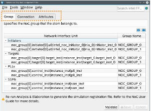
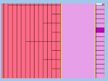
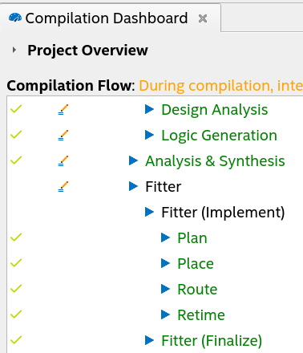

- 
Platform Designer Connection Flow—you use Platform Designer to configure
and instantiate your NoC-related IP. You also use Platform Designer to make
connections between NoC initiator bridges and NoC target bridges and to define
the addressing mapping for these connections. Once you generate HDL for your
Platform Designer system, your design is ready for RTL simulation. You must use
the NoC Assignment Editor to create additional assignments, such as specifying
NoC groupings and optional performance targets. You can use Interface Planner to
make physical location assignments for your NoC elements. Then you compile
your design and review the results.
- 
NoC Assignment Editor Connection Flow—you can configure and instantiate
your NoC-related IP in either Platform Designer or directly in RTL. You then use
the NoC Assignment Editor to make all NoC assignments including grouping,
connectivity, address mapping, and optional performance targets. After completing
the assignments and rerunning Analysis & Elaboration, your design is ready for
RTL simulation. You can use Interface Planner to make physical location
assignments for your NoC elements. Then compile your design and review the
results.
The NoC design flow that you select impacts the NoC design entry method, how you
specify NoC connectivity and addressing assignments, and at what stage you can
perform RTL simulation of the NoC. Subsequent stages of the design flow, such as
assigning physical locations, compiling, and reviewing results, are the same in both
flows.
Table 5.
Comparison of Platform Designer Connection Flow and NoC Assignment
Editor Connection Flow
Design Steps
Platform Designer Connection
Flow
NoC Assignment Editor
Connection Flow
Configure NoC-related IP
Parameter Editor launched from
Platform Designer
Parameter Editor launched from
either Platform Designer or IP
Catalog
Instantiate NoC-related IP in your design
Platform Designer only
Either Platform Designer or
directly in RTL
Connect NoC initiator bridges and NoC target bridges
Platform Designer
NoC Assignment Editor
Define address maps for NoC connections
Platform Designer
NoC Assignment Editor
Specify NoC grouping
NoC Assignment Editor
Specify NoC performance targets
NoC Assignment Editor
Assign physical locations
Interface Planner
Compile design and review results
Quartus Prime Pro Edition
Ready for RTL simulation
After generating HDL in
Platform Designer
After completing NoC
Assignment Editor and running
Analysis & Elaboration
Related Information
- 
Creating NoC Assignments for Compilation on page 44
- 
Generating the Abstract Simulation Include File (Platform Designer Connection
Flow) on page 81
4. NoC Design Flow in Quartus Prime Pro Edition
Agilex™ 7 M-Series FPGA Network-on-Chip (NoC) User Guide
Send Feedback
30

4.2. Using NoC Example Designs
To quickly start a design from a complete, pre-verified design example that uses the
hard memory NoC, you can access a design example from within the Quartus Prime
Pro Edition software. These design examples include the following:
- 
A complete Quartus Prime project that contains a Platform Designer system that
instantiates and connects the hard memory NoC IP, including the following IP:
○
NoC Initiator Intel FPGA IP connected to traffic generators.
○
Targets within the memory IP (HBM2e FPGA IP or External Memory Controller
(EMIF) IP).
○
Clock Control Intel FPGA IP.
- 
Assignments to implement grouping, connectivity, and address mapping for the
use case.
- 
Assignment for default read and write bandwidth requirements based on optimal
configuration and initiator bridge placement. You can change these settings
independently for each initiator-target connection in the NoC Assignment Editor.
- 
Simulation models and testbench.
The following steps summarize the process to create a hard memory NoC user design
based on an available design example in the Quartus Prime Pro Edition software.
These example designs specify NoC connectivity and addressing using the NoC
Assignment Editor. Because these example design simulation testbenches include the
necessary registration statements, you can perform RTL simulation before running
Analysis & Elaboration.
1.
In the Quartus Prime software IP Catalog or Platform Designer IP Catalog, double-
click the appropriate memory IP:
- 
High Bandwidth Memory (HBM2e) Interface Agilex 7 FPGA IP
Or
- 
External Memory Interfaces (EMIF) IP
2.
In the IP parameter editor, configure the desired parameters for your use case on
the General tab. On the Example Design tab, configure the options related to
your hard memory NoC implementation.
3.
Click the Generate Example Design button. Specify a location and file name to
generate and open the example design.
For details on characteristics and accessing HBM2e and eternal memory IP example
designs, refer to the following resources.
Related Information
- 
AN 1003: Multi Memory IP System Resource Planning for Agilex 7 M-Series FPGAs
- 
External Memory Interfaces Agilex 7 M-Series FPGA IP Design Example User Guide
- 
High Bandwidth Memory (HBM2E) Interface Agilex 7 M-Series FPGA IP Design
Example User Guide
- 
Quartus Prime Pro Edition User Guide: Getting Started
4. NoC Design Flow in Quartus Prime Pro Edition
Send Feedback
Agilex™ 7 M-Series FPGA Network-on-Chip (NoC) User Guide
31

4.3. NoC Building Blocks
Creating a hard memory NoC design involves the following building blocks that you
configure using corresponding IP:
- 
NoC Initiators—for fabric-facing initiators, configure using the NoC Initiator Intel
FPGA IP. If you are using the Hard Processor System FPGA IP, this IP includes the
HPS-facing initiators.
- 
NoC Targets—for memory resources that the FPGA fabric uses, you configure the
targets using the High Bandwidth Memory (HBM2E) Interface Agilex 7 FPGA IP and
External Memory Interfaces (EMIF). For memory resources that the HPS uses, you
configure the targets using the External Memory Interfaces for HPS FPGA IP.
- 
NoC Clock Control—configure the NoC PLL and NoC SSM using the NoC Clock
Control Intel FPGA IP.
Related Information
Hard Memory NoC IP Reference on page 90
4.3.1. NoC Initiators for Hard Processor Systems
Configure NoC initiators for hard processor systems (HPS) using the Hard Processor
System FPGA IP in Platform Designer. To enable NoC initiators for HPS when
parameterizing the Hard Processor System FPGA IP, follow these steps:
1.
Click the SDRAM tab in the IP Parameter Editor.
2.
Turn on the Enable HPS-to-HNOC-INIU AXI Interfaces option.
3.
Select one of the following HNOC Interface Configuration options:
- 
Single-Channel—this configuration instantiates one initiator in the MPFE.
Select Single-Channel configuration for memory capacity up to 64 GB when
you do not require interleaving.
- 
Dual-Channel—this configuration instantiates two initiators in the MPFE. You
can also turn on the Enable Interleave Mode option to enable logic in the
MPFE to interleave between the HPS-EMIF channels. Select Dual-Channel
configuration for memory capacity above 64 GB or when enabling interleaving.
Figure 19.
SDRAM Tab of Hard Processor System FPGA IP Parameter Editor
4. NoC Design Flow in Quartus Prime Pro Edition
Agilex™ 7 M-Series FPGA Network-on-Chip (NoC) User Guide
Send Feedback
32

### Figures from page 32

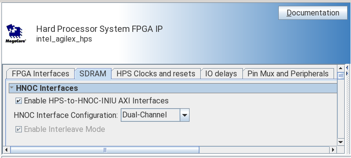

NoC initiators for HPS can only connect to NoC targets in External Memory Interfaces
for HPS IP. For further information on HPS, refer to the Agilex 7 Hard Processor
System Component Reference Manual.
Related Information
Agilex 7 Hard Processor System Component Reference Manual
4.3.2. NoC Targets for Hard Processor Systems
Configure NoC targets for HPS using the External Memory Interfaces for HPS FPGA IP
in Platform Designer. This IP always uses the NoC and does not have a bypass mode
available. NoC targets for HPS can only connect to NoC initiators in Hard Processor
System FPGA IP. For details on the External Memory Interfaces for HPS FPGA IP, refer
to the External Memory Interfaces Agilex 7 M-Series FPGA IP User Guide.
Related Information
External Memory Interfaces Agilex 7 M-Series FPGA IP User Guide
4.3.3. NoC Initiators for Fabric AXI4 Managers
Configure hard memory NoC initiators for fabric AXI4 managers using the NoC
Initiator Intel FPGA IP in either IP Catalog or Platform Designer. Access the NoC
Initiator Intel FPGA IP in the IP Catalog by expanding the Intel FPGA Interconnect
category, and then expanding the NoC subcategory.
The NoC Initiator Intel FPGA IP allows the creation of multiple AXI4 and AXI4 Lite
interfaces using the same configuration that interfaces to the same hard memory NoC
subsystem. If your design requires NoC initiators with different configurations, or if
your design uses both hard memory NoC subsystems along the top edge and bottom
edge of the die, this configuration requires separate NoC Initiator Intel FPGA IP. Each
AXI4 interface in the NoC Initiator Intel FPGA IP maps to one hard memory NoC
initiator bridge.
In the IP parameter editor, you specify the following parameters for the IP instance:
- 
Specify a value for the Number of AXI4 interfaces and Number of AXI4 Lite
interfaces. Each AXI4 interface is associated with its own physical NoC initiator
bridge. AXI4 Lite interfaces, used to access control and status registers of NoC
peripherals, are associated with the first physical NoC initiator bridge. If an
instance of the NoC initiator IP has the number of AXI4 interfaces set to 0, that
instance uses only one NoC initiator bridge that carries the AXI Lite transactions
from all the exposed AXI Lite interfaces.
- 
Specify whether the AXI4 and AXI4 Lite interfaces have per-interface clock and
reset signals, or whether the interfaces share these signals. If you do not
configure for per-interface clock and reset signals, the IP exposes a single shared
clock sink and reset sink interface for all AXI4 interfaces, and exposes a separate
shared clock sink and reset sink for all AXI4 Lite interfaces.
- 
Select the data width for read and write interfaces using the AXI4 Data Mode
parameter. Selections with read data width of 512 or 576 bits implement the fabric
NoC to transport read response data directly into M20K memory blocks. If you
select data widths of 288 or 576 bits, the AXI4 WUSER and RUSER signals carry the
extra data bits.
4. NoC Design Flow in Quartus Prime Pro Edition
Send Feedback
Agilex™ 7 M-Series FPGA Network-on-Chip (NoC) User Guide
33

- 
When using a 512 or 576 bit wide data mode, additionally specify whether the
wide interfaces use an independent clock from the 256-bit NoC initiator hardware.
Enable this option for best system-level performance when using wide data
modes.
- 
Use the AXI4 interface handshaking parameter to optimize the interface
handshaking for either fMAX or area. AXI4 Handshaking Support on page 20
describes this option.
- 
Use the NoC QoS Mode parameter to select one of three NoC initiator traffic
management options. Use the following NoC QoS Mode parameters to select how
the NoC initiator manages NoC traffic:
○
To use AXI4 QoS to manage traffic, select either the AXI QoS option, where
priority for each transaction is set using the arqos or awqos signals, or the
NoC Bridge generated option, where user-defined, hard-coded values in the
initiator IP set the priority for all read or write transactions.
○
To use the hardware limiters to manage traffic, select the Limiter option that
allows for limiting bandwidth usage (from 40% to 100%), outstanding read
transactions (from 1 to 128), and outstanding write transactions (from 1 to
64).
For example, Parameter Editor for NoC Initiator Intel FPGA IP shows the following NoC
Initiator Intel FPGA IP configuration:
- 
The IP instance has 16 AXI4 interfaces and 0 AXI4 Lite interfaces.
- 
The AXI4 read and write channels are configured for 512-bit wide transactions.
Since the interface is symmetrical, one AXI interface is exposed, which includes all
5 AXI channels (R, AR, W, AW, B).
- 
Configuration with an AXI4 data mode using 512 bit data paths indicates this IP is
implemented using the fabric NoC.
- 
Clock(s) of wide read and write AXI channels are independent from the NoC
initiator hardware clock. As a result, the read channels (R, AR) are implemented
on the NOC clock domain, while the write channels (W, B, AW) use a different clock
(noc_bridge_fabric_clk). This independence allows faster clocking of the
INIU-facing portion of the write path. However, regardless of the value of this
option, the user-facing AXI interface is clocked from the user clock
(s0_axi4_clock).
- 
This IP uses the default AXI standard for interface handshaking (Fmax optimized).
The NoC urgency level of each transaction is based on the AXI AxQOS value
associated with each read or write command.
4. NoC Design Flow in Quartus Prime Pro Edition
Agilex™ 7 M-Series FPGA Network-on-Chip (NoC) User Guide
Send Feedback
34

Figure 20.
Parameter Editor for NoC Initiator Intel FPGA IP
For full details on the NoC Initiator Intel FPGA IP, refer to NoC Initiator Intel FPGA IP
Note:
Quartus Prime software assignments (such as placement) for NoC initiators may refer
to hierarchical names within the IP. If you reconfigure and regenerate NoC initiators in
your design, verify that these assignments remain valid and update if necessary.
4.3.4. NoC Targets for Fabric AXI4 Managers
The High Bandwidth Memory (HBM2e) Interface Agilex 7 FPGA IP automatically
includes hard memory NoC targets for fabric AXI4 managers. The External Memory
Interfaces (EMIF) IP also automatically includes NoC targets for fabric AXI4 managers
when you enable use of the hard memory NoC instead of bypass mode. There is no
need to generate NoC targets separately.
For details on the High Bandwidth Memory (HBM2E) Interface Agilex 7 FPGA IP, refer
to the High Bandwidth Memory (HBM2E) Interface Agilex 7 M-Series FPGA IP User
Guide.
For details on the External Memory Interfaces (EMIF) IP, including which protocols and
speeds use the hard memory NoC, refer to the External Memory Interfaces Agilex 7 M-
Series FPGA IP User Guide.
Related Information
- 
High Bandwidth Memory (HBM2E) Interface Agilex 7 M-Series FPGA IP User Guide
- 
External Memory Interfaces Agilex 7 M-Series FPGA IP User Guide
4.3.5. NoC Clock Control
Configure the clock control for the hard memory NoC using the NoC Clock Control Intel
FPGA IP in either IP Catalog or Platform Designer. Access the NoC Clock Control Intel
FPGA IP in the IP Catalog by expanding the Intel FPGA Interconnect category, and
then expanding the NoC subcategory.
The NoC Clock Control Intel FPGA IP includes the NoC PLL that provides clocking to
the hard memory NoC. The NoC Clock Control Intel FPGA IP also includes the NoC
SSM that configures the hard memory NoC. The NoC SSM provides access to AXI4 Lite
4. NoC Design Flow in Quartus Prime Pro Edition
Send Feedback
Agilex™ 7 M-Series FPGA Network-on-Chip (NoC) User Guide
35

### Figures from page 35

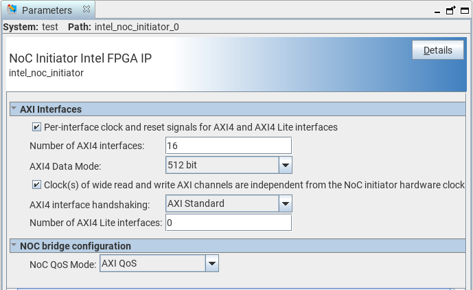

targets in the High Bandwidth Memory (HBM2e) Interface Agilex 7 FPGA IP and the
External Memory Interfaces (EMIF) IP over the service network parallel to the main
switch network.
The hard memory NoC along the top edge of the die, and the hard memory NoC along
the bottom edge of the die, each requires its own clock control instance. If your design
does not use the hard memory NoC along one edge of the die, that hard memory NoC
does not require a clock control.
There is only one parameter to configure in the NoC Clock Control Intel FPGA IP.
Specify the Reference Clock Frequency for the NoC PLL. Available options are 25,
100, or 125 MHz.
For details on the NoC Clock Control Intel FPGA IP, refer to NoC Clock Control Intel
FPGA IP.
4.4. Connecting NoC IP
4.4.1. General NoC IP Connectivity Guidelines
To create a hard memory NoC design, you instantiate NoC initiators (for fabric and for
HPS AXI4 managers), NoC targets in memory IP (for fabric and HPS AXI4 managers)
and NoC clock control IP in your Platform Designer system or in your RTL netlist.
Connect these IP blocks to external pins or FPGA core logic, as this section of the
document describes in detail.
There are two supported flows for making connections between NoC initiators and
targets, as NoC Design Flow Options describes. In the Platform Designer connection
flow, you connect NoC initiators to NoC targets in Platform Designer, and then
generate the HDL for your system. Note that when using the Platform Designer
connection flow, Platform Designer stores the connections in the system .qip file and
are not in the generated HDL. In the NoC Assignment Editor Connection flow, you do
not connect NoC initiators to NoC targets within either Platform Designer or RTL.
Instead, you run Analysis & Elaboration and then make these connections in the NoC
Assignment Editor. The following sections provide details on connecting NoC IP using
both design flows.
4.4.1.1. Connecting NoC IP and Assigning Base Addresses in the Platform
Designer Connection Flow
This topic describes how to connect the NoC IP and assign base addresses using the
Platform Designer connection flow, as NoC Design Flow Options describes. When using
the Platform Designer connection flow, you must configure and instantiate your NoC IP
in Platform Designer. The Platform Designer connection flow does not support
instantiating the NoC IP in RTL.
Note:
If you are using the NoC Assignment Editor connection flow, you can ignore this topic
and refer instead to Connecting NoC IP and Assigning Base Addresses in the NoC
Assignment Editor Connection Flow.
You can make NoC connections in Platform Designer using the AXI4 NoC manager,
AXI4 NoC subordinate, HPS AXI4 NoC manager, and HPS AXI4 NoC subordinate
interfaces in the System View tab.
4. NoC Design Flow in Quartus Prime Pro Edition
Agilex™ 7 M-Series FPGA Network-on-Chip (NoC) User Guide
Send Feedback
36

AXI4 NoC manager interfaces are initiator interfaces of the fabric-facing NoC Initiator
Intel FPGA IP. AXI NoC manager interfaces include initiator interfaces configured for
AXI4 only, for AXI4-Lite only, or as shared AXI4 and AXI4-Lite. AXI NoC subordinate
interfaces are the target interfaces of the High Bandwidth Memory (HBM2E) Interface
Agilex 7 FPGA IP, External Memory Interfaces (EMIF) IP, and the NoC Clock Control
Intel FPGA IP. AXI NoC subordinate interfaces includes either AXI4 and AXI4-Lite
target interfaces. AXI4 NoC manager interfaces can only connect to AXI4 NoC
subordinate Interfaces.
HPS AXI4 NoC manager interfaces are the AXI4 initiator interfaces of the Hard
Processor System FPGA IP. HPS AXI4 NoC subordinate interfaces are the AXI4 target
interfaces of the External Memory Interfaces for HPS FPGA IP. HPS AXI4 NoC manager
interfaces can only connect to AXI4 NoC subordinate interfaces.
To connect the NoC IP and assign base addresses using the Platform Designer
connection flow, follow these steps:
1.
In Platform Designer, configure and instantiate all the NoC IP in the System View
tab.
2.
In the System View tab, connect the NoC IP to external pins or FPGA core logic,
as appropriate for your application.
3.
In the System View tab, connect NoC initiators and targets for fabric-facing AXI4
managers by connecting the AXI4 NoC manager interfaces to the appropriate AXI4
NoC subordinate interfaces. Connect the NoC initiators and targets for HPS by
connecting the HPS AXI4 NoC manager interface to the appropriate HPS AXI4 NoC
subordinate interfaces.
- 
AXI4 NoC manager interfaces on the fabric-facing NoC Initiator Intel FPGA IP
must only connect to AXI4 NoC subordinate interfaces on memory resources
for the fabric, such as High Bandwidth Memory (HBM2E) Interface Agilex 7
FPGA IP or External Memory Interfaces (EMIF) IP, or to the AXI4 NoC
subordinate port on the NoC Clock Control Intel FPGA IP to access NoC
performance monitors.
- 
HPS AXI4 NoC manager interfaces on Hard Processor System FPGA IP must
only connect to HPS AXI4 NoC subordinate interfaces on memory resources for
HPS in External Memory Interfaces for HPS FPGA IP.
Note: Connections between the AXI4 Lite NoC manager interface in the HPS MPFE
and the AXI4 Lite NoC subordinate interfaces in the HPS EMIF IP are hard-
coded and not displayed in Platform Designer.
4.
Click the Address Map tab in Platform Designer to assign starting addresses for
each AXI4 NoC interface connection. If an AXI4 NoC manager connects to multiple
AXI4 NoC subordinate interfaces, ensure that each target has a unique starting
address. You can specify these address mappings manually on the Address Map
tab, or click System ➤ Assign Base Addresses to allow Platform Designer to
assign addresses automatically.
Note: For NoC connections, you only need to specify the starting address.
Specifying the ending address for NoC connections is unnecessary.
5.
Save the system and click Generate HDL. Platform Designer stores the NoC
connectivity and addressing as assignments in the system .qip file. Platform
Designer also generates the .inc file that also stores the connectivity and
addressing.
4. NoC Design Flow in Quartus Prime Pro Edition
Send Feedback
Agilex™ 7 M-Series FPGA Network-on-Chip (NoC) User Guide
37

Note: The connections between AXI4 NoC manager and AXI4 NoC subordinate
interfaces do not appear in the generated RTL. Similarly, the connections
between HPS AXI4 NoC manager and HPS AXI4 NoC subordinate interfaces
do not appear in the generated RTL.
6.
After you include the generated .inc file in your project, the design is now ready
for RTL simulation. To proceed with compilation, first run Analysis & Elaboration
and the proceed to Creating NoC Assignments for Compilation on page 44.
4.4.1.2. Connecting NoC IP and Assigning Base Addresses in the NoC Assignment
Editor Connection Flow
This topic describes how to connect the NoC IP and assign base addresses using the
NoC Assignment Editor connection flow, as NoC Design Flow Options describes. When
using the NoC Assignment Editor connection flow, you can configure and instantiate
your NoC IP in either Platform Designer or in RTL.
Note:
If you are using the Platform Designer connection flow, you can ignore this topic and
refer instead to Connecting NoC IP and Assigning Base Addresses in the Platform
Designer Connection Flow.
To connect the NoC IP and assign base addresses using the NoC Assignment Editor
connection flow, follow these steps:
1.
In Platform Designer System View tab, or in your design RTL, configure and
instantiate all the NoC IP.
2.
If you instantiate your NoC IP in the System View tab, leave any AXI4 NoC
manager, AXI4 NoC subordinate, HPS AXI4 NoC manager, and HPS AXI4 NoC
subordinate interfaces on the NoC IP unconnected. If you are instantiating your
NoC IP directly in RTL, these interfaces do not exist. In the System View tab, or
in your design RTL, connect the NoC IP to external pins or FPGA core logic, as
appropriate for your application.
Note: If you are using Platform Designer, making these connections may require
exporting signals as conduits when the connection targets are not part of
the Platform Designer system.
3.
If you instantiate your NoC IP in the System View tab, save the system and click
Generate HDL.
4.
Run Quartus Prime Analysis & Elaboration on the design and then create NoC
connections and base address assignments, as Creating NoC Assignments for
Compilation describes.
Note: The NoC Assignment Editor connection flow does not support RTL simulation
until after you complete NoC connection and base address assignments in
the NoC Assignment Editor.
4.4.2. Connectivity Guidelines: NoC Initiators for Fabric AXI4 Managers
The NoC Initiator Intel FPGA IP uses a separate NoC initiator bridge for each AXI4
subordinate interface that you specify when configuring the IP. If you configure the IP
with AXI4 Lite subordinate interfaces, these interfaces all share the bandwidth of the
first NoC initiator bridge that the IP uses. If you configure the IP with only AXI4 Lite
interfaces, all the AXI4 Lite subordinates share a single physical NoC initiator bridge.
4. NoC Design Flow in Quartus Prime Pro Edition
Agilex™ 7 M-Series FPGA Network-on-Chip (NoC) User Guide
Send Feedback
38

If you configure the NoC Initiator Intel FPGA IP with unequal read and write AXI4 data
widths, the IP exposes two AXI4 subordinate interfaces per initiator bridge. One of
these interfaces uses the Fabric NoC and is only for read transactions, as Fabric NoC
describes. This interface has only the AXI4 AR and R channels. The other interface is
only for write transactions, having only the AXI4 AW, W, and B channels. Configure
these AXI4 subordinate interfaces for compatibility with the AXI4 managers in your
design.
If you configure the NoC Initiator Intel FPGA IP for per-interface clock and reset
signals, there are separate clock and reset connections for each AXI4 and AXI4 Lite
subordinate interface. Otherwise, there is a single clock and reset to provide clocking
and reset to all AXI4 interfaces, and another single clock and reset to provide clocking
and reset to all AXI4 Lite subordinates. Connect the clock and reset interfaces to clock
and reset sources in your design. Each AXI4 or AXI4 Lite subordinate interface must
be synchronous to its clock and reset connections.
AXI4 resets are active-low and you can assert the resets asynchronously. However,
you must deassert AXI4 resets on a rising edge of the clock that you use to drive data
and handshake signals of the associated AXI4 interfaces.
If you choose to configure the NoC Initiator Intel FPGA IP with a read data width of
512 or 576 bits, you can also configure the IP with a separate clock for the NoC
initiator bridges. In this case, the IP exposes an additional clock input. Interface
Planner displays each NoC initiator bridge as a AXI4 NoC manager interface, whether
configured for AXI4, AXI4 Lite, or both. The AXI4 NoC manager interfaces do not exist
in the RTL representation of this IP.
- 
If you are using the Platform Designer connection flow, as NoC Design Flow
Options describes, instantiate your NoC IP in Platform Designer and connect each
AXI4 NoC manager interface to one or more AXI4 NoC subordinate interfaces in
the System View tab. Only connect AXI4 NoC manager interfaces on NoC
Initiator Intel FPGA IP to memory resources for fabric managers, such as High
Bandwidth Memory (HBM2E) Interface Agilex 7 FPGA IP or External Memory
Interfaces (EMIF) IP, or to the NoC Clock Control Intel FPGA IP for access to the
NoC performance monitors. Do not connect the NoC Initiator Intel FPGA IP to
memory resources for the HPS in the External Memory Interfaces for HPS FPGA IP.
After connecting AXI4 NoC manager and AXI4 NoC subordinate interfaces, click
the Address Map tab in Platform Designer to specify the base address for each
connection. If an AXI4 NoC manager interface connects to multiple AXI4 NoC
subordinate interfaces, ensure each connection has a unique starting address. You
can click the Assign Base Addresses button to allow Platform Designer to assign
addresses automatically.
- 
If you are using the NoC Assignment Editor connection flow, as NoC Design Flow
Options describes, and using Platform Designer to instantiate your NoC IP, leave
the AXI4 NoC manager interfaces unconnected in the Platform Designer System
View tab. After running Quartus Prime Analysis & Elaboration, you use the NoC
Assignment Editor to define connectivity and addressing to prepare your design for
RTL simulation.
- 
If you are using the NoC Assignment Editor connection flow, as NoC Design Flow
Options describes, and instantiating your NoC IP directly in RTL, the AXI4 NoC
manager interfaces do not exist. After running Quartus Prime Analysis &
Elaboration, you use the NoC Assignment Editor to define connectivity and
addressing to prepare your design for RTL simulation.
For details on the NoC Initiator Intel FPGA IP, refer to NoC Initiator Intel FPGA IP.
4. NoC Design Flow in Quartus Prime Pro Edition
Send Feedback
Agilex™ 7 M-Series FPGA Network-on-Chip (NoC) User Guide
39

Related Information
- 
Agilex 7 Hard Processor System Technical Reference Manual
- 
NoC Design Flow Options on page 29
4.4.3. Connectivity Guidelines: NoC Targets for Fabric AXI4 Managers
The High Bandwidth Memory (HBM2E) Interface Agilex 7 FPGA IP and the External
Memory Interfaces (EMIF) IP each contain the Hard memory NoC targets. These IP
have separate AXI4 and AXI4 Lite targets. Interface Planner displays both types of
targets as AXI4 NoC subordinate interfaces.
For High Bandwidth Memory (HBM2E) Interface Agilex 7 FPGA IP, the AXI4 targets
have interface names, such as t_ch<number>_u<number>_axinoc. The AXI4 Lite
targets have interface names, such as t_ch<number>_ch<number>_sb_axinoc.
For External Memory Interface (EMIF) IP, the AXI4 targets have interface names, such
as t<number>_axi4noc. The AXI4 Lite targets have interface names, such as
t<number>_axilnoc. The AXI4 NoC subordinate interfaces do not exist in the RTL
representation of these IP.
The following table shows the various interface name formats. Make any clocking,
reset, calibration, or external I/O connections for these IP in accordance with the IP
user guide guidelines for these IP.
Table 6.
Interface Name Formats
Interface Type
Interface Name Format
HBM2E Interface AXI4 targets
t_ch<number>_u<number>_axinoc
HBM2E Interface AXI4-Lite
targets
t_ch<number>_ch<number>_sb_axinoc
EMIF IP AXI4 targets
t<number>_axi4noc
EMIF IP AXI4-Lite targets
t<number>_axilnoc
4. NoC Design Flow in Quartus Prime Pro Edition
Agilex™ 7 M-Series FPGA Network-on-Chip (NoC) User Guide
Send Feedback
40

- 
If you are using the Platform Designer connection flow, as NoC Design Flow
Options describes, instantiate your NoC IP in Platform Designer and connect each
AXI4 NoC subordinate interface to one or more AXI4 NoC manager interfaces in
the System View tab. Only connect AXI4 NoC subordinate interfaces on memory
resources for fabric AXI4 managers to NoC Initiator Intel FPGA IP. Do not connect
memory resources for fabric AXI4 managers to HPS initiators in the Hard
Processor System FPGA IP. After connecting AXI4 NoC manager and AXI4 NoC
subordinate interfaces, click the Address Map tab to specify the base address for
each connection. If an AXI4 NoC manager interface connects to multiple AXI4 NoC
subordinate interfaces, ensure each connection has a unique starting address. You
can click the Assign Base Addresses button to allow Platform Designer to assign
addresses automatically.
- 
If you are using the NoC Assignment Editor connection flow, as NoC Design Flow
Options describes, and using Platform Designer to instantiate your NoC IP, do not
connect the AXI4 NoC subordinate interfaces in the Platform Designer System
View tab. After running Quartus Prime Analysis & Elaboration, you use the NoC
Assignment Editor to define connectivity and addressing to prepare your design for
RTL simulation.
- 
If you are using the NoC Assignment Editor connection flow, as NoC Design Flow
Options describes, and instantiating your NoC IP directly in RTL, the AXI4 NoC
subordinate interfaces do not exist. After running Quartus Prime Analysis &
Elaboration, you use the NoC Assignment Editor to define connectivity and
addressing to prepare your design for RTL simulation.
Refer to the High Bandwidth Memory (HBM2E) Interface Agilex 7 FPGA IP User Guide
for information on the High Bandwidth Memory (HBM2E) Interface Agilex 7 FPGA IP.
Refer to the External Memory Interfaces Agilex 7 M-Series FPGA IP User Guide for
information on the External Memory Interfaces (EMIF) IP
Related Information
- 
External Memory Interfaces Agilex 7 M-Series FPGA IP User Guide
- 
High Bandwidth Memory (HBM2E) Interface Agilex 7 M-Series FPGA IP User Guide
- 
NoC Design Flow Options on page 29
4. NoC Design Flow in Quartus Prime Pro Edition
Send Feedback
Agilex™ 7 M-Series FPGA Network-on-Chip (NoC) User Guide
41

4.4.4. Connectivity Guidelines: NoC Clock Control
The NoC Clock Control Intel FPGA IP contains the NoC PLL and NoC SSM. Connect the
refclk pin of this IP to a top-level port in your design, and to a high-quality clock
source on your board.
- 
If you are using the Platform Designer connection flow, as NoC Design Flow
Options describes, instantiate your NoC IP in Platform Designer. The NoC Clock
Control Intel FPGA IP has one AXI4 NoC subordinate interface that is an AXI4 Lite
target that you can connect to NoC initiators. Connect this AXI4 Lite target to a
NoC Initiator Intel FPGA IP that has an AXI4 Lite interface. to allow access to the
NoC performance monitors. After connecting AXI4 NoC manager and AXI4 NoC
subordinate interfaces, click to the Address Map tab, to specify the base address
for each connection. If an AXI4 NoC manager interface connects to multiple AXI4
NoC subordinate interfaces, ensure each connection has a unique starting address.
You can click the Assign Base Addresses button to allow Platform Designer to
assign addresses automatically.
- 
If you are using the NoC Assignment Editor connection flow, as NoC Design Flow
Options describes, and using Platform Designer to instantiate your NoC IP, do not
connect the AXI4 NoC subordinate interface in the Platform Designer System
View tab. After running Quartus Prime Analysis & Elaboration, you can use the
NoC Assignment Editor to define connectivity and addressing to prepare your
design for RTL simulation.
- 
If you are using the NoC Assignment Editor connection flow, as NoC Design Flow
Options describes, and instantiating your NoC IP directly in RTL, the AXI4 NoC
subordinate interface does not exist. After running Quartus Prime Analysis &
Elaboration, you can use the NoC Assignment Editor to define connectivity and
addressing to prepare your design for RTL simulation.
4.4.5. Connectivity Guidelines: NoC Initiators for HPS
The Hard Processor System FPGA IP contains the NoC initiator bridges for HPS.
Connect all non-NoC interfaces of the HPS in accordance with the HPS IP user
guidelines.
- 
If you are using the Platform Designer connection flow, as NoC Design Flow
Options describes, instantiate your NoC IP in Platform Designer. Connect the HPS
AXI4 NoC manager interface on the Hard Processor System FPGA IP only to AXI4
NoC subordinate interfaces on External Memory Interfaces for HPS IP. Do not
connect the initiator bridges in the HPS IP to memory resources for fabric-facing
AXI4 managers. After connecting AXI4 NoC manager and AXI4 NoC subordinate
interfaces, click the Address Map tab to specify the base address for each
connection. If an AXI4 NoC manager interface connects to multiple AXI4 NoC
subordinate interfaces, ensure each connection has a unique starting address. You
can click the Assign Base Addresses button to allow Platform Designer to assign
addresses automatically.
- 
If you are using the NoC Assignment Editor connection flow, as NoC Design Flow
Options describes, instantiate your NoC IP in Platform Designer and leave the HPS
AXI4 NoC manager interface unconnected. After running Quartus Prime Analysis &
Elaboration, you can use the NoC Assignment Editor to define connectivity and
addressing to prepare your design for RTL simulation. Note that HPS designs only
support design entry using Platform Designer. HPS designs do not support direct
RTL instantiation.
4. NoC Design Flow in Quartus Prime Pro Edition
Agilex™ 7 M-Series FPGA Network-on-Chip (NoC) User Guide
Send Feedback
42

For details on HPS EMIF IP, refer to refer to the Agilex 7 Hard Processor System
Component Reference Manual.
Related Information
Agilex 7 Hard Processor System Component Reference Manual
4.4.6. Connectivity Guidelines: NoC Targets for HPS
The External Memory Interfaces for HPS FPGA IP contains the NoC target bridges for
HPS. Make any clocking, reset, calibration, or external I/O connections for this IP in
accordance with the user guide guidelines for this IP.
- 
If you are using the Platform Designer connection flow, as NoC Design Flow
Options describes, instantiate your NoC IP in Platform Designer. Connect the HPS
AXI4 NoC subordinate interface on the External Memory Interfaces for HPS FPGA
IP only to the AXI4 NoC manager interfaces on the Hard Processor System FPGA
IP. Do not connect the target bridges in the HPS EMIF IP to any fabric-facing NoC
Initiator bridge. After connecting the HPS AXI4 NoC manager and HPS AXI4 NoC
subordinate interfaces, click the Address Map tab, to specify the base address for
each connection. If an HPS AXI4 NoC manager interface connects to multiple HPS
AXI4 NoC subordinate interfaces, ensure each connection has a unique starting
address. You can click the Assign Base Addresses button to allow Platform
Designer to assign addresses automatically.
- 
If you are using the NoC Assignment Editor connection flow, as NoC Design Flow
Options describes, instantiate your NoC IP in Platform Designer and leave the HPS
AXI4 NoC subordinate interface unconnected. After running Quartus Prime
Analysis & Elaboration, you can use the NoC Assignment Editor to define
connectivity and addressing to prepare your design for RTL simulation. Note that
HPS designs only support design entry using Platform Designer. HPS designs do
not support direct RTL instantiation.
For details on HPS EMIF IP, refer to refer to the External Memory Interfaces Agilex 7
M-Series FPGA IP User Guide.
Related Information
External Memory Interfaces Agilex 7 M-Series FPGA IP User Guide
4. NoC Design Flow in Quartus Prime Pro Edition
Send Feedback
Agilex™ 7 M-Series FPGA Network-on-Chip (NoC) User Guide
43

4.5. Making NoC Logical Assignments
The Compiler applies several logical assignments for the NoC during Quartus Prime
compilation. You can use the NoC Assignment Editor to create and validate these
assignments. These logical assignments include the following:
- 
Group (required)—assign NoC IP in your design to one of two groups. The Fitter
places one group in the hard memory NoC along the top edge of the die, and the
other group in the hard memory NoC along the bottom edge of the die.
- 
Connection (required)—specify which NoC initiator bridges communicate with
which NoC target bridges.
- 
Addressing (required)—for each NoC initiator bridge, define the address map for
the connected NoC target bridges.
- 
Read and write bandwidth and transaction size (recommended)—enter the
anticipated read and write bandwidth requirements and transaction sizes for each
NoC initiator bridge-to-target bridge connection. The Quartus Prime Compiler uses
this information to analyze whether there is congestion on the hard memory NoC.
4.5.1. Creating NoC Assignments for Compilation
After instantiating NoC-related IP in your design, connecting initiators to AXI4
managers, and connecting other NoC IP to external ports, you next run Quartus Prime
Analysis & Elaboration on your design. Analysis & Elaboration reads your design,
discovers the hard memory NoC-related IP in your design, and determines the location
of the IP in the design hierarchy. Once Analysis & Elaboration is complete, open the
NoC Assignment Editor to enter the NoC logical assignments.
If your design uses the Platform Designer connection flow, as NoC Design Flow
Options describes, the connection and address map assignments that you create in
Platform Designer automatically import into the NoC Assignment Editor as read-only
assignments. If you need to change these connection and address map assignments,
return to Platform Designer and make the necessary changes there. You specify the
remaining NoC group and read and write bandwidth and transaction size requirements
in the NoC Assignment Editor.
If your design uses the NoC Assignment Editor connection flow, as NoC Design Flow
Options describes, you must re-run Analysis & Elaboration after completing the logical
assignments. This step allows you to generate the simulation registration file that
communicates connection and address mapping to your simulation environment. If
your design uses the Platform Designer connection flow, as NoC Design Flow Options
describes, this simulation registration file generates when you generate HDL for your
Platform Designer system. For simulation flow details, refer to Simulating NoC
Designs.
To proceed to compilation, run Analysis & Synthesis to prepare your design for
physical assignments. You can optionally use the Quartus Prime Interface Planner to
assign locations for hard memory NoC initiator, target, PLL, and SSM blocks, and make
assignments for other I/O-related IP, as Making NoC Physical Assignments Using
Interface Planner describes.
Related Information
NoC Design Flow Options on page 29
4. NoC Design Flow in Quartus Prime Pro Edition
Agilex™ 7 M-Series FPGA Network-on-Chip (NoC) User Guide
Send Feedback
44

4.5.2. Using the NoC Assignment Editor
The NoC Assignment Editor in the Quartus Prime Pro Edition software allows you to
make logical assignments for hard memory NoC-related blocks in your design. These
assignments include grouping, connectivity, address mapping, and bandwidth
requirements.
Note:
Regardless of whether you instantiate the NoC IP using Platform Designer or directly
in RTL, the netlist does not include the connections between NoC initiators, targets,
and the clock control. If your design uses the NoC Assignment Editor connection flow,
as NoC Design Flow Options describes, you must specify these connections using the
NoC Assignment Editor. If your design uses the Platform Designer connection flow, as
NoC Design Flow Options describes, you specify these connections in Platform
Designer. The design’s .qip file stores the connection and address mapping
assignments. The NoC Assignment Editor automatically reads these connection
assignments and displays them as read-only assignments.
Figure 21.
Network on Chip (NoC) Assignment Editor
After making assignments in the NoC Assignment Editor, you click Save to store the
assignments in the Quartus Prime settings file (.qsf). You must successfully complete
Analysis & Elaboration before using the NoC Assignment Editor.
To access the NoC Assignment Editor, click Assignments ➤ Network on Chip (NoC)
Assignment Editor.
4. NoC Design Flow in Quartus Prime Pro Edition
Send Feedback
Agilex™ 7 M-Series FPGA Network-on-Chip (NoC) User Guide
45

### Figures from page 45

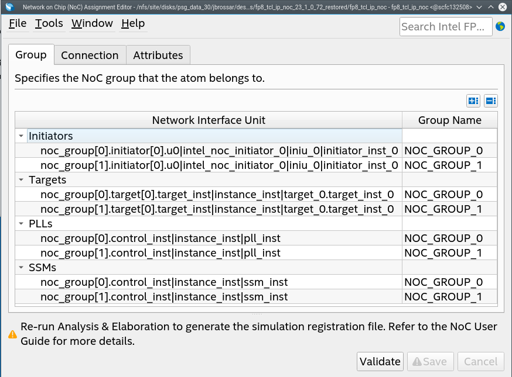

Specify assignments on the following NoC Assignment Editor tabs:
- 
Group tab—specifies the Group Name of the NoC initiators and targets.
- 
Connection tab—specifies the connections between NoC initiators and targets or
SSM elements.
- 
Attributes tab—specifies address mapping, bandwidth requirements, and
transaction sizes for each connection.
The tabs appear in order of priority. The assignments made on the Group tab affect
the assignments available in the Connection tab. The assignments made on the
Connection tab affect the assignments available in the Attributes tab.
Complete the assignments on each tab in order before moving to the next tab.
If your design uses the Platform Designer connection flow, as NoC Design Flow
Options describes, the connection and address map assignments that you create in
Platform Designer automatically appear in the NoC Assignment Editor. However, you
must create group assignments before proceeding with compilation. To allow analysis
of your design for possible traffic congestion, you must also create bandwidth and
transaction size assignments.
4.5.2.1. Step 1: Make Group Assignments in the NoC Assignment Editor
1.
Click Analysis & Elaboration on the Compilation Dashboard.
2.
Click Assignments ➤ Network on Chip (NoC) Assignment Editor. The Group
tab displays two columns:
- 
Network Interface Unit column—displays a list of all NoC initiator, target,
PLL, and SSM elements in your design.
- 
Group Name column—assign each of the elements to one of two groups by
entering the name of the group. You can define a custom, case-insensitive
Group Name. Group names support alphanumeric and underscore ‘_’
characters.
During the Fitter stage, one group is associated with the hard memory NoC that
runs along the top edge of the die. The other group is associated with the hard
memory NoC that runs along the bottom edge of the die. You can optionally
specify which group is associated with which edge using Interface Planner.
Otherwise, the Fitter automatically assigns this association during design
compilation.
Each group must contain the NoC initiators and targets that you connect through
that hard memory NoC, as well as the NoC PLL and SSM contained within an
instance of the NoC Clock Control IP.
Figure 22. NoC Assignment Editor Group Tab shows an example with NoC initiators
and targets assigned to groups NOC_GROUP_0 and NOC_GROUP_1.
4. NoC Design Flow in Quartus Prime Pro Edition
Agilex™ 7 M-Series FPGA Network-on-Chip (NoC) User Guide
Send Feedback
46

Figure 22.
NoC Assignment Editor Group Tab
Note:
Use the scrollbar at the right side of the window to view additional NoC elements
below.
The following shows the equivalent .qsf assignment for assigning a hard memory
NoC element to a group:
set_instance_assignment -name NOC_GROUP \
  <user-assigned noc group name> -to <hierarchical path name>
Related Information
Troubleshooting NoC Assignment Editor on page 52
4.5.2.2. Step 2: Make Connection Assignments in the NoC Assignment Editor
This step describes how to create connection assignments between initiators and
targets using the NoC Assignment Editor. If your design uses the Platform Designer
connection flow, as NoC Design Flow Options describes, you make connections
between initiators and targets in Platform Designer. The design .qip file stores those
connection assignments that appear automatically in the NoC Assignment Editor as
read-only assignments. You must make any changes to these assignments only in
Platform Designer.
If your design uses the Platform Designer connection flow, as NoC Design Flow
Options describes, and you have not made group assignments for your NoC elements,
the Connection tab displays an <Ungrouped> subtab. The <Ungrouped> subtab
shows connections that you defined in Platform Designer, but whose elements you
4. NoC Design Flow in Quartus Prime Pro Edition
Send Feedback
Agilex™ 7 M-Series FPGA Network-on-Chip (NoC) User Guide
47

### Figures from page 47

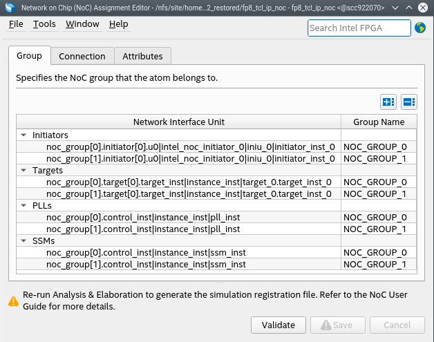

have not assigned to a NoC group. Before continuing with connection assignments,
click the Group tab and make group assignments for all NoC elements, as Step 1:
Make Group Assignments in the NoC Assignment Editor describes.
After creating the group assignments in the Group tab of the NoC Assignment Editor,
follow these steps to specify connections between NoC initiators and targets or SSM
elements:
1.
In the NoC Assignment Editor, click the Connection tab. The Connection tab
includes a subtab for each group that you specify on the Group tab.
Note: You must complete the Group tab assignments before starting the
Connection tab assignments.
2.
Specify connections between a NoC initiator and a target or SSM by enabling the
corresponding checkbox in the connection table. The group subtab includes a
connection table with all the NoC initiators for that group listed on the left-hand
side, and of all the NoC targets and SSM elements for the group listed across the
top.
Figure 23. NoC Assignment Editor Connection Tab shows an example Connection tab
in the NoC Assignment Editor with individual initiators and targets marked for
connection.
Figure 23.
NoC Assignment Editor Connection Tab
Note:
Use the scrollbar at the right side to view additional initiators below. Use the scrollbar
along the bottom to view additional targets or SSM elements to the right.
The following shows the equivalent .qsf assignment for specifying an initiator-to-
target connection:
set_instance_assignment -name NOC_CONNECTION ON -from \
<hierarchical initiator path name> -to <hierarchical target path name>
Related Information
Troubleshooting NoC Assignment Editor on page 52
4. NoC Design Flow in Quartus Prime Pro Edition
Agilex™ 7 M-Series FPGA Network-on-Chip (NoC) User Guide
Send Feedback
48

### Figures from page 48

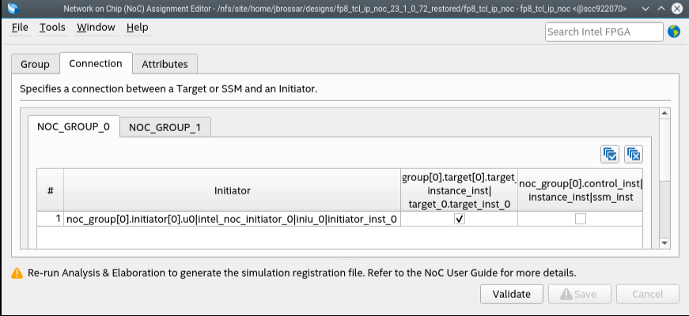

4.5.2.3. Step 3: Make Attribute Assignments in the NoC Assignment Editor
This step describes how to create attribute assignments on connections between
initiators and targets using the NoC Assignment Editor. If your design uses the
Platform Designer connection flow, as NoC Design Flow Options describes, you create
address map assignments in Platform Designer. The design .qip file stores those
assignments that appear automatically in the NoC Assignment Editor as read-only
assignments. You must make any changes to these assignments only in Platform
Designer.
If your design uses the Platform Designer connection flow, as NoC Design Flow
Options describes, and you have not made group assignments for your NoC elements,
the Attributes tab displays an <Ungrouped> subtab. The <Ungrouped> subtab
shows attributes such as base addresses that you defined in Platform Designer, but
whose elements you have not assigned to a NoC group. Before continuing with
attribute assignments, click the Group tab and make group assignments for all NoC
elements, as Step 1: Make Group Assignments in the NoC Assignment Editor
describes.
1.
Complete the Group and Connection tab assignments before starting the
Attribute tab assignments
2.
To create assignments for address mapping and bandwidth requirements for each
connection, click the Attributes tab. The Attributes tab includes a subtab for
each group that you specify on the Group tab. Each subtab lists each initiator to
target connection.
Table 7.
Attributes Tab Options
Option
Description
Base Address
Enter the hexadecimal base address for each initiator-target connection. The set of targets
that connect to an initiator is a memory-mapped space using physical addresses to define
how the initiator reaches each target. Defining a connection between an initiator and a
target and setting the base address of that connection creates a logical address space that
is visible from the initiator's perspective.
Read Bandwidth
Specify the steady-state required read bandwidth (in GB/s) for each initiator to target
connection. The default setting is 0 GB/s.
Write Bandwidth
Specify the steady-state required write bandwidth (in GB/s) for each initiator to target
connection. The default setting is 0 GB/s.
Read Transaction Size
Specify the average read transaction size (in bytes) for each initiator to target connection.
Valid sizes are 32, 64, 128, 256, 512, 1024, 2048, or 4096. The default setting is 64.
Write Transaction Size
Specify the average write transaction size (in bytes) for each initiator to target connection.
Valid sizes are 32, 64, 128, 256, 512, 1024, 2048, or 4096. The default setting is 64.
Figure 24. NoC Assignment Editor Attributes Tab shows an example Attributes tab in
the NoC Assignment Editor with the base addresses assigned for individual initiator-
target connections.
4. NoC Design Flow in Quartus Prime Pro Edition
Send Feedback
Agilex™ 7 M-Series FPGA Network-on-Chip (NoC) User Guide
49

Figure 24.
NoC Assignment Editor Attributes Tab
Note:
Use the right-side scrollbar to view additional initiator-target connects below. Use the
bottom scrollbar to view additional columns to the right for assigning read and write
bandwidth requirements.
If an initiator connects to multiple targets, select base addresses to avoid address
range overlaps. For HBM2e memory, the minimum address span is 1 GB and you must
align base addresses to 1 GB boundaries. For external memory interfaces, the
minimum address span is 4 GB and you must align base addresses to 4 GB
boundaries. For example, if an initiator connects to both HBM2e memory and DDR5
memory, you might select the base address for the HBM2e memory as 0x00000000,
and the base address for the DDR5 memory as 0x40000000, assuming a 16GB
HBM2e memory space. You can click the Assign Base Addresses button to allow
Platform Designer to assign addresses automatically.
Read and write bandwidth is based on the traffic that you anticipate your system
places on each initiator-target connection. You must account for the physical limits of
the hard memory NoC, including initiator data widths and frequencies, and high-
bandwidth memory or external memory interface limitations. Additionally, consider
whether you need to limit traffic on certain connections to avoid overloading the
horizontal bandwidth limits of the hard memory NoC. Since the hard memory NoC
breaks down transactions into 512-bit (64-byte) packets, using a smaller transaction
size of 32 bytes can result in inefficient usage of the hard memory NoC.
The NOC Performance Report estimates whether you can meet these performance
targets. This report is available during interactive placement in the Interface Planner.
In Interface Planner, results are based on estimated clock frequencies. After
compilation, the Compilation Report also includes this report but is based on actual
clock frequencies. For details, refer to Fitter NoC Reports. Additionally, the Power and
Thermal Calculator (PTC) estimates power based on the bandwidth performance
targets. Leaving the bandwidth requirements as the default (0 GB/s for both read and
write traffic) can result in inaccurate performance reporting and power estimation.
4. NoC Design Flow in Quartus Prime Pro Edition
Agilex™ 7 M-Series FPGA Network-on-Chip (NoC) User Guide
Send Feedback
50

### Figures from page 50

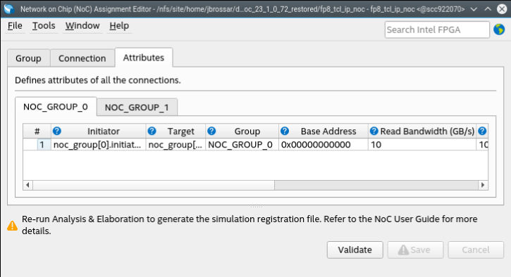

The following shows the equivalent .qsf assignments for specifying the base address,
bandwidth requirements, and transaction sizes. Base addresses are in hexadecimal
format and do not require a leading 0x. Read and write bandwidth requirements are
numeric values in GB/s. Read and write transaction sizes are in bytes.
set_instance_assignment -name NOC_TARGET_BASE_ADDRESS <address> \
   -from <hierarchical initiator path name> \
   -to <hierarchical target path name>
set_instance_assignment -name NOC_READ_BANDWIDTH \
   <read bandwidth requirement> -from <hierarchical initiator path name> \
   -to <hierarchical target path name>
set_instance_assignment -name NOC_WRITE_BANDWIDTH \
   <write bandwidth requirement> -from <hierarchical initiator path name>\
   -to <hierarchical target path name>
set_instance_assignment -name NOC_READ_TRANSACTION_SIZE \
   <read transaction size> -from \
   <hierarchical initiator path name> -to \
   <hierarchical target path name>
set_instance_assignment -name NOC_WRITE_TRANSACTION_SIZE \
   <write transaction size> -from \
   <hierarchical initiator path name> -to \
   <hierarchical target path name>
Related Information
Troubleshooting NoC Assignment Editor on page 52
4.5.2.4. Step 4: Validate Logical NoC Assignments and Generate Simulation File
After creating all necessary group, connection, and attribute assignments in the NoC
Assignment Editor, follow these steps to validate the logical NoC assignments and
generate the simulation file for the NoC:
1.
Click the Validate button on the NoC Assignment Editor. Validation performs
design rule checks, such as ensuring that there is exactly one PLL in each NoC
group, and that each NoC initiator has at least one connection. Additionally,
validation ensures there are no address space overlaps in your base address
assignments. Any design rule check violations display in the lower portion of the
NoC Assignment Editor.
2.
After resolving any errors or warnings, click the Save button to write the
assignments to the project .qsf. The registration include file for simulation
includes information from the NoC logical assignments.
3.
If your design uses the NoC Assignment Editor connection flow, as NoC Design
Flow Options describes, re-run Analysis & Elaboration to update the registration
include file after you make any change to these assignments using either the NoC
Assignment Editor or directly in the .qsf.
4.
After completing logical assignments, run Analysis & Synthesis to prepare the
design to make physical assignments using the Interface Planner.
For more details on the registration include file and the NoC simulation flow, refer to
Simulating NoC Designs.
4. NoC Design Flow in Quartus Prime Pro Edition
Send Feedback
Agilex™ 7 M-Series FPGA Network-on-Chip (NoC) User Guide
51

Related Information
Troubleshooting NoC Assignment Editor on page 52
4.5.3. Troubleshooting NoC Assignment Editor
Use the following FAQs to help you understand conditions and resolve conflicts in the
NoC Assignment Editor:
Table 8.
NoC Assignment Editor FAQs
FAQs
Explanation/Resolution
Why are some assignments in NoC Assignment
Editor 'read-only'?
- 
Any NoC assignment that you make in Platform Designer appears as
read-only in NoC Assignment Editor. You cannot modify these read-
only assignments inside the NoC Assignment Editor.
- 
To modify such read-only NoC assignments, modify the corresponding
elements in Platform Designer and regenerate HDL for the system.
Why are there conflicting assignments
between Platform Designer and NoC
Assignment Editor?
- 
This condition can occur if you first make assignments in NoC
Assignment Editor, and then later make similar NoC assignments in
Platform Designer.
If you make Platform Designer assignments first, and then later make
assignments in NoC Assignment Editor, those Platform Designer
assignments appear as read-only in NoC Assignment Editor.
- 
This condition can also occur if you first make NoC assignments in
Platform Designer, and then later manually specify NoC assignments
in the .qsf file.
To avoid this condition, only use Platform Design or only use NoC
Assignment Editor to specify NoC connectivity and addressing
assignments. Avoid using the .qsf to specify NoC connectivity and
addressing assignments.
How do I identify conflicting assignments
between Platform Designer and NoC
Assignment Editor?
- 
The NoC Assignment Editor cell containing any assignment conflict is
highlighted in yellow.
- 
The last assignment in the list takes precedence and is displayed. If
the last assignment is a Platform Designer assignment, the cell is also
read-only.
How can I resolve conflicting assignments
between Platform Designer and NoC
Assignment Editor?
You can use either of the following methods to replace a conflicting .qsf
assignment with the Platform Designer assignment:
- 
Right-click in the highlighted cell with a conflict, and then click
Delete.
- 
Manually delete any conflicting assignment from the .qsf. Avoid
manually editing the .qsf if you can resolve issues in the NoC
Assignment Editor.
4.5.4. NoC Connection and Addressing Examples
This section provides examples of NoC connections and addressing for several
configurations. Each configuration includes examples for the Platform Designer
connection flow and for the NoC Assignment Editor flow, as NoC Design Flow Options
describes.
For both connection flows, you specify NoC group, bandwidth, and transaction size
assignments in the NoC Assignment Editor, as Using the NoC Assignment Editor
describes.
4. NoC Design Flow in Quartus Prime Pro Edition
Agilex™ 7 M-Series FPGA Network-on-Chip (NoC) User Guide
Send Feedback
52

Table 9.
Specifying Connections and Addressing Per Flow
Connection Flow
Make Connections In
Specify Addressing In
Platform Designer
Connection Flow
Platform Designer System View tab
Platform Designer Address Map tab
NoC Assignment Editor
Connection Flow
NoC Assignment Editor Connection tab
NoC Assignment Editor Attributes tab
Note:
Connections and addresses that you make in the Platform Designer connection flow
also appear in the NoC Assignment Editor, but the connections appear as read-only.
4.5.4.1. Example 1: External Memory Interface with 1 AXI4 Initiator and 1 AXI4-
Lite Initiator
Example 1 represents a single AXI4 manager in the fabric communicating to a single
external memory interface.
Example 1 contains one instance of the External Memory Interfaces (EMIF) IP and two
instances of the NoC Initiator Intel FPGA IP:
- 
The first initiator has a single AXI4 interface, and connects to the main AXI4
target interface of the external memory interface.
- 
The second initiator has a single AXI4-Lite interface and connects to the sideband
AXI4-Lite interface of the external memory interface.
Each initiator interface connects to only one target interface. Each connection uses a
base address of 0x0000. Example 1 also contains one instance of the NoC Clock
Control Intel FPGA IP, but its AXI4-Lite interface is unconnected.
4.5.4.1.1. Example 1: Platform Designer Connection Flow
The following figures show how the Platform Designer System View and Address
Map tabs display the connections and addressing in this Example 1.
For simplicity, the System View in the following figures applies the Hide Clocks and
Resets filter.
Figure 25.
Platform Designer Connection Flow—System View for Example 1
4. NoC Design Flow in Quartus Prime Pro Edition
Send Feedback
Agilex™ 7 M-Series FPGA Network-on-Chip (NoC) User Guide
53

### Figures from page 53

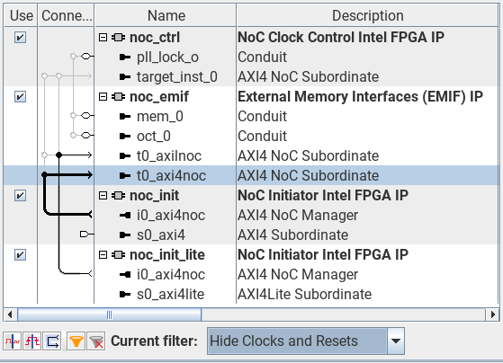

Figure 26.
Platform Designer Connection Flow—Address Map for Example 1
4.5.4.1.2. Example 1: NoC Assignment Editor Connection Flow
The following figures show how the NoC Assignment Editor displays the connections
on the Connections tab and addressing in the Attributes tab for Example 1.
In these examples, all NoC elements are assigned to NoC group GROUP0.
Figure 27.
NoC Assignment Editor Connection Flow—Connection Tab for Example 1
Figure 28.
NoC Assignment Editor Connection Flow—Attributes Tab for Example 1
4.5.4.2. Example 2: Two External Memory Interfaces with One AXI4 Initiator and
One AXI4-Lite Initiator
Example 2 represents a single AXI4 manager in the fabric communicating to two
external memory interfaces.
Example 2 contains two instances of the External Memory Interfaces (EMIF) IP and
two instances of the NoC Initiator Intel FPGA IP:
- 
The first initiator has a single AXI4 interface, and connects to the main AXI4
target interface of each external memory interface.
- 
The second initiator has a single AXI4-Lite interface and connects to the sideband
AXI4-Lite interface of each external memory interface.
4. NoC Design Flow in Quartus Prime Pro Edition
Agilex™ 7 M-Series FPGA Network-on-Chip (NoC) User Guide
Send Feedback
54

### Figures from page 54

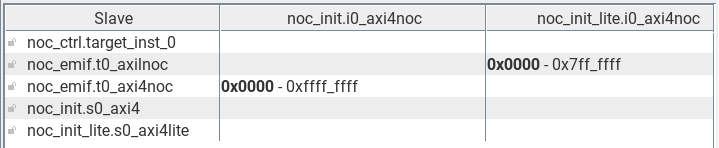
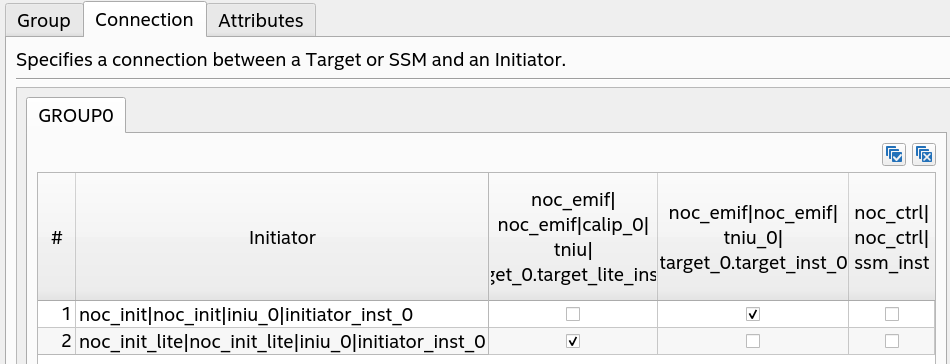
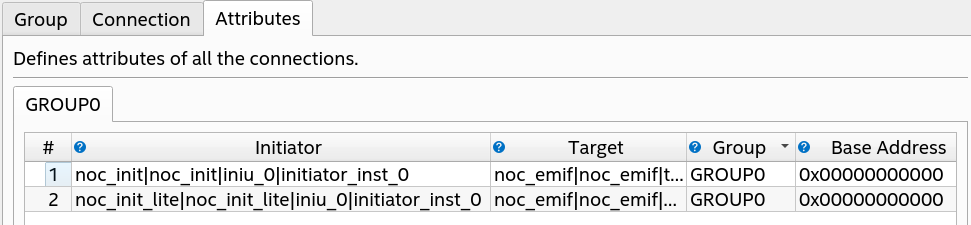

The AXI4 initiator interface uses an address of 0x000000000 for the first memory
interface, and an address of 0x100000000 for the second memory interface. The
AXI4-Lite initiator interface uses an address of 0x0000000 for the first memory
sideband interface, and an address of 0x8000000 for the second memory sideband
interface.
The example also contains one instance of the NoC Clock Control Intel FPGA IP, but
the AXI4-Lite interface is unconnected.
4.5.4.2.1. Example 2: Platform Designer Connection Flow
The following figures show how the Platform Designer System View and Address
Map tabs display the connections and addressing in Example 2.
For simplicity, the System View in the following figures applies the Hide Clocks and
Resets filter.
Figure 29.
Platform Designer Connection Flow—System View for Example 2
Figure 30.
Platform Designer Connection Flow—Address Map for Example 2
4.5.4.2.2. Example 2: NoC Assignment Editor Connection Flow
The following figures show how the NoC Assignment Editor displays the connections
on the Connections tab and addressing in the Attributes tab for Example 2.
4. NoC Design Flow in Quartus Prime Pro Edition
Send Feedback
Agilex™ 7 M-Series FPGA Network-on-Chip (NoC) User Guide
55

### Figures from page 55

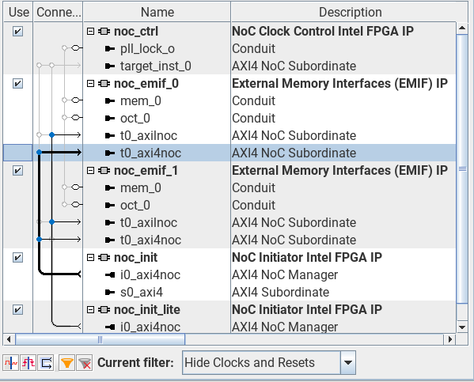
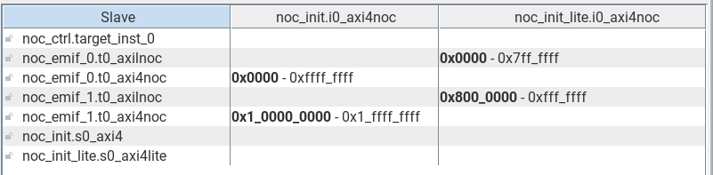

In these examples, all NoC elements are assigned to NoC group GROUP0.
Figure 31.
NoC Assignment Editor Connection Flow—Connection Tab for Example 2
Figure 32.
NoC Assignment Editor Connection Flow—Attributes Tab for Example 2
4.5.4.3. Example 3: One External Memory Interfaces with Two AXI4 Initiators
and One AXI4-Lite Initiator
Example 3 represents two AXI4 managers in the fabric communicating to a single
external memory interface.
Example 3 contains one instance of the External Memory Interfaces (EMIF) IP and
three instances of the NoC Initiator Intel FPGA IP:
- 
Two of the initiators have a single AXI4 interface, and connect to the main AXI4
target interface of each external memory interface.
- 
The third initiator has a single AXI4-Lite initiator interface and connects to the
sideband AXI4-Lite interface of the external memory interface.
Both AXI4 initiator interfaces connect to the same target interface. Each AXI4 initiator
interface has access to the full memory space, and uses an address of 0x000000000
for the memory. The AXI4-Lite initiator interface uses an address of 0x0000000 for
the memory sideband interface.
Example 3 also contains one instance of the NoC Clock Control Intel FPGA IP, but the
AXI4-Lite interface is unconnected.
4.5.4.3.1. Example 3: Platform Designer Connection Flow
The following figures show how the Platform Designer System View and Address
Map tabs display the connections and addressing in Example 3.
For simplicity, the System View in the following figures applies the Hide Clocks and
Resets filter.
4. NoC Design Flow in Quartus Prime Pro Edition
Agilex™ 7 M-Series FPGA Network-on-Chip (NoC) User Guide
Send Feedback
56

### Figures from page 56

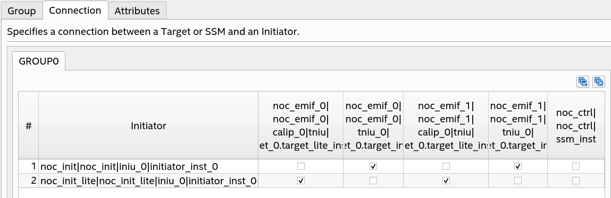
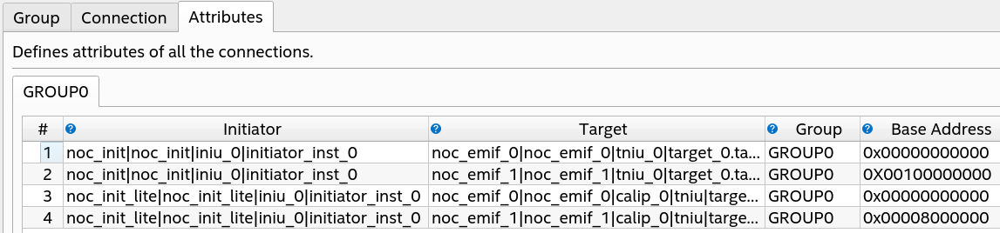

Figure 33.
Platform Designer Connection Flow—System View for Example 3
Figure 34.
Platform Designer Connection Flow—Address Map for Example 3
4.5.4.3.2. Example 3: NoC Assignment Editor Connection Flow
The following figures show how the NoC Assignment Editor displays the connections
on the Connections tab and addressing in the Attributes tab for Example 3.
In these examples, all NoC elements are assigned to NoC group GROUP0.
Figure 35.
NoC Assignment Editor Connection Flow—Connection Tab for Example 3
4. NoC Design Flow in Quartus Prime Pro Edition
Send Feedback
Agilex™ 7 M-Series FPGA Network-on-Chip (NoC) User Guide
57

### Figures from page 57

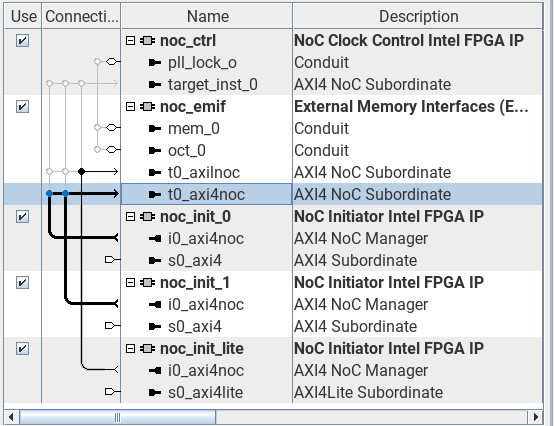
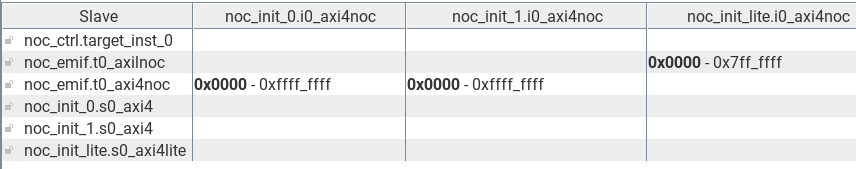
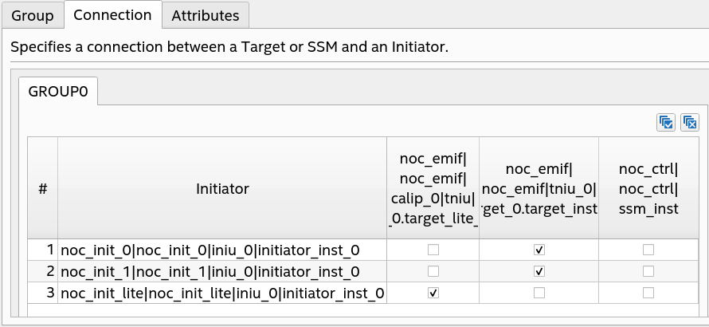

Figure 36.
NoC Assignment Editor Connection Flow—Attributes Tab for Example 3
4.5.4.4. Example 4: Two High-Bandwidth Memory Pseudo-Channels with Two
AXI4 Initiators (Crossbar) and Shared AXI4-Lite Initiator
Example 4 represents two AXI4 managers in the fabric and two pseudo-channels of
high-bandwidth memory in a crossbar configuration.
In this configuration, each AXI4 manager can communicate with each pseudo-channel
of the high-bandwidth memory. Example 4 contains one instance of the High
Bandwidth Memory (HBM2E) Interface FPGA IP with only one channel or two pseudo-
channels.
Example 4 also contains one instance of the NoC Initiator Intel FPGA IP with two AXI4
interfaces and one AXI4-Lite interface.
This configuration implements two NoC initiator bridges, where the first bridge is
shared between the first AXI4 interface and the AXI4-Lite interface, and the second
bridge is dedicated for the second AXI4 interface, as NoC Initiators for Fabric AXI4
Managers describes.
Both AXI4 interfaces connect to both high-bandwidth memory pseudo-channels in a
crossbar configuration. The first AXI4 interface also connects to the high-bandwidth
memory sideband interface. Each AXI4 initiator interface uses 0x00000000 as the
base address for the first pseudo-channel, and 0x40000000 as the base address for
the second pseudo channel. The first AXI4 initiator interface also uses 0x80000000 as
the base address for the sideband channel.
The example also contains one instance of the NoC Clock Control Intel FPGA IP, but
the AXI4-Lite interface is unconnected.
4.5.4.4.1. Example 4: Platform Designer Connection Flow
The following figures show how the Platform Designer System View and Address
Map tabs display the connections and addressing in Example 4.
For simplicity, the System View in the following figures applies the Hide Clocks and
Resets filter.
4. NoC Design Flow in Quartus Prime Pro Edition
Agilex™ 7 M-Series FPGA Network-on-Chip (NoC) User Guide
Send Feedback
58

### Figures from page 58

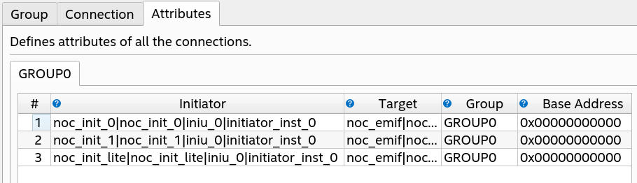

Figure 37.
Platform Designer Connection Flow—System View for Example 4
Figure 38.
Platform Designer Connection Flow—Address Map for Example 4
4.5.4.4.2. Example 4: NoC Assignment Editor Connection Flow
The following figures show how the NoC Assignment Editor displays the connections
on the Connections tab and addressing in the Attributes tab for Example 4.
In these examples, all NoC elements are assigned to NoC group GROUP0.
4. NoC Design Flow in Quartus Prime Pro Edition
Send Feedback
Agilex™ 7 M-Series FPGA Network-on-Chip (NoC) User Guide
59

### Figures from page 59

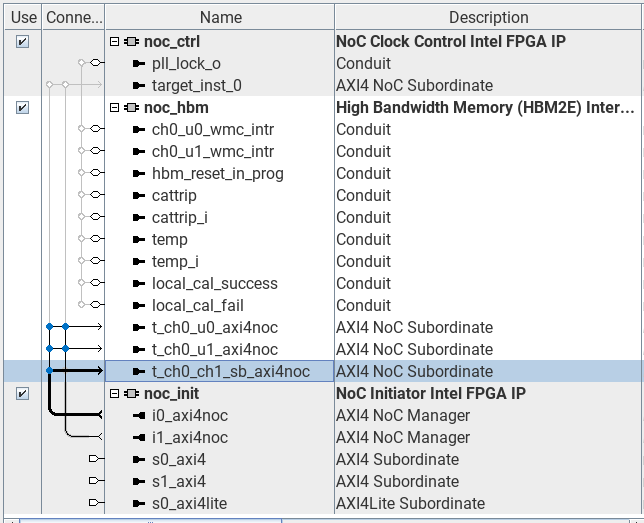
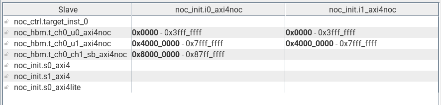

Figure 39.
NoC Assignment Editor Connection Flow—Connection Tab for Example 4
Figure 40.
NoC Assignment Editor Connection Flow—Attributes Tab for Example 4
4.5.4.5. Example 5: Hard Processor System with Two External Memory Interfaces
Example 5 represents a Hard Processor System IP with a dual-channel NoC interface
configuration. This configuration enables both HPS AXI4 NoC manager interfaces on
the MPFE.
Example 5 also contains an instance of External Memory Interfaces for HPS FPGA IP
configured with two HPS AXI NoC subordinate ports. Both manager interfaces on the
MPFE are connected to both HPS AXI NoC subordinate ports in a crossbar
configuration. Each MPFE manager uses 0x0_0000_0000 as the base address for the
first HPS AXI NoC subordinate port, and 0x2_0000_0000 as the base address for the
second HPS AXI NoC subordinate port.
Example 5 also contains one instance of the NoC Clock Control Intel FPGA IP, but its
AXI4 Lite interface is unconnected.
4.5.4.5.1. Example 5: Platform Designer Connection Flow
The following figures show how the Platform Designer System View and Address
Map tabs display the connections and addressing in this Example 5.
For simplicity, the System View in the following figures applies the Hide Clocks and
Resets filter.
4. NoC Design Flow in Quartus Prime Pro Edition
Agilex™ 7 M-Series FPGA Network-on-Chip (NoC) User Guide
Send Feedback
60

### Figures from page 60

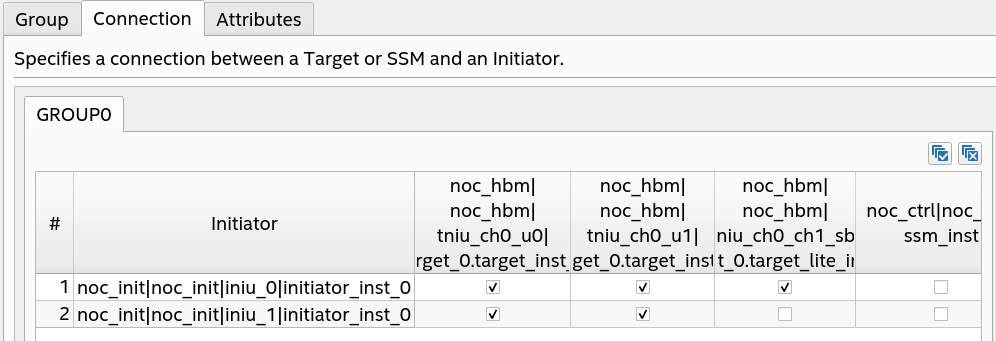
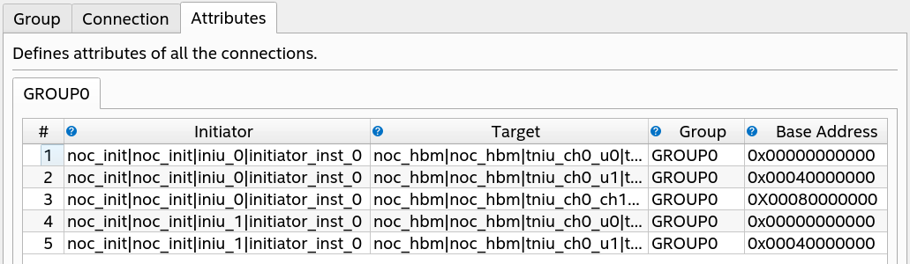

Figure 41.
Platform Designer Connection Flow—System View for Example 5
Figure 42.
Platform Designer Connection Flow—Address Map for Example 5
4.5.4.5.2. Example 5: NoC Assignment Editor Connection Flow
The following figures show how the NoC Assignment Editor displays the connections
on the Connections tab and addressing in the Attributes tab for Example 5.
In these examples, all NoC elements are assigned to NoC group GROUP0.
Figure 43.
NoC Assignment Editor Connection Flow—Connection Tab for Example 5
4. NoC Design Flow in Quartus Prime Pro Edition
Send Feedback
Agilex™ 7 M-Series FPGA Network-on-Chip (NoC) User Guide
61

### Figures from page 61

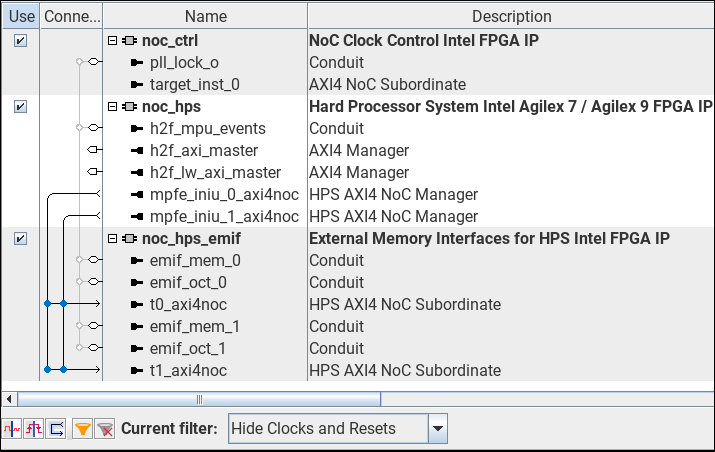
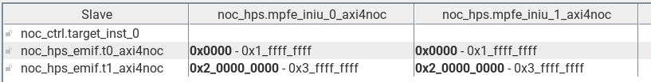
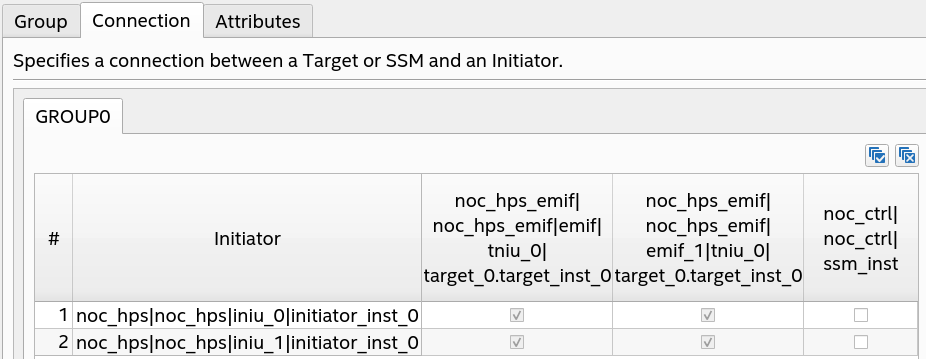

Figure 44.
NoC Assignment Editor Connection Flow—Attributes Tab for Example 5
4.6. Making NoC Physical Assignments Using Interface Planner
After design synthesis, you can use the Quartus Prime Interface Planner to help you to
make physical assignments to define a legal device floorplan.
Note:
It is best to use Interface Planner to specify NoC physical assignments. Otherwise, the
Fitter automatically chooses the location of NoC elements and does not optimize for
bandwidth utilization.
Interface Planner allows you to assign physical locations for the periphery elements in
your design, such as external memory interfaces or other general purpose I/O. You
can also use Interface Planner to assign physical locations for NoC initiators, PLLs, and
SSMs. For step-by-step instructions on using Interface Planner, refer to Using
Interface Planner.
Figure 45.
Interface Planner Design Tab
4. NoC Design Flow in Quartus Prime Pro Edition
Agilex™ 7 M-Series FPGA Network-on-Chip (NoC) User Guide
Send Feedback
62

### Figures from page 62

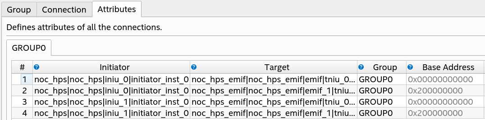
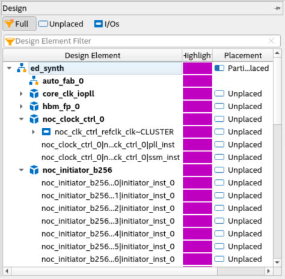

Interface Planner displays your project's logical hierarchy, post-synthesis design
elements, and Fitter-created design elements, alongside a floorplan view of target
device locations. The GUI supports a variety of methods for placing design elements in
the floorplan. As you place elements in the floorplan, the Fitter verifies legality in real
time to ensure accurate correlation with the final implementation.
You can use Interface Planner to assign physical locations for NoC initiators, targets
(as part of the HBM2e or external memory interfaces), PLLs, and SSMs. If you do not
make physical assignments for NoC elements, the Fitter places NoC elements
automatically during compilation. However, the Fitter automatic placement does not
optimize for bandwidth utilization.
It is best to place NoC initiators that communicate with AXI4 Lite targets close to the
NoC SSM. This placement reduces AXI4 Lite access latency and separates AXI4 Lite
and memory traffic on the hard memory NoC.
You use the floorplan view in Interface Planner to place hard memory NoC and
periphery elements. There are three floorplan views available:
- 
NoC View—shows a filtered view of NoC initiators and targets.
- 
Chip View—shows the placeable locations for hard memory NoC elements,
including NoC initiators, targets, PLLs, and SSMs.
- 
Package View—NoC elements are not visible in the Package View.
In the Chip View, the available NoC initiator and target locations appear as rows of
small boxes across the top and bottom edges of the device, between the FPGA fabric
and the periphery I/O structures. Placing your cursor over locations displays a tooltip
indicating whether the location supports only an initiator, only a target, or both an
initiator and a target.
The available NoC PLL and NoC SSM locations appear as smaller boxes at the end of
the row of initiators and targets. The PLL and SSM locations appear at the left end of
the rows (if using the Chip Top view), or at the right end of the rows (if using the
Chip Bottom view). The HPS appears at the top right (if using the Chip Top view) or
at the top left (if using the Chip Bottom view).
Figure 46. Interface Planner Chip View, Closeup of NoC Features shows an example of
the Interface Planner Chip View showing the top left corner of the die as viewed from
the top. The two smaller pink boxes at the top left corner of the fabric are the
locations of the NoC PLL and the NoC SSM.
4. NoC Design Flow in Quartus Prime Pro Edition
Send Feedback
Agilex™ 7 M-Series FPGA Network-on-Chip (NoC) User Guide
63

Figure 46.
Interface Planner Chip View, Close-up of NoC Features
NoC PLL
&
NoC SSM
In the NoC View, only the NoC initiators and targets are visible as larger rectangles.
The targets and initiators for both high-speed NoC along the top edge of the die, and
the high-speed NoC along the bottom edge of the die, are visible. The NoC View
splits the initiators and targets that may share the same location in the Chip View.
Additionally, the I/O banks and UIBs associated with each group of targets appear for
reference. However, you cannot place the memory controllers associated with these
targets in the NoC View. Use the Chip View to place these elements.
The outer-top and outer-bottom rows are the targets for the top-edge NoC and
bottom-edge NoC, respectively. Similarly, the inner-top and inner-bottom rows are the
initiators for the top-edge NoC and bottom-edge NoC, respectively. As with the Chip
View, if you place your cursor over one of these locations, a tooltip reports if that
location supports a target or an initiator. For the targets, the darker colors represent
the main AXI4 targets, while the lighter colors represent the AXI4-Lite targets. The
initiators are all the same color, except for one initiator that is white. The white
initiator represents the HPS MPFE. These colors are for locations that are not yet
assigned. Once you place an initiator or target in one of these locations, the initiator
or target changes to a color that you select (default is purple).
Between each set of targets and initiators are four horizontal lines representing the
four links that comprise the NoC. Additionally, there are green vertical bars
representing the switches that connect the initiators and targets to the horizontal
links. The link utilized in going from a particular initiator to a particular target are
tabulated in Figure 13. Horizontal Link Allocation for Top-Edge NoC and Figure 14.
Horizontal Link Allocation for Bottom-Edge NoC . If you select one of the switches, the
NoC View highlights the initiator and any targets that connect using that switch.
While the initiators are directly adjacent to the switch they use, the targets may be
offset to the left or right. This is particularly true for the targets in the UIB segments,
where there are more targets than switches.
Figure 47. NoC View of Targets and Initiators is an example of the Interface Planner
NoC View showing the targets and initiators for both the top-edge NoC and the
bottom-edge NoC. The row of initiators along the top edge shows 21 rectangles. 20 of
these rectangles are for fabric-facing initiators. The last rectangle (shown white)
4. NoC Design Flow in Quartus Prime Pro Edition
Agilex™ 7 M-Series FPGA Network-on-Chip (NoC) User Guide
Send Feedback
64

### Figures from page 64

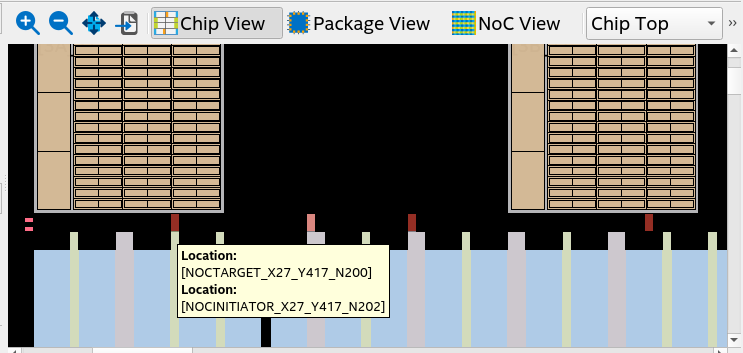

contains the two HPS-facing initiators. Between each row of initiators and targets are
horizontal lines representing the NoC links and vertical bars representing the NoC
switches. This view is based on the ‘Chip Top’ view.
Figure 47.
NoC View of Targets and Initiators
NoC Targets
NoC Initiators
NoC Targets
NoC Initiators
NoC Links
(Horizontal)
NoC Switches
(Vertical)
Related Information
- 
AN 1003: Multi Memory IP System Resource Planning for Agilex 7 M-Series FPGAs
- 
Quartus Prime Pro Edition User Guide: Design Constraints
4.6.1. Using Interface Planner
The following steps describe basic operation of the Interface Planner to place NoC
design elements:
1.
Ensure that you have already run Analysis & Synthesis, as this document
previously describes.
2.
To open the Interface Planner, click Tools ➤ Interface Planner.
3.
On the Flow control, click Initialize Interface Planner.
4.
On the Flow control, click View Assignments.
5.
On the Assignments tab, enable or disable specific or groups of project
assignments to resolve any conflicts or experiment with different settings. You can
filter the list of assignments by assignment name or status.
6.
Click Update Plan on the Flow control to apply the enabled project assignments
to your interface plan.
7.
Click Plan Design on the Flow control to interactively place IP cores and other
design elements in legal locations in the device periphery. All placeable elements,
including NoC elements and periphery elements, appear in the Design Elements
list. Refer to Recommended Placement Order for NoC Elements in Interface
Planner.
4. NoC Design Flow in Quartus Prime Pro Edition
Send Feedback
Agilex™ 7 M-Series FPGA Network-on-Chip (NoC) User Guide
65

### Figures from page 65

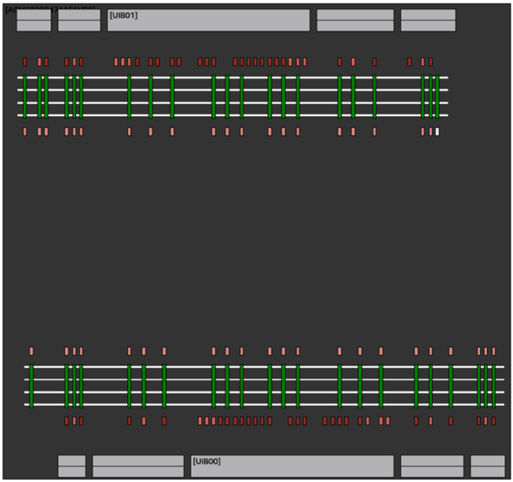

8.
Use any of the following methods to place design elements in the Chip View. All
elements can be placed using the Chip View. NoC initiators and targets can also
be placed using the NoC View.
- 
Drag NoC elements from the Design Elements list and drop them onto
available device resources in the Chip view. You may experience a small
delay while dragging as Interface Planner calculates the legal locations.
- 
To allow Interface Planner to place an unplaced design element in a legal
location, right-click and select Autoplace Selected. You must use Autoplace
Selected for all unplaced clocks.
- 
Right-click an element in the Design Elements list, and then click Generate
Legal Locations to display a list of Legal Locations for the element. Click
any legal location in the list to highlight the location in the floorplan. Double-
click any location in the list to place the element in the location.
9.
After making all necessary location assignments in Interface Planner, validate the
placement by clicking Validate Plan in the Flow pane.
10. To generate a Tcl script to apply the placement constraints to your project, click
Export Constraints in the Flow pane. To automatically run the Tcl script, enable
Apply Assignments.
Figure 48.
Export Physical Constraints from Interface Planner to Your Project
11. To report whether the NoC initiator and target location placement allows your
design to meet the bandwidth and transaction size requirements, click the
Reports tab, and then double-click Report NoC Performance in the Tasks
pane. For report details, refer to NoC Performance Reports in Interface Planner.
Note: Lower-speed memory protocols and other I/O functions that you implement
in the GPIO-B blocks, and that bypass the NoC, can cause conflicts that
prevent the use of certain initiator locations. Therefore, before assigning
any initiator locations, place HBM2e and external memory controllers, as
well as any fixed-location lower speed protocols or GPIO.
For more details on placing NoC initiators and targets, refer to the following related
topics:
Related Information
- 
AN 1003: Multi Memory IP System Resource Planning for Agilex 7 M-Series FPGAs
- 
NoC Design Considerations on page 22
- 
Hard Memory NoC Locations in Interface Planner on page 69
4. NoC Design Flow in Quartus Prime Pro Edition
Agilex™ 7 M-Series FPGA Network-on-Chip (NoC) User Guide
Send Feedback
66

### Figures from page 66

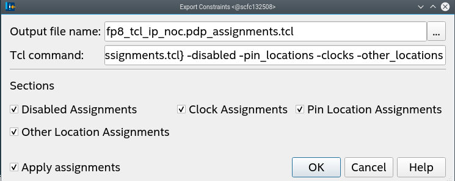

- 
Recommended Placement Order for NoC Elements in Interface Planner on page
67
4.6.2. Recommended Placement Order for NoC Elements in Interface
Planner
For best results, place NoC-related elements in the following order, starting with the IP
containing the NoC targets.
If your design uses HPS, perform the following step:
1.
Click the Autoplace Fixed button to place any elements that have only one legal
location. Repeat clicking the Autoplace Fixed button to place directly connected
elements until Interface Planner displays the message 'No elements found with
only 1 legal location’.
If your design uses HPS and any external memory interfaces associated with the HPS
remain unplaced after the previous step, perform the following steps:
1.
For each HPS external memory, expand the IP in the Design Element pane and
locate the RZQ pin, the element whose name ends in …oct_rzqin~CLUSTER.
2.
Right-click on this element and click Generate Legal Locations for Selected
Elements. The Interface Planner may display multiple legal locations, depending
on prior placements.
3.
Select the RZQ pin for the I/O bank that you want to implement your external
memory interface. Refer to the pinout tables for your device to identify the RZQ
pin associated with the target bank. Note that you must place external memory
interfaces for HPS in the I/O bank or banks adjacent to the HPS. Right-click on the
desired pin location from the list of legal locations and click Place at Selected.
4.
Click the Autoplace Fixed button to place directly connected elements. Repeat
clicking the Autoplace Fixed button until Interface Planner displays the message
‘No elements found with only 1 legal location’. The placement of this IP block is
complete, and you can proceed to the next IP.
For each HBM2e IP in your design, perform the following steps:
1.
Expand the IP in the Design Element pane and locate the HBM controller, the
element whose name ends in “…|xhmbc."
2.
Right-click on this element and click Generate Legal Locations for Selected
Elements. The Interface Planner may display one or two legal locations,
depending on prior placements.
3.
Select the HBM2e location along the top edge or bottom edge of the die based on
your design requirements. Right-click on the desired location from the list of legal
locations and click Place at Selected.
4.
Click the Autoplace Fixed button to place directly connected elements. Repeat
pressing the Autoplace Fixed button until Interface Planner displays the message
‘No elements found with only 1 legal location’. At this point, the placement of the
IP block is complete, and you can proceed to the next IP.
4. NoC Design Flow in Quartus Prime Pro Edition
Send Feedback
Agilex™ 7 M-Series FPGA Network-on-Chip (NoC) User Guide
67

For each external memory interface in your design, perform the following steps:
1.
Expand the IP in the Design Element pane and locate the RZQ pin, the element
whose name ends in “…oct_rzqin~CLUSTER."
2.
Right-click on this element and click Generate Legal Locations for Selected
Elements. The Interface Planner may display multiple legal locations, depending
on prior placements.
3.
Select the RZQ pin for the I/O bank that you want to implement your external
memory interface. Refer to the pinout tables for your device to identify the RZQ
pin associated with the target bank. Right-click on the desired pin location from
the list of legal locations and select Place at Selected.
4.
Click the Autoplace Fixed button to place directly connected elements. Repeat
pressing the Autoplace Fixed button until Interface Planner displays the message
‘No elements found with only 1 legal location’. At this point, the placement of this
IP block is complete, and you can proceed to the next IP.
After placing all the IP containing the NoC targets, Interface Planner also places the
NoC Clock Control IP containing the NoC PLL and the NoC SSM. These placements are
based on the group assignments that you make in the NoC Assignment Editor.
Proceed with placing the NoC initiators by switching to the NoC View. This view
shows the target interface bridges that you have placed. As you place each initiator,
Interface Planner highlights the targets connected to the initiator, as well as the
switches and horizontal links that form the connection. When placing each initiator,
consider the targets that are accessed by that initiator.
If you click on the NoC switches represented by the green vertical bars, Interface
Planner displays the initiators and targets that connect directly to that switch.

If you place the initiator such that it only uses the vertical switch to connect to its
target, its traffic does not use the horizontal links. That placement avoids the traffic
causing congestion on the links that are in use for other initiator-to-target
connections. Place the initiator close to the targets that require low-latency or high-
bandwidth accesses. Since HBM2e channels are functionally interchangeable, you can
also shorten communication paths across the NoC by choosing HBM2e channels that
are close to your ideal initiator location.
Note:
When placing initiators, try to balance connections across the four horizontal links.
This balancing minimizes possible congestion on the NoC. For more details, refer to
the tables in Horizontal Bandwidth Considerations, along with tables in Hard Memory
NoC Locations in Interface Planner to translate location choices into physical
placements.
4. NoC Design Flow in Quartus Prime Pro Edition
Agilex™ 7 M-Series FPGA Network-on-Chip (NoC) User Guide
Send Feedback
68

### Figures from page 68

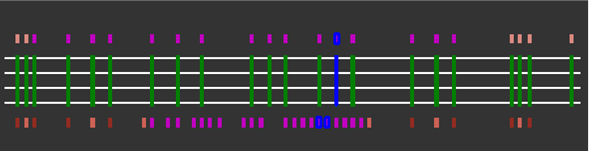

External Memory Interfaces and other GPIO functions that bypass the NOC can conflict
with initiator interface bridges placement, as GPIO-B Bypass Mode and Initiators
describes. Depending on design requirements, you can place these I/O functions that
bypass the NoC before or after placing the NoC initiator interfaces. Placing I/O
functions first gives greater flexibility to their placement, while restricting which
initiator locations you can use. Placing NoC initiator interface bridges first allows
optimal initiator placement, while restricting which I/O locations are available.
Other interfaces, such as transceivers, have no direct interaction with the hard
memory NoC. Therefore, you can place such interfaces before or after the NoC.
Related Information
- 
AN 1003: Multi Memory IP System Resource Planning for Agilex 7 M-Series FPGAs
- 
Quartus Prime Pro Edition User Guide: Design Constraints
4.6.3. Hard Memory NoC Locations in Interface Planner
When placing NoC initiators and targets, refer to Table 10. Top-Edge Hard Memory
NoC Locations in Interface Planner and Table 11. Bottom-Edge Hard Memory NoC
Locations in Interface Planner to correlate locations with Horizontal Bandwidth
Considerations with NoC elements visible in the Interface Planner. In the following
tables, the initiator and target locations in the same cell connect to the same switch in
the hard memory NoC. Connections between initiators and targets using the same
switch use a local connection instead of the high-speed horizontal links.
Table 10.
Top-Edge Hard Memory NoC Locations in Interface Planner
NoC Segment
Initiator
Interface Planner Location
PLL/SSM
NOCPLL_X11_Y417_N221
NOCSSM_X11_Y417_N220
GPIO-B_0
I0
NOCINITIATOR_X27_Y417_N202
NOCTARGET_X27_Y417_N200
I1
NOCINITIATOR_X42_Y417_N202
NOCAXILITETARGET_X42_Y417_N200
I2
NOCINITIATOR_X53_Y417_N202
NOCTARGET_X53_Y417_N200
GPIO-B_1
I0
NOCINITIATOR_X79_Y417_N202
NOCTARGET_X79_Y417_N200
I1
NOCINITIATOR_X94_Y417_N202
NOCAXILITETARGET_X94_Y417_N200
I2
NOCINITIATOR_X105_Y417_N202
NOCTARGET_X105_Y417_N200
UIB_L
I0
NOCINITIATOR_X134_Y417_N202
NOCAXILITETARGET_X123_Y417_N200 (Visible in Chip Planner and
Interface Planner but not user-accessible.)
NOCAXILITETARGET_X129_Y417_N200
NOCAXILITETARGET_X134_Y417_N200
NOCTARGET_X140_Y417_N200
NOCTARGET_X150_Y417_N200
continued...
4. NoC Design Flow in Quartus Prime Pro Edition
Send Feedback
Agilex™ 7 M-Series FPGA Network-on-Chip (NoC) User Guide
69

NoC Segment
Initiator
Interface Planner Location
I1
NOCINITIATOR_X150_Y417_N202
NOCTARGET_X156_Y417_N200
NOCTARGET_X161_Y417_N200
I2
NOCINITIATOR_X161_Y417_N202
NOCTARGET_X167_Y417_N200
UIB_M
I0
NOCINITIATOR_X188_Y417_N202
NOCTARGET_X177_Y417_N200
NOCTARGET_X183_Y417_N200
I1
NOCINITIATOR_X204_Y417_N202
NOCTARGET_X188_Y417_N200
NOCTARGET_X210_Y417_N200
I2
NOCINITIATOR_X215_Y417_N202
NOCTARGET_X215_Y417_N200
NOCTARGET_X221_Y417_N200
UIB_R
I0
NOCINITIATOR_X242_Y417_N202
NOCTARGET_X231_Y417_N200
I1
NOCINITIATOR_X258_Y417_N202
NOCTARGET_X237_Y417_N200
NOCTARGET_X242_Y417_N200
I2
NOCINITIATOR_X269_Y417_N202
NOCTARGET_X248_Y417_N200
NOCTARGET_X258_Y417_N200
NOCAXILITETARGET_X264_Y417_N200
NOCAXILITETARGET_X269_Y417_N200
NOCAXILITETARGET_X275_Y417_N200 (Visible in Chip Planner and
Interface Planner but not user-accessible.)
GPIO-B_2
I0
NOCINITIATOR_X296_Y417_N202
NOCTARGET_X296_Y417_N200
I1
NOCINITIATOR_X311_Y417_N202
NOCAXILITETARGET_X311_Y417_N200
I2
NOCINITIATOR_X322_Y417_N202
NOCTARGET_X322_Y417_N200
GPIO-B/HPS
I0 (fabric)
NOCINITIATOR_X357_Y417_N204
NOCTARGET_X346_Y417_N200
I1 (fabric)
NOCINITIATOR_X365_Y417_N204
NOCAXILITETARGET_X357_Y417_N200
I0 (MFFE)
AXI4 Lite T1 (MPFE)
I2 (MPFE)
NOCINITIATOR_X373_Y417_N202
NOCAXILITEINITIATOR_X373_Y417_N201
NOCINITIATOR_X373_Y417_N200
NOCTARGET_X365_Y417_N200
Table 11.
Bottom-Edge Hard Memory NoC Locations in Interface Planner
NoC Segment
Initiator
Interface Planner Location
PLL/SSM
NOCPLL_X11_Y6_N221
continued...
4. NoC Design Flow in Quartus Prime Pro Edition
Agilex™ 7 M-Series FPGA Network-on-Chip (NoC) User Guide
Send Feedback
70

NoC Segment
Initiator
Interface Planner Location
NOCSSM_X11_Y6_N220
SDM
I0
NOCINITIATOR_X28_Y6_N200
GPIO-B_0
I0
NOCINITIATOR_X79_Y6_N202
NOCTARGET_X79_Y6_N200
I1
NOCINITIATOR_X94_Y6_N202
NOCAXILITETARGET_X94_Y6_N200
I2
NOCINITIATOR_X105_Y6_N202
NOCTARGET_X105_Y6_N200
GPIO-B_1
I0
NOCINITIATOR_X134_Y6_N202
NOCTARGET_X134_Y6_N200
I1
NOCINITIATOR_X149_Y6_N202
NOCAXILITETARGET_X149_Y6_N200
I2
NOCINITIATOR_X160_Y6_N202
NOCTARGET_X160_Y6_N200
UIB_L
I0
NOCINITIATOR_X188_Y6_N202
NOCAXILITETARGET_X177_Y6_N200 (Visible in Chip Planner and
Interface Planner but not user-accessible.)
NOCAXILITETARGET_X183_Y6_N200
NOCAXILITETARGET_X188_Y6_N200
NOCTARGET_X194_Y6_N200
NOCTARGET_X204_Y6_N200
I1
NOCINITIATOR_X204_Y6_N202
NOCTARGET_X210_Y6_N200
NOCTARGET_X215_Y6_N200
I2
NOCINITIATOR_X215_Y6_N202
NOCTARGET_X221_Y6_N200
UIB_M
I0
NOCINITIATOR_X242_Y6_N202
NOCTARGET_X231_Y6_N200
NOCTARGET_X237_Y6_N200
I1
NOCINITIATOR_X258_Y6_N202
NOCTARGET_X242_Y6_N200
NOCTARGET_X264_Y6_N200
I2
NOCINITIATOR_X269_Y6_N202
NOCTARGET_X269_Y6_N200
NOCTARGET_X275_Y6_N200
UIB_R
I0
NOCINITIATOR_X296_Y6_N202
NOCTARGET_X285_Y6_N200
I1
NOCINITIATOR_X312_Y6_N202
NOCTARGET_X291_Y6_N200
NOCTARGET_X296_Y6_N200
I2
NOCINITIATOR_X323_Y6_N202
NOCTARGET_X302_Y6_N200
NOCTARGET_X312_Y6_N200
continued...
4. NoC Design Flow in Quartus Prime Pro Edition
Send Feedback
Agilex™ 7 M-Series FPGA Network-on-Chip (NoC) User Guide
71

NoC Segment
Initiator
Interface Planner Location
NOCAXILITETARGET_X318_Y6_N200
NOCAXILITETARGET_X323_Y6_N200
NOCAXILITETARGET_X329_Y6_N200 (Visible in Chip Planner and
Interface Planner but not user-accessible.)
GPIO-B_2
I0
NOCINITIATOR_X350_Y6_N202
NOCTARGET_X350_Y6_N200
I1
NOCINITIATOR_X365_Y6_N202
NOCAXILITETARGET_X365_Y6_N200
I2
NOCINITIATOR_X376_Y6_N202
NOCTARGET_X376_Y6_N200
GPIO-B_3
I0
NOCINITIATOR_X404_Y6_N202
NOCTARGET_X404_Y6_N200
I1
NOCINITIATOR_X419_Y6_N202
NOCAXILITETARGET_X419_Y6_N200
I2
NOCINITIATOR_X430_Y6_N202
NOCTARGET_X430_Y6_N200
4.6.4. NoC Performance Reports in Interface Planner
At any point during NoC initiator placement, you can interactively generate a NoC
Performance Report in Interface Planner. The NoC Performance Report generation
performs a static analysis of the NoC initiator and target locations to evaluate whether
the placement allows your design to meet the bandwidth requirements and transaction
sizes that you specify in the NoC Assignment Editor.
Note:
The NoC Performance Report uses default clock frequencies when computing
bandwidth capabilities. To generate a report based on actual clock frequencies, refer
to the NoC Performance Report generated during the Fitter stage, as Fitter NoC
Performance Reports describes.
To access the NoC Performance Report in Interface Planner, click the Reports tab, and
then double-click Report NoC Performance in the Tasks pane.
The NoC Performance Report reports performance data for each initiator to target
connection. You can achieve lower minimum structural latency by placing the NoC
initiators and targets closer together. You can also display the congestion on the
horizontal links visually in the NoC View.
To display this congestion after generating the report:
1.
Switch back to the Plan tab.
2.
Select the NoC View option.
3.
In the NoC View, right-click and enable Show NoC Congestion from the context
menu.
Any segments of the horizontal links that are congested will be highlighted in red.
4. NoC Design Flow in Quartus Prime Pro Edition
Agilex™ 7 M-Series FPGA Network-on-Chip (NoC) User Guide
Send Feedback
72

Table 12.
NoC Performance Report Data
NoC Performance Report Column
Description
Requested RD BW
The requested read bandwidth in GB per second. This value is the same as the
value that you specify in the NoC Assignment Editor, as Step 3: Make Attribute
Assignments in NoC Assignment Editor describes.
Requested WR BW
The requested write bandwidth in GB per second. This value is the same as the
value that you specify in the NoC Assignment Editor.
Initiator placement
The placement location of the initiator element.
Target placement
The placement location of the target element.
Message
A message indicating whether you can achieve the requested bandwidth, or
whether the connection is congested; and information about the cause of the
congestion. The cause of congestion is an indication of where the congestion
occurs, and which other connections contribute to that congestion.
Figure 49.
Sample NoC Performance Report Not Meeting Performance Targets
One possible reason that the Message reports that the current placement cannot
meet the requested bandwidth is because of over-saturation of an initiator or a target.
For example, if the sum of all bandwidth requirements through a particular initiator is
greater than the bandwidth that the initiator can support, based on the data width and
operating frequency of its fabric facing AXI4 interface. To avoid this problem, either
reduce bandwidth requirements or increase bandwidth capability.
Another possible reason that the current placement cannot meet the requested
bandwidth is over-saturation of the horizontal bandwidth available in the NoC. This
condition is the result of multiple initiator to target connections requesting bandwidth
over the same sections of the horizontal links.
Further congestion can arise for connections that overlap connections that are already
congested for any of the above reasons.
4. NoC Design Flow in Quartus Prime Pro Edition
Send Feedback
Agilex™ 7 M-Series FPGA Network-on-Chip (NoC) User Guide
73

### Figures from page 73

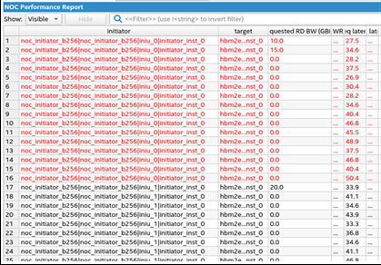

Note:
For important considerations when choosing initiator interface bridge placement, refer
to the tables in Horizontal Bandwidth Considerations, along with tables in Hard
Memory NoC Locations in Interface Planner to translate location choices into physical
placements.
4.7. Compiling the NoC Design
After exporting your validated NoC assignments to your Quartus Prime project, you
next compile the design in the Quartus Prime software. Design compilation places and
routes the design including all NoC-related elements.
To compile your NoC design when ready, double-click Compile Design on the
Compilation Dashboard (Processing ➤ Compilation Dashboard)
Figure 50.
Compile Design Command in the Compilation Dashboard
4.7.1. Fitter NoC Reports
The Compilation Report includes the NoC Connectivity Report and the NoC
Performance Report in the Plan Stage section of the Fitter Report.
The NoC Connectivity Report provides information on connections between NoC
initiators and targets in the implemented design, and their associated base addresses.
Use this report to verify that the implementation of connection and attribute
assignments are correct.
4. NoC Design Flow in Quartus Prime Pro Edition
Agilex™ 7 M-Series FPGA Network-on-Chip (NoC) User Guide
Send Feedback
74

### Figures from page 74

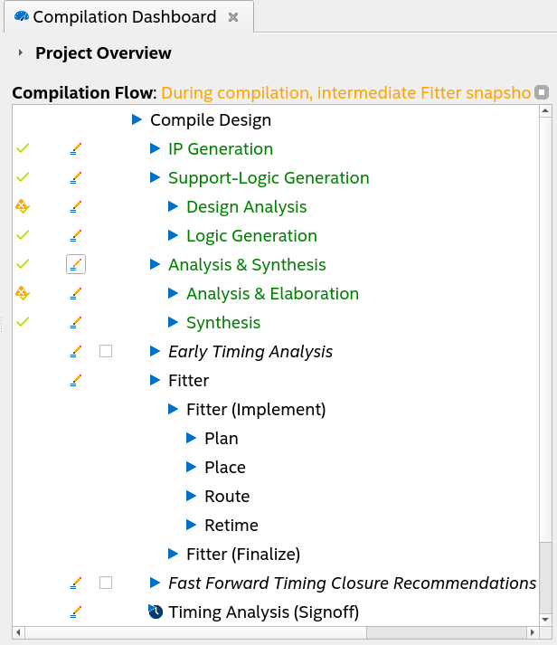

Figure 51. Sample NoC Connectivity Report shows an example NoC Connectivity
Report. The table in this report contains a row for each initiator to target connection.
Additional rows may report any unconnected NoC elements. The following columns
report data:
- 
Group—displays the connection's NoC group assignment.
- 
Status—displays whether the row is for connected or unconnected elements.
- 
Initiator—lists the NoC initiator elements.
- 
Target—lists the NoC target elements.
- 
Address—displays the hexadecimal base address for each connection
Figure 51.
Sample NoC Connectivity Report
Fitter NoC Performance Report
The Fitter NoC Performance report uses actual design clock frequencies determined
during bandwidth analysis to report performance data. This report is similar to the
NoC Performance Report that the Interface Planner generates. However, the Interface
Planner report uses only estimated design clock frequencies. The Fitter NoC
Performance report shows the maximum possible bandwidth and the total of
requested bandwidth for the congested path. This report indicates whether you can
achieve the requested bandwidth, or whether the connection is congested; and
provides information about the cause of the congestion. The cause of congestion is an
indication of where the congestion occurs, and which other connections contribute to
that congestion.
Note:
The read and write transaction size affect the total bandwidth. The default transaction
size is 64 bytes, corresponding to the physical width of the horizontal links in the hard
memory NoC. Smaller transaction sizes utilize the NoC inefficiently, resulting in less
effective bandwidth.
4. NoC Design Flow in Quartus Prime Pro Edition
Send Feedback
Agilex™ 7 M-Series FPGA Network-on-Chip (NoC) User Guide
75

### Figures from page 75

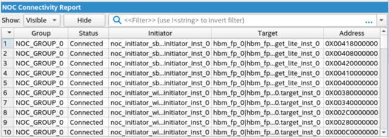

The following are some possible causes of congestion:
- 
The sum of bandwidth that you specified for all connections (read and write
combined) entering a target exceeds the target bandwidth limit.
- 
The sum of bandwidth that you specified for all connections leaving an initiator
exceeds the initiator bandwidth limit.
- 
The sum of connections on any node in the body of the NoC exceeds the
bandwidth capability of that element in the NoC.
- 
A connection shares any node in the NoC with another connection that has
congestion. In other words, slower connection B traffic delays the connection A
traffic.
- 
Over-saturation of the horizontal bandwidth available in the NoC. This condition is
the result of multiple initiator to target connections requesting bandwidth in the
same direction through a horizontal section of the NoC. The NoC Performance
Report message reports the congested segments. You can adjust initiator
placement to alleviate congestion. For important considerations when choosing
initiator interface bridge placement, refer to the tables in Horizontal Bandwidth
Considerations and High-Speed Interconnect NoC Locations in Interface Planner to
translate location choices into physical placements.
Figure 52.
Sample NoC Performance Report Messages- Excessive Requested Bandwidth
For example, if the sum of all bandwidth requirements through a particular initiator is
greater than the bandwidth that the initiator can support, based on the data width and
operating frequency of its AXI4 interface. To avoid this problem, either reduce
bandwidth requirements or increase bandwidth capability. The NoC Performance
Report Messages show:
Figure 53.
Performance Report Message Column Congestion Details
4. NoC Design Flow in Quartus Prime Pro Edition
Agilex™ 7 M-Series FPGA Network-on-Chip (NoC) User Guide
Send Feedback
76

### Figures from page 76

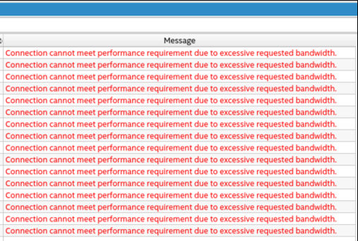
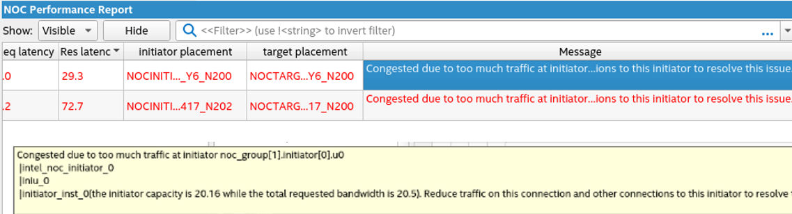

4.7.2. Viewing NoC Elements in Chip Planner
NoC elements are also visible in the Quartus Prime Chip Planner. The Chip Planner
simplifies floorplanning by allowing you to view and constrain design logic within a
visual display of the FPGA chip resources. You can use the Chip Planner to view and
modify the logic placement, connections, and routing paths after running the Fitter.
You can also make assignment changes, such as creating and deleting Logic Lock,
clock region, and resource assignments.
The NoC elements appear in Chip Planner as a row of boxes between the main logic
array, the GPIO-B, and other blocks across the top and bottom edge of the die. You
can also click Report Resources in the Chip Planner Tasks pane to locate different
types of NoC resources, such as the following
- 
NOC_INITIATOR
- 
NOC_TARGET
- 
NOC_AXILITE_INITIATOR
- 
NOC_AXILITE_TARGET
- 
NOC_PLL
- 
NOC_SSM
Viewing your design in Chip Planner provides insight into how the Fitter physically
arranges the NoC elements on the device. For general information about using the
Chip Planner, refer to the Quartus Prime Pro Edition User Guide: Design Optimization.
Figure 54.
NoC Group Node in Chip Planner
Related Information
- 
AN 1003: Multi Memory IP System Resource Planning for Agilex 7 M-Series FPGAs
- 
Quartus Prime Pro Edition User Guide: Design Optimization
4. NoC Design Flow in Quartus Prime Pro Edition
Send Feedback
Agilex™ 7 M-Series FPGA Network-on-Chip (NoC) User Guide
77

### Figures from page 77

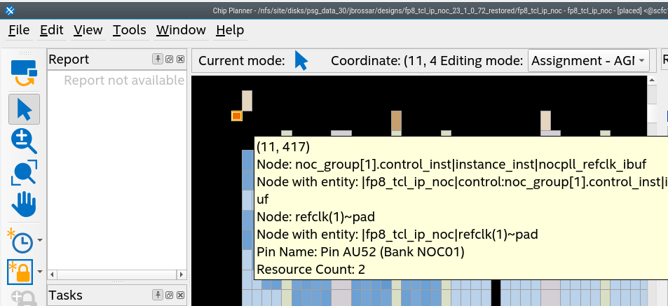

5. NoC Real-time Performance Monitoring
Real-time performance monitoring of the NoC is not enabled in the current version of
the Quartus Prime Pro Edition software.
© Altera Corporation. Altera, the Altera logo, the ‘a’ logo, and other Altera marks are trademarks of Altera Corporation. Altera
reserves the right to make changes to any products and services at any time without notice. Altera assumes no responsibility or
liability arising out of the application or use of any information, product, or service described herein except as expressly agreed
to in writing by Altera. Altera customers are advised to obtain the latest version of device specifications before relying on any
published information and before placing orders for products or services.
*Other names and brands may be claimed as the property of others.

6. Simulating NoC Designs
The NoC in Agilex 7 M-series devices supports both an abstract model and an accurate
model for simulation of the NoC. The abstract and accurate models differ in the details
modeled in simulation and in the design stage at which you can simulate the models.
Abstract Simulation Model
The NoC abstract simulation model includes design information about initiator-to-
target connectivity and address mapping. However, the abstract model does not
include NoC initiator and target physical placement data. Therefore, you can use the
abstract model to verify connectivity, but not for modeling latency or throughput and
traffic congestion affects. You can use the abstract model early in the design process,
after generation of your Platform Designer system or after design Analysis &
Elaboration.
Accurate Simulation Model
In addition to connectivity and address mapping, the accurate simulation model also
includes initiator and target physical placement data. This placement data allows
simulation to model the effects of placement on latency, throughput, and traffic
congestion. Because the accurate model requires placement data, you can use this
model only after the Fitter generates the placement data. The accurate model is
available after the Fitter's Place stage, or after the Fitter's Plan stage when not using
the Fabric NoC option.
Table 13.
Comparison of Abstract and Accurate NoC Simulation Models
Abstract Model
Accurate Model
Includes connectivity and address mapping
Yes
Yes
Includes placement information
No
Yes
Can model basic connectivity
Yes
Yes
Can model traffic latency, throughput, and
congestion
No
Yes
Supports designs using the Fabric NoC option
Yes
Yes
Design stage for use
After Platform Designer netlist
generation (Platform Designer
Connection flow)
After Analysis & Elaboration (NoC
Assignment Editor Connection flow)
After Fitter Place stage (if using
Fabric NoC option).
After Fitter Plan stage (if not
using Fabric NoC option).
Supported Simulators
Cadence Xcelium
Siemens QuestaSim
Synopsys VCS
Cadence Xcelium
Siemens QuestaSim
Synopsys VCS
© Altera Corporation. Altera, the Altera logo, the ‘a’ logo, and other Altera marks are trademarks of Altera Corporation. Altera
reserves the right to make changes to any products and services at any time without notice. Altera assumes no responsibility or
liability arising out of the application or use of any information, product, or service described herein except as expressly agreed
to in writing by Altera. Altera customers are advised to obtain the latest version of device specifications before relying on any
published information and before placing orders for products or services.
*Other names and brands may be claimed as the property of others.

The abstract and accurate NoC simulation models are both for modeling the NoC itself.
The models for the NoC-related IP generate during IP HDL generation. NoC-related IP
includes the NoC Initiator FPGA IP, High Bandwidth Memory (HBM2e) Interface Agilex
7 FPGA IP, and External Memory Interfaces (EMIF) IP. Refer to Introduction to Altera
IP Cores for instructions on incorporating these models into your simulation netlist and
generating the appropriate simulation scripts.
The NoC supports simulation using only one of these models at a time. To simulate
using either model, ensure that your testbench only reads one of the models for a
given simulation. You can use a variable to determine which model to read, as the
following example shows. The following sections detail the variables to define and files
to include for each model.
`ifdef PERFORMANCE_ACC_NOC_SIM_MODEL_AGILEX
    `include “noc_sim_defparams.inc”    // Accurate NoC Simulation Model
‘else
    `include “<top_module>_noc_sim.inc” // Abstract NoC Simulation Model
`endif
Related Information
- 
NoC Design Flow Options on page 29
- 
Introduction to Altera IP Cores
6.1. Using the Abstract NoC Simulation Model
The abstract NoC simulation model enables behavioral simulation of the NoC in
combination with your logic as either RTL, or as a functional (non-timing) gate-level
netlist. You can use these simulation methods to verify correct specification of the
connectivity and addressing. However, you cannot model the throughput, latency, or
traffic congestion on the hard memory NoC using the abstract simulation model.
Because the design netlist does not include NoC initiator-to-target connectivity and
address-mapping, you must create a simulation include file that defines initiator-to-
target-connections by registration function calls, as Connecting NoC IP describes. The
registration function uses a Verilog initial block to specify the start address and
address range of each connection between an initiator and target.
There are two distinct flows for generating a simulation include file that includes NoC
connectivity, as NoC Design Flow Options describes:
- 
Platform Designer Connection Flow—specify NoC connectivity and addressing
within Platform Designer. When you generate HDL for your Platform Designer
system, a simulation include file also generates with the NoC connectivity and
addressing information.
- 
NoC Assignment Editor Connection Flow—specify NoC connectivity and addressing
in the NoC Assignment Editor. After saving your assignments and re-running
Analysis & Elaboration, a simulation include file generates with the NoC
connectivity and addressing information.
After generating the simulation include file using either connection flow, you must
then add NoC connectivity and address mapping to your simulation netlist. The
following topics describe generating the include file and using it in your simulation
testbench.
6. Simulating NoC Designs
Agilex™ 7 M-Series FPGA Network-on-Chip (NoC) User Guide
Send Feedback
80

6.1.1. Generating the Abstract Simulation Include File (Platform Designer
Connection Flow)
To generate the abstract simulation include file in the Platform Designer connection
flow, follow these steps:
1.
Connect the AXI4 NoC manager ports to the AXI4 NoC subordinate ports in the
System View tab of Platform Designer. The AXI4 NoC manager ports are on the
NoC Initiator Intel FPGA IP. The AXI4 NoC subordinate ports are on the High
Bandwidth Memory (HBM2E) Interface Agilex 7 FPGA IP and on the External
Memory Interfaces (EMIF) IP.
2.
Click the Address Map tab in Platform Designer to assign base addresses for each
NoC initiator to target connection. If an initiator connects to multiple targets,
ensure that each target has a unique starting address. For NoC connections, you
only need to specify the starting address. Specifying the ending address for NoC
connections is unnecessary.
For HBM2e memory, the minimum address span is 1 GB and you must align base
addresses to 1 GB boundaries. For external memory interfaces, the minimum
address span is 4 GB and you must align base addresses to 4 GB boundaries. For
example, if an initiator connects to both HBM2e memory and DDR5 memory, you
can specify the base address for the HBM2e memory as 0x00000000, and specify
the base address for the DDR5 memory as 0x40000000, assuming a 16 GB
HBM2e memory space.
3.
Save the system and click Generate HDL. Platform Designer generates the
registration include file along with the HDL. There is no need to run Quartus Prime
Analysis & Elaboration before simulation when using this flow.
If you update any initiator-to-target connections or address mapping in Platform
Designer, you must click Generate HDL to update the simulation include file.
Related Information
NoC Design Flow Options on page 29
6.1.2. Generating the Abstract Simulation Include File (NoC Assignment
Editor Connection Flow)
To generate the abstract simulation registration include file for the NoC Assignment
Editor connection flow, follow these steps:
Note:
These steps do not apply to the Platform Designer connection flow. For this flow, refer
to Generating a Simulation Registration Include File (Platform Designer Connection
Flow).
1.
Specify your NoC grouping, initiator-to-target connectivity, and base addressing in
the NoC Assignment Editor, as Using the NoC Assignment Editor describes.
Alternatively, you can specify these assignments directly in the .qsf.
2.
Re-run Analysis & Elaboration or perform a full compilation. This step allows the
Compiler to read your assignments and create a simulation registration include file
that contains the information that simulation requires to reflect your connectivity
specifications. The registration include file contains one registration statement for
each initiator-to-target connection, specifying the start address and the size of
that connection’s address range.
6. Simulating NoC Designs
Send Feedback
Agilex™ 7 M-Series FPGA Network-on-Chip (NoC) User Guide
81

Note: If you update any of these assignments in the NoC Assignment Editor, or
modify them directly in the .qsf, you must re-run Analysis & Elaboration or
perform a full compile to update this simulation registration include file.
6.1.3. Using the Abstract Simulation Include File
The simulation registration include file generates into your project directory, in Verilog
HDL format, with the name <top_module>_noc_sim.inc. This simulation
registration include file has all the necessary registration information for each initiator-
to-target connection, using a SIM_TOP_PATH macro to specify the hierarchical path.
Note:
This file is only available in Verilog HDL format. If your design uses VHDL, you must
create a top-level wrapper in Verilog HDL to use this registration include file and
perform a mixed-language simulation.
To use this file:
1.
Edit your top-level simulation testbench to define the SIM_TOP_PATH macro to
complete the hierarchical path to the initiators and targets relative to the
testbench.
2.
Once you define the SIM_TOP_PATH macro, use the `include directive to
include this file into your simulation testbench and apply the registration
statements.
3.
If your simulation environment instantiates these modules at multiple places in
your hierarchy, redefine the SIM_TOP_PATH macro and re-include this file for each
additional instantiation.
Note:
Do not edit the simulation registration include file directly because the Compiler
rewrites this file during each compilation.
6. Simulating NoC Designs
Agilex™ 7 M-Series FPGA Network-on-Chip (NoC) User Guide
Send Feedback
82

Figure 55.
Example Contents of Simulation Registration Include File Generation
/*
File test_noc_sim.inc created by Quartus Version 23.3.0 Internal Build 81
08/20/2023 SC Pro Edition.
Description: This file contains simulation registration statements necessary to
define connectivity
and address mapping between initiators and targets in your hard memory NoC.
Instructions for Use: In your simulation testbench, define the SIM_TOP_PATH
macro to complete the
hierarchical path to the initiators and targets in the registration statements
below. Once the
SIM_TOP_PATH macro is defined, use a `include directive to include this file
into your simulation
testbench and apply the registration statements. If your simulation environment
instantiates these
modules at multiple places in your hierarchy, redefine the SIM_TOP_PATH macro
and re-include this file
for each additional instantiation.
This file will be overwritten upon rerun.
*/
initial begin
 #1;
 `SIM_TOP_PATH.noc_init|noc_init|iniu_0|initiator_inst_
0.register_if(`SIM_TOP_PATH.noc_hbm|noc_hbm|tniu_ch0_ch1_sb|
target_0.target_lite_inst_0.get_if(),
44'h80000000, 44'h8000000);
 `SIM_TOP_PATH.noc_init|noc_init|iniu_0|initiator_inst_
0.register_if(`SIM_TOP_PATH.noc_hbm|noc_hbm|tniu_ch0_u0|
target_0.target_inst_0.get_if(), 44'h0,
44'h40000000);
 `SIM_TOP_PATH.noc_init|noc_init|iniu_0|initiator_inst_
0.register_if(`SIM_TOP_PATH.noc_hbm|noc_hbm|tniu_ch0_u1|
target_0.target_inst_0.get_if(),
44'h40000000, 44'h40000000);
 `SIM_TOP_PATH.noc_init|noc_init|iniu_1|initiator_inst_
0.register_if(`SIM_TOP_PATH.noc_hbm|noc_hbm|tniu_ch0_u0|
target_0.target_inst_0.get_if(), 44'h0,
44'h40000000);
`SIM_TOP_PATH.noc_init|noc_init|iniu_1|initiator_inst_
0.register_if(`SIM_TOP_PATH.noc_hbm|noc_hbm|tniu_ch0_u1|
target_0.target_inst_0.get_if(),
44'h40000000, 44'h40000000);
end
6. Simulating NoC Designs
Send Feedback
Agilex™ 7 M-Series FPGA Network-on-Chip (NoC) User Guide
83

### Figures from page 83

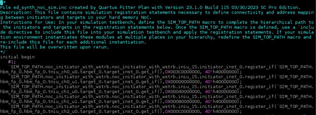

6.2. Using the Accurate NoC Simulation Model
The accurate NoC simulation model enables performance simulation of the NoC in
combination with your logic as either RTL or as a functional (non-timing) gate-level
netlist. In addition to the connectivity modeled by the abstract model, the cycle
accurate model can model the throughput, latency, and traffic congestion on the hard
memory NoC.
Because the design netlist does not include NoC initiator-to-target connectivity and
address-mapping, nor any physical placement information, you must create a
simulation include file that provides this information to your simulation environment.
The include file uses a combination of registration functions and defparam statements
to describe your design’s connectivity, address mapping, and placement.
After generating the simulation include file, you must then add the include file to your
simulation netlist. The following topics detail generating the include file and using it in
your simulation testbench.
6.2.1. Generating the Accurate Simulation Include File
To generate a simulation include file for the accurate model, follow these steps:
1.
Create your design using either the Platform Designer Connection flow or NoC
Assignment Editor Connection flow, as NoC Design Flow Options describes.
2.
(Recommended) If you are assigning your own locations for NoC initiators and
targets, run Processing ➤ Start ➤ Start Analysis & Synthesis and then use
the Interface Planner to create placement assignments, as Using Interface Planner
describes.
3.
Upon Fitter completion, the noc_sim_defparams.inc file appears in the project
directory. If your design uses the Fabric NoC option, this file is available after the
Fitter Place stage. If your design does not use the Fabric NoC option, this file is
available after the Fitter Plan stage.
Note: If you update the connectivity or addressing (in either Platform Designer or
the NoC Assignment Editor), or if you update any placement, you must
regenerate this simulation include file by recompiling your design through
the Fitter Plan or Place stage.
6.2.2. Using the Accurate Simulation Include File
The simulation registration include file generates into your project directory, in Verilog
HDL format, with the name noc_sim_defparams.inc. This simulation registration
include file has all the necessary registration information for each initiator-to-target
connection, using a SIM_TOP_PATH macro to specify the hierarchical path. The file
also includes defparam statements that specify placement information from your
design.
Note:
This file is only available in Verilog HDL format. If your design uses VHDL, you must
create a top-level wrapper in Verilog HDL to use this registration include file and
perform a mixed-language simulation.
6. Simulating NoC Designs
Agilex™ 7 M-Series FPGA Network-on-Chip (NoC) User Guide
Send Feedback
84

To use this file:
1.
Edit your top-level simulation testbench to define the SIM_TOP_PATH macro to
complete the hierarchical path to the initiators and targets relative to the
testbench.
2.
Once you define the SIM_TOP_PATH macro, use the `include directive to
include this file into your simulation testbench and apply the registration
statements.
3.
If your simulation environment instantiates these modules at multiple places in
your hierarchy, redefine the SIM_TOP_PATH macro and re-include this file for each
additional instantiation.
Note:
Do not edit the simulation registration include file directly because the Compiler
rewrites this file during each compilation.
6. Simulating NoC Designs
Send Feedback
Agilex™ 7 M-Series FPGA Network-on-Chip (NoC) User Guide
85

7. NoC Power Estimation
You can perform power estimation for Agilex 7 M-Series FPGAs using the Power and
Thermal Calculator (PTC). The PTC estimates your design's power consumption and
provides thermal design parameters for the target device. The PTC allows early
analysis of the factors contributing to FPGA power consumption, allowing you to adjust
your design for greater power and thermal efficiency. Alternatively, after compiling
your design in the Quartus Prime software, you can import your design into the PTC
for a more accurate power analysis based on the actual implementation of your design
For general information on using the PTC to estimate power, refer to the Power and
Thermal Calculator User Guide. For information on using the PTC to estimate power for
the High Bandwidth Memory (HBM2E) IP, refer to the High Bandwidth Memory
(HBM2E) Interface Agilex 7 IP User Guide.
7.1. Using the Power and Thermal Calculator to Estimate NoC
Power
To estimate NoC power using the Power and Thermal Calculator (PTC), follow these
steps:
1.
To open the Power and Thermal Calculator from the Quartus Prime Pro Edition
software, click Tools ➤ Power and Thermal Calculator
2.
(Optional) If you have compiled your design in the Quartus Prime software, you
can import details of your design’s implementation into the PTC:
a.
In the Quartus Prime Compilation Dashboard, run the Power Analysis task to
generate a Power and Thermal Calculator (.qptc) file.
b.
In the PTC, click File ➤ Import or click the Open button open the Import
dialog box in the Hierarchy Manager.
c.
Refer to the Power and Thermal Calculator User Guide for more information on
importing .qptc files in PTC.
3.
On the Main page, ensure that the selected device, device grade and transceiver
grade match your device. NoC power estimation is only available for Agilex 7 M-
Series FPGAs.
© Altera Corporation. Altera, the Altera logo, the ‘a’ logo, and other Altera marks are trademarks of Altera Corporation. Altera
reserves the right to make changes to any products and services at any time without notice. Altera assumes no responsibility or
liability arising out of the application or use of any information, product, or service described herein except as expressly agreed
to in writing by Altera. Altera customers are advised to obtain the latest version of device specifications before relying on any
published information and before placing orders for products or services.
*Other names and brands may be claimed as the property of others.

Figure 56.
Example PTC NOC Page
4.
Under Total Dynamic Power, click NOC. The NOC page appears. Use any scrollbars
along the right and bottom sides of the table to view additional rows or columns
available for entry.
The top portion of the PTC shows results that calculate from the table at the
bottom portion of the PTC. These results include the NOC summary of total power,
and the initiator and target utilization. The total power includes the power usage
of the initiators and targets in the table, as well as the power usage of the hard
memory switch fabric, and its supporting NoC PLL and NoC SSM. A breakdown of
current draw per power rail also appears.
5.
Enter information about NoC initiators, targets, and switch fabric in your design in
the table in the bottom portion of the NOC page. Create entries for each fabric-
facing initiator bridge and each peripheral-facing target bridge. Additionally, create
entries for each horizontal NoC switch network used in your design. For example,
create one for the top-edge switch network, and one for the bottom edge switch
network. You can edit the Entity Name and Full Hierarchy Name fields. The
report includes these two optional columns if you use them, and displays them in
the Module Manager.
6.
In the Block Type column, select whether the element on that row is an
Initiator, Target, or a Switch Network.
7.
In the Location column, select whether that initiator, target, or switch network is
associated with the hard memory NoC along the top edge of the die, or the hard
memory NoC along the bottom edge of the die.
8.
In the # of Instances column, enter the number of initiator or target interface
bridges for the element on this row. If you have multiple initiators (or multiple
targets) that have the same clock frequency and bandwidth requirements, you can
enter them on the same row. Otherwise, create separate rows for initiators or
targets with different clock frequencies or different bandwidth requirements. Leave
this column blank when creating entries for switch networks.
Note: A single NoC Initiator Intel FPGA IP can contain multiple initiator interface
bridges. Similarly, a target memory IP, such as the High Bandwidth Memory
(HBM2E) Interface Agilex 7 FPGA IP, can contain multiple target interface
bridges.
9.
For target elements only, specify details about the Memory Interface. In the
Type column, select either HBM for HBM2E memory or DDR for external memory
interfaces implemented in GPIO-B blocks. In the Clock Freq. (MHz) column,
enter the clock frequency for these target interface bridges.
7. NoC Power Estimation
Send Feedback
Agilex™ 7 M-Series FPGA Network-on-Chip (NoC) User Guide
87

### Figures from page 87

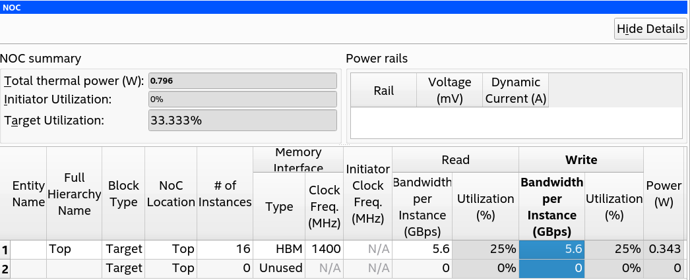

10. For initiator elements only, use Initiator Clock Freq. (MHz) column to enter the
clock frequency that the user interface for these initiators operates. If different
initiators operate at different frequencies, you must specify each frequency on a
separate row.
11. For both initiator and target elements, use the Read and Write Bandwidth per
Instance (GBps) columns to specify total read and write bandwidth for each
element. If an initiator connects to multiple targets, enter the total of the
bandwidth requirements for the connections from that initiator to all targets.
Similarly, if a target connects multiple initiators, enter the total of the bandwidth
requirements for the connections from all initiators to that target. This entry is for
the read or write bandwidth per instance and expressed in GBps. The Utilization
(%) displays the bandwidth utilization for each initiator or target. You must
specify Initiator or target elements with different bandwidth requirements on
separate rows.
12. For switch networks only, enter information in the Switch Utilization columns to
describe the switch network:
- 
Span Factor is a measure of how many clock sectors each switch network
spans. Enter an integer up to seven for the top-edge switch network, or up to
eight for the bottom-edge switch network. The UIB segment described in NoC
Segments spans three clock sectors. The GPIO-B and SDM segments span
one clock sector each.
- 
Read Factor and Write Factor indicate the volume of read and write traffic
in each switch network. Enter floating point values between zero (no traffic)
and five (full utilization).
13. Optionally specify a User Comment in the text field that later appears in the
results report.
14. NoC initiators that have AXI4 read data widths greater than or equal to 512 bits
use the fabric NoC to return read data via M20K memory blocks. For each initiator
that has an AXI4 read data width greater than or equal to 512 bits, follow these
steps to enter M20K memory block information:
a.
Click the RAM page.
b.
Create an entry in the table with the RAM Type set to M20K and # of
Instances set to 16.
c.
Set the Vertical Network to Top or Bottom, based on the hard memory NoC
that connects to the initiator. The Vertical Network Column specifies which
column of M20K memory blocks the Fabric NoC is in. Make this column value
unique for each initiator on the same edge of the device.
d.
Set the Starting eSRAM ID/Vertical Network Column to the X coordinate
of the M20K column the fabric NoC is placed in. If there is no assigned location
yet, select [Auto].
e.
Set the Data Width to 40 and the RAM Depth to 512.(1) With the Vertical
Network set to Top or Bottom, the RAM Mode automatically sets to Simple
Dual Port. The parameters for Port A are based on the NoC operation that
runs at 700 MHz in -1 and -2 speed grade devices, and at 500 MHz in -3 speed
grade devices. The parameters for Port B are based on the AXI4 clock for the
read interface of the initiator. The parameters for the Vertical Network Port
set according to the expected traffic from the HBM2e or external memory.
(1) The is the width and depth of the M20Ks making up the fabric NoC.
7. NoC Power Estimation
Agilex™ 7 M-Series FPGA Network-on-Chip (NoC) User Guide
Send Feedback
88

Note:
In addition to estimating power for the hard memory NoC and the optional fabric NoC
extension, you also need to estimate power for any HBM2e FPGA IP or External
Memory Interface (EMIF) IP, as well as any other logic or IP in your design.
7. NoC Power Estimation
Send Feedback
Agilex™ 7 M-Series FPGA Network-on-Chip (NoC) User Guide
89

8. Hard Memory NoC IP Reference
This chapter provides interface, signal, and parameter information for the NoC
Initiator Intel FPGA IP and the NoC Clock Control Intel FPGA IP. The targets for the
hard memory NoC in Agilex 7 M-Series FPGAs are part of the High Bandwidth Memory
(HBM2E) Interface Agilex 7 FPGA IP or the External Memory Interfaces (EMIF) IP.
For information on NoC targets in the High Bandwidth Memory (HBM2E) Interface
Agilex 7 FPGA IP, refer to the High Bandwidth Memory (HBM2E) Interface Agilex 7 M-
Series FPGA IP User Guide.
For information on NoC targets in external memory interfaces, refer to the External
Memory Interfaces Agilex 7 M-Series FPGA IP User Guide.
Related Information
- 
High Bandwidth Memory (HBM2E) Interface Agilex 7 M-Series FPGA IP User Guide
- 
External Memory Interfaces Agilex 7 M-Series FPGA IP User Guide
8.1. NoC Initiator Intel FPGA IP
You use the NoC Initiator Intel FPGA IP to configure AXI4 or AXI4 Lite interfaces
between AXI4 managers in your logic and the hard memory NoC. During compilation,
the Fitter maps these interfaces to NoC initiator bridges in the hard memory NoC.
Access the NoC Initiator Intel FPGA IP in the IP Catalog by expanding the Intel FPGA
Interconnect category, and then expanding the NoC subcategory.
8.1.1. NoC Initiator Intel FPGA IP Parameters
The following parameters are available in the NoC Initiator Intel FPGA IP parameter
editor:
Table 14.
Parameters for NoC Initiator Intel FPGA IP
Parameter
Description
Per-interface clock and reset
signals for AXI4 and AXI4 Lite
interfaces
If enabled, each top-level AXI4 or AXI4 Lite interface has its own aclk and
aresetn signal. Otherwise, there is a single clock and reset that all AXI4
interfaces share, and another clock and reset that all AXI4 Lite interfaces share.
Number of AXI4 interfaces
Specifies the number of AXI4 interfaces. Each AXI4 interface is associated with
its own physical NoC initiator bridge.
AXI4 Data Mode
The data mode of the AXI4 interface controls the width of the read and write
data and user signals. When you select options with a read data width of 512 or
576 bits, vertical fabric NoC networks deliver read response data deep into the
fabric. AXI4 data signal widths are always a power of two. When you select
288- or 576-bit widths, the WUSER and RUSER signals carry the extra bits.
continued...
© Altera Corporation. Altera, the Altera logo, the ‘a’ logo, and other Altera marks are trademarks of Altera Corporation. Altera
reserves the right to make changes to any products and services at any time without notice. Altera assumes no responsibility or
liability arising out of the application or use of any information, product, or service described herein except as expressly agreed
to in writing by Altera. Altera customers are advised to obtain the latest version of device specifications before relying on any
published information and before placing orders for products or services.
*Other names and brands may be claimed as the property of others.

Parameter
Description
AXI4 interface handshaking
You can choose how the IP implements the standard AXI handshake where data
transfer occurs when you assert READY and VALID. The default implementation
includes pipelining registers that may improve fMAX. There is also a low-area
implementation available without these pipelining registers.
Clock(s) of wide read and write AXI
channels are independent from the
NoC initiator hardware clock
When you select both read and write data widths of >= 512 bits, you can also
choose to drive the wide interfaces with a clock that is independent from the
clock supplied to the 256b NoC initiator hardware. Use this option for best
system-level performance.
Number of AXI4 Lite interfaces
Sets the number of AXI4 Lite interfaces associated with the first physical NoC
initiator. Use AXI4 Lite interfaces to access control and status registers of
peripherals on the hard memory NoC. You can only configure the NoC Initiator
Intel FPGA IP to expose AXI4 Lite interfaces when the configured AXI4
interfaces are less than or equal to 256 bits in width (or when the AXI4
interface is unused).
NoC QoS Mode
Specifies whether hard memory NoC Quality of Service traffic originating from
this NoC Initiator Intel FPGA IP is driven by AXI QoS signals, is generated by
the hard memory NoC initiator hardware (NOC Bridge generated), or uses
bandwidth and transaction limiters (Limiters).
NoC bridge generated Read Priority
If you select the QoS mode of NOC Bridge generated, select the read priority
level for the hard memory NoC initiator QoS Generator. When priority level is 0,
read traffic originated by this initiator has the lowest priority on the NoC.
Priority level 3 traffic has the highest priority in the hard memory NoC.
NoC bridge generated Write Priority
If you select the QoS mode of NOC Bridge generated, select the write priority
level for the hard memory NoC initiator QoS Generator. When priority level is 0,
write traffic originated by this initiator has the lowest priority on the NoC.
Priority level 3 traffic has the highest priority in the hard memory NoC.
Bandwidth Limiter
If you select the QoS mode of Limiters, specify the percentage of the initiator’s
full bandwidth for the initiator to use. Select values between 40% and 100%.
Default is 100%.
Read Transaction Limiter
If you select the QoS mode of Limiters, specify the number of outstanding read
transactions for the initiator to allow. Enter whole numbers between 1 and 128.
Default is 128.
Write Transaction Limiter
If you select the QoS mode of Limiters, specify the number of outstanding write
transactions for the initiator to allow. Enter whole numbers between 1 and 64.
Default is 64.
8. Hard Memory NoC IP Reference
Send Feedback
Agilex™ 7 M-Series FPGA Network-on-Chip (NoC) User Guide
91

Figure 57.
Parameter Editor for NoC Initiator Intel FPGA IP (256 Bit)
Figure 58.
Parameter Editor for NoC Initiator Intel FPGA IP (512 Bit)
Note:
Quartus Prime software assignments (such as placement) for NoC initiators may refer
to hierarchical names within the IP. If you reconfigure and regenerate NoC initiators in
your design, verify that these assignments remain valid and update if necessary.
8.1.2. NoC Initiator Intel FPGA IP Interfaces
This section describes the interfaces on the NoC Initiator Intel FPGA IP for the AXI4 or
AXI4 Lite interfaces to AXI4 managers in your logic. Connections between the NoC
Initiator Intel FPGA IP and the hard memory NoC are not modeled in RTL. Rather, you
specify these connections by making assignments in the NoC Assignment Editor. For
more information about making these assignments, refer to Making NoC Assignments.
8. Hard Memory NoC IP Reference
Agilex™ 7 M-Series FPGA Network-on-Chip (NoC) User Guide
Send Feedback
92

### Figures from page 92

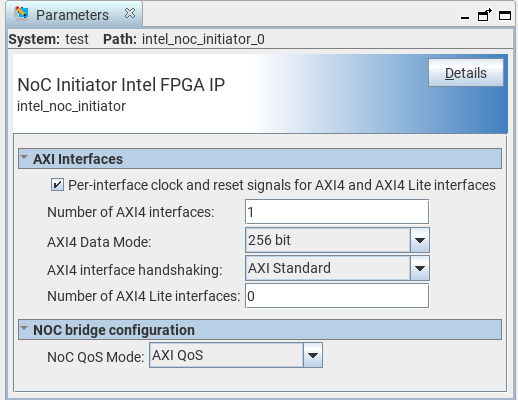
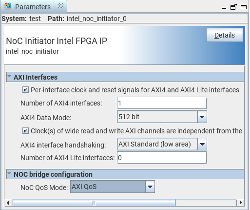

8.1.2.1. NoC Initiator Intel FPGA IP AXI4/AXI4-Lite Interfaces
The interfaces that the NoC Initiator Intel FPGA IP can expose depend on the
configuration that you select. You can expose the following interfaces:
Table 15.
Interfaces for NoC Initiator Intel FPGA IP
Interface
Number
Details
AXI4
0-23
These interfaces follow the AMBA AXI4 protocol specification. The NoC Initiator
Intel FPGA IP exposes these interfaces when the Number of AXI4 interfaces
is non-zero and the AXI4 Data Mode specifies equal read and write widths.
The Number of AXI4 interfaces parameter determines the number of AXI4
interfaces that you expose.
Each such interface uses the s<x>_axi4_ prefix for all signals, where x ranges
from 0 to N-1, with N being the number of AXI4 interfaces.
AXI4 Read-only
0-23
These interfaces follow the AMBA AXI4 protocol specification but only include
the AR and R channels. The NoC Initiator Intel FPGA IP exposes these interfaces
when the Number of AXI4 interfaces is non-zero and the AXI4 Data Mode
specifies unequal read and write widths.
The Number of AXI4 interfaces parameter determines the number of AXI4
read-only interfaces that you expose.
Each such interface uses the s<x>_ro_axi4_ prefix for all signals, where x
ranges from 0 to N-1, with N being the number of AXI4 interfaces.
AXI4 Write-only
0-23
These interfaces follow the AMBA AXI4 protocol specification but only include
the AW, W, and B channels. The NoC Initiator Intel FPGA IP exposes these
interfaces when the Number of AXI4 interfaces is non-zero the AXI4 Data
Mode specifies unequal read and write widths.
The Number of AXI4 interfaces parameter determines the number of write-
only AXI4 interfaces that you expose.
Each such interface uses the s<x>_wo_axi4_ prefix for all its signals, where x
ranges from 0 to N-1, with N being the number of AXI4 interfaces.
0-4
These interfaces follow the AMBA protocol specification. The NoC Initiator Intel
FPGA IP exposes these interfaces when the Number of interfaces is non-zero.
The Number of interfaces determines the number of interfaces that you
expose.
Each such interface uses the s<x>_axi4lite_ prefix for all its signals, where x
ranges from 0 to N-1, with N being the number of interfaces.
8.1.2.2. NoC Initiator AXI4 User Interface Signals
This section describes the signals for the AXI4 interfaces. The AXI4 read-only and
write-only interfaces are subsets of the standard AXI4 interface. Depending on the IP
configuration, the signal prefix can be s<x>_axi4_, s<x>_ro_axi4_, or
s<x>_wo_axi4_, for example s0_axi4_awid.
AXI ID signals exposed by the NoC Initiator Intel FPGA IP are seven bits wide, unless
the NoC Initiator Intel FPGA IP is also exposing AXI4 Lite interfaces. When you
configure the NoC Initiator Intel FPGA IP to expose AXI4 Lite interfaces, AXI ID signals
on its AXI4 interfaces are six bits wide.
8. Hard Memory NoC IP Reference
Send Feedback
Agilex™ 7 M-Series FPGA Network-on-Chip (NoC) User Guide
93

Table 16.
AXI4 Write Address (AW) Command Channel
Port Name
Width
Direction
Description
<prefix>_awid
7 or 6
Input
Write transaction identification tag for the write command.
<prefix>_awaddr
44
Input
Write Address. The write address gives the address of the first
transfer in a write burst transaction.
<prefix>_awlen
8
Input
Burst Length. The burst length gives the exact number of
transfers in the AXI4 write transaction. This information
determines the number of data transfers associated with the
address. awlen is encoded as (<number of transfers> - 1).
<prefix>_awsize
3
Input
Size. This signal indicates number of bytes written by each
transfer in the burst. For write data widths of 256 bits or less,
awsize must indicate a width less than or equal to the width of
wdata.
awsize is encoded as follows:
3'b000 = 1 byte
3'b001 = 2 bytes
3'b010 = 4 bytes
3'b011 = 8 bytes
3'b100 = 16 bytes
3'b101 = 32 bytes
3'b110 = 64 bytes (512-bit initiators must drive awsize to
3'b110).
Note: If the write data width is 512 bits, this signal must have
the value 3'b110.
<prefix>_awburst
2
Input
Burst Type. The burst type and the size information determine
how to calculate the address for each transfer within the burst .
- 
2’b01 = INCR burst type
Only INCR is supported. 2'b00 = FIXED and 2'b10 = WRAP
are not supported. 2'b11 is reserved and does not decode to
anything
<prefix>_awlock
1
Input
Lock Type [reserved for future use].
- 
1’b0 = Normal access (no lock)
<prefix>_awprot
3
Input
Protection Type [reserved for future use]. This signal indicates
the privilege and security level of the transaction, and whether
the transaction is a data access or an instruction access.
- 
3’b010 = Unprivileged, non-secure data access
<prefix>_awqos
4
Input
Quality of Service. The quality of service identifier sent for each
write transaction. For the upper two bits, 3=highest, 0= lowest.
The lower two bits are ignored. Refer to Quality of Service
(QoS) Support.
<prefix>_awuser
11
Input
User signal. Refer to the High Bandwidth Memory (HBM2E)
Interface Agilex 7 M-Series FPGA IP User Guide or the External
Memory Interfaces Agilex 7 M-Series FPGA IP User Guide for
how to optionally map this signal for transactions with each IP.
Tie unused bits low. The width of this signal may change in
future releases of the IP.
<prefix>_awvalid
1
Input
Write Address Valid. This signal indicates that the host or
manager is signaling valid write address and control
information. The write address valid signal must not be
dependent on the write address ready signal.
<prefix>_awready
1
Output
Write Address Ready. This signal indicates that the subordinate
is ready to accept an address and associated control signals.
8. Hard Memory NoC IP Reference
Agilex™ 7 M-Series FPGA Network-on-Chip (NoC) User Guide
Send Feedback
94

Table 17.
AXI4 Write Data (W) Channel
Port Name
Width
Direction
Description
<prefix>_wdata
32, 64,
128, 256,
or 512
Input
Write Data. Width is determined by your selected AXI4
Data Mode.
<prefix>_wstrb
4, 8, 16,
32, or 64
Input
Write Strobes (Byte Enables). These signals indicate which
bytes of the AXI4 wdata hold valid data. There is one byte
strobe for every eight bits of write data. Write strobes are
ignored when you choose an AXI4 Data Mode that has a
288 or 576 bit wide write data path.
<prefix>_wuser_data
32 or 64
Input
Extra Write Data (AXI4 WUSER port). When you select an
AXI4 Data Mode that has a 288 or 576 bit wide write data
path, then this signal carries an additional 32 or 64 bits
over the hard memory NoC. You must configure the
targeted memory controller IP to store the additional bits.
This signal is ignored when the AXI4 Data Mode specifies
a write data width other than 288 or 576 bits.
<prefix>_wlast
1
Input
Write Last. This signal indicates the last transfer in a write
burst.
<prefix>_wvalid
1
Input
Write Valid. This signal indicates that valid write data and
accompanying strobes or user data are available. The write
address valid signal must not be dependent on the write
address ready signal.
<prefix>_wready
1
Output
Write Ready. This signal indicates that the subordinate can
accept write data.
Table 18.
AXI4 Write Response (B) Channel
Port Name
Width
Direction
Description
<prefix>_bid
7 or 6
Output
Write Response ID tag. This matches the transaction ID tag
of the original write command.
<prefix>_bresp
2
Output
Write Response. This signal indicates the status of the write
transaction.
- 
2’b00 = OKAY; memory controller indicates that normal
access is successful.
- 
2’b10 = SLVERR; memory controller indicates that the
transaction is unsuccessful.
- 
2’b11 = DECERR; hard memory NoC could not extract a
valid destination address from the address supplied in the
original write command.
- 
Note that 2’b01 = EXOKAY is not returned as
implementation does not support exclusive access.
<prefix>_bvalid
1
Output
Write Response Valid. This signal indicates that the host or
manager is signaling a valid write response.
<prefix>_bready
1
Input
Response Ready. This signal indicates that the manager can
accept a write response.
Table 19.
AXI4 Read Address (AR) command Channel
Port Name
Width
Direction
Description
<prefix>_arid
7 or 6
Input
Read transaction identification tag for the read command.
<prefix>_araddr
44
Input
Read Address. The address of the first transfer in a read
burst transaction.
continued...
8. Hard Memory NoC IP Reference
Send Feedback
Agilex™ 7 M-Series FPGA Network-on-Chip (NoC) User Guide
95

Port Name
Width
Direction
Description
<prefix>_arlen
8
Input
Burst Length. The burst length gives the exact number of
transfers in the AXI4 transaction. This information
determines the number of data transfers associated with
the address.
arlen is encoded as (<number of transfers> - 1).
<prefix>_arsize
3
Input
Size. This signal indicates the number of bytes written by
each transfer in the burst. If the read data width is 512
bits, this signal must have the value 3'b110. For read data
widths of 256 bits or less, arsize must indicate a width less
than or equal to the width of rdata. arsize is encoded as
follows:
3'b000 = 1 byte
3'b001 = 2 bytes
3'b010 = 4 bytes
3'b011 = 8 bytes
3'b100 = 16 bytes
3'b101 = 32 bytes
3'b110 = 64 bytes
<prefix>_arburst
2
Input
Burst Type. The burst type and the size information
determines how the address for each transfer within the
burst is calculated.
- 
2’b01 = INCR burst type
Only INCR is supported.
<prefix>_arlock
1
Input
Lock Type [reserved for future use].
1’b0 = Normal access (no lock)
<prefix>_arprot
3
Input
Protection Type [reserved for future use]. This signal
indicates the privilege and security level of the
transaction, and whether the transaction is a data access
or an instruction access.
3’b010 = Unprivileged, non-secure data access
<prefix>_arqos
4
Input
Quality of Service. The quality of service identifier sent for
each read transaction.
<prefix>_aruser
11
Input
User signal. Refer to the High Bandwidth Memory (HBM2E)
Interface Agilex 7 M-Series FPGA IP User Guide or the
External Memory Interfaces Agilex 7 M-Series FPGA IP
User Guide for how to optionally map this signal for
transactions with each IP. Tie unused bits low. The width
of this signal may change in future releases of the IP.
<prefix>_arvalid
1
Input
Read Address Valid. This signal indicates that the channel
is signaling valid read address and control information.
<prefix>_arready
1
Output
Read Address Ready. This signal indicates that the
subordinate is ready to accept an address and associated
control signals.
Table 20.
AXI4 Read Data (R) Channel
Port Name
Width
Direction
Description
<prefix>_rid
7 or 6
Output
Read Response ID tag. This matches the transaction ID
tag of the original read command.
<prefix>_rdata
32, 64,
128, 256,
or 512
Output
Read Data. Width is determined by the selected AXI4
Data Mode.
continued...
8. Hard Memory NoC IP Reference
Agilex™ 7 M-Series FPGA Network-on-Chip (NoC) User Guide
Send Feedback
96

Port Name
Width
Direction
Description
<prefix>_rresp
2
Output
Read Response. This signal indicates the status of the read
transfer:
- 
2’b00 = OKAY; memory controller indicates that
normal access is successful.
- 
2’b10 = SLVERR; memory controller indicates that the
transaction is unsuccessful.
- 
2’b11 = DECERR; hard memory NoC could not extract
a valid destination address from the address supplied
in the original read command.
- 
Note that 2’b01 = EXOKAY is not returned as
implementation does not support exclusive access.
<prefix>_ruser
32 0r 64
Output
When you select an AXI4 Data Mode that has a 288 or
576 bit wide read data path, then this signal carries an
additional 32 or 64 bits that are returned across the hard
memory NoC. You must configure the targeted memory
controller IP to read and return the additional bits. This
signal does not contain valid data when the AXI4 Data
Mode specifies a read data width other than 288 or 576
bits.
<prefix>_rlast
1
Output
Read Last. This signal indicates the last transfer in a read
burst.
<prefix>_rvalid
1
Output
Read Valid. The read address valid signal must not be
dependent on the read address ready signal.
<prefix>_rready
1
Input
Read Ready. This signal indicates that the manager can
accept the read data and response information.
8.1.2.3. NoC Initiator Intel FPGA IP AXI4-Lite User Interface Signals
There are three types of AXI4-Lite interfaces that you may have in your design:
1.
The NoC subsystem uses an AXI4-Lite target that you can access to read
performance monitoring registers.
2.
The HBM2e IP optionally uses an AXI4-Lite target that provides access to the
HBM2e memory controller's configuration and status registers.
3.
The EMIF IP uses a AXI4-Lite target that connects to the I/O subsystem (IOSSM)
and provides the following functionality:
- 
Through the IOSSM Mailbox, provides access to the HMC (hard memory
controller) CSRs.
- 
Through the IOSSM Mailbox, provides capability for discovery (which EMIF ID
is in the same GPIO-B bank as this IOSSM).
- 
Through the IOSSM Mailbox, provides API to read calibration diagnostic info.
- 
Through the IOSSM Mailbox, provides API to read PLL lock status.
- 
Provides direct access to (reading from or writing to) PHY registers.
The AXI4-Lite interface is primarily for relatively low-bandwidth sideband operations.
Conversely, the AXI4 interface is primarily for high-bandwidth, mainband operations.
The signals that this section describes refer to signal names that correspond to an
AXI4-Lite interface. These signals adopt the prefix s<x>_axi4lite_, for example
s0_axi4lite_awaddr.
8. Hard Memory NoC IP Reference
Send Feedback
Agilex™ 7 M-Series FPGA Network-on-Chip (NoC) User Guide
97

Table 21.
AXI4-Lite Write Address (AW) command Channel
Port Name
Width
Direction
Description
<prefix>_awaddr
44
Input
Write Address. The write address gives the address of the
first transfer in a write burst transaction.
<prefix>_awprot
3
Input
Protection Type [reserved for future use]. This signal
indicates the privilege and security level of the
transaction, and whether the transaction is a data access
or an instruction access.
3’b0101 = Unprivileged, non-secure data access
<prefix>_awvalid
1
Input
Write Address Valid. This signal indicates that the manager
is signaling valid write address and control information.
The write address valid signal must not be dependent on
the write address ready signal.
<prefix>_awready
1
Output
Write Address Ready. This signal indicates that the
subordinate is ready to accept an address and associated
control signals.
Table 22.
AXI4-Lite Write Data (W) Channel
Port Name
Width
Direction
Description
<prefix>_wdata
32
Input
Write Data.
<prefix>_wstrb
4
Input
Write Strobes (Byte Enables). These signals indicate which
bytes of the AXI4-Lite wdata signal hold valid data. There
is one byte strobe for every eight bits of write data.
<prefix>_wvalid
1
Input
Write Valid. This signal indicates that valid write data and
write strobes are available. The write address valid
signal must not be dependent on the write address ready
signal.
<prefix>_wready
1
Output
Write Ready. This signal indicates that the subordinate can
accept write data.
Table 23.
AXI4-Lite Write Response (B) Channel
Port Name
Width
Direction
Description
<prefix>_bresp
2
Output
Write Response. This signal indicates the status of the
write transaction.
- 
2’b00 = OKAY; memory controller indicates that
normal access is successful.
- 
2’b10 = SLVERR; memory controller indicates that the
transaction is unsuccessful.
- 
2’b11 = DECERR; hard memory NoC could not extract
a valid destination address from the address supplied
in the original write command.
- 
Note that 2’b01 = EXOKAY is not returned as
implementation does not support exclusive access.
<prefix>_bvalid
1
Output
Write Response Valid. This signal indicates that the host or
manager is signaling a valid write response.
<prefix>_bready
1
Input
Response Ready. This signal indicates that the manager
can accept a write response.
8. Hard Memory NoC IP Reference
Agilex™ 7 M-Series FPGA Network-on-Chip (NoC) User Guide
Send Feedback
98

Table 24.
AXI4-Lite Read Address (AR) command Channel
Port Name
Width
Direction
Description
<prefix>_araddr
44
Input
Read Address. The read address gives the address of the
first transfer in a read burst transaction.
<prefix>_arprot
3
Input
Protection Type [reserved for future use]. This signal
indicates the privilege and security level of the
transaction, and whether the transaction is a data access
or an instruction access.
3’b010 = Unprivileged, non-secure data access
<prefix>_arvalid
1
Input
Read Address Valid. This signal indicates that the host or
manager is signaling valid write address and control
information. The read address valid signal must not be
dependent on the read address ready signal.
<prefix>_arready
1
Output
Read Address Ready. This signal indicates that the
subordinate is ready to accept an address and associated
control signals.
Table 25.
AXI4-Lite Read Data (R) Channel
Port Name
Width
Direction
Description
<prefix>_rdata
32
Output
Read Data.
<prefix>_rresp
2
Output
Read Response. This signal indicates the status of the read
transfer:
- 
2’b00 = OKAY; memory controller indicates that
normal access is successful.
- 
2’b10 = SLVERR; memory controller indicates that the
transaction is unsuccessful.
- 
2’b11 = DECERR; hard memory NoC could not extract
a valid destination address from the address supplied
in the original read command.
- 
Note that 2’b01 = EXOKAY is not returned as
implementation does not support exclusive access.
<prefix>_rvalid
1
Output
Read Valid. This signal indicates that the subordinate is
signaling the required read data.
<prefix>_rready
1
Input
Read Ready. This signal indicates that the manager can
accept the read data and response information.
8.1.2.4. NoC Initiator Intel FPGA IP Clock and Reset Signals
Clock and reset signals are separate for AXI4 and AXI4 Lite interfaces. Additionally, if
you configure the IP with the unequal read and write widths, the clock and reset
signals are separate for the AXI4 read-only and AXI4 write-only interfaces. When you
choose an AXI4 Data Mode that is 512 or 576 bits wide, and also enable a separate
clock for the NoC initiator hardware, the NoC Initiator Intel FPGA IP exposes an input
named noc_bridge_fabric_clk. For guidance choosing appropriate clock
frequencies, refer to Planning NoC and Memory Solution Clocks in AN 1003: Planning
NoC and Memory Solution Clocks.
Depending on IP configuration, prefixes may be s_axi4_, s_ro_axi4_,
s_wo_axi4_, or s_axi4lite_. If you configure the IP for separate clock and reset
signals for each interface, prefixes may be s<x>_woaxi4_aclk,
s<x>_ro_axi4_aclk, s<x>_wo_axi4_, or s<x>_axi4lite_.
8. Hard Memory NoC IP Reference
Send Feedback
Agilex™ 7 M-Series FPGA Network-on-Chip (NoC) User Guide
99

Related Information
AN 1003: Multi Memory IP System Resource Planning for Agilex 7 M-Series FPGAs
8.1.2.5. NoC Initiator IP Platform Designer-Only Signals
In the Platform Designer view of the NoC Initiator Intel FPGA IP, there are additional
AXI4 NoC manager port(s), one for each AXI4 or AXI4 Lite interface. If you are using
the early RTL simulation flow, you can connect this port to an AXI4 NoC subordinate
port to specify an initiator-to-target connection in the Platform Designer System
View tab.
Platform Designer uses this initiator-to-target connection when generating the
simulation registration include file. You can locate AXI4 NoC subordinate ports in IP
containing NoC targets, such as the High Bandwidth Memory (HBM2E) Interface Agilex
7 FPGA IP, or the External Memory Interfaces (EMIF) IP. For more information on the
early RTL simulation flow, refer to Simulating NoC Designs. If you are not using the
early RTL simulation flow, you can leave the AXI4 NoC manager ports unconnected in
Platform Designer. Regardless of whether you connect the AXI4 NoC manager ports in
Platform Designer, the generated HDL for your system does not show the AXI4 NoC
manager port on the NoC Initiator Intel FPGA IP.
If you are designing your NoC system in RTL, the NoC Initiator Intel FPGA IP does not
have an AXI4 NoC manager port.
8.2. NoC Clock Control Intel FPGA IP
You use the NoC Clock Control Intel FPGA IP to insert the NoC PLL and NoC SSM. You
must provide one NoC Clock Control Intel FPGA IP instance for the hard memory NoC
running along the top edge of the die. You must also provide a second NoC Clock
Control Intel FPGA IP instance for the hard memory NoC along the bottom of the die.
Access the NoC Clock Control Intel FPGA IP in the IP Catalog by expanding the Intel
FPGA Interconnect category and then expanding the NoC subcategory.
8.2.1. NoC Clock Control Intel FPGA IP Parameters
Figure 59. Parameter Editor for NoC Clock Control Intel FPGA IP shows the parameter
editor for the NoC Initiator Intel FPGA IP.
Figure 59.
Parameter Editor for NoC Clock Control Intel FPGA IP
8. Hard Memory NoC IP Reference
Agilex™ 7 M-Series FPGA Network-on-Chip (NoC) User Guide
Send Feedback
100

### Figures from page 100

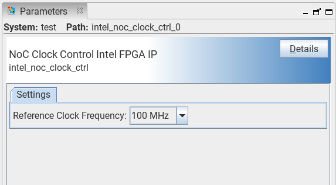

The following parameter is available:
Table 26.
Parameters for NoC Clock Control Intel FPGA IP
Parameter
Description
Reference Clock Frequency
Specifies the reference clock frequency for the NoC PLL. Supported values are:
- 
25 MHz
- 
100 MHz
- 
125 MHz
8.2.2. NoC Clock Control Intel FPGA IP Interfaces
Interfaces for NoC Clock Control FPGA IP describes the interfaces on the NoC Clock
Control Intel FPGA IP. There are no RTL connections between the NoC Clock Control
Intel FPGA IP and the hard memory NoC. Rather, you specify these connections using
assignments in the NoC Assignment Editor, as Making NoC Assignments describes.
Table 27.
Interfaces for NoC Clock Control FPGA IP
Port Name
Width
Direction
Description
refclk
1
Input
1.8-V single-ended reference clock for NoC PLL
pll_lock_o
1
Output
Lock signal for NoC PLL
8.2.3. NoC Clock Control Intel FPGA IP Platform Designer-only Signals
In the Platform Designer view of the NoC Clock Control Intel FPGA IP, there is an
additional AXI4 NoC subordinate port. If you are using the early RTL simulation flow,
you can connect this port to an AXI4 NoC manager port to specify an initiator-to-
target connection in the Platform Designer System View tab. Platform Designer uses
this connection when generating the simulation registration include file. You can now
locate AXI4 NoC manager ports in the NoC Initiator Intel FPGA IP. For more
information on the early RTL simulation flow, refer to Simulating NoC Designs.
If you are not using the early RTL simulation flow, you can leave the AXI4 NoC
subordinate port unconnected in Platform Designer. Regardless of whether you
connect the AXI4 NoC subordinate port in Platform Designer, the generated HDL for
your system does not show the AXI4 NoC subordinate port on the NoC Clock Control
Intel FPGA IP.
If you are designing your NoC system in RTL, the NoC Clock Control Intel FPGA IP
does not have an AXI4 NoC subordinate port.
8. Hard Memory NoC IP Reference
Send Feedback
Agilex™ 7 M-Series FPGA Network-on-Chip (NoC) User Guide
101

9. Document Revision History of Agilex 7 M-Series FPGA
Network-on-Chip (NoC) User Guide
Document Version
Quartus Prime
Version
Changes
2025.07.14
25.1.1
- 
Enhanced definition of refclk in NoC Clock Control Intel FPGA IP
Interfaces topic.
- 
Revised port descriptions in NoC Initiator AXI4 User Interface
Signals topic.
- 
Revised port descriptions in NoC Initiator AXI4-Lite User Interface
Signals topic.
2025.03.31
25.1
- 
Applied Altera® rebranding throughout.
- 
Revised Simulating NoC Designs topic for change to the accurate
simulation model that now supports the Fabric NoC option.
- 
Revised Using the Accurate NoC Simulation Model topic for change
to the accurate simulation model that now supports the Fabric
NoC option.
- 
Enhanced explanation in NoC Power Estimation topic.
- 
Revised steps in Using the Power and Thermal Calculator to
Estimate NoC Power topic.
2025.01.27
24.3.1
- 
Added note about bandwidth and transaction limitation settings to
Quality of Service (QoS) Support topic.
- 
Added new Options for Managing NoC Bandwidth topic.
- 
Added QoS Mode parameter descriptions to NoC Initiators for
Fabric AXI4 Managers topic.
- 
Updated Simulating NoC Designs section for introduction of cycle
accurate NoC Simulation model.
- 
Revised NoC Initiator Intel FPGA IP Parameters topic for
bandwidth and transaction limitation settings.
2024.09.30
24.3
- 
Updated Making NoC Physical Assignments Using Interface
Planner topic for visualization of links and switches.
- 
Updated Recommended Placement Order for NoC Elements in
Interface Planner topic for visualization of links and switches.
- 
Updated NoC Performance Reports in Interface Planner topic for
Show NoC Congestion and visualization of the horizontal link
congestion.
- 
Added note to NoC Initiators for Fabric AXI4 Managers about
verifying assignments with hierarchical names within the IP.
- 
Added note to NoC Initiator Intel FPGA IP Parameters topic about
verifying assignments with hierarchical names within the IP.
- 
Revised Using Interface Planner step 8.
- 
Updated Hard Memory NoC Locations in Interface Planner for
latest locations.
continued...
© Altera Corporation. Altera, the Altera logo, the ‘a’ logo, and other Altera marks are trademarks of Altera Corporation. Altera
reserves the right to make changes to any products and services at any time without notice. Altera assumes no responsibility or
liability arising out of the application or use of any information, product, or service described herein except as expressly agreed
to in writing by Altera. Altera customers are advised to obtain the latest version of device specifications before relying on any
published information and before placing orders for products or services.
*Other names and brands may be claimed as the property of others.

Document Version
Quartus Prime
Version
Changes
2024.08.05
24.2
- 
Showed user inaccessible AXI4 Lite targets in NoC UIB Segment
diagram.
- 
Revised signal direction in NoC Initiators With and Without Fabric
NoC diagram.
- 
Added notations about AXI4 Lite user non-accessible signals to
Hard Memory NoC Locations in Interface Planner topic.
- 
Revised horizontal link allocation diagrams in Horizontal
Bandwidth Considerations topic.
2023.12.04
23.4
- 
Updated Terminology for Agilex 7 M-Series FPGAs topic.
- 
Added initiator and target numbering to diagrams in Horizontal
Bandwidth Considerations topic.
- 
Added Troubleshooting NoC Assignment Editor topic.
- 
Updated screenshot in Compiling the NoC Design topic for latest
Compilation Dashboard.
- 
Added links to AN 1003: Multi Memory IP System Resource
Planning for Agilex 7 M-Series FPGAs and other cross referencing
enhancements throughout.
2023.10.12
23.3
- 
Removed footnote indicting that the current version of software
restricts device support for Agilex 7 M-series FPGAs and SoCs.
- 
Updated Using NoC Example Designs topic to mention default
read and write bandwidth settings.
- 
Updated NoC Clock Control topic to mention AXI4 Lite targets in
the High Bandwidth Memory (HBM2e) Interface Intel Agilex 7
FPGA IP and the External Memory Interfaces (EMIF) IP.
- 
Revised Connecting NoC IP and Assigning Base Addresses in the
Platform Designer Connection Flow topic to mention HPS AXI4.
- 
Revised Connecting NoC IP and Assigning Base Addresses in the
NoC Assignment Editor Connection Flow topic to mention HPS
AXI4.
- 
Revised Connectivity Guidelines: NoC Initiators for Fabric AXI4
Managers topic to mention Assign Base Addresses function.
- 
Revised Connectivity Guidelines: NoC Targets for Fabric AXI4
Managers topic to mention Assign Base Addresses function.
- 
Revised Connectivity Guidelines: NoC Clock Control topic to
mention Assign Base Addresses function.
- 
Revised Connectivity Guidelines: NoC Initiators for HPS topic to
mention Assign Base Addresses function.
- 
Revised Connectivity Guidelines: NoC Targets for HPS topic to
mention Assign Base Addresses function.
- 
Revised Step 2: Make Connection Assignments in the NoC
Assignment Editor topic to describe the <Ungrouped> subtab.
- 
Revised Step 3: Make Attribute Assignments in the NoC
Assignment Editor topic to mention the <Ungrouped> subtab and
Assign Base Addresses.
- 
Added new NoC Connection and Addressing Examples section.
- 
Revised Simulating NoC Designs topic to describe initiator-to-
target-connections by registration function calls.
2023.07.05
23.2
- 
Updated throughout to reflect support for Platform Designer
connection flow and NoC Assignment Editor connection flow.
- 
Updated throughout to reflect HPS-EMIF IP support.
- 
Added new NoC Switch and Link Detail topic.
- 
Updated NoC Design Flow Options topic for latest flows and
comparison table.
- 
Added new NoC Initiators for Hard Processor Systems topic.
- 
Added new NoC Targets for Hard Processor Systems topic.
- 
Added new NoC Initiators for Fabric AXI4 Managers topic.
continued...
9. Document Revision History of Agilex 7 M-Series FPGA Network-on-Chip (NoC) User Guide
Send Feedback
Agilex™ 7 M-Series FPGA Network-on-Chip (NoC) User Guide
103

Document Version
Quartus Prime
Version
Changes
- 
Added new NoC Targets for Fabric AXI4 Managers topic.
- 
Added new Connecting NoC IP and Assigning Base Addresses in
the Platform Designer Connection Flow topic.
- 
Added new Connecting NoC IP and Assigning Base Addresses in
the NoC Assignment Editor Connection Flow topic.
- 
Revised Connectivity Guidelines: NoC Initiators for Fabric AXI4
Managers topic.
- 
Revised Connectivity Guidelines: NoC Targets for Fabric AXI4
Managers topic.
- 
Added new Connectivity Guidelines: NoC Initiators for HPS topic.
- 
Added new Connectivity Guidelines: NoC Targets for HPS
2023.05.22
23.1
Initial document release.
9. Document Revision History of Agilex 7 M-Series FPGA Network-on-Chip (NoC) User Guide
Agilex™ 7 M-Series FPGA Network-on-Chip (NoC) User Guide
Send Feedback
104
