# Altera document: High Bandwidth Memory (HBM2E) Interface Agilex 7 M-Series FPGA IP User Guide

Source PDF: `ug-773264_D632290_25.1.pdf`
Pages: 64
Figures extracted: yes

## High Bandwidth Memory (HBM2E) Interface Agilex 7 M-Series FPGA IP User Guide  *(p.1-64)*

Explore more resources
Altera® Design Hub
High Bandwidth Memory (HBM2E)
Interface Agilex 7 M-Series FPGA IP
User Guide
Updated for Quartus® Prime Design Suite: 25.1.1
IP Version: 9.0.0
Online Version
Send Feedback
773264
2026.02.05

Contents
1. About the High Bandwidth Memory (HBM2E) Interface Agilex™ 7 FPGA IP User
Guide......................................................................................................................... 4
1.1. Release Information...............................................................................................4
2. Introduction to High Bandwidth Memory........................................................................ 5
2.1. HBM2E in Agilex 7 M-Series Devices.........................................................................5
2.2. HBM2E DRAM Structure..........................................................................................6
2.3. Agilex 7 HBM2E Features........................................................................................ 6
2.4. Agilex 7 M-Series HBM2E Controller Features............................................................ 7
2.5. Agilex 7 M-Series FPGA HBM2E IP Device Family Support............................................8
3. Agilex 7 M-Series HBM2E Architecture............................................................................ 9
3.1. Agilex 7 M-Series HBM2E Introduction......................................................................9
3.2. Agilex 7 M-Series Hard Memory NoC Subsystem........................................................ 9
3.3. Address Mapping of the HBM2E Targets...................................................................10
3.4. Agilex 7 M-Series UIB Architecture......................................................................... 11
3.5. Agilex 7 M-Series HBM2E Controller Architecture......................................................14
3.5.1. Agilex 7 M-Series HBM2E Controller Details................................................. 15
4. Creating and Parameterizing the High Bandwidth Memory (HBM2E) Interface
FPGA IP................................................................................................................... 19
4.1. Creating an Quartus Prime Pro Edition Project for High Bandwidth Memory
(HBM2E) Interface FPGA IP................................................................................ 19
4.2. Parameterizing the High Bandwidth Memory (HBM2E) Interface FPGA IP..................... 20
4.2.1. General Parameters for High Bandwidth Memory (HBM2E) Interface FPGA IP... 20
4.2.2. Example Design Parameters for High Bandwidth Memory (HBM2E)
Interface FPGA IP.....................................................................................25
4.2.3. Modifying Your Pin Assignments to Choose the Physical Location of the
HBM2E Device......................................................................................... 30
5. High Bandwidth Memory (HBM2E) Interface FPGA IP Interface....................................32
5.1. High Bandwidth Memory (HBM2E) Interface FPGA IP High Level Block Diagram............ 32
5.2. High Bandwidth Memory (HBM2E) Interface FPGA IP Controller Interface Signals..........32
5.2.1. Reset, Clock, and Calibration Status Signals................................................ 33
5.2.2. Requirement and Timing of the hbm_reset_n Signal..................................... 33
5.2.3. "Do not connect" Signals...........................................................................34
5.2.4. Asynchronous HBM2E Controller Signals......................................................35
5.2.5. AXI4 Interface Signals.............................................................................. 36
5.2.6. AXI4-Lite Interface...................................................................................41
5.3. User AXI Interface Timing..................................................................................... 43
5.3.1. AXI Write Transaction............................................................................... 45
5.3.2. AXI Read Transaction................................................................................46
5.4. Platform Designer-Only Interface........................................................................... 47
5.5. User Accesses to the HBM2E Controller...................................................................48
5.5.1. Initialization Control Register and Initialization Status Register ......................48
5.5.2. Thermal Status Register............................................................................49
5.5.3. ECC Error Counters Register......................................................................49
5.5.4. Error Login Registers................................................................................ 50
Contents
High Bandwidth Memory (HBM2E) Interface Agilex 7 M-Series FPGA IP User
Guide
Send Feedback
2

5.5.5. Error Injection Registers........................................................................... 51
6. High Bandwidth Memory (HBM2E) Interface FPGA IP Performance.............................. 53
6.1. High Bandwidth Memory (HBM2E) Interface FPGA IP Controller Performance................53
6.1.1. High Bandwidth Memory (HBM2E) DRAM Bandwidth..................................... 53
6.1.2. High Bandwidth Memory (HBM2E) Interface FPGA IP Efficiency...................... 53
6.1.3. High Bandwidth Memory (HBM2E) Interface FPGA IP Latency.........................54
6.1.4. High Bandwidth Memory (HBM2E) Interface FPGA IP Timing.......................... 55
6.2. High Bandwidth Memory (HBM2E) Interface FPGA IP System Performance...................55
7. Debugging the High Bandwidth Memory (HBM2E) Interface FPGA IP........................... 57
7.1. Debugging Guidelines for High Bandwidth Memory (HBM2E) Interface FPGA IP.............57
8. Document Revision History for High Bandwidth Memory (HBM2E) Interface FPGA
IP User Guide.......................................................................................................... 58
A. High Bandwidth Memory (HBM2E) Interface FPGA IP Quartus Prime Software Flow.... 60
A.1. Initiators Placement Recommendations...................................................................60
A.2. Simulating HBM2E User Designs............................................................................ 63
Contents
Send Feedback
High Bandwidth Memory (HBM2E) Interface Agilex 7 M-Series FPGA IP User
Guide
3

1. About the High Bandwidth Memory (HBM2E) Interface
Agilex™ 7 FPGA IP User Guide
1.1. Release Information
IP versions are the same as the Quartus® Prime Design Suite software versions up to
v19.1. From Quartus Prime Design Suite software version 19.2 or later, IP cores have
a new IP versioning scheme.
The IP version (X.Y.Z) number may change from one Quartus Prime software version
to another. A change in:
- 
X indicates a major revision of the IP. If you update your Quartus Prime software,
you must regenerate the IP.
- 
Y indicates the IP includes new features. Regenerate your IP to include these new
features.
- 
Z indicates the IP includes minor changes. Regenerate your IP to include these
changes.
Table 1.
Item
Description
IP Version
9.0.0
Quartus Prime
25.1.1
Release Date
2025.08.11
Note:
This documentation is preliminary and subject to change.
Related Information
- 
High Bandwidth Memory (HBM2E) Interfaces Agilex 7 M-Series FPGA IP Design
Example User Guide
Describes the Agilex™ 7 M-Series HBM2E architecture and how to create,
parameterize, simulate, and optimize the HBM2E IP for performance and
efficiency.
- 
High Bandwidth Memory (HBM2E) Interfaces Agilex 7 M-Series FPGA IP Release
Notes
Release notes for the Agilex™ 7 M-Series HBM2E IP.
© Altera Corporation. Altera, the Altera logo, the ‘a’ logo, and other Altera marks are trademarks of Altera Corporation. Altera
reserves the right to make changes to any products and services at any time without notice. Altera assumes no responsibility or
liability arising out of the application or use of any information, product, or service described herein except as expressly agreed
to in writing by Altera. Altera customers are advised to obtain the latest version of device specifications before relying on any
published information and before placing orders for products or services.
*Other names and brands may be claimed as the property of others.

2. Introduction to High Bandwidth Memory
High Bandwidth Memory (HBM) is a JEDEC specification (JESD-235) for a wide, high
bandwidth memory device. The next generation of High Bandwidth Memory, HBM2E, is
defined in JEDEC specification JESD-235C. The HBM2E implementation in Agilex™ 7 M-
Series devices complies with JESD-235C.
The High Bandwidth Memory DRAM is tightly coupled to the host die with a distributed
interface. The interface is divided into channels, each completely independent of one
another. Each memory channel interface has a 128-bit data bus, operating at DDR
data rates. Each memory channel is further divided into two pseudo-channels.
Related Information
High Bandwidth Memory (HBM2E) Interfaces Agilex 7 M-Series FPGA IP Design
Example User Guide
2.1. HBM2E in Agilex 7 M-Series Devices
Agilex 7 M-Series devices incorporate a high-performance FPGA fabric along with two
HBM2E memory DRAMs in a single package. Agilex 7 M-Series devices support up to a
maximum of two HBM2E interfaces.
Agilex 7 M-Series devices incorporate Intel’s Embedded Multi-Die Interconnect Bridge
(EMIB) technology to implement a silicon bridge between HBM2E DRAM memory and
the Universal Interface Block Subsystem (UIBSS). The UIB subsystem contains the
HBM2E controller (HBMC), physical-layer interface (PHY), and I/O ports to interface to
the HBM2E stack. The FPGA core accesses the UIB through the integrated hard
memory network-on-chip (NoC).
As illustrated in the figure below, each Agilex 7 M-Series device contains a single
universal interface bus per HBM2E interface, supporting 8 independent channels. The
HBM2E channel interface operates only in pseudo-channel mode, providing a separate
read and write command queue for each of the two pseudo-channels.
The user interface to the hard memory NoC uses the AXI4 protocol; the hard memory
NoC also communicates with the UIB using the AXI4 protocol. Each HBM2E controller
provides sixteen AXI interfaces, one AXI interface for each HBM2E pseudo-channel.
HBM2E DRAM densities of 8GB and 16GB are supported.
© Altera Corporation. Altera, the Altera logo, the ‘a’ logo, and other Altera marks are trademarks of Altera Corporation. Altera
reserves the right to make changes to any products and services at any time without notice. Altera assumes no responsibility or
liability arising out of the application or use of any information, product, or service described herein except as expressly agreed
to in writing by Altera. Altera customers are advised to obtain the latest version of device specifications before relying on any
published information and before placing orders for products or services.
*Other names and brands may be claimed as the property of others.

Figure 1.
Agilex 7 M-Series Device with Hard Memory NoC, UIB, and HBM2E DRAM
User Memory Port
User Memory Port
User Logic
Hard Memory
NoC
Agilex M FPGA
AXI4
AXI4
AXI4
AXI4
UIBSS
EMIB
HBM2e
DRAM
Channel N
Controller
Channel 0
Controller
PHY
2.2. HBM2E DRAM Structure
The HBM2E DRAM is optimized for high-bandwidth operation using a stack of multiple
DRAM devices exposing several independent interfaces called channels. Each DRAM
stack supports eight channels.
The following figure shows an example stack containing four DRAM dies, each die
supporting two channels. Each die contributes additional capacity and additional
channels to the stack, up to a maximum of eight channels per stack. Each channel
provides access to an independent set of DRAM banks. Requests from one channel
may not access data attached to a different channel.
Figure 2.
High Bandwidth Memory Stack Consisting of Four DRAM Dies
Channel 1
Channel 0
4 DRAM dies
with 2 Channels
per Die
Base “Logic Die
2.3. Agilex 7 HBM2E Features
Agilex 7 M-Series FPGAs offer the following HBM2E features.
2. Introduction to High Bandwidth Memory
High Bandwidth Memory (HBM2E) Interface Agilex 7 M-Series FPGA IP User
Guide
Send Feedback
6

- 
Supports two configurations: 4H/8GB and 8H/16GB.
- 
Transfer rate up to 3.2 GT/s for the fastest device speed grade.
- 
2GB capacity per DRAM die.
- 
Supports one to eight HBM2E channels per HBM2E interface in the Pseudo Channel
mode.
- 
Only supports pseudo-channel mode of the HBM2E specifications.
- 
Each HBM2E channel supports a 128-bit DDR data bus, with optional ECC support.
- 
Pseudo Channel mode divides each channel into two individual 64-bit I/O pseudo-
channels. The two pseudo-channels operate semi-independently; they share the
channel’s row and column command bus as well as CK and CKE inputs, but they
decode and execute commands individually. Address BA4 directs commands to
either pseudo-channel 0 (BA4 = 0) or pseudo-channel 1 (BA4 = 1), offering
unique address space to each pseudo-channel. Pseudo Channel mode requires
that the burst length for DRAM transactions is set to 4.
- 
Data referenced to strobes RDQS_t / RDQS_c and WDQS_t / WDQS_c, one strobe
pair per 32 DQs.
- 
Differential clock inputs (CK_t / CK_c). Unterminated data/address/cmd/clk
interfaces.
- 
DDR commands entered on each positive CK_t and CK_c edge. Row Activate
commands require two memory cycles; all other commands are single-cycle
commands.
- 
Supports command, write data and read data parity.
- 
Support for bank grouping.
- 
Support for data bus inversion.
- 
64-bit data per pseudo-channel. Eight additional data bits are available per
pseudo-channel; you can use these data bits for any of the following:
○
ECC. The ECC scheme implemented is single-bit error correction with double-
bit error detection (SECDEC). This includes 8 bits of ECC code (also known as
syndrome).
○
Data mask (DM). The data mask for masking write data per byte.
○
User-defined data
○
Can be left unused.
- 
I/O voltage of 1.2V and DRAM core voltage of 1.2V.
2.4. Agilex 7 M-Series HBM2E Controller Features
Agilex 7 FPGAs offer the following controller features.
- 
User applications communicate with the HBMC via the hard memory NoC using the
AXI4 Protocol.
- 
There is one AXI4 interface per HBM2E pseudo-channel. Each HBM2E interface
supports a maximum of sixteen AXI4 interfaces corresponding to the sixteen
Pseudo Channels.
- 
There are sixteen HBM controller cores, one for each pseudo-channel.
2. Introduction to High Bandwidth Memory
Send Feedback
High Bandwidth Memory (HBM2E) Interface Agilex 7 M-Series FPGA IP User
Guide
7

- 
Each AXI interface supports a 256-bit Write Data interface and a 256-bit Read
Data interface.
- 
Each AXI interface connects to a target on the hard memory NoC.
- 
The controller offers 32B and 64B access granularity, supporting HBM2E
transactions with a burst length of 4 (BL4) and transactions composed of two
successive BL4 transactions, referred to as pseudo-BL8 (pBL8).
- 
The controller offers out-of-order command scheduling.
- 
The controller refresh policy allows the controller to decide when to issue refresh
requests. Also offers two refresh modes, Advanced and Standard, for the HBM2E
memory.
- 
The controller supports access to the HBM2E channel status registers, through the
AXI4-Lite interface.
- 
The controller supports data mask or error correction code (ECC). When you do
not use data mask or ECC, you may use those bits as additional data bits.
- 
The controller supports auto-precharge and temperature-based throttling.
2.5. Agilex 7 M-Series FPGA HBM2E IP Device Family Support
Advance support — The IP core is available for simulation, compilation, and hardware
testing for this device family. Timing models include initial engineering estimates of
delays based on early post-layout information. The timing models are subject to
change as silicon testing improves the correlation between the actual silicon and the
timing models. You can use this IP core for system architecture and resource
utilization studies, simulation, pinout, system latency assessments, basic timing
assessments (pipeline budgeting), and I/O transfer strategy (data-path width, burst
depth, and I/O standards tradeoffs.)
2. Introduction to High Bandwidth Memory
High Bandwidth Memory (HBM2E) Interface Agilex 7 M-Series FPGA IP User
Guide
Send Feedback
8

3. Agilex 7 M-Series HBM2E Architecture
This chapter provides an overview of the Agilex 7 M-Series HBM2E architecture.
3.1. Agilex 7 M-Series HBM2E Introduction
Agilex 7 M-Series devices use the Intel EMIB technology to interface to the HBM2E
memory devices.
- 
The Agilex 7 FPGAs offer up to two HBM2E devices.
- 
Each HBM2E device can have a device density of 8GB or 16GB, based on the FPGA
chosen.
This system-in-package solution helps to achieve maximum bandwidth and low power
consumption in a small footprint.
3.2. Agilex 7 M-Series Hard Memory NoC Subsystem
The Agilex 7 M-series FPGAs are integrated with a hard memory network-on-chip
(NoC), which is a hardened block primarily intended to facilitate high-bandwidth data
movement from the FPGA core fabric to periphery and vice-versa.
Note:
As a prerequisite to this content, please review the first three chapters of the Agilex 7
M-Series FPGA Network-on-Chip (NoC) User Guide.
The hard memory NoC is implemented as two high-speed interconnect NoC
subsystems which run horizontally along the top and bottom edges of the die.
Each high-speed interconnect NoC subsystem consists of a PLL, a subsystem manager
(SSM), and multiple NoC segments that contain the following:
- 
Initiator – Initiator NoC Interface Unit . An AXI bridge onto the NoC. An initiator
is an AXI slave that converts AXI commands from a design in the FPGA fabric into
NoC requests and converts NoC responses back into AXI responses to the user's
design.
- 
Target – Target NoC Interface Unit . A bridge from the NoC to an AXI target in
the periphery of the FPGA device. This is a NoC target and acts as an AXI master
to the peripheral, such as a memory controller.
- 
Switch – act as routers for the requests.
M-series FPGAs include two separate high-speed interconnect NoC subsystems,
identified as top and bottom. The top and bottom NoC subsystem interfaces with UIB,
IO96B, HPS and core fabric. With the fabric NoC option, the AXI read response data is
routed into the fabric via M20K columns instead of being delivered to initiators read
data port. This reduces fabric routing utilization and improves read response data
throughput.
© Altera Corporation. Altera, the Altera logo, the ‘a’ logo, and other Altera marks are trademarks of Altera Corporation. Altera
reserves the right to make changes to any products and services at any time without notice. Altera assumes no responsibility or
liability arising out of the application or use of any information, product, or service described herein except as expressly agreed
to in writing by Altera. Altera customers are advised to obtain the latest version of device specifications before relying on any
published information and before placing orders for products or services.
*Other names and brands may be claimed as the property of others.

NoC Subsystem for HBM2E Read-Write Operations
In Agilex 7 M-series FPGAs, fabric access to the HBM2E DRAM memory is exclusively
via the hard memory NoC. Direct fabric access to and from the HBM2E DRAM is not
supported, as illustrated in Figure 1.
The HBM2E DRAM memory connects to the UIB through the EMIB. The UIB interfaces
with user logic via the integrated hardened memory NoC using the AXI4 protocol. The
hard memory NoC enables a single AXI master in the user logic to access data in
multiple pseudo-channels.
Figure 3.
Abstract Block Diagram of HBM2E IP Components
Ch6 128
Top Die 3D DRAM
Ch4 128
Ch2 128
Ch0 128
Ch7 128
Ch5 128
Ch3 128
Ch1 128
Target
Target-Lite
Channel 0 & 1 Controller
CH0PC0
CH0PC1
CH0CH1SB
CH1PC0
CH1PC1
Channel 2 & 3 Controller
CH2PC0
CH2PC1
CH2CH3SB
CH3PC0
CH3PC1
Channel 4 & 5 Controller
CH4PC0
CH4PC1
CH4CH5SB
CH5PC0
CH5PC1
Channel 6 & 7 Controller
CH6PC0
CH6PC1
CH6CH7SB
CH7PC0
CH7PC1
I/O
PHY
HBMC
High Speed Interconnect NoC
64
I/O
64
I/O
64
I/O
64
I/O
64
I/O
64
I/O
64
I/O
64
I/O
64
I/O
64
I/O
64
I/O
64
I/O
64
I/O
64
I/O
64
I/O
64
I/O
Note:
The above figure is an abstract diagram and is not intended to accurately represent
the physical layout of the related blocks.
As illustrated in Figure 1, the read and write transactions are routed from the FPGA’s
user logic to the initiators through their AXI interfaces. The initiators face the fabric
and are part of the hard memory NoC block. Initiators convert the AXI-based
transactions to the packet-based protocol used by the hard memory NoC. The
transactions are routed to their appropriate targets, through the hard memory NoC.
The targets convert the packet-based traffic back to AXI. The targets face the UIB and
connect to each of the controller's pseudo-channels. From the HBM controller channel
the transactions are transferred to the HBM2E DRAM through the PHY and I/Os.
3.3. Address Mapping of the HBM2E Targets
You must assign a base address to each target that you connect to an initiator. The
base address is a logical address that is your logic that uses that instance of the NoC
Initiator IP.
3. Agilex 7 M-Series HBM2E Architecture
High Bandwidth Memory (HBM2E) Interface Agilex 7 M-Series FPGA IP User
Guide
Send Feedback
10

Each initiator uses an independent 44-bit logical address space. The targets connected
to HBM pseudo-channels are addressed using these 44-bit logical addresses. You must
map the addresses for a given target in accordance with the following rules:
- 
Each target has a fixed address span of 1 GB, regardless of the actual pseudo-
channel capacity (512 MB for 4H and 1 GB for 8H devices). Hence, the base
addresses should be aligned to 1 GB boundaries, implying that the least significant
30-bits of the base address must always be zero.
- 
Targets must be mapped using non-overlapping address spaces.
3.4. Agilex 7 M-Series UIB Architecture
The Agilex 7 M-Series device architecture includes the universal interface bus (UIB)
subsystem (UIBSS) which contains the necessary logic to interface the HBM
controller's NoC targets to the HBM2E DRAM. The UIB subsystem is designed to be
compatible with the HBM2E DRAM standard.
Each UIB subsystem includes the HBM2E hardened controller and the universal
interface bus, consisting of the hardened physical interface and I/O logic needed to
interface to each HBM2E DRAM device. The NoC initiators and targets interface to the
core logic and HBM2E controllers using the AMBA AXI4 protocol.
The following figure shows a high-level block diagram of the UIB subsystem. The UIB
subsystem includes the following hardened blocks:
- 
HBM2E memory controller (HBMC).
- 
UIB PHY, including the UIB physical layer and I/O.
- 
A block that is responsible for initializing the UIB hardware, including configuration
of the HBMC, calibration of the HBM memory interface, and sequencing of
hardware resets.
Figure 4.
Block Diagram of Agilex 7 M-Series HBM2E Implementation
The user core clock drives the logic highlighted in green, while the UIB clocks the logic
highlighted in blue. The UIB clock also drives the HBM2E interface clock.
Channel Mapping
Each HBM2E DRAM supports eight channels, each comprising two pseudo-channels.
The table below shows the mapping from the HBM2E DRAM channels to the HBM
controller channels, from controller channels to IP GUI channel names.
3. Agilex 7 M-Series HBM2E Architecture
Send Feedback
High Bandwidth Memory (HBM2E) Interface Agilex 7 M-Series FPGA IP User
Guide
11

### Figures from page 11

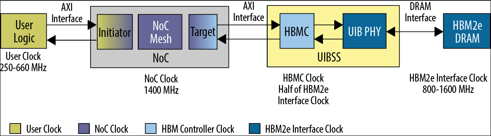

Table 2.
Channel Mapping
HBM2E IP GUI Channel
AXI4 Channel (HBMC)
HBM2E DRAM Channel
Channel 0
ch0_u0
Channel E
ch0_u1
Channel 1
ch1_u0
Channel F
ch1_u1
Channel 2
ch2_u0
Channel A
ch2_u1
Channel 3
ch3_u0
Channel B
ch3_u1
Channel 4
ch4_u0
Channel G
ch4_u1
Channel 5
ch5_u0
Channel H
ch5_u1
Channel 6
ch6_u0
Channel C
ch6_u1
Channel 7
ch7_u0
Channel D
ch7_u1
HBM2E DRAM
The following table lists the HBM2E signals that interface to the UIB. The UIB drives
the HBM2E signals and decodes the received data from the HBM2E. These signals
cannot be accessed through the AXI4 User Interface.
Table 3.
Summary of Per-channel Signals
Signal Name
Signal Width
Notes
Data
128
128 bit bidirectional DQ per channel
Column command/address
9
9-bit wide column address bits
Row command/address
7
7-bit wide row address bits
DBI
16
1 DBI per 8 DQs
DM_CB
16
1 DM per 8 DQs. You can use these
pins for DM or ECC, but not both.
PAR
4
1 parity bit per 32 DQs
DERR
4
1 data error bit per 32 DQs
Strobes
16
Separate strobes for read and write
strobes. One differential pair per 32
DQs for read and write.
Clock
2
Clocks address and command signals
CKE
1
Clock enable
AERR
1
Address error
3. Agilex 7 M-Series HBM2E Architecture
High Bandwidth Memory (HBM2E) Interface Agilex 7 M-Series FPGA IP User
Guide
Send Feedback
12

(You can see the above signals in simulation.)
The following table lists the HBM2E signals that are common to all Pseudo Channels in
each HBM2E interface.
Table 4.
Summary of Global HBM2E Signals
Signal Name
Signal Width
Notes
Reset
1
Reset input
TEMP
3
Temperature compensated refresh
output from the HBM2E device.
Note: See also the Thermal Control
section, in the Agilex 7 M-
Series HBM2E Controller Details
topic.
Cattrip
1
Catastrophic trip indication from the
HBM2E device.
Note: See also the Thermal Control
section, in the Agilex 7 M-
Series HBM2E Controller Details
topic.
The HBM2E IP for Agilex 7 M-Series devices supports only the Pseudo Channel mode
of the HBM2E specification. Pseudo Channel mode includes the following features:
- 
Pseudo-channel mode divides a single HBM2E channel into two individual
subchannels of 64 bit I/O.
- 
Both pseudo-channels share the channel’s row and column command bus, CK, and
CKE inputs, but decode and execute commands individually.
- 
Pseudo-channel mode requires an HBM burst length of 4.
- 
Address BA4 directs commands to either pseudo-channel 0 (BA4 = 0) or pseudo-
channel 1 (BA4 = 1). The HBM2E controller handles the addressing requirements
of the pseudo-channels.
- 
Power-down and self-refresh are common to both pseudo-channels, due to a
shared CKE pin. Both pseudo-channels also share the channel’s mode registers.
User AXI Interface
Each Agilex 7 M-Series HBM2E interface supports a maximum of eight HBM2E
channels. Each HBM2E channel has two AXI4 interfaces, one per Pseudo Channel.
Each AXI4 interface includes 256-bit wide Write and Read Data AXI channels. The
following figure shows the flow of data from user logic to the HBM2E DRAM through
the UIBSS, while selecting HBM2E channels 0 and 7.
3. Agilex 7 M-Series HBM2E Architecture
Send Feedback
High Bandwidth Memory (HBM2E) Interface Agilex 7 M-Series FPGA IP User
Guide
13

Figure 5.
Agilex 7 M-Series HBM2E Interface Using HBM2E Channels 0 through 7
CH0
Controller
CH1
Controller
CH2
Controller
CH3
Controller
CH4
Controller
CH5
Controller
CH6
Controller
CH7
Controller
User
Logic
AXI
Interface
NoC
Channel 7
HBM2
DRAM
CH0
PHY & I/O
CH1
PHY & I/O
CH2
PHY & I/O
CH3
PHY & I/O
CH4
PHY & I/O
CH5
PHY & I/O
CH6
PHY & I/O
CH7
PHY & I/O
AXI Master 0
AXI Master 1
AXI Master N
PC0:256 b
PC0:256 b
PC1:256 b
PC1:256 b
PC0:256 b
PC1:256 b
PC0:256 b
PC1:256 b
PC0:256 b
PC1:256 b
PC0:256 b
PC1:256 b
PC0:256 b
PC1:256 b
PC0:256 b
PC1:256 b
DQ:64
DQ:64
HBM2E
DRAM
DQ:64
DQ:64
DQ:64
DQ:64
DQ:64
DQ:64
DQ:64
DQ:64
DQ:64
DQ:64
DQ:64
DQ:64
DQ:64
DQ:64
The AXI4 protocol can handle concurrent writes and reads to the HBM2E controller.
There is also a sideband user port per user channel pair, compliant to AXI4-Lite. The
sideband provides access to user-controlled features such as ECC status, Power Down
status, HBM2E temperature readout, calibration status, and User Interrupt
configuration and status.
3.5. Agilex 7 M-Series HBM2E Controller Architecture
The hardened HBM2E controller provides a total of sixteen controller cores, one per
Pseudo Channel.
Each controller consists of a write and read data path and the control logic that helps
to translate user commands to the HBM2E memory. The HBM2E controller logic
accounts for the HBM2E memory specification timing and schedules commands in an
efficient manner. The following figure shows a block diagram of the HBM2E controller,
corresponding to channel 0. You can find more information about the interface timing
details in the User AXI Interface Timing section.
3. Agilex 7 M-Series HBM2E Architecture
High Bandwidth Memory (HBM2E) Interface Agilex 7 M-Series FPGA IP User
Guide
Send Feedback
14

Figure 6.
Agilex 7 M-Series HBM2E Controller Block Diagram
3.5.1. Agilex 7 M-Series HBM2E Controller Details
This topic explains some of the high level HBM2E controller features.
HBM2E burst transactions
The HBM2E controller supports only the Pseudo Channel mode of accessing the HBM2E
device; consequently, it can only support BL4 transactions to the DRAM. For improved
efficiency, it supports the pseudo-BL8 mode, which performs two back-to-back BL4
transactions for each command queue entry.
Each BL4 transaction corresponds to 4*64 bits or 32 bytes and a pseudo-BL8
transaction corresponds to 64 bytes. You can select the burst transaction mode (32B
or 64B) through the parameter editor.
User Interface vs HBM2E Interface Frequency
The user interface runs at a frequency lower than the HBM2E interface; the maximum
interface frequency depends on the chosen device speed grade and the FPGA core
logic frequency. The HBM2E interface frequency is independent of the core logic
frequency.
3. Agilex 7 M-Series HBM2E Architecture
Send Feedback
High Bandwidth Memory (HBM2E) Interface Agilex 7 M-Series FPGA IP User
Guide
15

### Figures from page 15

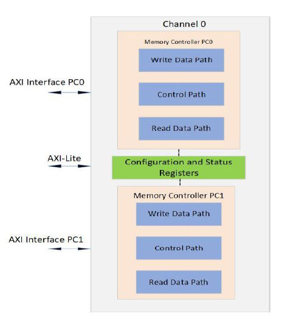

Command Priority
You can set command priority for a write or read command request through the AXI
interface: through the awqos signal in the AXI write address channel, or arqos in the
AXI read address channel. The HBM2E controller supports normal and high priority
levels. The controller executes commands with the same priority level in a round-robin
scheme.
Starvation limit
The controller tracks how long each command waits and leaves no command
unserviced in the command queue for a long period of time. The controller ensures
that it serves every command efficiently.
Command scheduling
The HBM2E controller schedules the incoming commands to achieve maximum
efficiency at the HBM2E interface. The HBM2E controller also follows the AXI ordering
model of the AXI4 protocol specification.
Controller Refresh Mode
The HBM2E controller supports two different Refresh Modes. Advanced Refresh
improves controller performance for most traffic sequences, such as sequential or
stride access. Standard Refresh has higher performance for random access. For other
traffic sequences, you should test performance using both refresh modes to determine
the optimal option.
Address ordering
The HBM2E controller supports different address ordering schemes that you can select
for best efficiency given your use case. The chosen addressing scheme determines the
order of address configurations in the AXI write and read address buses, including row
address, column address, bank address, and stack ID (applicable only to the 8H
devices). The HBM2E controller remaps the logical address of the command to a
physical memory address.
3. Agilex 7 M-Series HBM2E Architecture
High Bandwidth Memory (HBM2E) Interface Agilex 7 M-Series FPGA IP User
Guide
Send Feedback
16

Thermal Control
The HBM2E controller uses the TEMP and CATTRIP outputs from the HBM2E device to
manage temperature variations inside the HBM2E stack.
- 
Temperature compensated refresh (TEMP): The HBM2E DRAM provides
temperature compensated refresh information to the controller through the
TEMP[2:0] pins, which defines the proper refresh rate that the DRAM expects to
maintain data integrity. The temp value is gray-coded and absolute temperature
values for each encoding are vendor-specific. The encoding on the TEMP[2:0] pins
reflects the required refresh rate for the hottest die in the stack. The TEMP data
updates when the temperature exceeds vendor-specified threshold levels
appropriate for each refresh rate.
Table 5.
DRAM Refresh Timing
TEMP [2:0]
Refresh Rate
000
4 x tREFI
001
2 x tREFI
011
1 x tREFI
010
0.5 x tREFI
110
0.25 x tREFI
111
TBD
101
TBD
100
TBD
- 
Catastrophic temperature sensor (CATTRIP): The CATTRIP sensor detects whether
the junction temperature of any die in the stack exceeds the catastrophic trip
threshold value CATTEMP. The device vendor programs the CATTEMP to a value
less than the temperature at which permanent damage to the HBM stack would
occur. The CATTEMP value is also the Absolute Max Junction temperature value as
specified in the Agilex 7 M-Series data sheet for the family of devices that include
the HBM2E DRAM.
If a junction temperature anywhere in the stack exceeds the CATTEMP value, the
HBM stack drives the external CATTRIP pin to 1, indicating that catastrophic
damage may occur. When the CATTRIP pin is at 1, the controller stops all traffic to
HBM and stalls indefinitely. To resolve the overheating situation and return the
CATTRIP value to 0, remove power from the device and allow sufficient time for
the device to cool before reapplying power.
- 
Thermal throttling: Thermal throttling is a controller safety feature that helps
control thermal runaway if the HBM2E die overheats, preventing a catastrophic
failure. The desired throttling ratio, which determines the throttling frequency, can
be specified for 2 temperature ranges: 85 to 94 degrees Celsius and 95 to 105
degrees Celsius. The throttling ratio for the 95 to 105 degree range should be
greater than or equal to the ratio specified for the 85 to 94 degree range. No
throttling is applied below 85 degrees and 100% throttling is applied above 105
degrees. The controller deasserts the AXI ready signals (awready, wready and
arready) when it is actively throttling the input commands and data.
3. Agilex 7 M-Series HBM2E Architecture
Send Feedback
High Bandwidth Memory (HBM2E) Interface Agilex 7 M-Series FPGA IP User
Guide
17

Refresh requests
The HBM2E controller handles HBM2E memory refresh requirements and issues
refresh requests at the optimal time, as specified by the JEDEC specification of the
HBM2E DRAM. The controller automatically controls refresh rates based on the
temperature setting of the memory through the TEMP vector that the memory
provides.
Precharge policy
The HBM2E controller issues precharge commands to the HBM2E memory based on
the write/read transaction address. In addition, you can issue an auto-precharge
request together with any AXI read or write command to the HBM2E controller.
There are two auto-precharge modes:
- 
HINT – You can issue the auto-precharge request. The controller then decides
whether to issue the precharge command, based on the contents of its command
queues.
- 
FORCED – You provide auto-precharge requests through the AXI interface and the
precharge request executes.
Power down enable
To conserve power, the HBM2E controller can enter power-down mode when the bus is
idle for a long time. You can select this option if required.
ECC
The HBM2E controller supports ECC. The ECC scheme implemented is single-bit error
correction with double-bit error detection, with 64-bits of data and 8-bits of ECC code
(also known as the syndrome).
HBM2E Controller features enabled by default
The HBM2E controller enables the following features by default:
- 
DBI – The DBI option supports both write and read DBI, and optimizes signal
integrity/power consumption by restricting signal switching on the HBM2E DQ bus.
- 
Parity – Supports command/address parity and DQ parity.
3. Agilex 7 M-Series HBM2E Architecture
High Bandwidth Memory (HBM2E) Interface Agilex 7 M-Series FPGA IP User
Guide
Send Feedback
18

4. Creating and Parameterizing the High Bandwidth
Memory (HBM2E) Interface FPGA IP
This chapter contains information on project creation, IP parameter descriptions, and
pin planning for your High Bandwidth Memory (HBM2E) Interface FPGA IP.
4.1. Creating an Quartus Prime Pro Edition Project for High
Bandwidth Memory (HBM2E) Interface FPGA IP
You can parameterize and generate the High Bandwidth Memory (HBM2E) Interface
FPGA IP using the Quartus Prime Pro Edition software.
1.
Before generating the HBM2E IP, you must create a new project:
a.
Launch the Quartus Prime Pro Edition software.
b.
Launch the New Project Wizard by clicking File ➤ New Project Wizard.
c.
Type a name for your project in the Directory, Name, Top-Level Entity
field.
d.
In the Project Type section, select Empty Project.
e.
In the Add Files section, click Next.
f.
In the Family, Device, and Board Settings section, select Agilex 7 (F-
Series/M-Series/I-Series) as the device family.
g.
Under Available Devices, select your Agilex 7 M-Series device and your
desired speed grade.
h.
Click Next and follow the Wizard's prompts to finish creating the project.
2.
In the IP Catalog, open Library ➤ Memory Interfaces and Controllers.
3.
Launch the parameter editor by selecting High Bandwidth Memory (HBM2E)
Interface Agilex 7 FPGA IP.
© Altera Corporation. Altera, the Altera logo, the ‘a’ logo, and other Altera marks are trademarks of Altera Corporation. Altera
reserves the right to make changes to any products and services at any time without notice. Altera assumes no responsibility or
liability arising out of the application or use of any information, product, or service described herein except as expressly agreed
to in writing by Altera. Altera customers are advised to obtain the latest version of device specifications before relying on any
published information and before placing orders for products or services.
*Other names and brands may be claimed as the property of others.

Figure 7.
Selecting High Bandwidth Memory (HBM2E) Interface FPGA IP in the IP
Catalog
4.2. Parameterizing the High Bandwidth Memory (HBM2E)
Interface FPGA IP
You can parameterize your HBM2E IP with the HBM2E IP parameter editor.
The parameter editor comprises the following tabs, on which you set the parameters
for your IP:
- 
General
- 
Example Design
4.2.1. General Parameters for High Bandwidth Memory (HBM2E) Interface
FPGA IP
The General tab allows you to select HBM2E device configurations, the number of
channels that you want to implement, and the controller settings.
4. Creating and Parameterizing the High Bandwidth Memory (HBM2E) Interface FPGA IP
High Bandwidth Memory (HBM2E) Interface Agilex 7 M-Series FPGA IP User
Guide
Send Feedback
20

### Figures from page 20

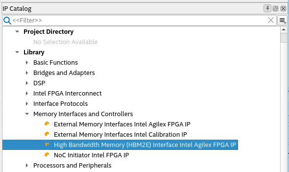

Figure 8.
Group: General / Quick Settings
Table 6.
Group: General / Quick Settings
Display Name
Description
Speed Grade
Speed grade of FPGA device and whether it is an
engineering sample (ES) or a production device. The value
is automatically determined based on the device selected
under View ➤ Device Family. If you do not specify a
device, the system assumes a production device of the
fastest speed grade. You should always specify the correct
target device during IP generation; failure to specify the
correct device may result in generated IP that does not
work on hardware.
HBM Device Type
The HBM device type. HBM_DEVICE_16GB_8HI refers to
HBM2E device with a total device density of 16GB in a 8-
high stack. HBM_DEVICE_8GB_4HI refers to an HBM2E
device with a total density of 8GB in a 4-high stack.
Memory clock frequency
The frequency of the memory clock in MHz. Specifies the
clock frequency for the HBM2E interface. The minimum
supported memory clock frequency is 800 MHz and the
maximum supported memory clock frequency depends on
the FPGA device speed grade.
- 
1 speed grade: 1600 MHz
- 
2 speed grade: 1400 MHz
- 
3 speed grade: 1000 MHz
PLL reference clock frequency
When checked the default value of 100 MHz is used for the
PLL reference clock frequency. Uncheck the check box if you
want to specify your own PLL reference clock frequency.
continued...
4. Creating and Parameterizing the High Bandwidth Memory (HBM2E) Interface FPGA IP
Send Feedback
High Bandwidth Memory (HBM2E) Interface Agilex 7 M-Series FPGA IP User
Guide
21

### Figures from page 21

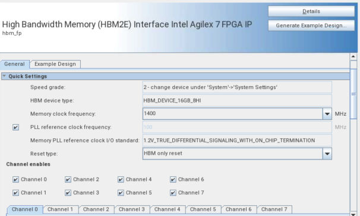

Display Name
Description
Memory PLL reference clock I/O standard
Specifies the I/O standard for the PLL reference clock of the
memory interface. The only supported termination option is
LVDS with on-chip termination.
Reset Type
HBM-only reset option resets the entire UIB subsystem,
including HBM2E DRAM. When you choose the reset with
calibration option, it recalibrates the UIB when you trigger
the reset.
Channel enables
Select number of channels you want to enable for your
HBM2E IP. Each channel selection activates the controllers
for the two pseudo-channels of that channel of the UIB
block.
Figure 9.
Group: General / Controller Configuration
Table 7.
Group: General / Controller Configuration
Display Name
Description
Is clone of
Set this option to make this channel configuration a clone of
the selected channel. Parameters are copied from the
specified channel. This parameter applies when you enable
more than one HBM2E channel.
Refresh Mode
Set this option depending on the traffic sequence your
design is running.
- 
Advanced Refresh improves controller performance for
most traffic sequences, such as sequential or stride
acces.
- 
Standard Refresh has higher performance for random
access. For other traffic sequences, benchmark
performance using both refresh modes to determine the
optimal option.
Address Re-ordering
Specifies the pattern for mapping the address from the AXI
interface to the HBM2E memory device. By choosing an
appropriate address reordering configuration, you help to
improve the efficiency of accesses to the HBM2E memory
device for the traffic pattern generated by your design. The
HBM controller supports three types of address reordering:
continued...
4. Creating and Parameterizing the High Bandwidth Memory (HBM2E) Interface FPGA IP
High Bandwidth Memory (HBM2E) Interface Agilex 7 M-Series FPGA IP User
Guide
Send Feedback
22

### Figures from page 22

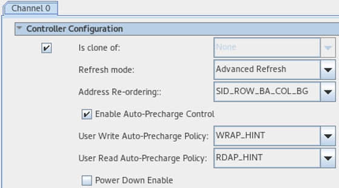

Display Name
Description
- 
SID-BG-BA-ROW-COL
- 
SID-ROW-BA-COL-BG
- 
ROW-SID-BA-COL-BG
Note: The SID-BG-BA-ROW-COL[5:1] address order limits
HBM throughput when memory accesses are
sequential, and also affects random access
throughput in pseudo-BL8 mode.
Enable Auto-Precharge Control
Select this parameter to enable the auto-precharge control
on the controller top level. If you assert the auto-precharge
control signal while requesting a read or write burst, you
can specify whether the controller should close (precharge)
the currently open page at the end of the read or write
burst, potentially making a future access to a different page
of the same bank faster.
User Read Auto-Precharge Policy
Controls the amount of freedom that the controller has
when handling auto-precharge requests. FORCED indicates
that the controller follows the user auto-precharge request
exactly. HINT indicates that the controller may override the
auto-precharge request by disabling it when a page hit is
detected (that is, if it receives two commands, one with
auto-precharge and one without auto-precharge to the
same page, the controller changes auto-precharge for the
first to 0 so that the second can access the page without
reopening it). You can issue the request to precharge
together with the read command by asserting aruser[0].
You can choose between two values for this parameter:
- 
RDAP_FORCED mode, in which the HBM2E controller
always performs a precharge after executing any
command that has the auto-precharge aruser bit set.
- 
RDAP_HINT mode, in which the controller determines
when to issue an auto-precharge command, based on
user-issued auto-precharge input and the target address
of the command.
User Write Auto-Precharge Policy
Controls the amount of freedom that the controller has
when handling auto-precharge requests. FORCED indicates
that the controller follows the user auto-precharge request
exactly. HINT indicates that the controller may override the
auto-precharge request by disabling it when a page hit is
detected (that is, if it receives two commands, one with
auto-precharge and one without auto-precharge to the
same page, the controller changes auto-precharge for the
first to 0 so that the second can access the page without
reopening it). You can issue a precharge request together
with the write by asserting awuser[0]. You can choose
between two values for this parameter:
- 
WRAP_FORCED mode, in which the HBM2E controller
always performs a precharge after executing any
command that has the auto-precharge awuser bit set.
- 
WRAP_HINT mode, in which the controller determines
when to issue an auto-precharge command, based on
user-issued auto-precharge input and the target address
of the command.
Power Down Enable
Causes the controller to power down when idle.
4. Creating and Parameterizing the High Bandwidth Memory (HBM2E) Interface FPGA IP
Send Feedback
High Bandwidth Memory (HBM2E) Interface Agilex 7 M-Series FPGA IP User
Guide
23

Figure 10.
Group: General / Temperature Based Throttling
Table 8.
Group: General / Temperature Based Throttling
Display Name
Description
Enable interface throttling based on temperature
Enables temperature-based throttling where the desired
throttling ratio can be specified for 2 temperature ranges:
85 to 94 degrees Celsius and 95 to 105 degrees Celsius.
The throttling ratio for the 95 to 105 degree range should
be greater than or equal to the ratio specified for the 85 to
94 degree range. No throttling is applied below 85 degrees
and 100% throttling is applied above 105 degrees.
85C - 94C
This parameter defines the throttle ratio as a percentage (0:
no throttling, 100: full throttling) to be applied when the
DRAM temperature is between 85 and 94 degrees Celsius.
> 95C
This parameter defines the throttle ratio as a percentage (0:
no throttling, 100: full throttling) that will be applied when
the DRAM temperature is between 95 and 105 degrees
Celsius.
Figure 11.
Group: General/Data Configuration
Table 9.
Group: General / Data Configuration
Display Name
Description
Enable pseudo BL8 mode
If enabled, data access granularity is 64B (64 bits per
pseudo-channel at BL8) which makes the most efficient use
of the NoC and of the controller's command scheduling
mechanism. Otherwise data access granularity is 32B (64
bits perpseudo-channel at BL4). The controller uses one or
two memory bursts per 64B AXI command, based on this
setting.
Data mode
Specifies the HBM2E DM pin function and use of HBM ECC
data bits.
continued...
4. Creating and Parameterizing the High Bandwidth Memory (HBM2E) Interface FPGA IP
High Bandwidth Memory (HBM2E) Interface Agilex 7 M-Series FPGA IP User
Guide
Send Feedback
24

### Figures from page 24

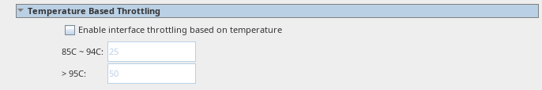
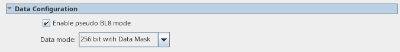

Display Name
Description
- 
In 256 bit mode, the DM pins and HBM ECC bits are not
used at all. In this mode, the write strobes can still be
used with the controller read-modify-write, wstrb is not
ignored; if used with 256 bit mode, it will have lower
efficiency compared to 256-bit with data mask.
- 
In 256 bit with ECC mode, the DM pins are used to
transfer HBM ECC bits, and the HBM controller
implements ECC generation and checking. Wstrb is
supported by controller read-modify-write.
- 
In 256 bit with data mask mode, the AXI write strobes
are used to drive the DM pins.
- 
In 288 bit mode, the HBM ECC bits are directly
accessible to the user design, as AXI user bits. They can
be used for data or a user-defined ECC scheme. In this
mode the AXI write strobes are ignored.
Figure 12.
Group: General / Pseudo-Channel n Power Estimation
Table 10.
Group: General / Pseudo-Channel n Power Estimation
Display Name
Description
Bandwidth
Specify estimated DRAM bandwidth for this pseudo-channel.
Page hit rate
Specify estimated DRAM page hit rate for traffic for this
pseudo-channel.
Read ratio
Specify estimated read ratio for this pseudo-channel. Read
ratio is the percentage of DRAM read traffic over write
traffic.
4.2.2. Example Design Parameters for High Bandwidth Memory (HBM2E)
Interface FPGA IP
The Example Design tab allows you to configure example design files for simulation
and synthesis.
4. Creating and Parameterizing the High Bandwidth Memory (HBM2E) Interface FPGA IP
Send Feedback
High Bandwidth Memory (HBM2E) Interface Agilex 7 M-Series FPGA IP User
Guide
25

### Figures from page 25

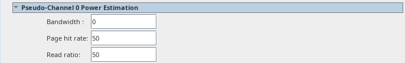

Figure 13.
Example Design tab of HBM2E IP Parameters
Table 11.
Group: Example Design / Example Design NoC Clocks and Connectivity
Display Name
Description
Reference clock frequency for example design NoC Clock
Control IP
When running the design example on hardware, you can
override this setting to match the NoC reference clock
generated by your board.
Choose initiator to target NoC mapping
You can choose between two configurations of initiator to
target hard memory NoC mapping for the design example:
- 
1 to 1 full address connection: each traffic generator in
the example design uses its NOC initiator to access the
full address range of the NOC target connected to a
single HBM pseudo-channel. Each initiator dedicatedly
connects to single target.
- 
16 to 16 cross bar: Each of the 16 traffic generators
drives traffic to all of the 16 pseudo-channels. This
option is only available when all 8 controller channels
are enabled.
Use Fabric NoC to return read responses via M20Ks
When you enable any option other than Fabric NoC will
not be used by the example design, the NoC initiator IP
uses the fabric's M20K-based memories to deliver AXI read
responses deep into the fabric. 512-bits of read response
data are returned to your design in each AXI interface,
enabling fabric frequencies above 350 MHz to saturate
HBM2E pseudo-channel read bandwidth.
continued...
4. Creating and Parameterizing the High Bandwidth Memory (HBM2E) Interface FPGA IP
High Bandwidth Memory (HBM2E) Interface Agilex 7 M-Series FPGA IP User
Guide
Send Feedback
26

### Figures from page 26

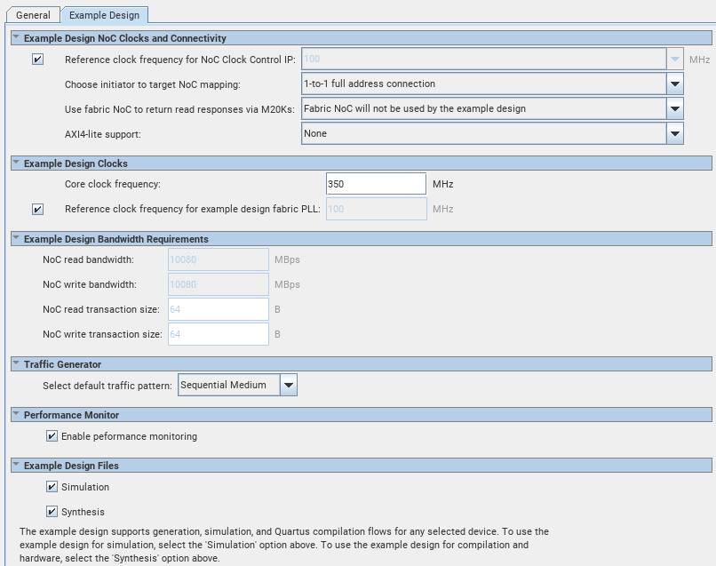

Display Name
Description
You can enable the Fabric NoC for one of the following
configurations:
512-bit wide data paths. 256-bit NoC bridge hardware has
an independent clock: Configures the NoC Initiator IP with a
single 512-bit wide AXI interface for both read and write
data paths, in which case the NoC bridge hardware must be
supplied with its own clock.
The following two configurations are asymmetric modes in
which the NoC Initiator IP has separate 512-bit wide read
and 256-bit wide write data paths. These paths can have a
common clock , but giving the wide read data paths their
own clock enables a higher frequency to be used for the
write interface:
- 
256-bit write and 512-bit read data paths, with a
common clock.
- 
256-bit write and 512-bit read data paths, read data
paths has it own clock.
AXI4-Lite support
Select this option to choose a design example that includes
AXI4-Lite interfaces in the fabric. The AXI4-Lite interface
provides access to control and status registers. You must
enable this option if you want to access the control and
status registers of the HBM2E IP.
- 
Select None if you don't want to enable AXI4-Lite in your
design.
- 
Select Dedicated AXI4-Lite NoC Initiator to enable AXI4-
Lite access. This option adds one more instance of the
NoC initiator IP with a seventeenth initiator which is
used to send out AXI4-Lite traffic.
- 
Select Shared NoC Initiator for AXI4 and AXI4-Lite to
share the initiator with AXI4 main-band and AXI4-Lite
traffic. You cannot use this option when there are HBM2E
channels that have been configured in a 288-bit data
mode. AXI4-Lite support via a shared initiator cannot be
combined with use of the fabric NoC.
Note: You cannot enable an AXI4-Lite interface with 288-
bit data mode designs.
Refer to the Use Cases topic in the HBM2E IP Design
Example User Guide for more detailed information on the
implementation of these options.
NoC read bandwidth
The anticipated read bandwidth requirement, in GBps, for
each NoC initiator bridge-to-target bridge (I-T) connection.
The Quartus PrimeCompiler uses this information to analyze
whether there is congestion on the hard memory NoC. This
is a default value selected based on the most optimal
configuration and initiator placements. This assignment is
made consistently to all I-T connections in the design. The
performance analysis tool may flag warnings if these
requirements lead to potential congestion on the NoC. Such
a design can still be fully compiled and run on hardware but
may cause sub-optimal performance. These settings can be
changed independently for each I-T connection in the design
in the NoC assignment editor.
NoC write bandwidth
The anticipated write bandwidth requirement, in GBps, for
each NoC initiator bridge-to-target bridge (I-T) connection.
The Quartus Prime Compiler uses this information to
analyze whether there is congestion on the hard memory
NoC. This is a default value selected based on the most
optimal configuration and initiator placements. This
assignment is made consistently to all I-T connections in the
design. The performance analysis tool may flag warnings if
these requirements lead to potential congestion on the NoC.
Such a design can still be fully compiled and run on
continued...
4. Creating and Parameterizing the High Bandwidth Memory (HBM2E) Interface FPGA IP
Send Feedback
High Bandwidth Memory (HBM2E) Interface Agilex 7 M-Series FPGA IP User
Guide
27

Display Name
Description
hardware but may cause sub-optimal performance. These
settings can be changed independently for each I-T
connection in the design in the NoC assignment editor.
NoC read transaction size
The anticipated read transaction length requirement, in B,
for each NoC initiator bridge-to-target bridge (I-T)
connection. The Quartus Prime Compiler uses this
information to analyze whether there is congestion on the
hard memory NoC. This is a default value selected based on
the most optimal configuration and initiator placements.
This assignment is made consistently to all I-T connections
in the design. The performance analysis tool may flag
warnings if these requirements lead to potential congestion
on the NoC. Such a design can still be fully compiled and
run on hardware but may cause sub-optimal performance.
These settings can be changed independently for each I-T
connection in the design in the NoC assignment editor.
NoC write transaction size
The anticipated write transaction length requirement, in B,
for each NoC initiator bridge-to-target bridge (I-T)
connection. The Quartus Prime Compiler uses this
information to analyze whether there is congestion on the
hard memory NoC. This is a default value selected based on
the most optimal configuration and initiator placements.
This assignment is made consistently to all I-T connections
in the design. The performance analysis tool may flag
warnings if these requirements lead to potential congestion
on the NoC. Such a design can still be fully compiled and
run on hardware but may cause sub-optimal performance.
These settings can be changed independently for each I-T
connection in the design in the NoC assignment editor.
Table 12.
Group: Example Designs / Example Design Clocks
Display Name
Description
Core clock frequency
The frequency of the core clock used to drive the design
example's traffic generators and the NoC initiator IP
interfaces to which they connect. In cases of fabric NoC
designs with 512-bit wide data paths, the NoC initiator IP
have their own clock.
Valid range of core clock frequencies depends on device
speed grade and design details. Maximum values apply to
all designs, while recommended values are based on the
design example without fabric NoC.
Device Speed
Grade
Max Core Clock
Recommended
Core Clock
-3
450 MHz
430 MHz
-2
630 MHz
500 MHz
-1
660 MHz
545 MHz
For designs using fabric NoC, refer to the High Bandwidth
Memory (HBM2E) Interface Agilex 7 M-Series FPGA IP
Design Example User Guide.
NoC bridge hardware frequency
Specifies the frequency of the clock that the design example
uses to drive the 256-bit wide NoC bridge hardware when
you configure the design example to generate NoC Initiator
IP with 512-bit data paths.
continued...
4. Creating and Parameterizing the High Bandwidth Memory (HBM2E) Interface FPGA IP
High Bandwidth Memory (HBM2E) Interface Agilex 7 M-Series FPGA IP User
Guide
Send Feedback
28

Display Name
Description
The following table shows the maximum operating
frequency of the NoC bridge hardware for a design using
Fabric NoC:
Device Speed Grade
Max Operating NoC Bridge
Clock
-3
450 MHz
-2
630 MHz
-1
660 MHz
For information on different fabric NoC configurations, refer
to the High Bandwidth Memory (HBM2E) Interface Agilex 7
M-Series FPGA IP Design Example User Guide.
Note: This parameter is available only when you choose a
fabric NoC configuration of 512-bit wide data
paths. 256-bit NoC bridge hardware has an
independent clock.
Reference clock frequency for example design core clock
PLL
Reference clock frequency for the PLL supplying the core
clock. This parameter affects only the design example PLL.
Read-only AXI data path frequency
Specifies the clock frequency of the NoC initiator IP read
interface when you configure the design example to
generate NoC Initiator IP with separately clocked
asymmetric-width read and write interfaces.
The following table shows the minimum operating frequency
to drive the 512-bit read-only AXI data path frequency:
Device Speed Grade
Min Operating Read-Only
AXI Data Path Freq.
-3
350 MHz
-2
350 MHz
-1
250 MHz
Note: This parameter is available only when you choose a
fabric NoC configuration of 256-bit wide and 512-
bit read data paths, read data path has its own
clock.
Table 13.
Group: Example Designs / Traffic Generator
Display Name
Description
Select default traffic pattern
This option allows you to select the traffic pattern type and
how many read and write transactions to run in the design
example simulation.
Table 14.
Group: Example Designs / Performance Monitor
Display Name
Description
Enable performance monitoring
Select this option to enable the performance monitor on all
active HBM2E channels for measuring read and write
transaction metrics.
4. Creating and Parameterizing the High Bandwidth Memory (HBM2E) Interface FPGA IP
Send Feedback
High Bandwidth Memory (HBM2E) Interface Agilex 7 M-Series FPGA IP User
Guide
29

Table 15.
Group: Example Designs / Example Design Files
Display Name
Description
Simulation
Specifies that the system generate all necessary file sets for
simulation when you click Generate Example Design.
If you do not enable this parameter, the system does not
generate simulation file sets. Instead, the output directory
contains the ed_sim.qsys file which contains details of the
simulation example design for Platform Designer, and a
make_sim_design.tcl file with other corresponding tcl
files.
You can run the make_sim_design.tcl file from a
command line to generate a simulation example design. The
generated example designs for various simulators reside in
the /sim subdirectory.
Synthesis
Specifies that the system generate all necessary file sets for
synthesis when you click Generate Example Design.
If you do not enable this parameter, the system does not
generate synthesis file sets. Instead, the output directory
contains the ed_synth.qsys file which contains details of
the synthesis example design for Platform Designer, and a
make_qii_design.tcl file with other corresponding tcl
files.
You can run the make_qii_design.tcl file from a
command line to generate a synthesis example design. The
generated example design resides in the /qii subdirectory.
Table 16.
Group: Example Designs / Generated HDL Format
Display Name
Description
Simulation HDL format
Format of HDL files generated for simulating the design
example.
4.2.3. Modifying Your Pin Assignments to Choose the Physical Location of
the HBM2E Device
There are two HBM2E memory devices in Agilex 7 M-Series FPGAs. One HBM2E
memory is on the top of the FPGA and the other is on the bottom. With the HBM2E
FPGA IP you must add the assignments in your qsf file to choose the location of the
HBM2e device.
You can choose top versus bottom device by specifying the pin assignment for the
dedicated refclk pins for the UIB PLL and the NoC PLL.
Modify your qsf file with the following assignments to use top or bottom location of
the HBM2e memory device:
Specifying the top HBM
To specify the top HBM, set these assignments:
Set_location_assignment PIN_AR36 -to uibpll_refclk_clk
Set_location_assignment PIN_AN36 -to "uibpll_refclk_clk(n)"
Set_location_assignment PIN_AU52 -to noc_clk_ctrl_refclk_clk
4. Creating and Parameterizing the High Bandwidth Memory (HBM2E) Interface FPGA IP
High Bandwidth Memory (HBM2E) Interface Agilex 7 M-Series FPGA IP User
Guide
Send Feedback
30

Specifying the bottom HBM
To specify the bottom HBM, set these assignments:
Set_location_assignment PIN_EC36 -to uibpll_refclk_clk
Set_location_assignment PIN_ED35 -to "uibpll_refclk_clk(n)"
Set_location_assignment PIN_EE56 -to noc_clk_ctrl_refclk_clk
4. Creating and Parameterizing the High Bandwidth Memory (HBM2E) Interface FPGA IP
Send Feedback
High Bandwidth Memory (HBM2E) Interface Agilex 7 M-Series FPGA IP User
Guide
31

5. High Bandwidth Memory (HBM2E) Interface FPGA IP
Interface
This chapter provides an overview of the signals that interface to the HBM2E IP.
5.1. High Bandwidth Memory (HBM2E) Interface FPGA IP High
Level Block Diagram
The following figure shows a high-level block diagram of the High Bandwidth Memory
(HBM2E) Interface FPGA IP per Pseudo Channel. The IP communicates with user logic
through the AXI protocol.
Figure 14.
High Level Block Diagram of HBM2E Implementation
5.2. High Bandwidth Memory (HBM2E) Interface FPGA IP Controller
Interface Signals
This section lists the signals that connect core logic to the High Bandwidth Memory
(HBM2E) Interface FPGA IP.
© Altera Corporation. Altera, the Altera logo, the ‘a’ logo, and other Altera marks are trademarks of Altera Corporation. Altera
reserves the right to make changes to any products and services at any time without notice. Altera assumes no responsibility or
liability arising out of the application or use of any information, product, or service described herein except as expressly agreed
to in writing by Altera. Altera customers are advised to obtain the latest version of device specifications before relying on any
published information and before placing orders for products or services.
*Other names and brands may be claimed as the property of others.

### Figures from page 32

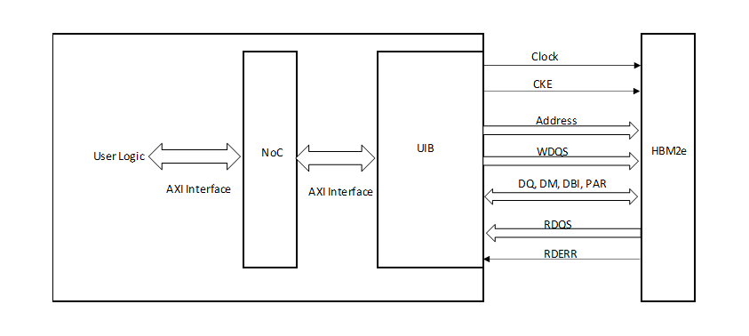

5.2.1. Reset, Clock, and Calibration Status Signals
Table 17.
Reset Signals
Signal
Direction
Description
hbm_reset_n
Input
User-initiated, negative-edge HBM
reset coming from core fabric. Resets
the UIB subsystem, including HBM
controller, PHY, and HBM2E DRAM.
hbm_reset_in_prog
Output
When this signal is high, it indicates
that the user-initiated HBM reset
(hbm_reset_n) is in progress.
Additional assertions of hbm_reset_n
are ignored while
hbm_reset_in_prog remains high.
Table 18.
Clock Signals
Signal
Direction
Description
uibpll_refclk
Input
Reference clock input for the UIB PLL.
This clock must be stable and free-
running at device power-up for
successful configuration. Refer to
Agilex 7 pin connection guidelines for
information on how to supply this
clock.
fabric_clk
Input
Core clock used to synchronize reset
and status signals.
Table 19.
Calibration Status Signals
Signal
Direction
Description
local_cal_success
Output
Indicates calibration success. This
signal is asynchronous. Once asserted,
this signal remains high until an HBM
reset with calibration is attempted.
local_cal_fail
Output
Indicates calibration failure. This signal
is asynchronous. Once asserted, this
signal remains high until an HBM reset
with calibration is attempted.
Clocking recommendations for Reliable Calibration of the HBM2E Interface
Observe the following clock guidelines for reliable calibration of the HBM2E interface:
- 
The UIB PLL reference clocks (one per HBM2E interface) must be provided through
an external clock source and must be stable and free-running prior to
configuration and stable thereafter.
5.2.2. Requirement and Timing of the hbm_reset_n Signal
The hbm_reset_n signal is a user-initiated reset which resets the entire UIB sub-
system, including the controller, PHY, and HBM2E DRAM.
The following waveform illustrates the timing associated with the hbm_reset_n
signal.
5. High Bandwidth Memory (HBM2E) Interface FPGA IP Interface
Send Feedback
High Bandwidth Memory (HBM2E) Interface Agilex 7 M-Series FPGA IP User
Guide
33

Figure 15.
hbm_reset_n Timing
clk
hbm_reset_n
hbm_reset_in_prog
local_cal_success
local_cal_fail
AXI Traffic
Active Traffic
Active Traffic
The following rules apply to the hbm_reset_n signal:
- 
To assert hbm_reset_n, you should drive it from a high to low state and hold it
low for at least one core clock cycle, and then transition the signal from low to
high state.
- 
The HBM system remains in reset if you hold hbm_reset_n low. Reset is
completed only after you de-assert hbm_reset_n from low to high state.
- 
You can assert hbm_reset_n again after hbm_reset_in_prog goes low (reset
completed). Any assertion of hbm_reset_n while the reset is in progress is
ignored.
- 
The local_cal_success signal de-asserts for several core clock cycles after the
reset sequence begins and asserts when reset is completed. Calibration does not
occur when the IP reset configuration is set to HBM only reset; calibration occurs
when you set IP reset configuration to Reset with calibration.
- 
You can start new traffic on the AXI interface after hbm_reset_in_prog is low
and local_cal_success is high.
- 
Before asserting hbm_reset_n to initiate an HBM reset, you must stop all AXI
traffic and ensure that there are no pending AXI transactions from previous
commands. It is critical that no AXI traffic is sent during the reset process. AXI
traffic may only resume after the reset is complete, as indicated by
hbm_reset_in_prog being low and local_cal_success being high. Failure to
stop AXI transactions before and during the reset can cause a system error.
Related Information
Instantiating the Reset Release IP In Your Design
5.2.3. "Do not connect" Signals
The following HBM2E memory signals represent physical connections between the UIB
and HBM2E device, and must not be connected in your design. Your design must route
these signals to its top level, and leave them unconnected.
5. High Bandwidth Memory (HBM2E) Interface FPGA IP Interface
High Bandwidth Memory (HBM2E) Interface Agilex 7 M-Series FPGA IP User
Guide
Send Feedback
34

Table 20.
"Do not connect" Thermal Status Signals
Signal
Direction
Description
hbm_cattrip_i
Input
Physical Device Catastrophic Trip
(CATTRIP) output from the HBM2E
device to the HBM controller; leave
unconnected in your design.
hbm_temp_i
Input[2:0]
Physical temperature readout from the
HBM2E device to the HBM controller;
leave unconnected in your design.
5.2.4. Asynchronous HBM2E Controller Signals
Table 21.
Thermal Status Signals
Signal
Direction
Description
hbm_cattrip
Output
Device Catastrophic Trip (CATTRIP):
Reflects the catastrophic trip indication
reported by the HBM2E device.
hbm_temp
Output[2:0]
Device Temperature Compensated
Refresh Value (TEMP): Reflects the
temperature compensated refresh
band reported by the HBM2E device.
Refer to the device specification for
temperature code definitions.
Table 22.
Level-sensitive Interrupt Signals
Signal
Direction
Description
ch0_u0_wmc_intr
Output
Level-sensitive interrupts which
indicate that an error or diagnostic
event has occurred on the associated
pseudo-channel. Your design should
interrogate the pseudo-channel's
interrupt status registers to identify the
condition that caused the interrupt.
ch0_u1_wmc_intr
Output
ch1_u0_wmc_intr
Output
ch1_u1_wmc_intr
Output
ch2_u0_wmc_intr
Output
ch2_u1_wmc_intr
Output
ch3_u0_wmc_intr
Output
ch3_u1_wmc_intr
Output
ch4_u0_wmc_intr
Output
ch4_u1_wmc_intr
Output
ch5_u0_wmc_intr
Output
ch5_u1_wmc_intr
Output
ch6_u0_wmc_intr
Output
ch6_u1_wmc_intr
Output
ch7_u0_wmc_intr
Output
ch7_u1_wmc_intr
Output
5. High Bandwidth Memory (HBM2E) Interface FPGA IP Interface
Send Feedback
High Bandwidth Memory (HBM2E) Interface Agilex 7 M-Series FPGA IP User
Guide
35

5.2.5. AXI4 Interface Signals
The AXI interface to the HBM2E controller follows the Amba AXI4 protocol
specification. Each AXI interface serves the read and write operations for one pseudo
channel, and is connected to a NoC target. Your design should issue AXI commands to
the HBM2E controller(s) via one or more instances of the NoC Initiator FPGA IP. You
can configure the hard memory NoC so that your design can use a single AXI interface
to access any or all of the pseudo-channels. The hard memory NoC can also be
configured to suit designs that use multiple AXI interfaces to initiate NoC commands
to a common set of pseudo-channels.
AXI Interface Signals
The hard memory NoC uses the upper 14 bits of AXI addresses to direct commands to
the 16 HBM pseudo-channels.
Each AXI interface consists of five subchannels:
- 
Write Address Channel –AXI write commands, specifying the target address,
transfer size, and associated information.
- 
Write Data Channel – AXI write data provided by the core logic corresponding to
the write address.
- 
Write Response Channel – Response from the HBM2E controller indicating whether
or not each write has been accepted.
- 
Read Address Channel – AXI read commands, specifying the target address,
transfer size, and associated information.
- 
Read Data Channel – AXI read data provided from the corresponding HBM2E
DRAM read address.
AXI Address Definition
The lower 30 bits of the AXI address identify a location within the targeted pseudo-
channel. The HBM2E DRAM addressing consists of the following:
- 
15-bit wide row address.
- 
6-bit wide column address. The user logic drives column address bits COL[5:1],
while the controller sets the lower order column address bit COL[0] to 0. For pBL8
transactions, the user logic must set COL[1] to 0.
- 
4-bit wide bank address. Bank group corresponds to the higher order 2 bits of the
bank address (BA[3:2]). HBM accesses are more efficient when the controller is
able to schedule consecutive HBM2E memory device read and write commands to
different bank groups.
- 
1-bit wide Stack ID (SID) is available only in the 16GB configuration.
5. High Bandwidth Memory (HBM2E) Interface FPGA IP Interface
High Bandwidth Memory (HBM2E) Interface Agilex 7 M-Series FPGA IP User
Guide
Send Feedback
36

Figure 16.
AXI Address Definition
HBM2E IP AXI Channel Descriptions
Within the HBM2E IP, the AXI interface signals of the HBM2E controller follow the
pattern ch<x>_u<y>_<portname> where x is the channel number and y is the
pseudo-channel number. For example, ch0_u1_awid refers to the write address ID of
the AXI interface corresponding to channel 0 and pseudo-channel 1. These AXI
interfaces are not user-accessible.
The signals in the following tables refer to the signal names corresponding to a single
AXI interface: channel 0, pseudo-channel 0.
Table 23.
Write Address (Command) Channel
Port Name
Width
Direction
Description
ch0_u0_awaddr
30
Input
Write address. The write address gives the
address of the first transfer in a write burst
transaction.
ch0_u0_awburst
2
Input
Burst type. The burst type and length determine
how the address for each transfer within the
burst is calculated.
Value
Burst Type
2’b01
INCR
Note: Only INCR Burst Type is supported for
HBM accesses.
continued...
5. High Bandwidth Memory (HBM2E) Interface FPGA IP Interface
Send Feedback
High Bandwidth Memory (HBM2E) Interface Agilex 7 M-Series FPGA IP User
Guide
37

### Figures from page 37

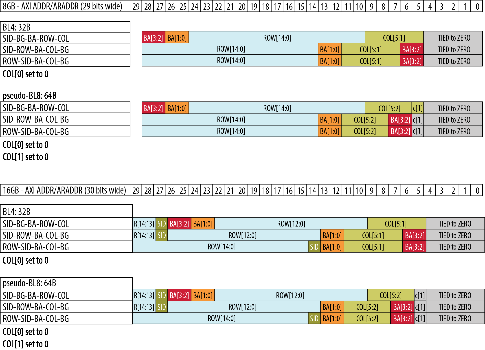

Port Name
Width
Direction
Description
ch0_u0_awid
7
Input
Write address channel command ID tag.
ch0_u0_awlen
8
Input
Burst Length. The burst length gives the exact
number of transfers in an AXI burst. In BL4
mode the HBMC supports burst lengths of 1 or 2;
in BL8 mode the HBMC only supports a burst
length of 2. When your design uses a burst
length of greater than 2, the NOC initiator
hardware issues multiple AXI commands of burst
length 1 or 2 to the HBMC. Note that AXI
encodes a burst length of 1 as awlen = 0, and
burst length 2 is encoded as awlen = 1.
In BL8 mode, the HBMC supports only a burst
length of 2 for write and read transactions. If
you issue a burst length of 1 in BL8 mode, you
will see bresp="10"(SLVERR).
ch0_u0_awprot
3
Input
Protection Type. [Reserved for future use] This
signal indicates the privilege and security level of
the transaction, and whether the transaction is a
data access or an instruction access.
Value
Protection
3’b010
No protection.
Because secure transactions are not currently
supported by the HBM controller, this value must
be driven to 3’b010.
ch0_u0_awqos
4
Input
Quality-of-service identifier for this write
command. The HBM controller supports only two
priority levels, distinguished by the top bit of the
QoS signal.
Value
Priority
4'b1xxx
High priority.
4'b0xxx
Normal priority.
ch0_u0_awready
1
Output
Write Address Channel Ready. This signal
indicates that the slave is ready to accept an
address and associated control signals.
ch0_u0_awsize
3
Input
Burst Size. This signal indicates the number of
AXI byte lanes containing valid data in each
transfer of the burst.
Note: The HBM controller supports only
256/288-bits (32 bytes) access, burst
size must be driven to 3’b101.
ch0_u0_awuser
14
Input
Altera-defined signals: auto-precharge is
signaled on awuser[0]. awuser[13:1] must be
driven to 13'b0 at the HBM controller interface.
ch0_u0_awvalid
1
Input
Write Address Channel Valid. This signal
indicates that valid write address and control
information are available.
ch0_u0_awlock
1
Input
Lock Type [Reserved for future use].
5. High Bandwidth Memory (HBM2E) Interface FPGA IP Interface
High Bandwidth Memory (HBM2E) Interface Agilex 7 M-Series FPGA IP User
Guide
Send Feedback
38

Table 24.
Write Data Channel
Port Name
Width
Direction
Description
ch0_u0_wdata
256
Input
Write Data.
ch0_u0_wlast
1
Input
Write Last. This signal indicates the last transfer
in a write burst.
ch0_u0_wready
1
Output
Write Channel Ready. This signal indicates that
the slave (HBM controller) can accept the write
data.
ch0_u0_wstrb
32
Input
Write Strobes (Byte Enables). This signal
indicates which byte lanes (for ch0_u0_wdata)
hold valid data. There is one write strobe bit for
each eight bits of the write data bus.
ch0_u0_wuser
32
Input
Altera-defined signal: when the pseudo-
channel's Data Mode is set to 288-bit, the ECC
bits of the HBM device receive their value from
wuser.
ch0_u0_wvalid
1
Input
Write Channel Valid. This signal indicates that
valid write data and strobes are available.
Table 25.
Write Response Channel
Port Name
Width
Direction
Description
ch0_u0_bid
7
Output
Response ID Tag. This signal is the ID tag of the
write response, and matches the ID tag of the
command for which this is the response.
ch0_u0_bready
1
Input
Write Response Channel Ready. This signal
indicates that the master can accept a write
response.
ch0_u0_bresp
2
Output
Write Response. This signal indicates the result
of the write command.
Value
Meaning
2’b00
OKAY
2’b10
SLVERR (indicates an
unsuccessful
transaction)
ch0_u0_bvalid
1
Output
Write Response Channel Valid. This signal
indicates that a valid write response is available.
Table 26.
Read Address (Command) Channel
Port Name
Width
Direction
Description
ch0_u0_araddr
30
Input
Read Address. The read address gives the
address of the first transfer in a read burst
transaction.
ch0_u0_arburst
2
Input
Burst type. The burst type and length
determine how the address for each transfer
within the burst is calculated.
Value
Burst Type
2’b01
INCR
continued...
5. High Bandwidth Memory (HBM2E) Interface FPGA IP Interface
Send Feedback
High Bandwidth Memory (HBM2E) Interface Agilex 7 M-Series FPGA IP User
Guide
39

Port Name
Width
Direction
Description
Note: Only INCR Burst Type is supported by
the HBM controller.
ch0_u0_arid
7
Input
Read address channel command ID tag.
ch0_u0_arlen
8
Input
Burst Length. The burst length gives the exact
number of transfers in an AXI burst. In BL4
mode the HBMC supports burst lengths of 1 or
2; in pseudo-BL8 mode the HBMC only
supports a burst length of 2. When your design
uses a burst length of greater than 2, the NOC
initiator hardware issues multiple AXI
commands of burst length 1 or 2 to the HBMC.
Note that AXI encodes a burst length of 1 as
arlen = 0, and burst length 2 is encoded as
arlen = 1.
In BL8 mode, the HBMC supports only a burst
length of 2 for write and read transactions. If
you issue a burst length of 1 in BL8 mode, you
will see rresp="10"(SLVERR).
ch0_u0_arprot
3
Input
Protection Type. [Reserved for future use.] This
signal indicates the privilege and security level
of the transaction, and whether the transaction
is a data access or an instruction access.
Value
Protection
3’b010
No protection.
Because secure transactions are currently not
supported by the HBM controller, this value
must be driven to 3’b010.
ch0_u0_arqos
4
Input
Quality-of-service identifier for this read
command. The HBM controller supports only
two priority levels, distinguished by the top bit
of the QoS signal.
Value
Priority
4'b1xxx
High Priority.
4'b0xxx
Normal Priority.
ch0_u0_arready
1
Output
Read Address Ready. This signal indicates that
the slave is ready to accept an address and
associated control signals.
ch0_u0_arsize
3
Input
Burst Size. This signal indicates the number of
AXI byte lanes containing valid data in each
transfer in the burst. NOTE: The HBM controller
supports only 256/288-bits (32 bytes) access,
burst size must be driven to 3’b101.
ch0_u0_aruser
14
Input
Altera-defined signals: auto-precharge is
signaled on aruser[0]. aruser[13:1] must be
driven to 13'b0 at the HBM controller interface.
ch0_u0_arvalid
1
Input
Read Address Valid. This signal indicates that
valid read address and control information are
available.
ch0_u0_arlock
1
Input
Lock Type [Reserved for future use].
5. High Bandwidth Memory (HBM2E) Interface FPGA IP Interface
High Bandwidth Memory (HBM2E) Interface Agilex 7 M-Series FPGA IP User
Guide
Send Feedback
40

Table 27.
Read Data Channel
Port Name
Width
Direction
Description
ch0_u0_rdata
256
Output
Read Data.
ch0_u0_rid
7
Output
Read Response ID Tag. This signal is the ID tag
for the read response, and matches the ID tag
of the command for which this is the response.
ch0_u0_rlast
1
Output
Read Last. This signal indicates the last transfer
in a read burst.
ch0_u0_rready
1
Input
Read Response Channel Ready. This signal
indicates that the master can accept the read
data and response information.
ch0_u0_rresp
2
Output
Read Response. This signal indicates the result
of the read command.
Value
Meaning
2’b00
OKAY
2’b10
SLVERR (indicates an
unsuccessful
transaction)
ch0_u0_ruser
32
Output
Altera-defined signal: when the pseudo-
channel's Data Mode is set to 288-bit, this
signal receives its value from the ECC bits of
the HBM device.
ch0_u0_rvalid
1
Output
Read Valid. This signal indicates that a valid
read response is available.
5.2.6. AXI4-Lite Interface
The AXI4-Lite interface allows access to the high-bandwidth memory controller's
control and status registers. The AXI4-Lite interface is intended primarily for use in
relatively low bandwidth sideband operations.
Table 28.
Write Address (Command) Channel
Port Name
Width
Direction
Description
sb_awaddr
27
Input
Write Address. Target address of the AXI4-Lite
write command.
sb_awvalid
1
Input
Write Address Valid. This signal indicates that
valid write address information is available.
sb_awready
1
Output
Write Address Channel Ready. This signal
indicates that the slave is ready to accept a
write command.
sb_awprot
3
Input
Protection Type. [Reserved for Future Use]. This
signal indicates the privilege and security level
of the transaction, and whether the transaction
is a data access or an instruction access.
5. High Bandwidth Memory (HBM2E) Interface FPGA IP Interface
Send Feedback
High Bandwidth Memory (HBM2E) Interface Agilex 7 M-Series FPGA IP User
Guide
41

Table 29.
Write Data Channel
Port Name
Width
Direction
Description
sb_wdata
32
Input
Write Data.
sb_wstrb
4
Input
Write Strobes (Byte Enables). This signal
indicates which byte lanes (for sb_wdata) hold
valid data. There is one write strobe bit for each
eight bits of the write data bus.
sb_wvalid
1
Input
Write Valid. This signal indicates that valid write
data and strobes are available.
sb_wready
1
Output
Write Ready. This signal indicates that the slave
(HBM controller) can accept the write data.
Table 30.
Write Response Channel
Port Name
Width
Direction
Description
sb_bresp
2
Output
Write Response. This signal indicates the result
of the most recent write command.
Value
Meaning
2’b00
OKAY
2’b10
SLVERR
sb_bvalid
1
Output
Write Response Valid. This signal indicates that
a valid write response is available.
sb_bready
1
Input
Response Ready. This signal indicates that the
master can accept a write response.
Table 31.
Read Address (Command) Channel
Port Name
Width
Direction
Description
sb_araddr
27
Input
Read Address. Target address of the AXI4-Lite
read command.
sb_arvalid
1
Input
Read Address Valid. This signal indicates that a
valid read address is available.
sb_arready
1
Output
Read Address Ready. This signal indicates that
the slave is ready to accept a read command.
sb_arprot
3
Input
Protection Type. [Reserved for Future Use]. This
signal indicates the privilege and security level
of the transaction, and whether the transaction
is a data access or an instruction access.
Table 32.
Read Data Channel
Port Name
Width
Direction
Description
sb_rdata
32
Output
Read Data.
sb_rresp
2
Output
Read Response. This signal indicates the result
of the most recent read command.
continued...
5. High Bandwidth Memory (HBM2E) Interface FPGA IP Interface
High Bandwidth Memory (HBM2E) Interface Agilex 7 M-Series FPGA IP User
Guide
Send Feedback
42

Port Name
Width
Direction
Description
Value
Meaning
2’b00
OKAY
2’b10
SLVERR
sb_rvalid
1
Output
Read Valid. This signal indicates that a valid
read response is available.
sb_rready
1
Input
Read Ready. This signal indicates that the
master can accept the read data and response
information.
5.3. User AXI Interface Timing
This section explains the interface timing details between user logic and the HBM2E
controller via the hard memory NoC. User interface signals follow the AXI4 protocol
specification while passing data to and from the HBM2E controller.
The AXI interface consists of the following channels:
- 
Write Address channel – Master (user logic or target NoC interface unit) provides
relevant signals to issue a write command to the slave (initiator NoC interface unit
or HBM2E controller).
- 
Write data channel – Master provides the write data signals corresponding to the
write address.
- 
Write response channel – Slave provides response on the status of the issued
write command to the master.
- 
Read Address channel – Master provides relevant signals to issue a read command
to the slave.
- 
Read data channel – Slave provides read data and read data valid signals
corresponding to the read command to the master.
All transactions in the five channels use a handshake mechanism for the master and
slave to communicate and transfer information.
Handshake Protocol
All five transaction channels use the same VALID/READY handshake process to
transfer address, data, and control information. Both the master and slave can control
the rate at which information moves between master and slave. The source generates
the VALID signal to indicate availability of the address, data, or control information.
The destination generates the READY signal to indicate that it can accept the
information. Transfer occurs only when both the VALID and READY signals are HIGH.
5. High Bandwidth Memory (HBM2E) Interface FPGA IP Interface
Send Feedback
High Bandwidth Memory (HBM2E) Interface Agilex 7 M-Series FPGA IP User
Guide
43

Figure 17.
AXI Protocol Handshake Process
T1
Clk
Address/Data
Ready
Valid
T2
T3
In the figure above, the source presents the address, data or control information after
T1 and asserts the VALID signal. The destination asserts the READY signal after T2,
and the source must keep its information stable until the transfer occurs at T3, when
this assertion occurs. In this example, the source asserts the VALID signal prior to the
destination asserting the READY signal. Once the source asserts the VALID signal, it
must remain asserted until the handshake occurs, at a rising clock edge at which
VALID and READY are both high. Once the destination asserts READY, it can deassert
READY before the source asserts VALID. The destination can assert READY whenever it
is ready to accept data, or in response to a VALID assertion from the source.
AXI IDs
In an AXI system with multiple masters, the AXI IDs used for the ordering model
include the infrastructure IDs that identify each master uniquely. The ordering model
applies independently to each master in the system.
The AXI ordering model also requires that all transactions with the same ID in the
same direction must provide their responses in the order in which they are issued.
Because the read and write address channels are independent, if an ordering
relationship is required between two transactions with the same ID that are in
different directions, then a master must wait to receive a response to the first
transaction before issuing the second transaction. If a master issues a transaction in
one direction before it has received a response to an earlier transaction in the opposite
direction, there is no ordering guarantee between the two transactions. An AXI master
can also issue several transactions with different IDs, indicating that the HBM
controller can re-order these transactions. This usually enables the HBM controller to
make more efficient accesses to the memory device.
AXI4-Lite transactions have no associated ID and are always handled in order.
AXI Ordering
The AXI system imposes no ordering restrictions between read and write transactions.
Read and write can complete in any order, even if the read address AXI ID (ARID) of a
read transaction is the same as the write address AXI ID (AWID) of a write
transaction. If a master requires a given relationship between a read transaction and a
5. High Bandwidth Memory (HBM2E) Interface FPGA IP Interface
High Bandwidth Memory (HBM2E) Interface Agilex 7 M-Series FPGA IP User
Guide
Send Feedback
44

write transaction, it must ensure that the earlier transaction is completed before it
issues a subsequent transaction. A master can consider the earlier transaction
complete only when one of the following is true:
- 
For a read transaction, it receives the last of the read data.
- 
For a write transaction, it receives the write response.
5.3.1. AXI Write Transaction
AXI Write Address
The user logic operates as an AXI master and should provide a valid write address and
accompanying control signals on the AW channel and assert AWVALID to indicate that
the address is valid. The master can assert the AWVALID signal only when it drives
valid address and control information.
When the slave is ready to accept a Write command, it asserts the AWREADY signal.
Transfer of the command happens when both AWVALID and AWREADY are asserted.
AWUSER, the user signal for auto precharge, must be presented at the same time as
AWADDR.
AXI Write Data
During a write burst, the master asserts the WVALID signal only when it drives valid
write data. Once asserted, WVALID must remain asserted until the rising clock edge
after the slave asserts WREADY. The master must assert the WLAST signal while it is
driving the final write transfer in the burst. The master must issue the write data in
the same order in which the write addresses are issued. Write data transfer happens
when both WVALID and WREADY are HIGH.
The following diagram illustrates a pseudo-BL8 Write transaction, which corresponds
to a 32-byte-wide AXI transaction of burst length 2. The master asserts the Write
address (WA0) in cycle T1 using transaction ID AWID0, the slave asserts the AWREADY
when it is ready to accept write requests. The master asserts the Write data in clock
cycle T3. Because the slave WREADY is already asserted, the write data is accepted
starting cycle T3. The second data beat of the transaction is transferred in clock cycle
T4.
5. High Bandwidth Memory (HBM2E) Interface FPGA IP Interface
Send Feedback
High Bandwidth Memory (HBM2E) Interface Agilex 7 M-Series FPGA IP User
Guide
45

Figure 18.
AXI Write Transaction – Using Pseudo-BL8 Memory Write Transaction
Core Clk
Master Write Address Valid (AWVALID)
Master Write Address AXI ID (AWID)
Master Write Address (AWADDR)
Slave AWREADY
Master Write Data Valid (WVALID)
Master Write Data (WDATA[255:0])
Master Write Last (WLAST)
Slave WREADY
AWID0
AWADDR0
D0
D1
T1
T2
T3
T4
T5
Write Response Channel
The slave uses the Write Response channel to respond once it has accepted a write
transaction. The slave can assert the BVALID signal only when it drives a valid write
response. Once asserted, BVALID must remain asserted until the rising clock edge
after the master asserts BREADY. The default state of BREADY can be high, but only if
the master can always accept a write response in a single cycle.
The HBM controller returns a Write Response as soon as the command has been
accepted, and before the accompanying write data has been committed to the HBM
memory.
5.3.2. AXI Read Transaction
Read Address
The AXI master asserts the ARVALID signal only when it drives a valid Read address
accompanying control signals. Once asserted, ARVALID must remain asserted until
the rising clock edge after the AXI slave asserts the ARREADY signal. If ARREADY is
high, the AXI slave accepts a valid address that is presented to it. ARUSER, the user
signal for auto precharge must be presented at the same time as ARADDR.
Read Data Channel
The slave asserts the RVALID signal when it drives valid read data to the user logic.
The master interface uses the RREADY signal to indicate that it accepts the data. The
state of RREADY can be always held high, if the master is always able to accept read
data. The slave asserts the RLAST signal when it is driving the final read transfer in
the burst.
5. High Bandwidth Memory (HBM2E) Interface FPGA IP Interface
High Bandwidth Memory (HBM2E) Interface Agilex 7 M-Series FPGA IP User
Guide
Send Feedback
46

The figure below describes the AXI transaction corresponding to an HBM pseudo-BL8
Read transaction. The AXI master asserts the Read address (RA0) in T1 using
transaction ID ARID0, the slave ARREADY is already asserted, the READ command is
accepted. The slave provides the Read Data back to the master after processing the
read command and obtaining the requested data. The slave presents the Read data in
clock cycle Ta. The Read transaction ID (RID) provided by the slave corresponds to
the Read Address ID (ARID). The second half of the 64 bytes returned by a pseudo-
BL8 read are presented in clock cycle Ta+1, and RLAST is asserted to indicate that this
is the last read response beat of the AXI transaction.
Figure 19.
AXI Read Transaction – Using Pseudo-BL8 Memory Read Transaction
T1
ARID0
Core Clk
Master Read Address Valid (ARVAID)
Master Read Address AXI ID (ARID)
Master Read Address
Slave (ARREADY)
Slave Read Data Valid (RVALID)
Slave Read Data (RDATA[255:0])
Slave Read Data ID (RID)
Slave Read Last (RLAST)
Master RREADY
RA0
Q0
Q1
RID0
T2
Ta
Ta+1
Ta+2
5.4. Platform Designer-Only Interface
The HBM2E IP in the Platform Designer includes additional target NoC interfaces not
present in the generated synthesis fileset. These are a special type of interface
without associated signals, which provide a connection point that you can use to
specify the routing of traffic between NoC initiators and targets. You can use the
Platform Designer to connect a NoC initiator instantiated by the NoC initiator IP to one
or more NoC targets instantiated within the HBM2E IP.
The number of HBM2E target NoC interfaces available in the Platform Designer is
determined by the number of channels enabled on the HBM2E IP. Each pseudo-
channel has dedicated NoC target hardware, and that NoC target includes a target
NoC interface that features in the Platform Designer patch panel. The HBM2E IP
exposes a target NoC interface for each AXI-Lite NoC target bridge enabled by the IP.
These NoC targets provide access to control and status registers of a predefined pair
of HBM2E channels. The naming convention for HBM2E pseudo-channel target NoC
interfaces follows the pattern of t_ch<x>_u<y>_axi4noc, where x is the channel
number and y is the pseudo-channel number. The HBM2E controller register access
target NoC interface naming is t_ch<z>_ch<z+1>_sb_axi4noc, where z is 0, 2, 4
or 6.
5. High Bandwidth Memory (HBM2E) Interface FPGA IP Interface
Send Feedback
High Bandwidth Memory (HBM2E) Interface Agilex 7 M-Series FPGA IP User
Guide
47

Note:
For more information on the NoC Initiator, refer to the Agilex 7 M-Series FPGA
Network-on-Chip (NoC) User Guide.
5.5. User Accesses to the HBM2E Controller
The high-bandwidth memory controller (HBMC) user memory-mapped registers allow
you to monitor the status of the HBMC.
You must enable the AXI4-Lite interface to access the control and status registers for
diagnostic or debugging purposes. You can achieve this by specifying the Number of
AXI4-Lite interfaces option when configuring the NoC Initiator IP.
The allocation of register offsets from the base of the channel's register space are as
follows:
- 
Initialization control : 32’h0010
- 
Initialization status : 32’h0014
- 
Thermal Status : 32’h0100
- 
ECC Error counters (PC0) : 32’h0560
- 
ECC Error counters (PC1) : 32’h0860
These addresses are offsets from the start of the HBM channel's register block. Each
HBM sideband NoC target provides access to the registers of two channels, at offsets
32'h0000 and 32'h10000 from the base address that you have set for the NoC target
in your NoC initiator's address map.
5.5.1. Initialization Control Register and Initialization Status Register
The Initialization control and status registers provide feedback on progress of the
reset sequence.
To read the status of these registers, issue a read command to the offset 32’h0010 for
the control register and 32’h0014 for the status register.
Table 33.
Initialization Control Register
Bits
Access
Name
Description
15:0
RO
Reserved
Reserved.
16
RO
AXI FenceReq
Asserted by the UIB subsystem controller during the part of the reset
sequence in which the HBM controller cannot accept AXI4 memory
transactions. If user logic issues memory transactions to the memory
controller while this bit is asserted, the resulting system state is
undefined.
31:17
RO
Reserved
Reserved.
Table 34.
Initialization Status Register
Bits
Access
Name
Description
0
RO
INITPROG
Indicates that a reset sequence is in progress. At the end of the reset
sequence one of INITSTS_PASS or INITSTS_FAIL is asserted.
1
RO
INITSTS_PASS
0: when INITPROG=1
1: Reset sequence completed successfully
continued...
5. High Bandwidth Memory (HBM2E) Interface FPGA IP Interface
High Bandwidth Memory (HBM2E) Interface Agilex 7 M-Series FPGA IP User
Guide
Send Feedback
48

Bits
Access
Name
Description
Mutually exclusive with INITSTS_FAIL
2
RO
INITSTS_FAIL
0: when INITPROG=1
1: Reset sequence failed
Mutually exclusive with INITSTS_PASS
31:3
RO
Reserved
Reserved.
5.5.2. Thermal Status Register
You can use the fields of the Thermal Status register to monitor the thermal status of
the HBM device and controller.
Because CATTRIP is a critical condition, it is advisable for your design to detect this
condition by monitoring the CATTRIP output signal from the HBM IP, instead of by
polling this register. To read the thermal status register, issue a read command to the
register at offset 32’h0100.
Table 35.
Thermal Status Register
Bits
Access
Name
Description
7:0
RO
TEMPRD
Temperature readout from the HBM device, expressed in degrees
Celsius.
27:8
RO
Reserved
Reserved.
30:28
RO
TEMP
Raw HBM device temperature compensated refresh band value: reflects
the TEMP[2:0] output of the HBM device. The HBM controller uses this
to adjust the frequency of memory refreshes.
31
RO
CATTRIP
HBM device catastrophic trip indication: reflects the catastrophic trip
indication reported by the HBM device on its CATTRIP output.
5.5.3. ECC Error Counters Register
This per-pseudo-channel register counts the number of single-bit errors and double-bit
errors detected by the HBM controller.
These counts can be used by software to track the reliability of the memory device. To
read the ECC error counters register, issue a read command to the offset 32’h0560 for
pseudo-channel 0 and 32’h0860 for pseudo-channel 1.
Table 36.
ECC Error Counters Register
Bits
Access
Default
Name
Description
14:0
RW1C
15’h0
SBE_ERRCNT
Number of correctable single-bit errors in pseudo-channel read
responses detected by the HBM controller, since power up or
counter reset. This counter saturates at maximum count. Any
error after maximum count sets the overflow bit.
15
RW1C
1’b0
Reserved
Reserved.
30:16
RW1C
15’h0
DBE_ERRCNT
Number of uncorrectable (double-bit) errors in pseudo-channel
read responses detected by the HBM controller, since power up or
counter reset. This counter saturates at maximum count. Any
error after maximum count sets the overflow bit.
31
RW1C
1’b0
Reserved
Reserved.
5. High Bandwidth Memory (HBM2E) Interface FPGA IP Interface
Send Feedback
High Bandwidth Memory (HBM2E) Interface Agilex 7 M-Series FPGA IP User
Guide
49

5.5.4. Error Login Registers
These per-pseudo-channel registers log the first error on the read/write command.
Error data is held by hardware until you clear the lock bit on the register.
To access the write register for Log 0, Log 1, Log 2, or Log 3, issue the read command
to the offset 0x540h/0x544/0x548/0x54C for pseudo-channel 0 and
0x840/0x844/0x848/0x84C for pseudo-channel 1.
To access the read register for Log 0, Log 1, Log 2, or Log 3, issue the read command
to the offset 0x550h/0x554/0x558/0x55C for pseudo-channel 0 and
0x850/0x854/0x858/0x85C for pseudo-channel 1.
Table 37.
Write Command Log 0 Register
Bits
Access
Default
Name
Description
14:0
RO
15'b0
AWID
Write ID for the error transaction.
15
RO
1'b0
Reserved.
Reserved.
23:16
RO
8'b0
AWLEN
Write Burst length for the error transaction.
26:24
RO
3'b0
AWSIZE
Write Burst size for the error transaction.
28:27
RO
2'b0
AWBURST
Write Burst type for the error transaction.
29
RO
1'b0
AWLOCK
Write Lock type for the error transaction.
31:30
RO
2'b0
Reserved.
Reserved.
Table 38.
Write Command Log 1 Register
Bits
Access
Default
Name
Description
31:0
RO
32'b0
AWADDR_LO
Lower 32-bits of write address for the error transaction.
Table 39.
Write Command Log 2 Register
Bits
Access
Default
Name
Description
31:0
RO
32'b0
AWADDR_HI
Upper 32-bits of write address for the error transaction.
Table 40.
Write Command Log 3 Register
Bits
Access
Default
Name
Description
2:0
RO
3'b0
AWPROT
Write protection type for the error transaction.
6:3
RO
4'b0
AWQOS
Write QOS for the error transaction.
30:7
RO
24'b0
Reserved.
Reserved.
31
RW1C
1'b0
R_AWHDRLOG_LOCK
This bit is set when 0540h/0840h- 054Fh/084Fh registers are
captured. Software write 1 to clears it.
5. High Bandwidth Memory (HBM2E) Interface FPGA IP Interface
High Bandwidth Memory (HBM2E) Interface Agilex 7 M-Series FPGA IP User
Guide
Send Feedback
50

Table 41.
Read Command Log 0 Register
Bits
Access
Default
Name
Description
14:0
RO
15'b0
ARID
Read ID for the error transaction.
15
RO
1'b0
Reserved.
Reserved.
23:16
RO
8'b0
ARLEN
Read Burst length for the error transaction.
26:24
RO
3'b0
ARSIZE
Read Burst size for the error transaction.
28:27
RO
2'b0
ARBURST
Read Burst type for the error transaction.
29
RO
1'b0
ARLOCK
Read Lock type for the error transaction.
31:30
RO
2'b0
Reserved.
Reserved.
Table 42.
Read Command Log 1 Register
Bits
Access
Default
Name
Description
31:0
RO
32'b0
ARADDR_LO
Lower 32-bits of read address for the error transaction.
Table 43.
Read Command Log 2 Register
Bits
Access
Default
Name
Description
31:0
RO
32'b0
ARADDR_HI
Upper 32-bits of read Address for the error transaction.
Table 44.
Read Command Log 3 Register
Bits
Access
Default
Name
Description
2:0
RO
3'b0
ARPROT
Read protection type for the error transaction.
6:3
RO
4'b0
ARQOS
Read QOS for the error transaction.
30:7
RO
24'b0
Reserved.
Reserved.
31
RW1C
1'b0
R_ARHDRLOG_LOCK
This bit is set when 0550h/0850h- 055Fh/085Fh registers are
captured. Software clears it.
5.5.5. Error Injection Registers
You can use the error injection registers to inject errors (single-bit, double-bit) to test
your error handling logic. You can also use them to check the status of injected errors.
To read the error injection control registers, issue a read command to the register at
the offset 32’h0600 for pseudo-channel 0 and 32’h0900 for the pseudo-channel 1.
Table 45.
Responder Error Injection Control Registers
Bits
Access
Default
Name
Description
[1:0]
RW
2’b00
R_INJ_ERR
2’b00: No operation.
2’b01: Initiator injects errors just once for all
selected errors through R_ERRINJ register.
continued...
5. High Bandwidth Memory (HBM2E) Interface FPGA IP Interface
Send Feedback
High Bandwidth Memory (HBM2E) Interface Agilex 7 M-Series FPGA IP User
Guide
51

Bits
Access
Default
Name
Description
2’b1x: Initiator injects errors, the count
determined by R_INJ_CNT, for all selected
errors through R_ERRINJ register.
[4:2]
RW
3’b000
R_INJ_CNT
Indicates the count of error injected. Default
indicates error injected for one transfer.
3’b111 means error injected for eight
consecutive transfers.
[31:5]
Reserved *
Reserved.
* When bits are marked as reserved, it is essential that software treat these bits as set to zero. Any non-zero value written
to the reserved bits may result in unexpected or undefined behavior.
To read the error injection registers, issue a read command to the register at the
offset 32’h0604 for pseudo-channel 0 and 32’h0904 for the pseudo-channel 1.
Table 46.
Responder Error Injection Register
Bits
Access
Default
Name
Description
[0]
RW
1’b0
DRAM_SBE_INJ
Indicates single-bit Error (SBE) Injection on
generated ECC in Responder.
[1]
RW
1’b0
DRAM_DBE_INJ
Indicates double-bit Error (DBE) Injection on
generated ECC in Responder.
[16:2]
Reserved *
Reserved.
[17]]
RW
1’b0
BRESP_BIT0_INJ
1: Response bit is flipped on the interface.
0: Response bit is normal on the interface.
[18]
RW
1’b0
BRESP_BIT1_INJ
1: Response bit is flipped on the interface.
0: Response bit is normal on the interface.
[24:19]
Reserved *
Reserved.
[25]
RW
1’b0
RRESP_BIT0_INJ
1: Response bit is flipped on the interface.
0: Response bit is normal on the interface.
[26]
RW
1’b0
RRESP_BIT1_INJ
1: Response bit is flipped on the interface.
0: Response bit is normal on the interface.
[31:27]
Reserved *
Reserved.
5. High Bandwidth Memory (HBM2E) Interface FPGA IP Interface
High Bandwidth Memory (HBM2E) Interface Agilex 7 M-Series FPGA IP User
Guide
Send Feedback
52

6. High Bandwidth Memory (HBM2E) Interface FPGA IP
Performance
This chapter discusses HBM2E IP controller and system performance.
6.1. High Bandwidth Memory (HBM2E) Interface FPGA IP Controller
Performance
The following topics discuss issues pertaining to controller performance.
6.1.1. High Bandwidth Memory (HBM2E) DRAM Bandwidth
For each HBM2E DRAM in an Agilex 7 device, there are eight channels of 128-bits
each. The following example illustrates the calculation of bandwidth offered by one
HBM2E interface.
Assuming an interface running at 1.6 GHz: 128 DQ × 1.6 GHz = 204.8 Gbps
- 
The interface operates in double data-rate mode, so the total bandwidth per
HBM2E is: 204.8 Gbps × 2 = 409.6 Gbps.
- 
The total bandwidth for the HBM2E interface is: 409.6 Gbps × 8 channels =
409.6 GByte/sec.
- 
If the HBM2E controller operates at 90% efficiency, the effective bandwidth is:
409.6 GByte/sec × 0.9 = ~368 GByte/sec.
6.1.2. High Bandwidth Memory (HBM2E) Interface FPGA IP Efficiency
The HBM2E controller provides high efficiency for any given address pattern from the
user interface. The controller efficiently schedules incoming commands, avoiding
frequent precharge and activate commands as well as frequent bus turn-around when
possible.
© Altera Corporation. Altera, the Altera logo, the ‘a’ logo, and other Altera marks are trademarks of Altera Corporation. Altera
reserves the right to make changes to any products and services at any time without notice. Altera assumes no responsibility or
liability arising out of the application or use of any information, product, or service described herein except as expressly agreed
to in writing by Altera. Altera customers are advised to obtain the latest version of device specifications before relying on any
published information and before placing orders for products or services.
*Other names and brands may be claimed as the property of others.

Factors Affecting Controller Efficiency
Several factors can affect controller efficiency. For best efficiency, you should consider
these factors in your design:
- 
User-interface frequency vs HBM2E interface frequency - The frequency of user
logic in the FPGA fabric plays an important role in determining HBM2E memory
efficiency.
- 
Controller Settings - The pseudo-BL8 mode helps to ensure shorter memory
access timing between successive BL4 transactions, to improve controller
efficiency. Also, BL4 transactions of AXI burst length 1 do not make efficient use of
hard memory NoC bandwidth.
- 
Traffic Patterns - Traffic patterns play an important role in determining controller
efficiency.
○
Sequential vs random DRAM addresses: Sequential addresses enable the
controller to issue consecutive write requests to an open page and help to
achieve high controller efficiency. Random addresses require constant
PRECHARGE/ACTIVATE commands and can reduce controller efficiency.
○
Set the User Auto Precharge Policy to FORCED and set the awuser[0]/
aruser[0] signal on the AXI interface to HIGH to enable Auto Precharge for
random transactions. For sequential transactions, set the Auto Precharge
Policy to HINT.
○
Sequential Read only or Write Only transactions: Sequential read-only or
write-only transactions see higher efficiency as they avoid bus turnaround
times of the DRAM bi-directional data bus.
- 
AXI Transaction IDs – Use of different AXI transaction IDs helps the HBM2E
controller schedule the transactions for high efficiency. Use of the same AXI
transaction ID preserves command order and may result in lower efficiency.
- 
Temperature – There are two main temperature effects that reduce the bandwidth
available for data transfers in the Agilex 7 HBM2E interface:
○
The HBM2E is exceeding a temperature threshold set in the General ➤
Enable interface throttling based on temperature parameter.
○
Above 85°C, refreshes occur more frequently, so there is less bandwidth
available for data transfers.
The TEMP register value can be read back via the HBM2E controller's AXI4-Lite
NoC target interface to help with the correlation of memory refreshes,
temperature, and data bandwidth.
6.1.3. High Bandwidth Memory (HBM2E) Interface FPGA IP Latency
Read latency includes the controller command path latency to issue the read
command to the HBM2E memory, memory read latency, and the delay in the read
data path through the HBM2E memory controller.Command and data transfer via the
hard memory NoC incur additional latency that is dependent on the relative position of
NoC initiator and target. The effects of hard memory NoC latency are not reflected in
simulation because they are placement-dependent
To monitor the read and write latency for the HBM2E interface, you should use the
Performance Monitor FPGA IP. The Performance Monitor allows you to measure
performance on an AXI4 mainband interface of the HBM2E pseudo-channel.
6. High Bandwidth Memory (HBM2E) Interface FPGA IP Performance
High Bandwidth Memory (HBM2E) Interface Agilex 7 M-Series FPGA IP User
Guide
Send Feedback
54

For information on enabling the Performance Monitor, refer to Enabling and Using the
HBM2E Design Example with the Performance Monitor in the High Bandwidth Memory
(HBM2E) Interface Agilex 7 M-Series FPGA IP Design Example User Guide.
6.1.4. High Bandwidth Memory (HBM2E) Interface FPGA IP Timing
The maximum HBM2E memory interface frequency is based on the Agilex 7 device
speed grade. The hard memory NoC operating frequency is fixed, and depends only on
the device speed grade. The maximum core-to-NoC interface frequency is limited by
the frequency at which the core logic can meet timing.
For the best HBM2E efficiency, ensure that your user logic follows best design
practices. Take care to avoid combinational paths between the AXI master and slave
input and output signals. Add pipeline registers as necessary and reduce logic levels in
timing-critical paths to successfully meet core timing requirements.
6.2. High Bandwidth Memory (HBM2E) Interface FPGA IP System
Performance
This topic provides recommendations for achieving optimal system performance with
HBM2E IP.
Initiator-to-target NoC mapping
- 
1-to-1: Choose this 1-to-1 NoC target to initiator connectivity for the designs that
need one master accessing full address range of the single HBM2E pseudo-
channel.
- 
16X16 cross bar: Choose this connectivity for the designs that have multiple
master accessing the same HBM2E pseudo-channels.
Initiator placements
- 
If initiators and targets are to be connected one-to-one, place the initiators closest
to the targets that they connect to.
- 
For a design containing sixteen initiators, select nine initiators from the three
sectors directly beneath the UIB, and three initiators from the sector adjacent to
the UIB on the left, and four initiators from the sectors adjacent to UIB on the
right.
Number of Initiators
Your HBM2E design requires 16 initiators (one initiator per target) to achieve
maximum bandwidth considering full memory access.
Fabric NoC
You should use fabric NoC in your design in case your application requires increased
read bandwidth. The Fabric NoC option provides a 512-bit wide AXI4 read data width.
Refer to the Agilex 7 M-Series FPGA Network-on-Chip (NoC) User Guide for detailed
information on fabric NoC. For more information on different fabric NoC configurations,
refer to the HBM2E Design Example UG.
6. High Bandwidth Memory (HBM2E) Interface FPGA IP Performance
Send Feedback
High Bandwidth Memory (HBM2E) Interface Agilex 7 M-Series FPGA IP User
Guide
55

512-bit symmetric data path
512-bit symmetric data path: Choose 512-bit wide Datapath in your HBM2E IP design
to maximize your system performance. When you choose this option the user clock of
read and write AXI channels are independent from the NoC initiator hardware clock.
You can run the NoC Initiator hardware clock as high as possible and the 512-bit wide
core clock frequency can be relatively lower. For detailed implementation of the 512-
bit symmetric Datapath configuration, refer to the Fabric NoC section of the High
Bandwidth Memory (HBM2E) Interfaces Agilex 7 M-Series FPGA IP Design Example
User Guide.
6. High Bandwidth Memory (HBM2E) Interface FPGA IP Performance
High Bandwidth Memory (HBM2E) Interface Agilex 7 M-Series FPGA IP User
Guide
Send Feedback
56

7. Debugging the High Bandwidth Memory (HBM2E)
Interface FPGA IP
This section provides general guidelines for troubleshooting the HBM2E FPGA IP.
7.1. Debugging Guidelines for High Bandwidth Memory (HBM2E)
Interface FPGA IP
Follow these guidelines when commencing to debug calibration problems with the
HBM2E IP:
- 
Check the power supplies related to the HBM2E circuitry and verify that all are at
the correct voltage levels.
- 
Check the universal interface bus (UIB) power.
- 
Check the UIB reference clock and its board connectivity. Verify the quality of the
clock signal.
- 
Check that the PLL clock source meets its specifications, including its jitter
specification.
- 
Check the circuit board to ensure that all reference clocks are toggling at the
correct frequencies before configuring the device.
- 
Check the HBM2E device calibration using an out-of-the-box design example.
- 
Check the design using reduced specifications.
© Altera Corporation. Altera, the Altera logo, the ‘a’ logo, and other Altera marks are trademarks of Altera Corporation. Altera
reserves the right to make changes to any products and services at any time without notice. Altera assumes no responsibility or
liability arising out of the application or use of any information, product, or service described herein except as expressly agreed
to in writing by Altera. Altera customers are advised to obtain the latest version of device specifications before relying on any
published information and before placing orders for products or services.
*Other names and brands may be claimed as the property of others.

8. Document Revision History for High Bandwidth Memory
(HBM2E) Interface FPGA IP User Guide
Document Version
Quartus Prime
Version
IP Version
Changes
2026.02.05
25.1.1
9.0.0
In the High Bandwidth Memory (HBM2E) IP Interface
chapter, added a bullet point to the Requirement and
Timing of the hbm_reset_n Signal topic.
2026.01.12
25.1.1
9.0.0
- 
In the Agilex 7 M-Series HBM2E Controller Features
chapter, added a sentence stating that there are
two refresh modes: Advanced and Standard.
- 
In the Agilex 7 M-Series HBM2E Controller Details
chapter, added a paragraph describing the
Advanced and Standard refresh modes.
- 
In the General Parameters for High Bandwidth
Memory (HBM2E) Interface FPGA IP topic, modified
the second figure and added Refresh Mode to the
Group: General / Controller Configuration table.
- 
Rebranded from Intel to Altera where appropriate,
throughout.
2024.11.04
24.3
6.0.0
- 
In the Introduction to High Bandwidth Memory
chapter:
○Added a sentence to the second paragraph.
○Added a bullet point in the Agilex 7 HBM2E
Features topic.
- 
In the Creating and Parameterizing the HBM2E
FPGA IP chapter:
○Updated the Group: General / Quick Settings
figure in the General Parameters for High
Bandwidth Memory (HBM2E) Interface FPGA IP
topic.
○Modified the Data mode description in the
Group: General / Data Configuration table, in
the General Parameters for High Bandwidth
Memory (HBM2E) Interface FPGA IP topic.
- 
In the High Bandwidth Memory (HBM2E) Interface
FPGA IP Interface chapter:
○Upgraded the quality of figures in the following
topics:
- 
AXI4 Interface Signals.
- 
User AXI Interface Timing.
- 
AXI Write Transaction.
- 
AXI Read Transaction.
- 
Added a note to the bottom of the Requirement and
Timing of the hbm_reset_n Signal topic.
continued...
© Altera Corporation. Altera, the Altera logo, the ‘a’ logo, and other Altera marks are trademarks of Altera Corporation. Altera
reserves the right to make changes to any products and services at any time without notice. Altera assumes no responsibility or
liability arising out of the application or use of any information, product, or service described herein except as expressly agreed
to in writing by Altera. Altera customers are advised to obtain the latest version of device specifications before relying on any
published information and before placing orders for products or services.
*Other names and brands may be claimed as the property of others.

Document Version
Quartus Prime
Version
IP Version
Changes
2024.04.29
24.1
4.0.0
- 
In the High Bandwidth Memory (HBM2E) Interface
FPGA IP Interface chapter, added the Requirement
and Timing of the hbm_reset_n Signal and Error
Injection Registers topics.
- 
In the High Bandwidth Memory (HBM2E) Interface
FPGA IP Performance chapter, modified the High
Bandwidth Memory (HBM2E) Interface FPGA IP
Latency topic.
- 
In the appendix, added content to the Initiators
Placement Recommendations topic.
2023.12.04
23.4
3.0.0
- 
In the Creating and Parameterizing chapter, added
a Group: Example Designs / Performance Monitor
table to the Example Design Parameters for High
Bandwidth Memory (HBM2E) Interface Intel® FPGA
IP topic.
2023.10.02
23.3
2.0.0
- 
In the Architecture chapter, added a DRAM Refresh
Timing table to the Agilex 7 M-Series HBM2E
Controller Details topic.
- 
In the Creating and Parameterizing chapter, added
four parameter descriptions to the first table in the
Example Design Parameters for High Bandwidth
Memory (HBM2E) Interface Intel FPGA IP topic.
- 
In the High Bandwidth Memory (HBM2E) Interface
Intel FPGA IP Interface chapter, modified certain
values shown in the figure in the AXI4 Interface
Signals topic.
- 
Added the Debugging the High Bandwidth Memory
(HBM2E) Interface Intel FPGA IP chapter.
2023.07.14
23.2
1.3.0
In the Architecture chapter, corrected a text label in
the Block Diagram of Intel Agilex 7 M-Series HBM2E
Implementation figure in the Intel Agilex 7 M-Series
UIB Architecture topic.
2023.06.26
23.2
1.3.0
- 
In the Creating and Parameterizing chapter,
modified the description of the AXI4-Lite support
parameter in Table 10.
- 
In the High Bandwidth Memory (HBM2E) Interface
Intel FPGA IP Interface chapter:
○In the Platform Designer-Only Interface topic,
removed a note and modified the description of
HBM2E pseudo-channel target NoC naming.
○Added content to the User Access to the HBM2E
Controller topic.
- 
Added a new System Performance topic to the
Performance chapter.
2023.04.21
23.1
1.2.0
Initial release.
8. Document Revision History for High Bandwidth Memory (HBM2E) Interface FPGA IP User
Guide
Send Feedback
High Bandwidth Memory (HBM2E) Interface Agilex 7 M-Series FPGA IP User
Guide
59

A. High Bandwidth Memory (HBM2E) Interface FPGA IP
Quartus Prime Software Flow
This section describes how to assign physical locations to the initiators using the
Interface Planner tool and how to simulate your HBM2E design.
A.1. Initiators Placement Recommendations
Use the Interface Planner to modify the default physical placement of initiators. You
can also use this tool to specify the placements of the UIB blocks, such as the HBM2E
controller.
It is your responsibility to ensure that any placements that you specify are consistent
with each other.
Follow these steps to change the locations of initiators:
1.
Launch the Quartus Prime Pro Edition software.
2.
Click Tools ➤ Interface Planner. The Interface Planner appears.
3.
On the Flow tab, click Initialize Interface Planner.
4.
On the Plan tab, you can see the different modules of HBM2E IP under the
ed_synth hierarchy. To choose the correct location of the HBM2E instance, right-
click the HBM controller instance and select Generate Legal Locations of
Selected Element. The system reports the legal locations at which you can place
your HBM controller.
For each instance, there are two legal locations at which you can place the
controller: top or bottom. Right-click the location where you want to place the
controller and click Place at Selected. The following figure shows the bottom
controller selected:
© Altera Corporation. Altera, the Altera logo, the ‘a’ logo, and other Altera marks are trademarks of Altera Corporation. Altera
reserves the right to make changes to any products and services at any time without notice. Altera assumes no responsibility or
liability arising out of the application or use of any information, product, or service described herein except as expressly agreed
to in writing by Altera. Altera customers are advised to obtain the latest version of device specifications before relying on any
published information and before placing orders for products or services.
*Other names and brands may be claimed as the property of others.

### Figures from page 60

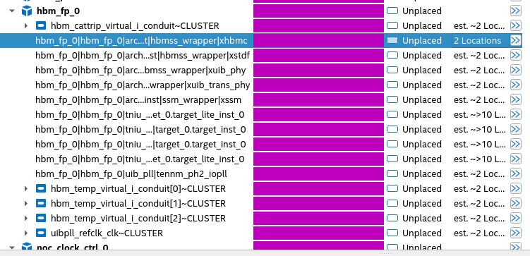

5.
Once the HBM2E controller is placed, click Autoplace Fixed three times to fix the
locations of the UIB PHY, targets, and NoC clock control block based on the
controller location. By this step, you see all the instances of your HBM2E IP and
NoC clock control that have been placed.
6.
To assign physical locations to the initiators in your design, right-click an initiator
and select Generate Legal Locations for Selected Element. The system
displays all legal locations for the selected initiator.
Select the location at which you want to place the initiator. (Refer to Guidelines for
Assigning Physical Locations to Initiators, below.)
A. High Bandwidth Memory (HBM2E) Interface FPGA IP Quartus Prime Software Flow
Send Feedback
High Bandwidth Memory (HBM2E) Interface Agilex 7 M-Series FPGA IP User
Guide
61

### Figures from page 61

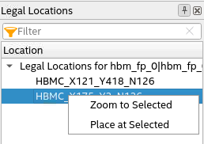
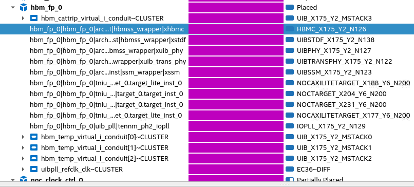
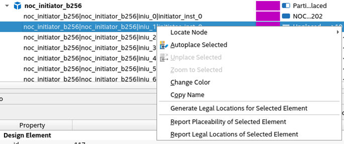

Guidelines for Assigning Physical Locations to Initiators
For information on the available initiators in the bottom and top hard memory NoC
and how they span the sectors relative to the physical UIB location, refer to the NoC
User Guide or the NoC techmodule. Note that all HBM targets are placed within the
three sectors directly beneath the UIB.
A. High Bandwidth Memory (HBM2E) Interface FPGA IP Quartus Prime Software Flow
High Bandwidth Memory (HBM2E) Interface Agilex 7 M-Series FPGA IP User
Guide
Send Feedback
62

### Figures from page 62

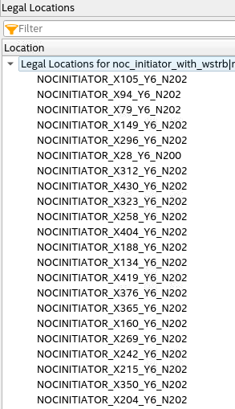

When placing initiators, you should consider the following points:
- 
The desired initiator–target connectivity.
- 
The physical arrangement of the targets. (Refer to the table, below.)
Table 47.
Target Placements
Top
UIB - Left
UIB - Middle
UIB - Right
tniu_
ch5_
u1
tniu_
ch7_
u1
tniu_
ch4_
u1
tniu_
ch6_
u1
tniu_
ch5_
u0
tniu_
ch7_
u0
tniu_
ch4_
u0
tniu_
ch6_
u0
tniu_
ch1_
u1
tniu_
ch3_
u1
tniu_
ch0_
u1
tniu_
ch2_
u1
tniu_
ch1_
u0
tniu_
ch3_
u0
tniu_
ch0_
u0
tniu_
ch2_
u0
Bottom
UIB - Left
UIB - Middle
UIB - Right
tniu_
ch2_
u0
tniu_
ch0_
u0
tniu_
ch3_
u0
tniu_
ch1_
u0
tniu_
ch2_
u1
tniu_
ch0_
u1
tniu_
ch3_
u1
tniu_
ch1_
u1
tniu_
ch6_
u0
tniu_
ch4_
u0
tniu_
ch7_
u0
tniu_
ch5_
u0
tniu_
ch6_
u1
tniu_
ch4_
u1
tniu_
ch7_
u1
tniu_
ch5_
u1
- 
When choosing physical locations for initiators, follow these recommendations:
○
If initiators and targets are to be connected one-to-one, place the initiators
closest to the targets.
○
For a design containing sixteen initiators, select nine initiators from the three
sectors directly beneath the UIB, and three initiators from the sector adjacent
to the UIB on the left, and four initiators from the sectors adjacent to UIB on
the right. Refer to the figure below for example placement.
Targets
EMIF
EMIF
UIB (To/From HBMC)
EMIF
EMIF
MPFE
Initiators
Switch
T0
T1
T2
T3
T4 T5
T6 T7
T8
T9 T10 T11 T12 T13 T14
T15
T16 T17 T18 T19
T20
T21
T22
T23
I0
I1
I2
I3
I4
I5
I6
I7
I8
I9
I10
I11
I12
I13
I14
I15
I16
I17
I18
I19
I20
I21
A.2. Simulating HBM2E User Designs
To run the simulations with your HBM2E designs created using the Quartus Prime
software flow, you must manually add the RTL simulation registration include file
(.inc) in the top-level of your design. The initiator-to-target connectivity and address
mapping are not included in the netlist. If you use the Platform Designer flow to make
connection between initiators and targets and generate a design, it creates the
registration file (.inc) for your design. In this case, you do not need to manually add
the registrations statements in the top-level of your design.
You must add one registration statement for each initiator-to-target connection,
specifying the start address and the size of that connection’s address range. Refer to
the Simulating the NoC Designs section in the Agilex 7 M-Series FPGA Network-on-
Chip (NoC) User Guide for detailed information on how to add NoC connectivity and
address mapping to the simulation net list.
A. High Bandwidth Memory (HBM2E) Interface FPGA IP Quartus Prime Software Flow
Send Feedback
High Bandwidth Memory (HBM2E) Interface Agilex 7 M-Series FPGA IP User
Guide
63

The HBM2E FPGA IP design example creates simulation files with registration
statements. You can refer to the registration statements included in the ed_sim.v file
generated with the design example. The ed_sim.v file resides at this location:
<your_directory>/hbm_fp_0_example_design/sim/ed_sim/sim/ed_sim.v
The following code fragment shows a snapshot of the registration statements for a
single-channel design:
.noc_initiator_b256.iniu_0.initiator_inst_0.register_if(ed_sim.hbm_fp_0.hbm_fp_0.
tniu_ch0_u0.target_0.target_inst_0.get_if() , 0, 31'h40000000);
.noc_initiator_b256.iniu_1.initiator_inst_0.register_if(ed_sim.hbm_fp_0.hbm_fp_0.
tniu_ch0_u1.target_0.target_inst_0.get_if() , 0, 31'h40000000);
.noc_initiator_b256.iniu_0.initiator_inst_0.register_if(ed_sim.hbm_fp_0.hbm_fp_0.
tniu_ch0_ch1_sb.target_0.target_lite_inst_0.target_inst_0.get_if() ,
44'h40000000, 31'h8000000);
A. High Bandwidth Memory (HBM2E) Interface FPGA IP Quartus Prime Software Flow
High Bandwidth Memory (HBM2E) Interface Agilex 7 M-Series FPGA IP User
Guide
Send Feedback
64
