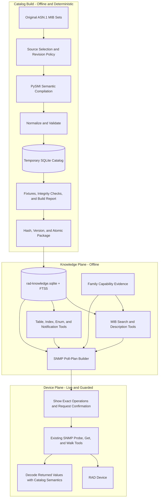

# Semantic MIB catalog: compilation, database, and SNMP use

## Document purpose

This document specifies the future SNMP knowledge layer for `rad-mcp`. It
explains how to compile the original ASN.1 MIB files without losing their
meaning, load that information into the prepared `rad-knowledge.sqlite`
database, expose it through MCP knowledge tools, and optionally turn an
offline answer into guarded SNMP operations against a device.

This is an implementation design, not a statement that these capabilities
already exist. Current family support, verified live behavior, and operational
caveats remain in [snmp-support.md](snmp-support.md). The current
`snmp-oid-map.json` contains useful symbol-to-OID mappings, but it does not
preserve enough MIB semantics to answer detailed questions by itself.

The design follows [MCP-FUTURE-ARCHITECTURE.md](../../../MCP-FUTURE-ARCHITECTURE.md):

- Keep one `rad-mcp` process.
- Keep authoritative knowledge at the MCP level, not in a large skill.
- Use PySMI during the build and SQLite with FTS5 at runtime.
- Keep offline knowledge lookup separate from live, guarded device access.
- Make every answer traceable to its original MIB source and revision.

## Target outcome

A user should be able to ask:

> Using only the local MIB data, show the ERP operational-state and R-APS
> counter variables with their numeric OIDs.

The MCP server should return matching objects with their numeric OIDs,
descriptions, types, enum meanings, access, table/index context, module
revision, and source provenance. It must clearly say that MIB-defined objects
are not proof that a particular family or device implements them.

The same result can then be used to prepare a poll plan. Only after the user
approves the exact live operation should the existing `snmp_get` or
`snmp_walk` tool contact a device.

## Architecture



The build pipeline never contacts a device. The knowledge plane never contacts
a device. Only the guarded device plane performs network I/O.

## Why the existing flat map is not enough

The current generated map is intentionally compact:

```text
numeric OID -> MODULE::symbol
```

That is sufficient for exact name resolution and basic numeric polling. It
cannot reliably answer:

- What does the object mean?
- Is it a scalar, table, row, column, or notification?
- Is it readable, writable, or notification-only?
- What are the enum labels for returned integer values?
- What units, ranges, defaults, or display hints apply?
- Which columns identify a table row?
- Does a table augment another table?
- Which objects are carried by a notification?
- Which textual convention defines the value?
- Which module revision and original source supplied the definition?
- Is the object merely defined by a MIB, or verified on a RAD family?

The semantic catalog must retain these details rather than trying to reconstruct
them later from symbol names.

## What was extracted before and what the new catalog will extract

### Current flat-map extraction

The existing MIB build extracted only the two fields needed for symbolic OID
resolution:

```json
{
  "oid": "1.3.6.1.4.1.164.3.1.6.1.4.2.1.1.4",
  "name": "RAD-EthIf-MIB::erpNodeState"
}
```

Conceptually, the current `snmp-oid-map.json` is a large collection of these
OID/name pairs. This was enough to:

- Resolve a symbolic object name to a numeric OID.
- Resolve a numeric OID to `MODULE::symbol`.
- Find objects by words present in their symbol names.
- Supply numeric OIDs to `snmp_get` and `snmp_walk`.

The original MIBs contained more information, but the flat map did not retain
it. The following data was therefore unavailable from the generated map:

- Syntax and base type.
- Textual convention and display hint.
- Read/write access.
- Full object description and references.
- Object kind and parent hierarchy.
- Table, row, column, and index relationships.
- Enum labels and their numeric values.
- Ranges, sizes, defaults, and units.
- Augmentations.
- Notification payload objects.
- Module revisions, imports, and source provenance.

This does not mean the data is absent from the original MIB. It means the old
generated artifact intentionally reduced each definition to its name and OID.

### Future normalized object

The new compiler must read the full semantic definition from the original MIB.
At minimum, a normal object returned to an MCP client should look like this:

```json
{
  "name": "RAD-EthIf-MIB::erpNodeState",
  "oid": "1.3.6.1.4.1.164.3.1.6.1.4.2.1.1.4",
  "syntax": "...",
  "access": "read-only",
  "description": "...",
  "indexes": ["erpIdx"],
  "enums": {}
}
```

The values represented by `...` must be copied from the compiled source MIB,
not inferred from the object name. An empty `enums` object must mean that the
source definition has no enum labels. It must not mean that enum extraction was
skipped or failed.

The compact shape above is suitable for user answers and simple MCP calls. The
database should retain a richer internal record so no useful MIB information is
lost:

```json
{
  "module": "RAD-EthIf-MIB",
  "symbol": "erpNodeState",
  "name": "RAD-EthIf-MIB::erpNodeState",
  "oid": "1.3.6.1.4.1.164.3.1.6.1.4.2.1.1.4",
  "kind": "column",
  "parent_oid": "...",
  "syntax": {
    "declared_type": "...",
    "base_type": "...",
    "textual_convention": null,
    "display_hint": null
  },
  "access": "read-only",
  "status": "...",
  "description": "...",
  "reference": null,
  "units": null,
  "default": null,
  "ranges": [],
  "enums": {},
  "table": {
    "table_name": "...",
    "entry_name": "...",
    "indexes": [
      {
        "name": "erpIdx",
        "implied": false,
        "position": 1
      }
    ],
    "augments": null
  },
  "module_revision": "...",
  "source": {
    "root": "MIBs2",
    "path": "...",
    "sha256": "...",
    "compiler": "PySMI ...",
    "catalog_build": "..."
  },
  "capability": {
    "state": "unknown",
    "evidence": ["mib-defined"]
  },
  "raw_compiler_record": {}
}
```

This is an illustrative normalized shape, not a claim about the exact syntax,
status, enums, or table relationships of `erpNodeState`. The implementation
must populate and test those values against the selected original
`RAD-EthIf-MIB` revision.

### Extraction comparison

| Information | Current flat map | Future semantic catalog |
|---|---:|---:|
| Numeric OID | Yes | Yes |
| Module and symbol | Yes | Yes |
| Description | No | Yes |
| Syntax and base type | No | Yes |
| Textual convention and display hint | No | Yes |
| Access and status | No | Yes |
| Enums | No | Yes |
| Ranges, defaults, and units | No | Yes |
| Table and ordered indexes | No | Yes |
| Augmentations | No | Yes |
| Notifications and payload objects | No | Yes |
| Module revisions and imports | No | Yes |
| Source file and hash | No | Yes |
| Family/device capability evidence | No | Yes, stored separately |
| Raw normalized compiler data | No | Yes |

## Source MIB policy

### Inputs

The build accepts one or more original MIB roots, including the current
`MIBS/` and `MIBs2/` sets. Original source files remain the authoritative
inputs. Generated JSON and SQLite files are reproducible build artifacts.

Each source root has explicit precedence. For the current corpus:

1. Prefer the newer `MIBs2/` definition when the same module exists in both
   sets.
2. Use `MIBS/` when a module is absent from `MIBs2/`.
3. Never silently merge two conflicting definitions of the same module and
   revision.
4. Record every selected and rejected candidate in the build report.

Precedence must be configuration, not hard-coded behavior, so future vendor MIB
kits can be added safely.

### Identity and conflict handling

Modules are compared using:

- Declared module name.
- Module identity and revision records.
- File content hash.
- Object identity and numeric OID.
- Configured source priority.

The build fails on unresolved conflicts such as:

- One numeric OID assigned to incompatible symbols.
- One module/revision resolving differently at equal priority.
- Missing imports that prevent semantic compilation.
- A table column whose parent row cannot be resolved.
- An index or augmentation target that does not exist.

Warnings are acceptable for deprecated objects, duplicate byte-identical
files, or optional metadata not present in an older MIB.

### Provenance

Every module and object must retain:

- Original source-root identifier.
- Relative source path.
- SHA-256 source hash.
- Declared module name.
- Module revision or an explicit `unknown` value.
- Compiler version and build timestamp.
- Selection reason and source priority.
- Raw normalized compiler record for forward compatibility.

Be explicit about what "vendor text" means here: object DESCRIPTION strings
**are** vendor-authored text, and the catalog stores them (FTS5 over
descriptions is a core requirement — there is no useful semantic catalog
without them). This is acceptable in the current setting because the corpus
is RAD's own MIB kit used in an internal RAD pilot, and the IEEE/IETF
standard MIB texts are redistributable. What the database must NOT embed is
the full original source files; it stores parsed metadata, description
text, source identity, hashes, and local paths. Revisit this statement
before any distribution of the catalog outside RAD.

## Semantic compilation

Use PySMI at build time to parse ASN.1 and emit semantic JSON with MIB texts
enabled. The exact PySMI version and compiler options must be pinned in the
build manifest.

Conceptual command:

```powershell
python scripts/build_knowledge_catalog.py `
  --mib-root "MIBs2:priority=200" `
  --mib-root "MIBS:priority=100" `
  --output "build/rad-knowledge.sqlite" `
  --report "build/mib-catalog-report.json"
```

The wrapper owns source selection, PySMI invocation, normalization, schema
loading, validation, and packaging. Operators should not need to invoke PySMI
directly.

### Information that must be retained

For modules:

- Name, identity OID, organization, contact, description, status.
- Revisions and revision descriptions.
- Imports and resolved source modules.
- Source path, hash, priority, and compiler metadata.

For objects:

- Numeric OID and canonical dotted representation.
- Module and symbol.
- Object kind: scalar, table, row, column, identity, notification, group, or
  compliance object.
- Description, reference text, status, and units.
- Syntax, base type, textual convention, display hint, and constraints.
- Access/max-access.
- Enum labels and numeric values.
- Integer or size ranges and defaults.
- Parent OID and ordered hierarchy.
- Scalar instance behavior, where applicable.

For tables:

- Table, entry, and column relationships.
- Ordered index components.
- `IMPLIED` index flags.
- Index syntax needed to encode and decode instance suffixes.
- Augmentation relationships.
- Readable identifying columns.

For notifications:

- Notification OID, description, status, and module.
- Ordered payload object list.
- Related notification groups, when defined.

Unknown compiler fields should be retained in normalized raw JSON. This avoids
discarding information before the schema has a dedicated column for it.

## Prepared database

The canonical runtime artifact is `rad-knowledge.sqlite`. The runtime opens it
read-only. Catalog generation uses a temporary database and atomically replaces
the packaged file only after all validation succeeds.

### Artifact and git policy

With full semantics plus FTS5 over the current corpus the database is
estimated at tens of MB — a **build artifact, not a committed binary**. The
repo policy mirrors the existing source-vs-derived pattern (MIB sources and
manual PDFs gitignored; extracted knowledge committed):

- `rad-knowledge.sqlite` — **gitignored**; produced by the build wrapper on
  the machine that needs it (install/release step), or distributed as a
  release artifact.
- The **build report** (JSON + human summary) — committed; it is the
  reviewable record of what the build selected, rejected, and validated.
- The regenerated compatibility `snmp-oid-map.json` — committed, as today.
- A failed build must leave the previously packaged database untouched.

### Core MIB tables

| Table | Purpose |
|---|---|
| `mib_modules` | One selected module identity with source and compiler provenance |
| `mib_revisions` | Ordered module revisions and revision descriptions |
| `mib_imports` | Imported symbols and resolved source modules |
| `mib_objects` | Canonical OID objects, symbols, kinds, types, text, access, and hierarchy |
| `mib_enum_values` | Numeric enum values and labels |
| `mib_ranges` | Integer, unsigned, and size constraints |
| `mib_table_indexes` | Ordered indexes, implied flags, and index object references |
| `mib_augments` | Row augmentation relationships |
| `mib_notifications` | Notification identities and metadata |
| `mib_notification_objects` | Ordered payload objects for each notification |
| `source_files` | Paths, hashes, priorities, and selection outcomes |
| `catalog_meta` | Schema version, corpus hash, tool versions, and build identity |

### Capability evidence

MIB definition and device implementation are different facts. Store
implementation evidence separately:

| Table | Purpose |
|---|---|
| `capability_evidence` | Family/device/object support claims with source, date, confidence, and notes |
| `capability_runs` | Live probe or CLI-harvest run identity and environment |
| `capability_observations` | Concrete observed OIDs, access results, and returned syntax |

Recommended support states:

- `supported`
- `partial`
- `unsupported`
- `unknown`

Recommended evidence types:

- `mib-defined`
- `manual`
- `cli-harvest`
- `live-snmp`
- `live-cli`
- `operator-verified`

An answer must not upgrade `mib-defined` evidence to `supported`.

The evidence tables must not start empty. The toolkit already holds verified
`live-snmp` evidence — the per-unit probe results and the walked capability
maps (`snmp-map-minid.md`, `snmp-map-etx2v.md`, and the live-state table in
[snmp-support.md](snmp-support.md)) — and Phase 1 must import them as the
first `capability_runs` / `capability_observations` rows.

### Transport and agent profiles

Semantic correctness is not enough to make a poll plan *executable*: the RAD
agents have live-verified transport quirks that decide whether a plan works
at all. These facts currently live as prose in
[snmp-support.md](snmp-support.md); the catalog must carry them as data:

| Table | Purpose |
|---|---|
| `family_snmp_profile` | Per-family transport facts: supported/verified SNMP versions (e.g. **mp4100 answers v1 ONLY** — v2c/v3 time out despite the manual's claims), credential model (v1/v2c community vs. v3 USM), preferred read strategy, and walk behavior flags |

Minimum fields per family:

- `versions_verified` — live-verified list, distinct from `versions_claimed`
  (the manual's claim); never conflate the two.
- `read_strategy` — `walk-ok` or `get-preferred` (the minid agent's GETNEXT
  chain is SPARSE: discovery walks under-report, so plans for it must expand
  to explicit GET lists).
- `bulk_supported` — false for all current RAD families (GETBULK jumps arcs
  and mis-orders on the small agents; plans must be GETNEXT/GET only).
- `end_of_view` — `silence` for current RAD agents (a mid-walk timeout after
  one pause-retry is end-of-view, not an outage) vs. `endOfMibView`.
- Provenance like every other row: how verified, on which unit, when.

### Search indexes

Use ordinary SQLite indexes for:

- Numeric OID.
- Module and symbol.
- Lowercased symbol.
- Parent OID.
- Object kind.
- Table/row/index relationships.
- Family, device, support state, and evidence type.

Use FTS5 for:

- Symbol and module names.
- Object descriptions and references.
- Enum labels.
- Notification descriptions.

Exact symbol/OID matches rank above prefix matches, which rank above FTS text
matches. Search results must be deterministic for the same catalog version.

## MCP knowledge tools

These tools are offline and available with both RO and RW tokens. They never
contact a device and therefore do not require live-operation confirmation.

### `knowledge_status`

Returns:

- Catalog schema and content versions.
- Build timestamp and corpus hash.
- Module and object counts.
- Source roots and selection summary.
- Validation status and warnings.

### `mib_search`

Searches by concept, module, symbol, OID prefix, object kind, access, or family
evidence.

Minimum inputs:

```json
{
  "query": "ERP operational state R-APS counters",
  "module": null,
  "family": "etx2",
  "limit": 25
}
```

Each result should include numeric OID, `MODULE::symbol`, kind, short
description, access, type, table context, and evidence summary.

### `mib_describe`

Returns the complete semantic definition for one symbol or numeric OID,
including enums, ranges, units, table/index context, revisions, and provenance.

### `mib_table`

Returns a complete table model:

- Table and entry OIDs.
- Ordered indexes and instance-encoding rules.
- Columns, types, access, units, and enum values.
- Suggested identifying and operational columns.

### `mib_notifications`

Finds notifications by concept, module, or OID and returns their payload objects
and semantic definitions.

### `snmp_build_poll_plan`

Builds an offline plan from concepts or selected objects. It must:

1. Resolve concepts to canonical numeric OIDs.
2. Expand required table indexes and useful identifying columns.
3. Exclude non-readable and notification-only objects.
4. Prefer exact GET operations when complete instances are known.
5. Use bounded walks when instances are unknown.
6. **Honor the target family's `family_snmp_profile`**: emit only transport
   operations the family verifiably answers (version, GETNEXT/GET-only, no
   GETBULK), switch to explicit-GET expansion for `get-preferred` agents
   (minid), and annotate walks with the family's end-of-view behavior so a
   silence is decoded as completion, not failure.
7. Include expected syntax, enums, units, and decoding instructions.
8. Include family support evidence and uncertainty.
9. Return only operations accepted by the existing SNMP backend.
10. Never contact a device.

Example result shape:

```json
{
  "catalog_version": "2026.07.18",
  "target_family": "etx2",
  "confidence": "mib-defined; live support not verified",
  "operations": [
    {
      "tool": "snmp_walk",
      "oid": "1.3.6.1.4.1...",
      "reason": "Discover ERP rows and their indexes"
    }
  ],
  "decode": [
    {
      "oid": "1.3.6.1.4.1...",
      "symbol": "RAD-EthIf-MIB::erpNodeState",
      "type": "INTEGER",
      "enums": {}
    }
  ]
}
```

The concrete OIDs and enums must come from the compiled catalog; they must
never be invented from this design example.

## Offline-to-live workflow

The normal workflow is:

1. Search the local catalog.
2. Describe selected variables or tables.
3. Build a poll plan.
4. Show the exact device, SNMP tool, numeric OIDs, and bounds to the user.
5. Ask exactly: **"Run this on the device now?"**
6. On confirmation, call existing `snmp_probe`, `snmp_get`, or `snmp_walk`.
7. Decode returned values with catalog enums, units, and table indexes.
8. Report live observations separately from MIB-defined expectations.

RO and RW tokens can use offline knowledge tools and live SNMP reads. SNMP
configuration changes are not part of this design; they remain guarded CLI
configuration operations requiring an RW token and staged commit.

## ERP usage example

For an offline ERP question, `mib_search` should search descriptions as well as
names. This matters because a user may say "operational state" or "R-APS
counters" while the MIB symbols use different abbreviations.

The response should group results into:

- ERP identity and row-index objects.
- Operational/admin state objects.
- R-APS receive/transmit counters.
- Fault, defect, or protection-switch counters.
- Related notifications.

For every object, return:

- Numeric OID.
- Module and symbol.
- Description.
- Read access.
- Type, enum, and units.
- Parent table and row indexes.
- MIB revision and source.
- Family/device support evidence.

If the user asks only for local data, stop there. Do not probe a device.

## Knowledge distribution modes (binding requirement)

After full implementation, BOTH modes remain installable — the catalog adds
`served`, it does not retire `bundled`:

| Mode | Skill payload | Knowledge source | Works without MCP? |
|---|---|---|---|
| **`bundled`** (today) | SKILL.md + `references/` (~14 MB) | grep the installed files | Yes (knowledge only; no device tools) |
| **`served`** | SKILL.md only (~tens of KB) | MCP knowledge tools over `rad-knowledge.sqlite` | No — an MCP connection is required for any knowledge answer |

Requirements this places on the implementation:

- Every client installer (`scripts/install/skills_and_mcp/*`) gains a
  knowledge-mode choice (e.g. `--knowledge bundled|served`; interactive
  prompt when unspecified), following the same keep-existing-config
  conventions the installers already use.
- The plugin/Desktop-zip build produces both variants (full and thin).
- `list_versions` reports the installed knowledge mode and, in `served`
  mode, the catalog content version.
- The skill text must not assume one mode: knowledge lookups are phrased as
  "grep the reference file (bundled) / call the knowledge tool (served)".
- `bundled` remains the fallback when the catalog or its tools are
  unavailable, and stays the default until `served` passes the acceptance
  criteria below.

## Compatibility and migration

The semantic catalog should be introduced without breaking current SNMP
operations.

### Phase 1: Compiler and validation — IMPLEMENTED 2026-07-18

Delivered by `scripts/build_knowledge_catalog.py` (first build: 286 modules
selected MIBs2-first, 330 compiled incl. web-pulled standard imports, 36,197
objects / 23,192 enum values / 4,466 index rows / 2,828 notifications with
15,145 payload rows / 640 TCs into `build/rad-knowledge.sqlite`, ~50 MB with
FTS5; all 10 fixtures passed; evidence + family profiles seeded; the 2 OID
"conflicts" are benign IEEE alias nodes, reported not fatal).

- Implement deterministic source selection and PySMI semantic compilation.
- Normalize all selected modules into a temporary SQLite database.
- Add schema, integrity tests, provenance, and build reports.
- Seed `family_snmp_profile` and `capability_runs`/`capability_observations`
  from the already-verified evidence (snmp-support.md live tables, the
  per-unit probes, and the walked snmp-map files) — the knowledge plane must
  not launch with empty evidence while verified facts exist.
- Continue using the existing flat map at runtime.

### Phase 2: Compatibility generation — IMPLEMENTED 2026-07-18

The same build regenerates the flat map with a stability-first tie-break for
shared OIDs (a compatibility map never re-attributes a shared OID between
builds). Result vs. the shipped map: **added=0 removed=0 changed=0** —
regeneration is exact; `--apply-compat` now maintains
`references/snmp-oid-map.json` from the database.

- Generate `snmp-oid-map.json` from the canonical database.
- Compare it with the current map and explain every added, removed, or changed
  mapping.
- Keep family SNMP maps and `snmp-support.md` unchanged as evidence sources.

### Phase 3: Offline MCP tools — IMPLEMENTED 2026-07-18

Delivered: `server/rad_mcp/knowledge.py` (read-only URI open, per-call
connections, parameterized SQL, bounded results, exact > prefix > FTS
ranking) + five tools in server 0.3.0. FTS indexes decamelized symbol words
("ERP state" finds `erpPortState`); `mib_describe` resolves textual
conventions and attaches live capability evidence; `mib_table` returns
ordered typed indexes, IMPLIED flags, all columns, and identifying-column
suggestions. Verified on the design's ERP target outcome.

- Add catalog status, search, describe, table, and notification tools.
- Package the database with the server and open it read-only.
- Keep the operations skill thin by routing questions to these MCP tools.

### Phase 4: Poll-plan integration — IMPLEMENTED 2026-07-18

Delivered in server 0.4.0: `snmp_build_poll_plan` (offline; resolves
symbols/OIDs/concepts, expands tables, excludes non-readable +
notification-only objects with reasons, honors `family_snmp_profile` —
get-preferred families plan an identifying-column walk + explicit GETs);
live `snmp_get`/`snmp_walk` values are now decoded with catalog semantics
(enum meaning + units appended — verified live: minid ifOperStatus `2 = down`);
every live SNMP call appends a row to
`server/logs/capability-observations.jsonl` (append-only live evidence,
importable by the next catalog build).

- Add `snmp_build_poll_plan`.
- Connect approved plans to existing SNMP tools.
- Decode live values with catalog semantics.
- Store live capability observations separately from MIB definitions.

### Phase 5: Broader knowledge integration — IMPLEMENTED 2026-07-18

Delivered in server 0.5.0: the catalog build ingests the CLI references
(cli-help-<family>.jsonl → `cli_help` + FTS, 4,367 records / 7 families),
the manuals (per-section split of manual-<family>/ → `manual_sections` +
FTS, 1,546 sections / 7 families), and the curated reference docs
(verified-commands, snmp-support, known-limitations, snmp capability maps →
`reference_docs`), each row with file provenance (`knowledge_sources`,
sha256). Two retrieval tools keep domain semantics distinct: `cli_search`
(exact context/prefix > prefix > FTS — the served-mode reference grep) and
`manual_search` (bounded excerpts with chapter/section/page provenance;
optional refdoc scope). Phase 5 fixtures gate the build: every CLI family
must also carry manual sections, and known lookups (static-route, zero
touch) must answer. DB ~63 MB. The bundled/served installer option (Knowledge distribution modes) is now
IMPLEMENTED 2026-07-18: `--knowledge bundled|served` on every skills_and_mcp
installer + the mcp_server launcher's catalog-readiness check, driven by
`Copy-SkillsTo`/`copy_skills_to` (served omits references/) and thin
plugin/Desktop-zip builds. Verified: bundled=276 files/14 MB, served=3
files/56 KB.

- Add manuals and CLI references to the same prepared database.
- Preserve domain-specific tables and provenance.
- Use one retrieval service while keeping domain semantics distinct.

## Build validation

Every build must perform:

- SQLite foreign-key and integrity checks.
- Unique canonical OID checks.
- Module import resolution checks.
- Parent/child OID hierarchy checks.
- Table, row, column, index, and augmentation checks.
- Enum uniqueness and range validation.
- Notification payload resolution.
- FTS row-count and query smoke tests.
- Compatibility-map generation and diff.
- Reproducibility check using corpus and output hashes.

Required semantic fixtures include:

- `sysDescr`
- `sysObjectID`
- `ifTable`
- `ifOperStatus`
- `erpTable`
- `erpNodeState`
- `erpPortRapsRxValidMsg`
- At least one enum-bearing object
- At least one indexed table
- At least one augmented table
- At least one notification with payload objects

Fixtures should assert exact numeric OIDs and known semantic fields from the
original source MIBs.

## Build report

Produce both machine-readable JSON and a short human-readable summary:

- Input roots and priorities.
- Selected, shadowed, duplicate, failed, and unresolved modules.
- Module/object/table/notification counts.
- Missing imports and parse warnings.
- OID and module conflicts.
- Compatibility-map differences.
- Database schema/content version and hashes.
- PySMI, Python, and SQLite versions.
- FTS5 availability.
- Pass/fail result for every validation stage.

A failed build must leave the previously packaged database untouched.

## Security and operational requirements

- Treat original MIB files as build inputs, never executable code.
- Reject paths outside configured source roots.
- Limit parser resources and report pathological inputs.
- Use parameterized SQL for all runtime queries.
- Open the packaged database in read-only mode.
- Do not let knowledge tools accept arbitrary SQL.
- Bound search result counts and SNMP walk limits.
- Never place SNMP credentials in the catalog or build report.
- Never infer live support solely from a MIB definition.
- Never execute a generated poll plan without the normal confirmation gate.

## Acceptance criteria

The first production version is complete when:

- The original RAD MIB corpus builds reproducibly into one validated SQLite
  catalog.
- Full semantic data is retained for objects, tables, enums, indexes,
  augmentations, and notifications.
- Every result includes source and revision provenance.
- The existing flat OID map can be regenerated from the database.
- Offline ERP state and R-APS queries return exact, source-backed numeric OIDs
  and semantic details without loading the original MIB files into the skill.
- Poll plans use only readable objects and explain table instance requirements.
- MIB-defined information is visibly separated from verified family/device
  support.
- No offline knowledge call can contact a device.
- Live execution continues through the existing guarded SNMP tools.
- Both knowledge distribution modes install and pass the same knowledge
  answers: a `bundled` install (skills + references, no catalog) and a
  `served` install (thin skills + catalog tools) answer the fixture
  questions identically, and the installer offers the choice.
